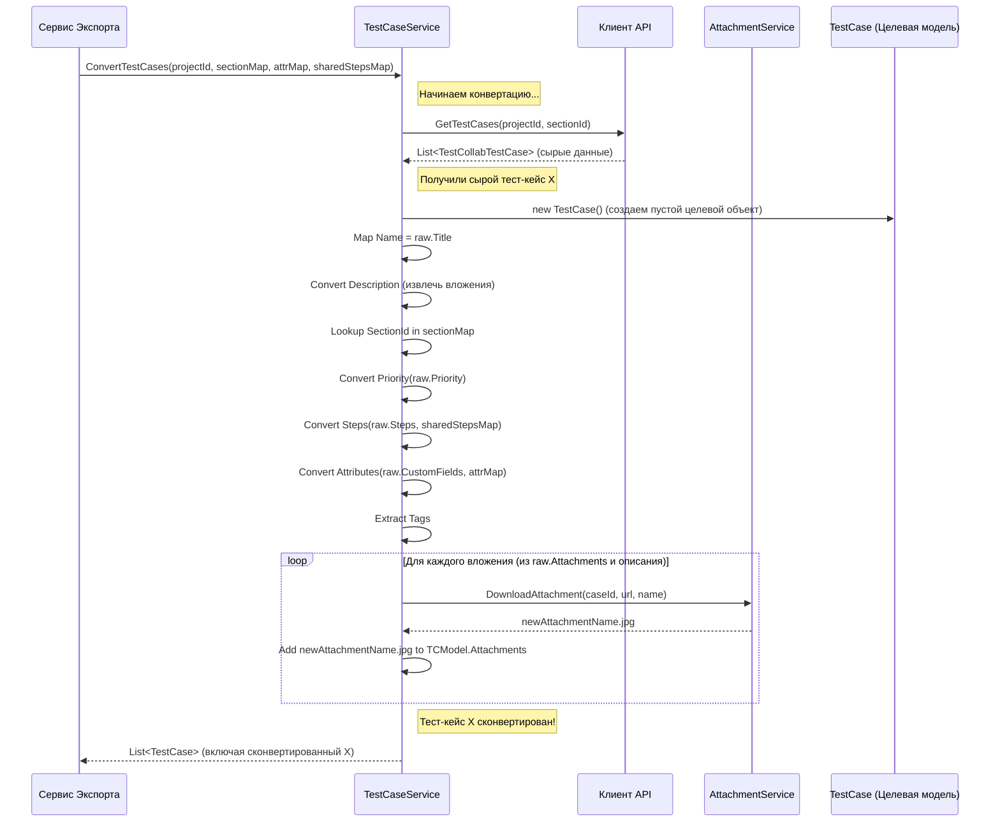

# Chapter 4: Сервис конвертации тест-кейсов


В [предыдущей главе](03_клиент_api_testcollab_.md) мы узнали, как [Клиент API TestCollab](03_клиент_api_testcollab_.md) выступает в роли нашего "курьера" и "переводчика API", доставляя нам "сырые" данные с сервера TestCollab. Мы получили данные в виде объектов [Моделей данных](02_модели_данных_.md) таких как `TestCollabTestCase`. Но что дальше? Эти данные все еще в формате TestCollab, а нам нужны данные, готовые для импорта в другую систему (например, Test IT) или для сохранения в нашем целевом JSON-формате.

Здесь на сцену выходит наш главный "лингвист" и "адаптатор" — **Сервис Конвертации Тест-Кейсов** (`TestCaseService`).

## Какую проблему он решает?

Представьте, что [Клиент API TestCollab](03_клиент_api_testcollab_.md) принес нам текст на одном языке (данные тест-кейса из TestCollab). Наша цель — получить этот же текст, но на другом языке и отформатированный по правилам этого языка (структура `TestCase` для Test IT).

Просто перевести слова "один к одному" часто недостаточно. Хороший переводчик должен:

*   Понимать смысл исходного текста (данные `TestCollabTestCase`).
*   Знать грамматику и структуру целевого языка (модель `TestCase` из проекта `Models`).
*   Адаптировать текст, чтобы он звучал естественно и правильно на новом языке. Например, перевести не только слова, но и идиомы, или перестроить предложения.
*   Обрабатывать особые элементы, такие как картинки или ссылки.

**Сервис Конвертации Тест-Кейсов** (`TestCaseService`) делает именно это для данных тест-кейсов. Он берет объект `TestCollabTestCase` и преобразует его в объект `TestCase` (наша целевая модель), выполняя все необходимые адаптации.

## Решение: Переводчик данных — `TestCaseService`

`TestCaseService` — это специализированный сервис, основная (и единственная) задача которого — преобразовывать информацию о тест-кейсах из формата TestCollab в целевой формат, необходимый для записи в JSON и последующего импорта.

Он отвечает за "перевод" и адаптацию следующих частей тест-кейса:

1.  **Название (`title` -> `Name`):** Обычно простое копирование.
2.  **Описание (`description` -> `Description`):** Может требовать обработки, например, извлечения ссылок на вложения, которые в TestCollab иногда встроены прямо в HTML-описание.
3.  **Шаги (`steps` -> `Steps`):** Одна из самых важных частей. Сервис должен:
    *   Преобразовать обычные шаги (действие, ожидаемый результат).
    *   Распознать ссылки на **общие шаги** (`reusable_step_id`) и заменить их соответствующей ссылкой (`SharedStepId`) в целевой модели. Для этого ему нужна информация о том, какие общие шаги уже были сконвертированы (обычно передается из [Сервиса Экспорта](01_сервис_экспорта_.md)).
4.  **Приоритет (`priority` -> `Priority`):** В TestCollab приоритет может быть строкой ("0", "1", "2"), а в целевой системе — специальным типом (`EnumType` Low, Medium, High). Сервис выполняет это сопоставление.
5.  **Пользовательские атрибуты (`custom_fields` -> `Attributes`):** Сопоставляет пользовательские поля из TestCollab с атрибутами в целевой системе, используя заранее подготовленную карту соответствия (которую тоже передает [Сервис Экспорта](01_сервис_экспорта_.md)).
6.  **Теги (`tags` -> `Tags`):** Обычно простое извлечение названий тегов.
7.  **Вложения (`attachments` -> `Attachments`):** Для вложений сервис не просто копирует информацию. Ему нужно:
    *   Получить URL вложения из данных TestCollab.
    *   Использовать другой сервис (`IAttachmentService`, который часто работает вместе с [Клиентом API TestCollab](03_клиент_api_testcollab_.md)) для **скачивания** этого вложения.
    *   Сохранить вложение в локальной папке и получить новое имя (или путь) файла.
    *   Добавить это новое имя файла в список `Attachments` целевой модели `TestCase`.

Этот сервис является ключевым звеном в подготовке данных тест-кейсов к финальной записи.

## Как это используется? ("Контракт" и вызов)

Как и у других сервисов, у `TestCaseService` есть свой интерфейс `ITestCaseService`, который описывает, что он умеет делать. В данном случае, у него один основной метод.

**Интерфейс `ITestCaseService`:**

```csharp
// File: Services\ITestCaseService.cs
using Models; // Используем целевую модель TestCase

namespace TestCollabExporter.Services;

// Интерфейс описывает, что умеет сервис конвертации тест-кейсов
public interface ITestCaseService
{
    // Основной метод: конвертировать тест-кейсы
    // Принимает:
    //  - projectId: ID проекта в TestCollab
    //  - sectionMap: Карта соответствия ID секций TestCollab -> ID секций в нашей системе
    //  - attributes: Карта соответствия Имен пользовательских полей -> ID атрибутов в нашей системе
    //  - sharedStepsMap: Карта соответствия ID общих шагов TestCollab -> ID общих шагов в нашей системе
    // Возвращает:
    //  - Список сконвертированных тест-кейсов в целевом формате (List<TestCase>)
    Task<List<TestCase>> ConvertTestCases(int projectId, Dictionary<int, Guid> sectionMap,
        Dictionary<string, Guid> attributes, Dictionary<int, Guid> sharedStepsMap);
}
```

*   **Пояснение:** Интерфейс объявляет метод `ConvertTestCases`. Обратите внимание на параметры: ему нужен не только `projectId`, чтобы знать, для какого проекта получать тест-кейсы, но и `sectionMap`, `attributes`, `sharedStepsMap`. Эти "карты соответствия" критически важны для правильной связи тест-кейсов с их секциями, атрибутами и общими шагами в *целевой* системе. Эти карты обычно подготавливаются другими сервисами (или [Сервисом Экспорта](01_сервис_экспорта_.md)) на предыдущих этапах. Метод возвращает `Task<List<TestCase>>`, то есть результат будет списком готовых объектов `TestCase`.

**Использование в `ExportService`:**

[Сервис Экспорта](01_сервис_экспорта_.md) вызывает этот метод после того, как получил необходимые данные (через [Клиент API TestCollab](03_клиент_api_testcollab_.md)) и подготовил карты соответствия.

```csharp
// Внутри ExportService.cs (Фрагмент из Главы 1, упрощенно)

// ... получили project, сконвертировали sections (получили sectionMap),
// сконвертировали attributes (получили attributesMap),
// сконвертировали shared steps (получили sharedStepsMap) ...

// Теперь вызываем сервис конвертации тест-кейсов
var testCases = await _testCaseService.ConvertTestCases(
    project.Id,          // ID проекта
    sections.SectionMap, // Передаем карту секций
    attributes.AttributesMap, // Передаем карту атрибутов
    sharedSteps.SharedStepMap // Передаем карту общих шагов
);

// Результат 'testCases' - это List<TestCase>, готовый для записи
// ... дальше передаем 'testCases' в Сервис Записи ...
```

*   **Пояснение:** `ExportService` собирает все необходимые ингредиенты (ID проекта и карты соответствия) и передает их в метод `ConvertTestCases` нашего сервиса. Результатом `testCases` будет список, который можно напрямую передать [Сервису записи данных (JsonWriter)](06_сервис_записи_данных__jsonwriter__.md).

## Под капотом: Как работает `TestCaseService`?

Давайте посмотрим, как `TestCaseService` выполняет свою работу "переводчика".

**Шаг за шагом (общая схема):**

1.  **Получение заказа:** Метод `ConvertTestCases` вызывается с ID проекта и картами соответствия.
2.  **Итерация по секциям:** Сервис понимает, что тест-кейсы в TestCollab организованы по секциям (suites). Он перебирает все секции из переданной `sectionMap`.
3.  **Запрос "сырых" тест-кейсов:** Для каждой секции он обращается к [Клиенту API TestCollab](03_клиент_api_testcollab_.md) (`_client.GetTestCases`) и просит список тест-кейсов именно для этой секции и проекта.
4.  **Итерация по "сырым" тест-кейсам:** Получив список `TestCollabTestCase` для секции, он перебирает каждый из них.
5.  **Создание целевого объекта:** Для каждого `TestCollabTestCase` создается новый пустой объект целевой модели `TestCase`. Генерируется новый уникальный ID (`Guid`) для этого тест-кейса в нашей системе.
6.  **"Перевод" полей:** Сервис начинает заполнять поля нового объекта `TestCase`, извлекая и адаптируя данные из `TestCollabTestCase`:
    *   `Name` берется из `Title`.
    *   `Description` берется из `Description` (при необходимости очищается от HTML-вложений).
    *   `SectionId` находится в `sectionMap` по ID исходной секции.
    *   `Priority` конвертируется с помощью вспомогательной функции (`ConvertPriority`).
    *   `Steps` конвертируются с помощью `ConvertSteps` (с использованием `sharedStepsMap` для обработки общих шагов).
    *   `Attributes` конвертируются с помощью `ConvertAttributes` (с использованием `attributes` карты).
    *   `Tags` извлекаются.
    *   **Вложения (`Attachments`):**
        *   Для каждого вложения из `testCollabTestCase.Attachments` (и тех, что могли быть извлечены из описания) вызывается `_attachmentService.DownloadAttachment`.
        *   `AttachmentService` скачивает файл, сохраняет его и возвращает новое имя файла.
        *   Это имя добавляется в список `Attachments` объекта `TestCase`.
7.  **Добавление в результат:** Заполненный объект `TestCase` добавляется в общий список сконвертированных тест-кейсов.
8.  **Возврат результата:** После обработки всех тест-кейсов во всех секциях, сервис возвращает полный список `TestCase`.

**Визуализация процесса конвертации одного тест-кейса:**


*   **Пояснение:** Диаграмма показывает, как `TestCaseService` получает сырые данные от `Client`, создает целевой объект `TestCase`, последовательно конвертирует каждое поле (используя карты соответствия и вспомогательные методы), взаимодействует с `AttachmentService` для скачивания файлов и, наконец, возвращает готовый список [Сервису Экспорта](01_сервис_экспорта_.md).

**Немного кода для иллюстрации:**

Сначала посмотрим, как `TestCaseService` получает доступ к другим нужным сервисам (`IClient`, `IAttachmentService`) через конструктор:

```csharp
// File: Services\TestCaseService.cs (начало)
using Microsoft.Extensions.Logging;
using Models; // Нужны целевые модели (TestCase, Step и т.д.)
using TestCollabExporter.Client; // Нужен клиент для получения данных
using TestCollabExporter.Models; // Нужны модели TestCollab (TestCollabTestCase)

namespace TestCollabExporter.Services;

public class TestCaseService : ITestCaseService
{
    private readonly ILogger<TestCaseService> _logger;
    private readonly IClient _client; // Для получения сырых тест-кейсов
    private readonly IAttachmentService _attachmentService; // Для скачивания вложений
    // ... другие возможные поля ...

    // Конструктор: Сюда передаются нужные сервисы
    public TestCaseService(ILogger<TestCaseService> logger, IClient client, IAttachmentService attachmentService)
    {
        _logger = logger;
        _client = client;
        _attachmentService = attachmentService;
    }

    // ... дальше метод ConvertTestCases и вспомогательные методы ...
}
```
*   **Пояснение:** Как и другие сервисы, `TestCaseService` объявляет зависимости (`IClient`, `IAttachmentService`) в конструкторе. Система внедрения зависимостей предоставит ему готовые экземпляры этих сервисов.

Теперь взглянем на структуру основного метода `ConvertTestCases` и пример конвертации одного из полей (например, приоритета).

```csharp
// File: Services\TestCaseService.cs (метод ConvertTestCases - упрощенно)
public async Task<List<TestCase>> ConvertTestCases(int projectId, Dictionary<int, Guid> sectionMap,
    Dictionary<string, Guid> attributes, Dictionary<int, Guid> sharedStepsMap)
{
    _logger.LogInformation("Начинаем конвертацию тест-кейсов");
    var testCases = new List<TestCase>(); // Список для результата

    // 1. Идем по всем секциям, о которых знаем
    foreach (var sectionEntry in sectionMap)
    {
        var sectionIdFromTestCollab = sectionEntry.Key;
        var sectionIdTarget = sectionEntry.Value; // Новый ID секции

        // 2. Запрашиваем тест-кейсы для текущей секции у Клиента
        var testCasesFromSection = await _client.GetTestCases(projectId, sectionIdFromTestCollab);

        // 3. Обрабатываем каждый полученный тест-кейс
        foreach (var testCollabTestCase in testCasesFromSection)
        {
            var testCaseId = Guid.NewGuid(); // Генерируем новый ID

            // ... обработка описания и вложений ...
            // var descriptionData = ConvertDescription(testCollabTestCase.Description);
            // var downloadedAttachments = await DownloadAllAttachments(testCaseId, testCollabTestCase.Attachments, descriptionData.Attachments);

            // 4. Создаем и заполняем целевой объект TestCase
            var testCase = new TestCase
            {
                Id = testCaseId,
                Name = testCollabTestCase.Title,
                Description = "...", // Обработанное описание
                SectionId = sectionIdTarget, // Используем ID из карты
                State = StateType.NotReady, // Статус по умолчанию
                Priority = ConvertPriority(testCollabTestCase.Priority), // Вызываем конвертер приоритета
                Steps = ConvertSteps(testCollabTestCase.Steps, sharedStepsMap), // Вызываем конвертер шагов
                Attributes = ConvertAttributes(testCollabTestCase.CustomFields, attributes), // Конвертер атрибутов
                Tags = testCollabTestCase.Tags.Select(t => t.Name).ToList(), // Извлекаем теги
                Attachments = new List<string>(), // Сюда добавляем скачанные вложения
                // ... другие поля ...
            };

            testCases.Add(testCase); // Добавляем готовый тест-кейс в список
        }
    }
    _logger.LogInformation("Конвертация тест-кейсов завершена. Сконвертировано: {Count}", testCases.Count);
    return testCases; // Возвращаем результат
}
```
*   **Пояснение:** Этот фрагмент показывает основной цикл работы: перебор секций -> получение сырых тест-кейсов -> перебор сырых тест-кейсов -> создание целевого `TestCase` -> вызов вспомогательных методов (`ConvertPriority`, `ConvertSteps`, `ConvertAttributes` и т.д.) для заполнения полей -> добавление в итоговый список.

А вот пример простой вспомогательной функции для конвертации приоритета:

```csharp
// File: Services\TestCaseService.cs (вспомогательный метод)
private static PriorityType ConvertPriority(string priority)
{
    // Используем конструкцию switch для сопоставления
    return priority switch
    {
        "0" => PriorityType.Low,    // Если в TestCollab "0", то у нас Low
        "1" => PriorityType.Medium, // Если "1", то Medium
        "2" => PriorityType.High,   // Если "2", то High
        _ => PriorityType.Medium // Если что-то другое, ставим Medium по умолчанию
    };
}
```

*   **Пояснение:** Эта функция `ConvertPriority` принимает строку приоритета из TestCollab (`"0"`, `"1"` или `"2"`) и возвращает соответствующее значение перечисления `PriorityType` (заранее определенного в [Моделях данных](02_модели_данных_.md)). Это простой пример того, как сервис адаптирует данные под целевой формат. Аналогичные, но более сложные функции (`ConvertSteps`, `ConvertAttributes`, `ConvertDescription`) выполняют преобразования для других полей.

## Заключение

Мы познакомились с **Сервисом Конвертации Тест-Кейсов** (`TestCaseService`) — ключевым компонентом, отвечающим за преобразование "сырых" данных о тест-кейсах из формата TestCollab в структурированный формат `TestCase`, готовый к записи и импорту.

Мы узнали, что он:

*   Работает как умный "переводчик", адаптируя данные под целевую структуру.
*   Обрабатывает все основные поля: название, описание, шаги (включая общие), приоритет, атрибуты, теги и вложения.
*   Использует [Клиент API TestCollab](03_клиент_api_testcollab_.md) для получения исходных данных по секциям.
*   Взаимодействует с `AttachmentService` для скачивания вложений.
*   Использует карты соответствия (`sectionMap`, `attributesMap`, `sharedStepsMap`) для правильной связи с другими элементами в целевой системе.

Понимание работы этого сервиса критически важно, так как тест-кейсы — это центральная часть экспортируемых данных.

Тест-кейсы тесно связаны с секциями (папками), в которых они находятся. В следующей главе мы рассмотрим, как происходит конвертация самой структуры этих папок — познакомимся с [Сервис конвертации секций](05_сервис_конвертации_секций_.md).

---

Generated by [AI Codebase Knowledge Builder](https://github.com/The-Pocket/Tutorial-Codebase-Knowledge)