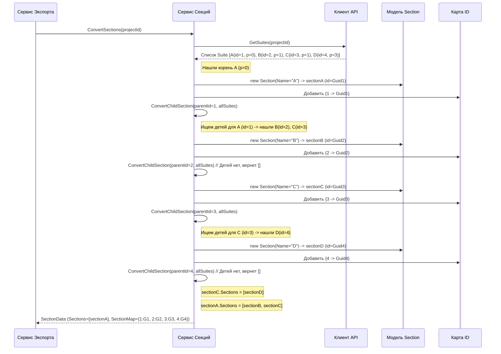

# Chapter 5: Сервис конвертации секций


В [предыдущей главе](04_сервис_конвертации_тест_кейсов_.md) мы разобрались, как [Сервис конвертации тест-кейсов](04_сервис_конвертации_тест_кейсов_.md) "переводит" и адаптирует информацию об отдельных тест-кейсах. Но тест-кейсы не существуют в вакууме – они организованы в иерархическую структуру, как файлы в папках. В TestCollab эта структура называется "наборы тестов" (Suites), а в целевом формате (например, для Test IT или просто в нашем JSON) мы называем их "секции".

Как же нам скопировать эту иерархию папок, чтобы сохранить ту же организацию тест-кейсов, что и в TestCollab?

## Какую проблему он решает?

Представьте, что у вас есть большой шкаф (проект в TestCollab) с множеством ящиков (`Suites`). В некоторых ящиках лежат стопки документов (тест-кейсы), а другие ящики содержат еще меньшие ящички (вложенные `Suites`), которые, в свою очередь, тоже могут содержать документы или еще более мелкие ящички. Это иерархическая структура.

Теперь вы хотите переложить все содержимое в новый шкаф (целевая система). Вам нужно не просто перекидать все документы в одну кучу, а **воссоздать точно такую же структуру ящиков и ящичков**, чтобы потом легко можно было найти нужный документ.

Именно эту задачу решает **Сервис конвертации секций** (`SectionService`). Он отвечает за перенос иерархической структуры проекта из TestCollab.

## Решение: Архитектор структуры — `SectionService`

`SectionService` можно представить как **архитектора** или **строителя иерархий**. Его главная задача — посмотреть на структуру "наборов тестов" (`Suites`) в TestCollab и построить точно такую же древовидную структуру "секций" (`Section`) в нашем целевом формате.

Он делает следующее:

1.  **Получает список всех "ящиков" (`Suites`)** из TestCollab для нужного проекта, используя [Клиент API TestCollab](03_клиент_api_testcollab_.md).
2.  **Определяет "главные ящики"** (корневые секции, у которых нет родительских). В TestCollab это `Suites` с `parent_id` равным 0.
3.  **Строит дерево:** Для каждого "ящика" он создает соответствующий объект `Section` в целевом формате. Если у "ящика" были вложенные "ящички", он рекурсивно (то есть вызывая сам себя для дочерних элементов) создает для них свои объекты `Section` и добавляет их в список дочерних секций родителя.
4.  **Генерирует новые ID:** Каждой новой секции `Section` присваивается уникальный идентификатор (`Guid`).
5.  **Создает карту соответствия:** Он запоминает, какой старый ID "ящика" (`Suite.Id` из TestCollab) соответствует какому новому ID секции (`Section.Id` в нашей системе). Эта карта (`SectionMap`) очень важна для [Сервиса конвертации тест-кейсов](04_сервис_конвертации_тест_кейсов_.md), чтобы он мог правильно разместить каждый тест-кейс в нужной секции.

В результате работы этого сервиса мы получаем:
*   Полностью построенную иерархию секций в целевом формате (список корневых `Section`, каждая из которых может содержать вложенные `Section`).
*   Словарь (`Dictionary` или "карту") `SectionMap`, который связывает старые ID с новыми.

## Как это используется?

Как и другие сервисы, `SectionService` имеет интерфейс `ISectionService`, который определяет его "услуги".

**Интерфейс `ISectionService`:**

```csharp
// File: Services\ISectionService.cs
using TestCollabExporter.Models; // Используем вспомогательную модель SectionData

namespace TestCollabExporter.Services;

// Интерфейс описывает, что умеет сервис конвертации секций
public interface ISectionService
{
    // Основной метод: конвертировать секции для проекта
    // Принимает: ID проекта в TestCollab (int projectId)
    // Возвращает:
    //  - Task<SectionData> - асинхронно возвращает объект SectionData,
    //    который содержит и список корневых секций, и карту ID (SectionMap)
    Task<SectionData> ConvertSections(int projectId);
}
```

*   **Пояснение:** Интерфейс объявляет всего один метод `ConvertSections`. Он принимает ID проекта из TestCollab. Важно, что он возвращает не просто список секций, а объект `SectionData`. Этот объект — это как контейнер, который хранит и саму структуру секций (`List<Section>`), и карту соответствия ID (`Dictionary<int, Guid> SectionMap`). Мы видели эту карту в действии в [главе о конвертации тест-кейсов](04_сервис_конвертации_тест_кейсов_.md).

**Использование в `ExportService`:**

[Сервис Экспорта](01_сервис_экспорта_.md) вызывает `ConvertSections` на одном из первых шагов, *до* конвертации тест-кейсов, потому что ему нужна карта `SectionMap`.

```csharp
// Внутри файла ExportService.cs (упрощенный фрагмент)
public async Task ExportProject()
{
    // ... получаем project от Клиента API ...
    var project = await _client.GetProject(companies);

    // Вызываем Сервис конвертации секций
    var sectionsData = await _sectionService.ConvertSections(project.Id);
    // Теперь у нас есть sectionsData.Sections (структура)
    // и sectionsData.SectionMap (карта ID)

    // ... потом конвертируем атрибуты, общие шаги ...

    // И только теперь вызываем конвертацию тест-кейсов, передавая карту секций
    var testCases = await _testCaseService.ConvertTestCases(
        project.Id,
        sectionsData.SectionMap, // Передаем карту!
        /* ... другие карты ... */
    );

    // ... дальше записываем все в файлы ...
}
```

*   **Пояснение:** `ExportService` сначала вызывает `_sectionService.ConvertSections`, получает результат `sectionsData`, а затем использует `sectionsData.SectionMap` при вызове `_testCaseService.ConvertTestCases`. Это показывает, почему порядок вызова сервисов важен.

## Заглянем под капот: Как `SectionService` строит иерархию?

Давайте разберемся, как сервис воссоздает структуру папок.

**Шаг за шагом:**

1.  **Запрос структуры:** Метод `ConvertSections` вызывается с ID проекта.
2.  **Получить все "папки":** Сервис просит [Клиента API TestCollab](03_клиент_api_testcollab_.md) дать ему список всех `Suites` (`TestCollabSuite`) для этого проекта. Каждый `TestCollabSuite` содержит `Id`, `Title` (имя) и `Parent_id` (ID родительской папки, или 0, если это папка верхнего уровня).
3.  **Найти корни:** Сервис ищет в полученном списке все `Suites`, у которых `Parent_id` равен 0. Это наши корневые секции.
4.  **Начать строительство:** Для каждой найденной корневой `Suite`:
    *   Создается новый объект `Section` (целевая модель).
    *   Ему присваивается `Name` из `Suite.Title`.
    *   Генерируется новый уникальный `Id` (типа `Guid`).
    *   **Запись в карту:** Пара "старый ID (`Suite.Id`) -> новый ID (`Section.Id`)" добавляется в словарь `_sectionMap`.
    *   **Поиск детей:** Вызывается специальная **рекурсивная** функция (например, `ConvertChildSection`), которой передается ID текущей `Suite` (`parentId`) и полный список всех `Suites`.
5.  **Рекурсивное строительство детей:** Функция `ConvertChildSection` делает следующее:
    *   Находит все `Suites` из общего списка, у которых `Parent_id` равен переданному `parentId`. Это прямые дочерние элементы.
    *   Для каждого найденного дочернего `Suite`:
        *   Создает новый объект `Section`.
        *   Присваивает `Name` и генерирует новый `Id`.
        *   Добавляет пару ID в карту `_sectionMap`.
        *   **Снова вызывает саму себя (`ConvertChildSection`)**, передавая ID *этого* дочернего элемента, чтобы найти его собственных детей (внуков исходной секции). Результат этого рекурсивного вызова (список дочерних `Section`) записывается в поле `Sections` текущего создаваемого объекта `Section`.
        *   Добавляет созданный дочерний `Section` (со всеми его уже построенными вложенными секциями) в список секций, который будет возвращен на предыдущий уровень рекурсии.
    *   Возвращает список созданных дочерних `Section`.
6.  **Сборка результата:** Когда рекурсивная функция завершит работу для всех корневых секций, у нас будет список корневых объектов `Section`, каждый из которых внутри себя содержит полную иерархию дочерних секций. Также будет полностью заполнена карта `_sectionMap`.
7.  **Упаковка и возврат:** Список корневых секций и карта `_sectionMap` упаковываются в объект `SectionData` и возвращаются [Сервису Экспорта](01_сервис_экспорта_.md).

**Визуализация процесса (Пример: A -> B, A -> C, C -> D):**


*   **Пояснение:** Диаграмма показывает, как `SectionService` получает список `Suites`, находит корень `A`, создает для него `Section` и карту. Затем рекурсивно вызывает `ConvertChildSection` для `A`. Этот вызов находит `B` и `C`, создает для них `Section` и карты, и рекурсивно вызывает `ConvertChildSection` для них. Вызов для `C` находит `D`, создает для него `Section` и карту. Рекурсия разворачивается обратно, собирая списки дочерних секций (`sectionC` получает `sectionD`, `sectionA` получает `sectionB` и `sectionC`). В конце возвращается `SectionData` с корневой секцией `A` (со всей вложенной структурой) и полной картой ID.

**Модели данных:**

*   **Вход:** `TestCollabSuite` (из папки `Models` в `TestCollabExporter`) - описывает "папку" так, как она приходит из TestCollab API.
    ```csharp
    // File: Models\TestCollabSuite.cs
    using System.Text.Json.Serialization;

    namespace TestCollabExporter.Models;

    // Модель для данных о "сьюте" (секции) из TestCollab
    public class TestCollabSuite
    {
        [JsonPropertyName("id")]
        public int Id { get; set; } // Числовой ID из TestCollab

        [JsonPropertyName("title")]
        public string Title { get; set; } // Имя секции

        [JsonPropertyName("parent_id")]
        public int Parent_id { get; set; } // ID родительской секции (0 для корневых)
    }
    ```
*   **Выход (Целевая модель):** `Section` (из внешнего проекта `Models`) - описывает секцию в нашем целевом формате JSON. Обратите внимание на поле `Sections`, которое содержит список таких же объектов `Section` - это и есть способ представления иерархии.
    ```csharp
    // Из проекта Models (упрощенно)
    namespace Models;

    public class Section
    {
        public Guid Id { get; set; } // Новый уникальный ID
        public required string Name { get; set; } // Имя секции
        public List<Step> PreconditionSteps { get; set; } // Предусловия (не используются в конвертации из TestCollab)
        public List<Step> PostconditionSteps { get; set; } // Постусловия (не используются)
        public List<Section> Sections { get; set; } // Список ВЛОЖЕННЫХ секций!
        // ... другие поля целевого формата ...
    }
    ```
*   **Контейнер результата:** `SectionData` (из папки `Models` в `TestCollabExporter`) - вспомогательная модель для передачи результатов работы `SectionService`.
    ```csharp
    // File: Models\SectionData.cs
    using Models; // Используем целевую модель Section

    namespace TestCollabExporter.Models;

    public class SectionData
    {
        // Список корневых секций (с построенной иерархией внутри)
        public List<Section> Sections { get; set; }

        // Карта соответствия: ID из TestCollab (int) -> Новый ID (Guid)
        public Dictionary<int, Guid> SectionMap { get; set; }

        // Специальная секция для общих шагов (создается отдельно)
        public Section SharedStepSection { get; set; }
    }
    ```

**Немного кода для иллюстрации:**

Сначала посмотрим, как `SectionService` получает доступ к `IClient` и инициализирует карту `_sectionMap`.

```csharp
// File: Services\SectionService.cs (начало)
using Microsoft.Extensions.Logging;
using Models;                  // Нужны целевые модели (Section)
using TestCollabExporter.Client; // Нужен клиент для получения данных
using TestCollabExporter.Models; // Нужны модели TestCollab (TestCollabSuite) и SectionData

namespace TestCollabExporter.Services;

public class SectionService : ISectionService
{
    private readonly ILogger<SectionService> _logger;
    private readonly IClient _client; // Для получения сырых "сьютов"
    // Карта для хранения соответствия ID (используется во всем сервисе)
    private readonly Dictionary<int, Guid> _sectionMap;

    public SectionService(ILogger<SectionService> logger, IClient client)
    {
        _logger = logger;
        _client = client;
        // Инициализируем пустую карту при создании сервиса
        _sectionMap = new Dictionary<int, Guid>();
    }

    // ... дальше метод ConvertSections и рекурсивный ConvertChildSection ...
}
```

Теперь основной метод `ConvertSections`, который запускает процесс:

```csharp
// File: Services\SectionService.cs (метод ConvertSections)
public async Task<SectionData> ConvertSections(int projectId)
{
    _logger.LogInformation("Получаем и конвертируем секции для проекта {ProjectId}", projectId);

    // 1. Получаем плоский список всех "сьютов"
    var suites = await _client.GetSuites(projectId);
    // Очищаем карту перед началом (на случай повторного вызова)
    _sectionMap.Clear();

    // 2. Создаем специальную секцию для общих шагов TBD: (можно упростить или убрать для начала)
    var sharedStepsSection = GetSharedStepsSection();

    var rootSections = new List<Section>(); // Список для корневых секций

    // 3. Ищем корневые "сьюты" (Parent_id == 0) и запускаем для них рекурсию
    foreach (var suite in suites.Where(s => s.Parent_id == 0))
    {
        var section = new Section
        {
            Id = Guid.NewGuid(), // Генерируем новый ID
            Name = suite.Title,
            PreconditionSteps = new List<Step>(), // Пусто
            PostconditionSteps = new List<Step>(), // Пусто
            // 4. Строим дочерние секции рекурсивно
            Sections = ConvertChildSection(suite.Id, suites)
        };

        rootSections.Add(section);
        _sectionMap.Add(suite.Id, section.Id); // 5. Добавляем в карту
    }

    // 6. Упаковываем результат в SectionData
    return new SectionData
    {
        Sections = rootSections,       // Список корневых секций (с иерархией)
        SectionMap = _sectionMap,      // Готовая карта ID
        SharedStepSection = sharedStepsSection // Секция для общих шагов
    };
}
```
*   **Пояснение:** Метод получает все `suites`, находит корневые (где `s.Parent_id == 0`), для каждой создает `Section`, добавляет ID в `_sectionMap` и вызывает `ConvertChildSection` для построения дочерней структуры. Результат пакуется в `SectionData`.

И, наконец, рекурсивный помощник `ConvertChildSection`:

```csharp
// File: Services\SectionService.cs (рекурсивный метод ConvertChildSection)
private List<Section> ConvertChildSection(int parentId, IEnumerable<TestCollabSuite> allSuites)
{
    var childSections = new List<Section>(); // Список для дочерних секций этого уровня
    var allSuitesList = allSuites.ToList(); // Преобразуем в список для удобства

    // 1. Находим прямых потомков для parentId
    var childSuites = allSuitesList.Where(s => s.Parent_id == parentId);

    // 2. Обрабатываем каждого найденного потомка
    foreach (var childSuite in childSuites)
    {
        var section = new Section
        {
            Id = Guid.NewGuid(), // Новый ID для дочерней секции
            Name = childSuite.Title,
            PreconditionSteps = new List<Step>(), // Пусто
            PostconditionSteps = new List<Step>(), // Пусто
            // 3. Рекурсивный вызов для поиска внуков (детей текущего childSuite)
            Sections = ConvertChildSection(childSuite.Id, allSuitesList)
        };

        childSections.Add(section);
        _sectionMap.Add(childSuite.Id, section.Id); // 4. Добавляем ID потомка в карту
    }

    // 5. Возвращаем список построенных дочерних секций
    return childSections;
}
```
*   **Пояснение:** Этот метод находит все `Suites`, у которых `Parent_id` совпадает с `parentId`, переданным в функцию. Для каждого найденного `childSuite` он создает `Section`, добавляет его ID в карту и **снова вызывает сам себя (`ConvertChildSection`)**, передавая уже `childSuite.Id`, чтобы построить следующий уровень иерархии. Список созданных на этом уровне `Section` (уже с их внутренними `Sections`) возвращается на уровень выше.

## Заключение

Мы познакомились с **Сервисом конвертации секций** (`SectionService`), который играет роль архитектора, воссоздающего иерархическую структуру папок (секций) из TestCollab в целевом формате.

Ключевые моменты:

*   Он получает список "наборов тестов" (`Suites`) из TestCollab.
*   Использует **рекурсию** для построения древовидной структуры объектов `Section`.
*   Генерирует новые уникальные ID (`Guid`) для каждой секции.
*   Создает критически важную **карту соответствия ID** (`SectionMap`), которая используется другими сервисами (особенно [Сервисом конвертации тест-кейсов](04_сервис_конвертации_тест_кейсов_.md)) для правильной привязки объектов к их родительским секциям.
*   Возвращает результат в виде объекта `SectionData`, содержащего и структуру, и карту.

Теперь, когда у нас есть сконвертированные данные — структура секций и список тест-кейсов (а также атрибуты и общие шаги, которые конвертируются аналогичными сервисами), — нам нужно сохранить все это в файлы на диске в формате JSON. Этим занимается наш следующий компонент. Давайте перейдем к изучению [Сервис записи данных (JsonWriter)](06_сервис_записи_данных__jsonwriter__.md).

---

Generated by [AI Codebase Knowledge Builder](https://github.com/The-Pocket/Tutorial-Codebase-Knowledge)