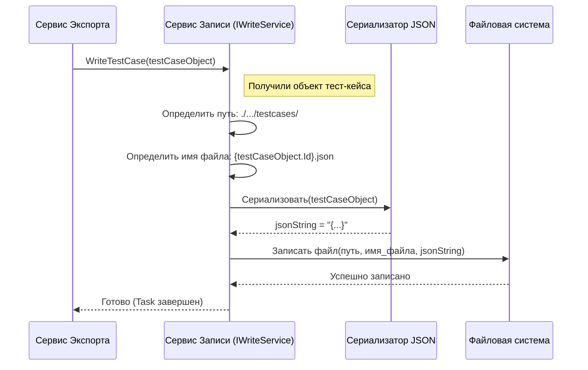

# Chapter 6: Сервис записи данных (JsonWriter)


В [предыдущей главе](05_сервис_конвертации_секций_.md) мы узнали, как [Сервис конвертации секций](05_сервис_конвертации_секций_.md) воссоздает иерархическую структуру папок из TestCollab. Теперь, когда у нас есть готовые, преобразованные данные — структура секций, список тест-кейсов, атрибуты, общие шаги и даже скачанные вложения — осталось сделать последний шаг: сохранить все это на диск в удобном формате.

За эту финальную часть отвечает **Сервис записи данных**, который использует возможности библиотеки `JsonWriter`.

## Какую проблему он решает?

Представьте, что вы написали книгу (наш проект со всеми данными). Вы перевели ее на нужный язык ([Сервисы конвертации](04_сервис_конвертации_тест_кейсов_.md), [Сервис конвертации секций](05_сервис_конвертации_секций_.md)), собрали все иллюстрации (вложения). Теперь вам нужен **издатель**, который возьмет эти материалы и:

1.  **Напечатает** основной том с оглавлением (главный файл `project.json`).
2.  **Напечатает** отдельные брошюры для каждой главы (JSON-файлы для каждого тест-кейса и общего шага).
3.  **Разложит** все иллюстрации (скачанные вложения) по папкам, соответствующим главам.
4.  **Организует** все это на книжной полке (в файловой системе) так, чтобы потом можно было легко найти нужный том или брошюру.

Без такого "издателя" наши готовые данные так и остались бы просто в памяти компьютера, не превратившись в полезные файлы, которые можно куда-то импортировать или проанализировать.

## Решение: Издатель JSON — `JsonWriter` через `IWriteService`

**Сервис записи данных** в нашем проекте `TestCollabExporter` выступает именно в роли такого издателя. Он представлен интерфейсом `IWriteService`, а реальная "печатная машина" находится во внешнем проекте `JsonWriter`. Думайте об `IWriteService` как о контракте с издательством, а о `JsonWriter` — как о самом издательстве.

Этот сервис отвечает за:

*   **Создание JSON-файлов:** Он берет готовые объекты [Моделей данных](02_модели_данных_.md) (такие как `Root`, `TestCase`, `SharedStep`) и преобразует их в строки формата JSON.
*   **Запись в файлы:** Сохраняет эти JSON-строки в отдельные файлы на диске. Каждый тест-кейс и общий шаг получают свой собственный файл, а общая структура проекта сохраняется в файл `project.json`.
*   **Организацию папок:** Создает необходимую структуру папок для хранения файлов (например, папки `testcases`, `sharedsteps`, `attachments`).
*   **Сохранение вложений:** Размещает previamente скачанные файлы вложений в соответствующие папки, связанные с их тест-кейсами.

Важно понимать: хотя сам код для записи JSON находится в библиотеке `JsonWriter`, наш проект `TestCollabExporter` взаимодействует с ним через четко определенный интерфейс `IWriteService`. Это позволяет нам легко "заказать" нужные услуги по записи, не вдаваясь в детали "печатного процесса".

## Как это используется?

[Сервис Экспорта](01_сервис_экспорта_.md) является главным "заказчиком" услуг у сервиса записи. После того как все данные сконвертированы, он последовательно передает их `IWriteService` для сохранения.

**Интерфейс `IWriteService` (упрощенно):**

Давайте посмотрим, какие услуги предлагает наш "издатель":

```csharp
// Из проекта JsonWriter (Интерфейс IWriteService)
using Models; // Используем целевые модели (Root, TestCase, SharedStep)

namespace JsonWriter;

// Контракт на услуги записи данных
public interface IWriteService
{
    // Записать главный файл project.json
    // Принимает: объект Root с общей структурой проекта
    Task WriteMainJson(Root root);

    // Записать JSON-файл для отдельного тест-кейса
    // Принимает: объект TestCase
    Task WriteTestCase(TestCase testCase);

    // Записать JSON-файл для отдельного общего шага
    // Принимает: объект SharedStep
    Task WriteSharedStep(SharedStep sharedStep);

    // Сохранить скачанный файл вложения
    // Принимает:
    //  - testCaseId: ID тест-кейса, к которому относится вложение
    //  - data: Содержимое файла (массив байт)
    //  - filename: Оригинальное имя файла
    // Возвращает: Новое имя файла (или путь), под которым он сохранен
    Task<string> WriteAttachment(Guid testCaseId, byte[] data, string filename);
}
```

*   **Пояснение:** Этот интерфейс определяет четыре основных действия: запись главного файла (`WriteMainJson`), запись тест-кейса (`WriteTestCase`), запись общего шага (`WriteSharedStep`) и сохранение вложения (`WriteAttachment`). [Сервис Экспорта](01_сервис_экспорта_.md) и другие сервисы (например, `AttachmentService`) используют эти методы.

**Использование в `ExportService`:**

В коде `ExportService` мы видим, как он вызывает эти методы после этапа конвертации:

```csharp
// Фрагмент из файла Services\ExportService.cs

// ... данные сконвертированы: attributes, sections, sharedSteps, testCases ...

_logger.LogInformation("Данные сконвертированы, начинаем запись...");

// 1. Записываем общие шаги (каждый в свой файл)
foreach (var sharedStep in sharedSteps.SharedSteps)
{
    await _writeService.WriteSharedStep(sharedStep); // Вызываем услугу записи общего шага
}

// 2. Записываем тест-кейсы (каждый в свой файл)
foreach (var testCase in testCases)
{
    await _writeService.WriteTestCase(testCase); // Вызываем услугу записи тест-кейса
}

// 3. Готовим общую структуру для главного файла
var root = new Root
{
    ProjectName = project.Name,
    Attributes = attributes.Attributes,
    Sections = sections.Sections, // Включая иерархию
    TestCases = testCases.Select(t => t.Id).ToList(), // Список ID тест-кейсов
    SharedSteps = sharedSteps.SharedSteps.Select(s => s.Id).ToList() // Список ID общих шагов
};

// 4. Записываем главный файл project.json
await _writeService.WriteMainJson(root); // Вызываем услугу записи основного файла

_logger.LogInformation("Запись файлов завершена.");
```

*   **Пояснение:** Этот код показывает, как `ExportService` делегирует задачу сохранения файлов сервису `_writeService`. Он перебирает все сконвертированные общие шаги и тест-кейсы, вызывая для каждого `WriteSharedStep` или `WriteTestCase`. Затем он собирает объект `Root` (описанный в [Модели данных](02_модели_данных_.md)) и передает его в `WriteMainJson`.

**Результат работы:**

После выполнения этих команд в папке `./TestManagementStudio/Root/ИмяПроекта/` (путь может настраиваться) появится следующая структура файлов:

```
ИмяПроекта/
├── project.json         # Главный файл с общей структурой
├── sharedsteps/         # Папка для общих шагов
│   ├── {Guid1}.json
│   └── {Guid2}.json
│   └── ...
├── testcases/           # Папка для тест-кейсов
│   ├── {GuidA}.json
│   └── {GuidB}.json
│   └── ...
└── attachments/         # Папка для вложений
    ├── {GuidA}/         # Папка для вложений тест-кейса A
    │   ├── image.png
    │   └── document.docx
    ├── {GuidB}/         # Папка для вложений тест-кейса B
    │   └── data.zip
    └── ...
```

*   **Пояснение:** Сервис записи создает аккуратную структуру папок, где каждый элемент (проект, общий шаг, тест-кейс) имеет свое место, а вложения сгруппированы по тест-кейсам. Имена файлов для тест-кейсов и общих шагов основаны на их уникальных `Guid`.

## Заглянем под капот: Как `JsonWriter` сохраняет файлы?

Хотя детали реализации находятся в отдельном проекте `JsonWriter`, давайте рассмотрим общую логику работы, когда `ExportService` вызывает, например, `_writeService.WriteTestCase(testCase)`.

**Шаг за шагом:**

1.  **Получение "рукописи":** Метод `WriteTestCase` получает объект `TestCase`, содержащий все данные конкретного тест-кейса.
2.  **Определение "полки":** Сервис определяет путь к папке, где должны храниться файлы тест-кейсов (например, `./TestManagementStudio/Root/ИмяПроекта/testcases/`). Если папка не существует, он ее создает.
3.  **Определение имени файла:** Имя файла формируется на основе `Id` (типа `Guid`) тест-кейса. Например, если `testCase.Id` равен `f47ac10b-58cc-4372-a567-0e02b2c3d479`, имя файла будет `f47ac10b-58cc-4372-a567-0e02b2c3d479.json`.
4.  **Преобразование в JSON:** Содержимое объекта `TestCase` сериализуется (превращается) в текстовую строку формата JSON. Этот процесс учитывает все поля объекта и их типы.
5.  **Запись на диск:** Полученная JSON-строка записывается в файл с определенным именем по определенному пути.
6.  **Готово:** Файл сохранен.

Процесс для `WriteSharedStep` и `WriteMainJson` аналогичен, меняется только тип объекта, папка и имя файла (`project.json` для главного файла). Метод `WriteAttachment` просто сохраняет переданные байты (`byte[] data`) в файл с нужным именем в папке `attachments/{testCaseId}/`.

**Визуализация процесса записи тест-кейса:**


*   **Пояснение:** Диаграмма показывает, как `ExportService` передает объект `WriteService`. `WriteService` определяет путь и имя файла, использует внутренний механизм (условно `JsonLib`) для превращения объекта в JSON-строку, а затем просит `FileSystem` сохранить эту строку в файл.

**Код (Пример использования `IWriteService` в `AttachmentService`):**

Мы уже видели, как `ExportService` использует `IWriteService`. Давайте посмотрим, как другой сервис, `AttachmentService`, использует метод `WriteAttachment`:

```csharp
// Фрагмент из файла Services\AttachmentService.cs
using JsonWriter;
using Microsoft.Extensions.Logging;
using TestCollabExporter.Client;

namespace TestCollabExporter.Services;

public class AttachmentService : IAttachmentService
{
    private readonly ILogger<AttachmentService> _logger;
    private readonly IClient _client;
    private readonly IWriteService _writeService; // Сервис записи используется здесь!

    // В конструктор передается IWriteService
    public AttachmentService(ILogger<AttachmentService> logger, IClient client, IWriteService writeService)
    {
        _logger = logger;
        _client = client;
        _writeService = writeService; // Сохраняем ссылку на сервис записи
    }

    // Метод для скачивания и сохранения вложения
    public async Task<string> DownloadAttachment(Guid testCaseId, string link, string filename)
    {
        _logger.LogInformation("Скачиваем вложение {Filename}", filename);

        // 1. Скачиваем файл с помощью клиента API
        var bytes = await _client.DownloadAttachment(link);

        // 2. Используем WriteService для сохранения файла на диск
        var name = await _writeService.WriteAttachment(testCaseId, bytes, filename);
        // Мы передаем ID тест-кейса, содержимое файла (байты) и имя

        _logger.LogInformation("Вложение {Filename} сохранено как {Name}", filename, name);
        return name; // Возвращаем имя, под которым файл был сохранен
    }
}
```
*   **Пояснение:** `AttachmentService` сначала использует [Клиент API TestCollab](03_клиент_api_testcollab_.md) для скачивания файла (получает массив байт `bytes`). Затем он передает эти байты, ID тест-кейса и оригинальное имя файла в метод `_writeService.WriteAttachment`. Сервис записи сам позаботится о создании нужной папки (`attachments/{testCaseId}/`) и сохранении файла, вернув его новое имя (или путь).

## Заключение

Мы завершили наше путешествие по компонентам `TestCollabExporter`, познакомившись с **Сервисом записи данных** (`IWriteService`, использующим `JsonWriter`). Этот сервис играет финальную, но очень важную роль:

*   Берет все подготовленные и сконвертированные данные ([Модели данных](02_модели_данных_.md)).
*   Преобразует их в **JSON** формат.
*   Аккуратно **сохраняет** их в файлы на диске (`project.json`, файлы для тест-кейсов и общих шагов).
*   **Организует** файлы в понятную структуру папок.
*   Сохраняет **вложения** в соответствующие папки.

Он работает как надежный издатель, превращая наши внутренние данные в готовые к использованию JSON-файлы.

**Общий итог:**

В этом руководстве мы рассмотрели ключевые компоненты `TestCollabExporter`:

1.  [Сервис экспорта](01_сервис_экспорта_.md) — главный координатор процесса.
2.  [Модели данных](02_модели_данных_.md) — чертежи для структуры информации.
3.  [Клиент API TestCollab](03_клиент_api_testcollab_.md) — специалист по получению данных из TestCollab.
4.  [Сервис конвертации тест-кейсов](04_сервис_конвертации_тест_кейсов_.md) и [Сервис конвертации секций](05_сервис_конвертации_секций_.md) (а также другие, не рассмотренные детально) — переводчики и адаптаторы данных.
5.  [Сервис записи данных (JsonWriter)](06_сервис_записи_данных__jsonwriter__.md) — издатель, сохраняющий результат.

Понимание роли каждого из этих компонентов поможет вам разобраться в том, как работает экспорт данных из TestCollab, и при необходимости модифицировать или расширять функциональность приложения. Надеемся, это руководство было полезным!

---

Generated by [AI Codebase Knowledge Builder](https://github.com/The-Pocket/Tutorial-Codebase-Knowledge)