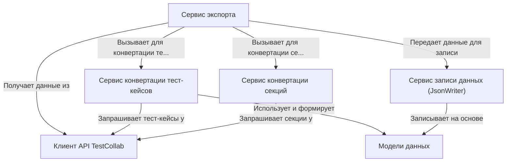

# Tutorial: TestCollabExporter

Этот проект предназначен для **экспорта** данных *тест-кейсов* и их *структуры* из системы **TestCollab**.
Он работает как *конвейер*: сначала получает данные из TestCollab с помощью **Клиента API** (0).
Затем **Сервисы конвертации** (2, 3) преобразуют эти данные в целевой формат, используя **Модели данных** (4).
Наконец, **Сервис записи** (5) сохраняет результат в *JSON-файлы*. Весь процесс координируется **Сервисом экспорта** (1).

## Chapters

1. [Сервис экспорта
](01_сервис_экспорта_.md)
2. [Модели данных
](02_модели_данных_.md)
3. [Клиент API TestCollab
](03_клиент_api_testcollab_.md)
4. [Сервис конвертации тест-кейсов
](04_сервис_конвертации_тест_кейсов_.md)
5. [Сервис конвертации секций
](05_сервис_конвертации_секций_.md)
6. [Сервис записи данных (JsonWriter)
](06_сервис_записи_данных__jsonwriter__.md)

---

Generated by [AI Codebase Knowledge Builder](https://github.com/The-Pocket/Tutorial-Codebase-Knowledge)