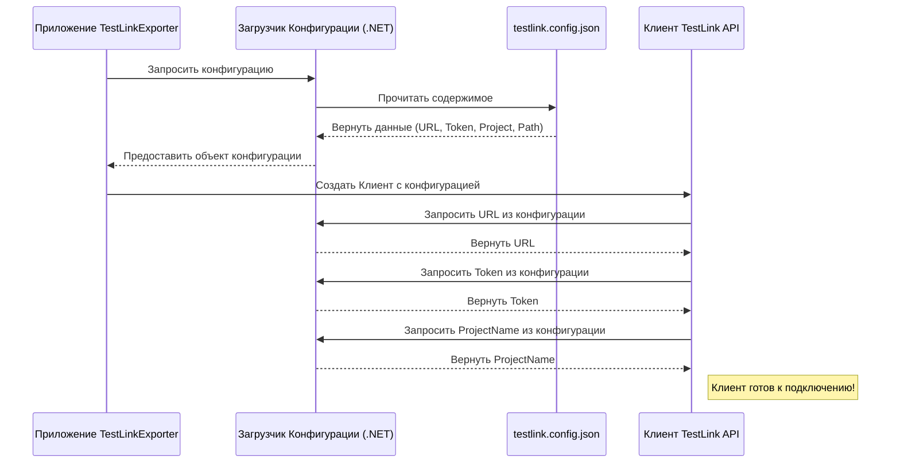

# Chapter 1: Конфигурация Соединения


Добро пожаловать в руководство по `TestLinkExporter`! Эта первая глава посвящена самому первому шагу — настройке соединения с вашим TestLink.

Представьте, что вы хотите отправить почтальона (`TestLinkExporter`) забрать важные документы (ваши тест-кейсы) из большого офисного здания (ваш TestLink). Чтобы почтальон успешно выполнил задание, ему нужна точная информация:
*   Адрес здания (URL API TestLink)
*   Секретный пропуск или код для входа (токен доступа)
*   Название нужного отдела или компании внутри здания (имя проекта в TestLink)
*   Место, куда сложить полученные документы (путь для сохранения результатов)

Именно эту информацию мы и указываем в конфигурации соединения. Без нее наш "почтальон" `TestLinkExporter` просто не будет знать, куда идти, как войти и куда принести результат.

## Файл Конфигурации: `testlink.config.json`

Вся информация для подключения хранится в специальном файле с именем `testlink.config.json`. Этот файл должен находиться в той же папке, где вы запускаете `TestLinkExporter`. Он использует формат JSON (JavaScript Object Notation), который легко читать и человеку, и компьютеру.

Вот как выглядит типичный файл `testlink.config.json`:

```json
{
  "resultPath": "/Users/user01/Documents/importer",
  "testLink": {
    "url": "http://testlink.example.com/lib/api/xmlrpc/v1/xmlrpc.php",
    "token": "ВАШ_СЕКРЕТНЫЙ_API_КЛЮЧ",
    "projectName": "Название Вашего Проекта"
  }
}
```

Давайте разберем каждую строчку:

*   `"resultPath"`: Это полный путь к папке на вашем компьютере, куда `TestLinkExporter` будет сохранять экспортированные файлы. В примере это `/Users/user01/Documents/importer`. Убедитесь, что папка существует и у приложения есть права на запись в нее.
    *   _Аналогия_: Адрес вашего почтового ящика или папки для документов.
*   `"testLink"`: Этот блок содержит настройки для подключения к самому TestLink.
    *   `"url"`: Это точный адрес (URL) API вашего сервера TestLink. Обычно он заканчивается на `xmlrpc.php`. Уточните этот URL у вашего администратора TestLink.
        *   _Аналогия_: Точный адрес здания TestLink, включая нужный вход для API.
    *   `"token"`: Это ваш персональный ключ доступа к API TestLink. Его нужно сгенерировать в настройках вашего профиля в TestLink (Обычно в разделе "Ключ API" или "API Key"). **Никогда не делитесь этим ключом с другими!**
        *   _Аналогия_: Секретный ключ-карта или пароль для входа.
    *   `"projectName"`: Точное название проекта в TestLink, из которого вы хотите экспортировать тест-кейсы. Название должно совпадать с тем, что вы видите в интерфейсе TestLink.
        *   _Аналогия_: Имя нужной компании или отдела внутри здания.

**Важно:** Вам нужно отредактировать этот файл, подставив *ваши* значения для `resultPath`, `url`, `token` и `projectName`.

## Как Это Работает "Под Капотом"?

Когда вы запускаете `TestLinkExporter`, происходит следующее:

1.  **Чтение Конфигурации:** Приложение первым делом ищет файл `testlink.config.json` в своей папке.
2.  **Загрузка Параметров:** Специальный компонент внутри приложения читает этот файл и запоминает указанные вами `url`, `token`, `projectName` и `resultPath`.
3.  **Передача Клиенту:** Эти параметры передаются другому компоненту — [Клиенту TestLink API](04_клиент_testlink_api_.md), который отвечает непосредственно за общение с TestLink.

В коде приложения есть специальная часть, которая отвечает за чтение этого файла. В файле `Program.cs` метод `SetupConfiguration` как раз и говорит приложению: "Ищи настройки в файле `testlink.config.json`":

```csharp
// Фрагмент из Program.cs
private static IConfiguration SetupConfiguration()
{
    return new ConfigurationBuilder()
        // Указываем, где искать файлы конфигурации (в текущей папке)
        .SetBasePath(Directory.GetCurrentDirectory())
        // Говорим искать именно файл testlink.config.json
        .AddJsonFile("testlink.config.json")
        // Позволяем также использовать переменные окружения (для продвинутых сценариев)
        .AddEnvironmentVariables()
        // Собираем все настройки вместе
        .Build();
}
```
*Этот код настраивает систему конфигурации .NET, чтобы она знала, откуда брать настройки.*

Затем, когда создается [Клиент TestLink API](04_клиент_testlink_api_.md), он запрашивает эти загруженные настройки, чтобы знать, куда подключаться. В файле `Client/Client.cs` конструктор класса `Client` делает именно это:

```csharp
// Фрагмент из Client/Client.cs
public Client(ILogger<Client> logger, IConfiguration configuration)
{
    _logger = logger;

    // Получаем секцию "testLink" из загруженной конфигурации
    var section = configuration.GetSection("testLink");
    // Извлекаем URL
    var url = section["url"];
    // Проверяем, указан ли URL
    if (string.IsNullOrEmpty(url))
    {
        throw new ArgumentException("Url не указан"); // Сообщаем об ошибке, если URL пуст
    }

    // Извлекаем токен
    var token = section["token"];
    // Проверяем, указан ли токен
    if (string.IsNullOrEmpty(token))
    {
        throw new ArgumentException("Токен не указан"); // Сообщаем об ошибке, если токен пуст
    }

    // Извлекаем имя проекта
    var projectName = section["projectName"];
    // Проверяем, указано ли имя проекта
    if (string.IsNullOrEmpty(projectName))
    {
        throw new ArgumentException("Имя проекта не указано"); // Сообщаем об ошибке
    }

    _projectName = projectName; // Сохраняем имя проекта для дальнейшего использования

    // Создаем экземпляр клиента TestLink API, используя полученные URL и токен
    _client = new TestLink(token, url);
}
```
*Этот код получает загруженные ранее настройки и использует их для инициализации соединения с TestLink.*

Вот упрощенная схема того, как приложение получает конфигурацию:



## Заключение

Мы разобрались, что такое конфигурация соединения и почему она так важна. Мы узнали, что все настройки хранятся в файле `testlink.config.json`, и рассмотрели значение каждого параметра (`url`, `token`, `projectName`, `resultPath`). Теперь вы знаете, как подготовить этот файл для подключения `TestLinkExporter` к вашему серверу TestLink.

В следующей главе мы перейдем к практике: [Настройка и Запуск Приложения](02_настройка_и_запуск_приложения_.md). Мы узнаем, как скачать `TestLinkExporter`, разместить наш файл конфигурации и запустить процесс экспорта.

---

Generated by [AI Codebase Knowledge Builder](https://github.com/The-Pocket/Tutorial-Codebase-Knowledge)