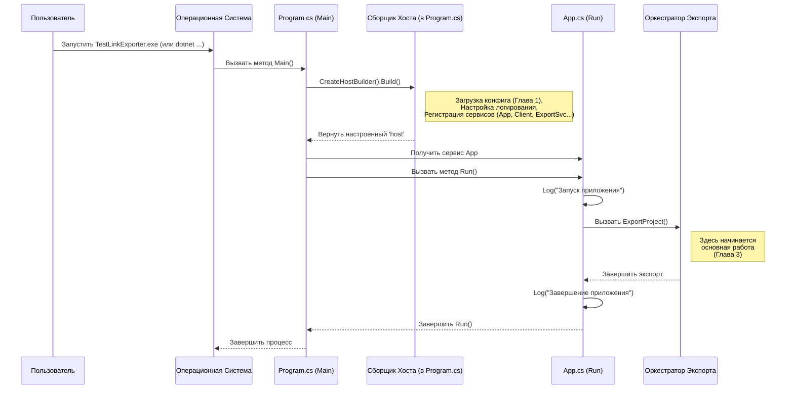

# Chapter 2: Настройка и Запуск Приложения


В [предыдущей главе](01_конфигурация_соединения_.md) мы подготовили наш "паспорт" для `TestLinkExporter` - файл `testlink.config.json`, содержащий все необходимые данные для подключения к TestLink. Теперь, когда у нас есть адрес и ключ доступа, пришло время узнать, как завести "автомобиль" – само приложение `TestLinkExporter` – и отправить его в путь за нашими тест-кейсами.

Эта глава посвящена сердцу приложения: его запуску и координации всех внутренних процессов. Представьте себе диспетчерскую вышку в аэропорту, как мы упоминали ранее. Она сама не летает, но именно она дает команду на взлет и следит, чтобы все службы были готовы. В нашем приложении роль такой "вышки" играют файлы `Program.cs` и `App.cs`.

## Точка Входа: `Program.cs`

Любое приложение .NET (язык, на котором написан `TestLinkExporter`) должно с чего-то начинаться. Этим началом служит специальный файл `Program.cs`. В нем находится метод `Main` — самая первая точка, куда "смотрит" система при запуске программы.

```csharp
// Фрагмент из Program.cs
internal class Program
{
    static void Main(string[] args)
    {
        // 1. Создаем и настраиваем "хост" приложения
        using var host = CreateHostBuilder(args).Build();
        // 2. Получаем доступ к настроенным службам (сервисам)
        using var scope = host.Services.CreateScope();
        var services = scope.ServiceProvider;

        try
        {
            // 3. Находим главный класс App и запускаем его метод Run
            services.GetRequiredService<App>().Run(args);
        }
        catch (Exception e)
        {
            // Если что-то пошло не так, выводим ошибку
            Console.WriteLine(e.Message);
        }
    }

    // ... остальной код настройки ...
}
```

Что здесь происходит?

1.  **Создание "Хоста" (`CreateHostBuilder(args).Build()`):** Представьте, что мы строим основу для нашего "аэропорта". `CreateHostBuilder` - это функция (мы ее рассмотрим ниже), которая собирает все необходимые компоненты: конфигурацию, систему логирования (записи о происходящем), и все службы (как [Клиент TestLink API](04_клиент_testlink_api_.md), [Оркестратор Экспорта](03_оркестратор_экспорта_.md) и др.). `.Build()` завершает эту "стройку".
2.  **Доступ к Сервисам:** Мы получаем доступ ко всем "построенным" и готовым к работе службам нашего "аэропорта".
3.  **Запуск Главного Компонента (`services.GetRequiredService<App>().Run(args)`):** Мы находим нашу "диспетчерскую вышку" - объект класса `App` - и вызываем её метод `Run`, давая команду "начать работу!".

## Настройка Компонентов: `CreateHostBuilder`

Метод `CreateHostBuilder` внутри `Program.cs` отвечает за подготовку всего необходимого для работы приложения. Это похоже на предстартовую подготовку самолета: проверка систем, подключение оборудования.

```csharp
// Фрагмент из Program.cs
static IHostBuilder CreateHostBuilder(string[] strings)
{
    // ... настройки для чтения конфигурации логирования ...

    return Host.CreateDefaultBuilder()
        // Настройка логирования (куда и как записывать сообщения о работе)
        .UseSerilog((context, services, configuration) => configuration
            // ... детальные настройки Serilog ...
            .WriteTo.File("logs/log.txt") // Писать логи в файл logs/log.txt
            .WriteTo.Console(LogEventLevel.Information) // Выводить инфо-сообщения в консоль
        )
        // Настройка сервисов (какие компоненты будут в приложении)
        .ConfigureServices((_, services) =>
        {
            // Регистрируем главный класс приложения
            services.AddSingleton<App>();
            // Регистрируем конфигурацию (из файла testlink.config.json)
            services.AddSingleton(SetupConfiguration());
            // Регистрируем клиент для общения с TestLink API
            services.AddSingleton<IClient, Client.Client>();
            // Регистрируем сервис записи файлов
            services.AddSingleton<IWriteService, WriteService>();
            // Регистрируем главный сервис экспорта (оркестратор)
            services.AddSingleton<IExportService, ExportService>();
            // Регистрируем сервисы для обработки секций, кейсов, шагов, вложений
            services.AddSingleton<ISectionService, SectionService>();
            services.AddSingleton<ITestCaseService, TestCaseService>();
            services.AddSingleton<IStepService, StepService>();
            services.AddSingleton<IAttachmentService, AttachmentService>();
        });
}

// Функция для загрузки конфигурации из файла (мы ее видели в Главе 1)
private static IConfiguration SetupConfiguration()
{
    return new ConfigurationBuilder()
        .SetBasePath(Directory.GetCurrentDirectory())
        .AddJsonFile("testlink.config.json") // Искать настройки здесь
        .AddEnvironmentVariables()
        .Build();
}
```

Ключевые моменты здесь:

*   **`.UseSerilog(...)`**: Настраивает систему логирования. Приложение будет записывать информацию о своей работе (что происходит, какие ошибки возникли) в файл `logs/log.txt` и выводить основные сообщения в консоль, где вы его запускаете. Это очень полезно для отслеживания процесса и диагностики проблем.
*   **`.ConfigureServices(...)`**: Это самая важная часть для сборки приложения. Здесь мы "регистрируем" все необходимые компоненты (сервисы).
    *   `services.AddSingleton<...>()`: Эта команда говорит: "Создай один экземпляр вот этого класса (например, `Client` для работы с API) и используй его везде, где он потребуется". Это гарантирует, что все части приложения работают с одними и теми же данными и настройками.
    *   Мы регистрируем:
        *   `App`: Наш главный управляющий класс.
        *   `SetupConfiguration()`: Результат чтения файла `testlink.config.json`, о котором мы говорили в [Главе 1](01_конфигурация_соединения_.md).
        *   `IClient`: Компонент для общения с TestLink ([Клиент TestLink API](04_клиент_testlink_api_.md)).
        *   `IExportService`: Компонент, который руководит всем процессом экспорта ([Оркестратор Экспорта](03_оркестратор_экспорта_.md)).
        *   И другие сервисы для конкретных задач (обработка секций, тест-кейсов, шагов, вложений).

Представьте, что `ConfigureServices` - это список задач для инженера перед вылетом: "Подключи навигационную систему (`IClient`), проверь двигатели (`IExportService`), убедись, что шасси готовы (другие сервисы)".

## Диспетчерская Вышка: `App.cs`

Теперь посмотрим на саму "диспетчерскую вышку" - класс `App` в файле `App.cs`. Он довольно прост, так как его основная задача – получить нужные инструменты (сервисы) и запустить главный процесс.

```csharp
// Файл: App.cs
using Microsoft.Extensions.Logging;
using TestLinkExporter.Services;

namespace TestLinkExporter;

public class App
{
    // Логгер для записи сообщений
    private readonly ILogger<App> _logger;
    // Главный сервис для выполнения экспорта
    private readonly IExportService _service;

    // Конструктор: получает нужные сервисы при создании объекта App
    public App(ILogger<App> logger, IExportService service)
    {
        _logger = logger;
        _service = service; // Получаем "оркестратора"
    }

    // Метод, который запускается из Program.Main
    public void Run(string[] args)
    {
        _logger.LogInformation("Запуск приложения"); // Записываем в лог о старте

        // Вызываем метод для запуска экспорта у сервиса-оркестратора
        // .Wait() означает, что мы ждем завершения экспорта
        _service.ExportProject().Wait();

        _logger.LogInformation("Завершение приложения"); // Записываем в лог об окончании
    }
}
```

Как это работает:

1.  **Конструктор (`public App(...)`)**: Когда система создает объект `App` (благодаря `services.AddSingleton<App>()` в `Program.cs`), она автоматически передает ему зарегистрированные ранее сервисы: логгер (`ILogger`) и сервис экспорта (`IExportService`). Это называется "внедрение зависимостей" - `App` не создает эти сервисы сам, а получает их готовыми.
2.  **Метод `Run`**:
    *   Записывает сообщение о старте в лог (`_logger.LogInformation`).
    *   Вызывает главный метод `ExportProject()` у сервиса `_service` ([Оркестратор Экспорта](03_оркестратор_экспорта_.md)). Именно здесь начнется вся магия: подключение к TestLink, получение данных, их преобразование и сохранение. Мы подробно рассмотрим это в следующей главе.
    *   `.Wait()`: Эта команда заставляет приложение дождаться, пока `ExportProject()` полностью завершит свою работу.
    *   Записывает сообщение о завершении работы в лог.

## Как Запустить Приложение?

Теперь, когда мы знаем, как приложение устроено внутри, давайте разберемся, как его запустить.

1.  **Скачайте `TestLinkExporter`:** Обычно это будет архив (`.zip`) или папка с файлами. Найдите исполняемый файл (например, `TestLinkExporter.exe` для Windows или скрипт запуска для Linux/macOS) или инструкцию по запуску через `dotnet` (например, `dotnet TestLinkExporter.dll`).
2.  **Создайте и Настройте `testlink.config.json`:** Как мы обсуждали в [Главе 1](01_конфигурация_соединения_.md), создайте этот файл в **той же папке**, где находится исполняемый файл `TestLinkExporter`. Заполните его вашими реальными данными (`url`, `token`, `projectName`, `resultPath`).
3.  **Запустите:**
    *   **Windows:** Дважды щелкните на `TestLinkExporter.exe` или запустите его из командной строки.
    *   **Linux/macOS (или через .NET SDK):** Откройте терминал (командную строку) в папке с приложением и выполните команду, указанную в документации (обычно что-то вроде `dotnet TestLinkExporter.dll`).
4.  **Наблюдайте:** Вы должны увидеть в консоли сообщения о запуске, процессе экспорта (если он занимает время) и завершении. Также проверьте папку `logs` на наличие файла `log.txt` с более подробной информацией. Наконец, проверьте папку, указанную в `resultPath` - там должны появиться экспортированные данные.

## Схема Запуска и Взаимодействия

Вот упрощенная схема того, что происходит при запуске:



## Заключение

В этой главе мы рассмотрели, как устроен запуск `TestLinkExporter`. Мы узнали, что `Program.cs` является точкой входа, которая настраивает все необходимые компоненты (конфигурацию, логирование, сервисы) с помощью `CreateHostBuilder` и `ConfigureServices`. Затем управление передается классу `App`, который, в свою очередь, запускает основной процесс экспорта, вызывая [Оркестратор Экспорта](03_оркестратор_экспорта_.md). Мы также обсудили практические шаги по запуску приложения.

Теперь вы понимаете, как приложение оживает и готовится к работе. В следующей главе, [Оркестратор Экспорта](03_оркестратор_экспорта_.md), мы погрузимся в самый центр процесса – как именно приложение координирует экспорт данных из TestLink.

---

Generated by [AI Codebase Knowledge Builder](https://github.com/The-Pocket/Tutorial-Codebase-Knowledge)