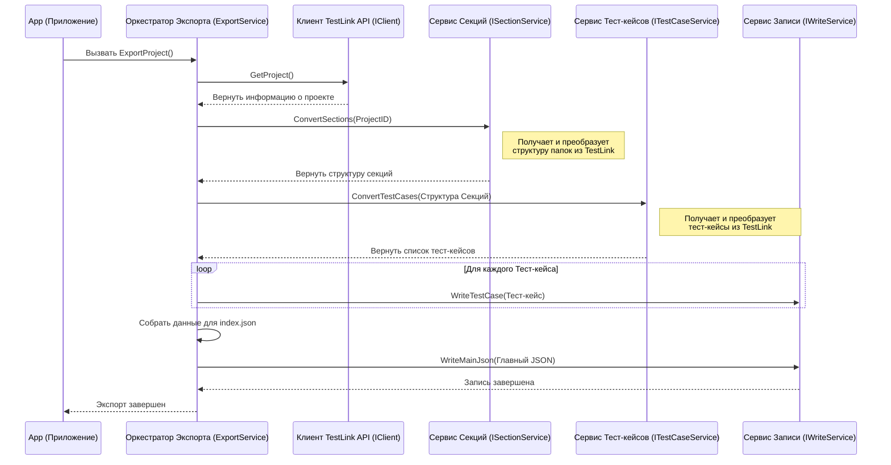

# Chapter 3: Оркестратор Экспорта


В [предыдущей главе](02_настройка_и_запуск_приложения_.md) мы узнали, как `TestLinkExporter` запускается и готовится к работе, словно автомобиль перед поездкой. Мы видели, как класс `App` дает команду "старт". Теперь давайте заглянем "под капот" и посмотрим, кто же главный за рулем всего процесса экспорта. Этот главный "водитель" или, лучше сказать, "режиссер" — это **Оркестратор Экспорта**.

Представьте себе съемочную площадку фильма. Есть множество людей: операторы, актеры, осветители, звукорежиссеры. Каждый знает свое дело, но нужен главный — **режиссер**, который скажет, когда начать съемку, кому войти в кадр, что делать, и проследит, чтобы все шло по плану.

В `TestLinkExporter` процесс экспорта тест-кейсов тоже состоит из множества шагов:
1.  Получить общую информацию о проекте из TestLink.
2.  Получить список всех папок (секций или тест-сьютов).
3.  Для каждой папки получить список тест-кейсов.
4.  Преобразовать каждый тест-кейс в нужный формат.
5.  Сохранить все это в файлы на вашем компьютере.

Было бы очень сложно управлять всем этим из одного места. Поэтому у нас есть **Оркестратор Экспорта** (в коде он называется `ExportService`). Его задача — не выполнять всю работу самому, а **координировать** работу других специализированных сервисов, вызывая их в правильном порядке. Он как тот самый режиссер, который говорит:
*   "Камера! Мотор!" (Начать процесс экспорта)
*   "Свет! Получаем данные о проекте!" (Вызывает [Клиент TestLink API](04_клиент_testlink_api_.md))
*   "Актеры! Преобразуем папки!" (Вызывает [Сервис Преобразования Секций](05_преобразование_секций__тест_сьютов__.md))
*   "Теперь преобразуем тест-кейсы!" (Вызывает [Сервис Преобразования Тест-кейсов](06_преобразование_тест_кейсов__.md))
*   "Сохраняем сцену!" (Вызывает сервис записи файлов)
*   "Снято!" (Завершить экспорт)

## Как Устроен Оркестратор?

Оркестратор Экспорта живет в файле `Services/ExportService.cs`. Как и другие важные компоненты, он "собирается" при запуске приложения (мы видели это в `Program.cs` в [Главе 2](02_настройка_и_запуск_приложения_.md)). Самое главное — он знает обо всех других сервисах, которые ему нужны для работы.

Посмотрите на "конструктор" этого класса — специальный метод, который вызывается при создании объекта `ExportService`:

```csharp
// Фрагмент из Services/ExportService.cs
public class ExportService : IExportService
{
    private readonly ILogger<ExportService> _logger; // Для записи логов
    private readonly IClient _client; // Для общения с TestLink
    private readonly IWriteService _writeService; // Для записи файлов
    private readonly ISectionService _sectionService; // Для обработки секций
    private readonly ITestCaseService _testCaseService; // Для обработки тест-кейсов

    // Конструктор: получает всех необходимых "помощников"
    public ExportService(ILogger<ExportService> logger, IClient client, IWriteService writeService,
        ISectionService sectionService, ITestCaseService testCaseService)
    {
        _logger = logger;
        _client = client; // Получаем Клиента TestLink API
        _writeService = writeService; // Получаем Сервис Записи
        _sectionService = sectionService; // Получаем Сервис Секций
        _testCaseService = testCaseService; // Получаем Сервис Тест-кейсов
    }

    // ... остальной код ...
}
```

Этот код показывает, что при создании `ExportService` ему автоматически передаются ссылки на другие сервисы (`IClient`, `IWriteService`, `ISectionService`, `ITestCaseService`). Он не создает их сам, а получает готовыми — это как режиссеру выдают команду и оборудование.

## Главный Метод: `ExportProject`

Вся логика координации находится в одном главном методе — `ExportProject()`. Именно его вызывает класс `App`, когда мы запускаем экспорт. Давайте посмотрим на него по шагам:

```csharp
// Фрагмент из Services/ExportService.cs
public async Task ExportProject()
{
    _logger.LogInformation("Начинаем экспорт..."); // Записываем в лог

    // Шаг 1: Получить информацию о проекте от TestLink
    var project = _client.GetProject();
    _logger.LogInformation($"Экспортируем проект: {project.Name}");

    // Шаг 2: Обработать секции (папки)
    // Вызываем сервис секций, чтобы получить структуру папок
    var sectionData = _sectionService.ConvertSections(project.Id);
    _logger.LogInformation($"Найдено {sectionData.Sections.Count} секций верхнего уровня.");

    // Шаг 3: Обработать тест-кейсы
    // Вызываем сервис тест-кейсов, передавая ему информацию о секциях
    var testCases = await _testCaseService.ConvertTestCases(sectionData.SectionMap);
    _logger.LogInformation($"Конвертировано {testCases.Count} тест-кейсов.");

    // Шаг 4: Сохранить каждый тест-кейс в отдельный файл
    _logger.LogInformation("Сохраняем тест-кейсы в файлы...");
    foreach (var testCase in testCases)
    {
        await _writeService.WriteTestCase(testCase); // Передаем каждый кейс сервису записи
    }

    // Шаг 5: Создать и сохранить главный JSON файл (оглавление)
    _logger.LogInformation("Создаем главный файл index.json...");
    var mainJson = new Root // Собираем финальную структуру
    {
        ProjectName = project.Name,
        Sections = sectionData.Sections,
        TestCases = testCases.Select(t => t.Id).ToList(), // Собираем ID всех кейсов
        // Списки для SharedSteps и Attributes пока пустые (для будущих версий)
        SharedSteps = new List<Guid>(),
        Attributes = new List<Models.Attribute>(),
    };

    await _writeService.WriteMainJson(mainJson); // Записываем главный файл

    _logger.LogInformation("Экспорт завершен!"); // Финальное сообщение в лог
}
```

**Что здесь происходит?**

1.  **`_client.GetProject()`:** Оркестратор обращается к [Клиенту TestLink API](04_клиент_testlink_api_.md) и говорит: "Дай мне информацию о проекте, указанном в конфигурации".
2.  **`_sectionService.ConvertSections(...)`:** Затем он передает ID полученного проекта [Сервису Преобразования Секций](05_преобразование_секций__тест_сьютов_).md) и просит: "Обработай все папки внутри этого проекта и верни мне их структуру".
3.  **`_testCaseService.ConvertTestCases(...)`:** Получив структуру папок, Оркестратор отдает ее [Сервису Преобразования Тест-кейсов](06_преобразование_тест_кейсов__.md) с командой: "Теперь найди все тест-кейсы в этих папках и преобразуй их в наш формат".
4.  **`_writeService.WriteTestCase(...)`:** Для каждого готового тест-кейса Оркестратор вызывает `_writeService` (сервис записи) и говорит: "Запиши этот тест-кейс в отдельный файл".
5.  **`_writeService.WriteMainJson(...)`:** В самом конце Оркестратор собирает общую информацию (имя проекта, список папок, список ID всех тест-кейсов) и просит `_writeService`: "Создай главный файл `index.json`, который будет служить оглавлением для всего экспорта".

Видите? Оркестратор сам не лезет в дебри общения с TestLink или форматирования JSON. Он лишь знает, кого позвать и в каком порядке, чтобы получить нужный результат.

## Схема Взаимодействия

Вот как выглядит последовательность вызовов, когда `App` запускает Оркестратора:



Эта диаграмма наглядно показывает роль Оркестратора как центрального координатора, который последовательно обращается к другим специализированным сервисам.

## Заключение

Мы разобрались, что **Оркестратор Экспорта** (`ExportService`) — это сердце всего процесса экспорта в `TestLinkExporter`. Он не выполняет грязную работу сам, а действует как режиссер или дирижер, вызывая другие сервисы ([Клиент TestLink API](04_клиент_testlink_api_.md), [Сервис Секций](05_преобразование_секций__тест_сьютов__.md), [Сервис Тест-кейсов](06_преобразование_тест_кейсов__.md), Сервис Записи) в строгой последовательности. Это позволяет сделать код более организованным и понятным.

Мы увидели, как метод `ExportProject` шаг за шагом выполняет экспорт: получает данные, преобразует их с помощью других сервисов и сохраняет результат.

Теперь, когда мы понимаем общую картину и роль дирижера, самое время познакомиться с первым "музыкантом" в нашем оркестре. В следующей главе мы подробно рассмотрим, как работает [Клиент TestLink API](04_клиент_testlink_api_.md) — компонент, отвечающий за непосредственное общение с вашим сервером TestLink.

---

Generated by [AI Codebase Knowledge Builder](https://github.com/The-Pocket/Tutorial-Codebase-Knowledge)