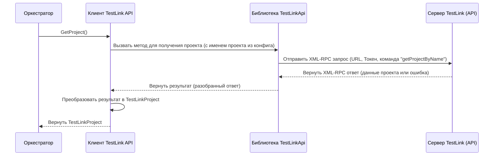

# Chapter 4: Клиент TestLink API


В [предыдущей главе](03_оркестратор_экспорта_.md) мы познакомились с "режиссером" нашего приложения — [Оркестратором Экспорта](03_оркестратор_экспорта_.md), который руководит всем процессом. Мы видели, как он дает команды различным сервисам. Теперь пришло время узнать поближе одного из самых важных исполнителей — того, кто непосредственно общается с TestLink. Это **Клиент TestLink API**.

Представьте, что наш [Оркестратор Экспорта](03_оркестратор_экспорта_.md) — это начальник отдела в вашей компании, которому нужны данные из другого, иностранного отдела (TestLink). Начальник не говорит на языке того отдела и не знает, как туда позвонить или отправить запрос. Ему нужен помощник — **переводчик и курьер** в одном лице. Этот помощник (Клиент TestLink API):

1.  **Знает язык:** Понимает, как "разговаривать" с TestLink с помощью его специального API (Application Programming Interface), используя протокол XML-RPC.
2.  **Знает адрес и пропуск:** Использует URL и Токен Доступа, которые мы указали в [конфигурации](01_конфигурация_соединения_.md), чтобы подключиться к нужному серверу TestLink.
3.  **Выполняет поручения:** Получает от "начальника" (Оркестратора) задания: "Принеси информацию о проекте", "Принеси список папок", "Достань вот этот тест-кейс".
4.  **Доставляет результат:** Передает полученные от TestLink данные обратно "начальнику" (Оркестратору) в понятном для него виде.

Без этого "переводчика-курьера" наше приложение `TestLinkExporter` не смогло бы получить никаких данных из TestLink.

## Основные Задачи Клиента TestLink API

Клиент TestLink API (в коде это класс `Client` в файле `Client/Client.cs`) отвечает за все прямое взаимодействие с сервером TestLink. Вот его главные функции:

*   **Подключение:** Использует URL и Токен из файла `testlink.config.json` для установления связи с API TestLink.
*   **Получение Информации о Проекте:** Запрашивает у TestLink основные данные о проекте (ID, имя), название которого указано в конфигурации.
*   **Получение Тест-сьютов (Секций/Папок):** Запрашивает список папок (тест-сьютов) внутри указанного проекта или внутри других папок.
*   **Получение Тест-кейсов:** Запрашивает детальную информацию по конкретным тест-кейсам (имя, шаги, предусловия и т.д.) по их ID.
*   **Получение Вложений:** Запрашивает файлы, прикрепленные к тест-кейсам.

Важно понимать, что сам `Client` не выполняет всю сложную работу по общению с API с нуля. Он использует специальную библиотеку `TestLinkApi` (её можно представить как готовый "разговорник" и "инструмент для отправки запросов"), которая берет на себя технические детали протокола XML-RPC. Наш `Client` — это скорее умелый пользователь этого инструмента.

## Как Оркестратор Использует Клиент?

Давайте вспомним метод `ExportProject` из [Оркестратора Экспорта](03_оркестратор_экспорта_.md). Оркестратор обращается к Клиенту (`_client`) несколько раз:

1.  **Получить проект:**
    ```csharp
    // Оркестратор просит Клиента: "Дай информацию о проекте"
    var project = _client.GetProject();
    _logger.LogInformation($"Экспортируем проект: {project.Name}");
    ```
    *   **Что происходит:** Оркестратор вызывает метод `GetProject()` у Клиента. Клиент использует имя проекта из конфигурации, запрашивает информацию у TestLink и возвращает Оркестратору объект `TestLinkProject` с ID и именем проекта.

2.  **(Внутри Сервиса Секций) Получить секции:** Хотя сам Оркестратор не вызывает метод получения секций напрямую, он передает управление [Сервису Преобразования Секций](05_преобразование_секций__тест_сьютов__.md), который уже использует Клиент:
    ```csharp
    // Примерно так Сервис Секций использует Клиент:
    // public SectionData ConvertSections(int projectId) {
    //    // Запрашиваем папки верхнего уровня у TestLink через Клиент
    //    List<TestLinkSuite> topLevelSuites = _client.GetSuitesByProjectId(projectId);
    //    // ... дальнейшая обработка ...
    // }
    ```
    *   **Что происходит:** Сервис Секций вызывает `GetSuitesByProjectId(id)` у Клиента, передавая ID проекта. Клиент запрашивает у TestLink список папок (сьютов) первого уровня в этом проекте и возвращает его. Похожим образом запрашиваются и вложенные папки (`GetSharedSuitesBySuiteId`).

3.  **(Внутри Сервиса Тест-кейсов) Получить ID и детали тест-кейсов:** Аналогично секциям, Оркестратор поручает работу с тест-кейсами [Сервису Преобразования Тест-кейсов](06_преобразование_тест_кейсов__.md), который использует Клиент:
    ```csharp
    // Примерно так Сервис Тест-кейсов использует Клиент:
    // public async Task<List<TestCase>> ConvertTestCases(...) {
    //    foreach (var sectionId in sectionMap.Keys) {
    //        // Получаем ID всех кейсов в секции через Клиент
    //        List<int> testCaseIds = _client.GetTestCaseIdsBySuiteId(sectionId);
    //        foreach (var testCaseId in testCaseIds) {
    //            // Получаем детали каждого кейса через Клиент
    //            TestLinkTestCase tlTestCase = _client.GetTestCaseById(testCaseId);
    //            // ... обработка тест-кейса ...
    //            // Получаем вложения через Клиент (если нужно)
    //            List<TestLinkAttachment> attachments = _client.GetAttachmentsByTestCaseId(testCaseId);
    //            // ... обработка вложений ...
    //        }
    //    }
    //    // ...
    // }
    ```
    *   **Что происходит:** Сервис Тест-кейсов сначала вызывает `GetTestCaseIdsBySuiteId(id)` у Клиента, чтобы получить список ID всех тест-кейсов в конкретной папке. Затем для каждого ID он вызывает `GetTestCaseById(id)`, чтобы получить полную информацию о тест-кейсе (шаги, статус и т.д.). При необходимости он также вызывает `GetAttachmentsByTestCaseId(id)` для получения вложений.

Клиент API действует как надежный источник данных из TestLink для других частей приложения.

## Как это Работает "Под Капотом"?

Давайте снова воспользуемся аналогией с "переводчиком-курьером".

1.  **Запрос от Оркестратора:** Например, Оркестратор говорит Клиенту: "Мне нужен проект".
2.  **Подготовка:** Клиент берет имя проекта из конфигурации (он запомнил его при запуске). Он также знает "адрес" (URL) и "секретный пропуск" (Токен).
3.  **"Перевод" и Отправка:** Клиент использует библиотеку `TestLinkApi`, чтобы сформировать специальный запрос на "языке" TestLink (XML-RPC). Этот запрос содержит Токен (для аутентификации) и команду "дай мне проект с таким-то именем". Запрос отправляется по указанному URL.
4.  **Ожидание и Получение Ответа:** Клиент ждет, пока сервер TestLink обработает запрос и пришлет ответ (тоже в формате XML-RPC).
5.  **Обратный "Перевод":** Клиент (с помощью библиотеки `TestLinkApi`) разбирает ответ от TestLink, извлекает нужные данные (ID, имя проекта).
6.  **Преобразование (если нужно):** Клиент преобразует полученные данные в более простой и удобный формат (например, в объект `TestLinkProject`), который понятен другим частям приложения (`TestLinkExporter`).
7.  **Доставка Оркестратору:** Клиент возвращает готовый объект `TestLinkProject` Оркестратору.

Вот упрощенная схема этого процесса:



## Заглянем в Код Клиента

**1. Инициализация (Конструктор)**

Когда приложение запускается, создается экземпляр `Client`. В этот момент он читает конфигурацию и настраивает библиотеку `TestLinkApi`:

```csharp
// Фрагмент из Client/Client.cs
public class Client : IClient
{
    // ... поля для логгера, клиента TestLinkApi, имени проекта ...
    private readonly TestLink _client; // Экземпляр библиотеки TestLinkApi
    private readonly string _projectName; // Имя проекта из конфигурации

    // Конструктор: получает логгер и конфигурацию
    public Client(ILogger<Client> logger, IConfiguration configuration)
    {
        _logger = logger;

        // Получаем секцию "testLink" из конфигурации
        var section = configuration.GetSection("testLink");
        // Извлекаем URL, Токен, Имя Проекта (с проверками)
        var url = section["url"];
        // ... (проверка url) ...
        var token = section["token"];
        // ... (проверка token) ...
        var projectName = section["projectName"];
        // ... (проверка projectName) ...

        _projectName = projectName; // Запоминаем имя проекта

        // Создаем экземпляр клиента TestLink API из библиотеки,
        // передавая ему Токен и URL
        _client = new TestLink(token, url);
    }

    // ... остальные методы ...
}
```
*Этот код в конструкторе получает необходимые данные из [Конфигурации Соединения](01_конфигурация_соединения_.md) и создает основной объект `_client` библиотеки `TestLinkApi`, который будет использоваться для всех последующих запросов к TestLink.*

**2. Пример Метода: `GetProject`**

Вот как выглядит метод, который Оркестратор вызывает для получения информации о проекте:

```csharp
// Фрагмент из Client/Client.cs
public TestLinkProject GetProject()
{
    // Используем объект _client библиотеки TestLinkApi,
    // чтобы вызвать метод API TestLink "getTestProjectByName"
    var project = _client.GetProject(_projectName); // Передаем имя проекта

    // Проверяем, найден ли проект
    if (project == null)
    {
        _logger.LogError("Проект {ProjectName} не найден", _projectName);
        throw new Exception($"Проект {_projectName} не найден");
    }

    _logger.LogDebug("Получен проект по имени {ProjectName}: {@Project}", _projectName, project);

    // Преобразуем результат из формата библиотеки TestLinkApi
    // в наш внутренний формат TestLinkProject
    return new TestLinkProject
    {
        Id = project.id,
        Name = project.name,
        // Другие поля project.* игнорируются, т.к. они не нужны дальше
    };
}
```
*Этот метод прост: он вызывает соответствующий метод (`GetProject`) у объекта `_client` (который представляет библиотеку `TestLinkApi`), передавая ему имя проекта. Затем он проверяет результат, записывает информацию в лог и преобразует полученные данные в более простую структуру `TestLinkProject`, возвращая ее тому, кто вызвал метод (Оркестратору).*

**3. Интерфейс `IClient`**

Существует также файл `Client/IClient.cs`. Он содержит "контракт" или описание того, *что* должен уметь делать наш `Client`, не вдаваясь в подробности *как* он это делает.

```csharp
// Фрагмент из Client/IClient.cs
using TestLinkExporter.Models;

namespace TestLinkExporter.Client;

// Интерфейс определяет "обещания" Клиента
public interface IClient
{
    TestLinkProject GetProject(); // Обещает вернуть информацию о проекте
    List<TestLinkSuite> GetSuitesByProjectId(int id); // Обещает вернуть сьюты по ID проекта
    List<TestLinkSuite> GetSharedSuitesBySuiteId(int id); // Обещает вернуть вложенные сьюты
    List<int> GetTestCaseIdsBySuiteId(int id); // Обещает вернуть ID кейсов в сьюте
    TestLinkTestCase GetTestCaseById(int id); // Обещает вернуть детали кейса по ID
    List<TestLinkAttachment> GetAttachmentsByTestCaseId(int id); // Обещает вернуть вложения кейса
}
```
*Этот интерфейс важен для организации кода. Он позволяет другим частям приложения (например, Оркестратору) знать, какие методы доступны у Клиента, не завися напрямую от конкретной реализации в `Client.cs`. Это делает систему более гибкой.*

## Заключение

В этой главе мы подробно рассмотрели **Клиент TestLink API** — ключевой компонент `TestLinkExporter`, который выступает в роли "переводчика" и "курьера" для общения с сервером TestLink. Мы узнали, что он использует URL и Токен из конфигурации, обращается к API TestLink (с помощью библиотеки `TestLinkApi`) для получения данных о проектах, секциях, тест-кейсах и вложениях, а затем передает эту информацию другим частям приложения в удобном формате. Мы также заглянули в код, чтобы увидеть, как он инициализируется и выполняет запросы.

Теперь, когда мы знаем, как `TestLinkExporter` получает "сырые" данные из TestLink, мы готовы перейти к следующему этапу — их обработке и преобразованию. В следующей главе, [Преобразование Секций (Тест-сьютов)](05_преобразование_секций__тест_сьютов__.md), мы увидим, как приложение берет информацию о папках (тест-сьютах), полученную от Клиента, и превращает ее в структуру, необходимую для финального экспорта.

---

Generated by [AI Codebase Knowledge Builder](https://github.com/The-Pocket/Tutorial-Codebase-Knowledge)