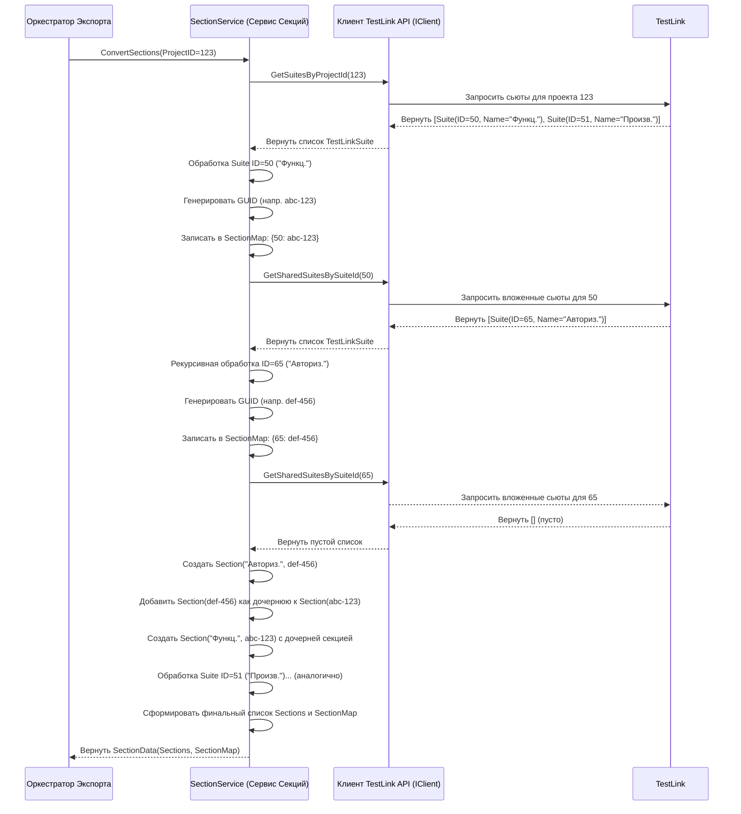

# Chapter 5: Преобразование Секций (Тест-сьютов)


В [предыдущей главе](04_клиент_testlink_api_.md) мы разобрались, как [Клиент TestLink API](04_клиент_testlink_api_.md) работает как наш "переводчик-курьер", доставляя "сырые" данные о папках и тест-кейсах прямо из TestLink. Теперь, когда у нас есть эти необработанные данные, нам нужно их организовать и подготовить для финального экспорта. Эта глава посвящена первому шагу этой подготовки: **преобразованию секций (тест-сьютов)**.

Представьте, что [Клиент TestLink API](04_клиент_testlink_api_.md) принес нам большую стопку папок с тестовой документацией (тест-сьюты) из TestLink. Папки могут быть вложены друг в друга, и у каждой есть свое название и идентификатор внутри TestLink. Наша задача на этом этапе — взять эту стопку и создать новую, аккуратную *внутреннюю* структуру, где каждая папка представлена в едином формате, удобном для `TestLinkExporter`, и имеет свой уникальный "библиотечный номер" (GUID), который не зависит от TestLink.

Этот процесс похож на работу **библиотекаря**. Библиотекарь (`SectionService` в нашем приложении) берет старые папки (тест-сьюты из TestLink), создает для каждой новую, стандартизированную карточку (`Section`) в своей картотеке, присваивая каждой уникальный номер (GUID). Он также аккуратно записывает, какие папки были вложены в другие, сохраняя исходную иерархию. Эта новая картотека (`SectionData`) будет использоваться на следующих этапах экспорта.

## Зачем Нужно Преобразование?

Может возникнуть вопрос: зачем что-то преобразовывать, если [Клиент TestLink API](04_клиент_testlink_api_.md) уже принес нам данные о папках? На это есть несколько причин:

1.  **Уникальная Идентификация:** В TestLink у каждой папки есть свой числовой ID. Но когда мы экспортируем данные, нам нужна система идентификации, которая будет уникальной и не будет конфликтовать, если, например, вы захотите объединить экспорты из разных проектов или даже разных TestLink-серверов в будущем. Поэтому `TestLinkExporter` генерирует для каждой папки (секции) универсальный уникальный идентификатор — **GUID** (Globally Unique Identifier). Это длинная строка из букв и цифр, которая гарантированно уникальна.
2.  **Стандартизированная Структура:** Формат данных, который возвращает TestLink API, может быть сложным или содержать лишнюю информацию. `TestLinkExporter` преобразует эти данные в свою собственную, более простую и чистую структуру `Section`. Эта структура содержит только то, что нужно для дальнейшей работы и финального экспорта (имя, уникальный ID, информация о вложенных секциях и т.д.).
3.  **Карта Соответствия:** Нам нужно помнить, какой оригинальный ID папки в TestLink соответствует новому GUID в нашей системе. Это необходимо для того, чтобы позже, при обработке тест-кейсов, мы знали, в какую новую секцию (по GUID) положить тест-кейс, который в TestLink лежал в папке с определенным ID. Для этого создается специальная "карта" (`SectionMap`).

## Кто Этим Занимается? `SectionService`

За всю эту работу по преобразованию папок (тест-сьютов) отвечает специальный компонент — `SectionService` (Сервис Секций). Он живет в файле `Services/SectionService.cs`.

Как мы видели в [Главе 3](03_оркестратор_экспорта_.md), [Оркестратор Экспорта](03_оркестратор_экспорта_.md) вызывает метод `ConvertSections` у `SectionService`, передавая ему ID проекта, полученный от [Клиента TestLink API](04_клиент_testlink_api_.md).

```csharp
// Фрагмент из Services/ExportService.cs (Оркестратор Экспорта)

// Шаг 2: Обработать секции (папки)
// Вызываем сервис секций, чтобы получить структуру папок
var sectionData = _sectionService.ConvertSections(project.Id); // <<-- Вот здесь!
_logger.LogInformation($"Найдено {sectionData.Sections.Count} секций верхнего уровня.");
```

*Этот код показывает, как Оркестратор инициирует процесс преобразования секций, вызывая `_sectionService.ConvertSections` и передавая ему ID проекта TestLink.*

`SectionService` берет этот ID, обращается к [Клиенту TestLink API](04_клиент_testlink_api_.md), чтобы получить список папок (сьютов) для этого проекта, а затем рекурсивно (то есть проходя по всем уровням вложенности) преобразует их в нужную нам структуру.

## Как Происходит Преобразование: Шаг за Шагом

Давайте представим, что `SectionService` — это наш библиотекарь, а `IClient` — его помощник, который бегает в архив (TestLink) за документами.

1.  **(Запрос от Оркестратора):** Оркестратор говорит `SectionService`: "Преобразуй папки для проекта с ID 123".
2.  **(Запрос в Архив):** `SectionService` просит своего помощника `IClient`: "Принеси мне список папок (сьютов) верхнего уровня для проекта 123". `IClient` обращается к TestLink и приносит, например, две папки: "Функциональные тесты" (ID 50) и "Тесты производительности" (ID 51).
3.  **(Создание Карточек):** `SectionService` берет папку "Функциональные тесты" (ID 50).
    *   Генерирует для нее уникальный библиотечный номер (GUID), например, `abc-123`.
    *   Создает новую карточку (`Section`) с этим GUID и именем "Функциональные тесты".
    *   **Записывает в карту соответствия (`SectionMap`):** "ID 50 из TestLink" -> "GUID abc-123".
4.  **(Проверка Вложенности):** `SectionService` спрашивает помощника `IClient`: "Есть ли внутри папки с ID 50 какие-то еще вложенные папки?". `IClient` идет в TestLink и приносит, скажем, папку "Авторизация" (ID 65).
5.  **(Рекурсивная Обработка):** `SectionService` повторяет шаг 3 и 4 для папки "Авторизация" (ID 65):
    *   Генерирует GUID, например, `def-456`.
    *   Создает карточку (`Section`) с GUID `def-456` и именем "Авторизация".
    *   **Записывает в карту (`SectionMap`):** "ID 65 из TestLink" -> "GUID def-456".
    *   Спрашивает про вложенные папки для ID 65. Допустим, их нет.
    *   Добавляет созданную карточку "Авторизация" (GUID `def-456`) как вложенную секцию в карточку "Функциональные тесты" (GUID `abc-123`).
6.  **(Обработка Следующей Папки):** `SectionService` переходит к следующей папке верхнего уровня — "Тесты производительности" (ID 51) — и повторяет для нее шаги 3-5.
7.  **(Возврат Результата):** Собрав все карточки (`Section`) в иерархический список и заполнив карту соответствия (`SectionMap`), `SectionService` возвращает их Оркестратору в виде объекта `SectionData`.

Вот как это выглядит на схеме:



## Заглянем в Код `SectionService`

**1. Конструктор и Инициализация:**

При старте `SectionService` получает "помощника" `IClient` и создает пустую карту `_sectionMap` для хранения соответствий ID и GUID.

```csharp
// Фрагмент из Services/SectionService.cs
public class SectionService : ISectionService
{
    private readonly ILogger<SectionService> _logger;
    private readonly IClient _client; // Наш "помощник" для связи с TestLink
    // Карта для хранения: ID из TestLink -> Наш новый GUID
    private readonly Dictionary<int, Guid> _sectionMap;

    // Конструктор получает зависимости и создает карту
    public SectionService(ILogger<SectionService> logger, IClient client)
    {
        _logger = logger;
        _client = client;
        _sectionMap = new Dictionary<int, Guid>(); // Создаем пустую карту
    }
    // ... остальные методы ...
}
```

*Этот конструктор просто сохраняет полученные логгер и клиент API, а также инициализирует словарь `_sectionMap`, который будет заполняться во время работы.*

**2. Главный Метод `ConvertSections`:**

Этот метод вызывается Оркестратором. Он запрашивает папки верхнего уровня и запускает основной процесс преобразования.

```csharp
// Фрагмент из Services/SectionService.cs
public SectionData ConvertSections(int projectId)
{
    _logger.LogInformation("Начинаем конвертацию тест-сьютов");

    // 1. Запрашиваем папки верхнего уровня через Клиента
    var mainSuites = _client.GetSuitesByProjectId(projectId);
    _logger.LogDebug($"Найдено {mainSuites.Count} тест-сьютов верхнего уровня");

    // 2. Запускаем рекурсивное преобразование этих папок
    var sections = ConvertSuitesToSections(mainSuites);

    // 3. Собираем результат: список секций и карту соответствия
    var sectionData = new SectionData
    {
        Sections = sections,    // Итоговый список наших Section
        SectionMap = _sectionMap // Заполненная карта соответствия
    };

    _logger.LogInformation("Экспорт тест-сьютов завершен");
    return sectionData; // Возвращаем результат Оркестратору
}
```

*Метод сначала получает "сырые" данные о папках верхнего уровня (`mainSuites`) от [Клиента TestLink API](04_клиент_testlink_api_.md), затем вызывает внутренний метод `ConvertSuitesToSections` для их преобразования, и наконец упаковывает результат (список `Section` и карту `_sectionMap`) в объект `SectionData`.*

**3. Метод `ConvertSuitesToSections` (Рекурсивное Преобразование):**

Это сердце процесса. Он проходит по списку папок из TestLink, создает для каждой новую `Section` с уникальным GUID, записывает соответствие в `_sectionMap` и рекурсивно вызывает себя для обработки вложенных папок.

```csharp
// Фрагмент из Services/SectionService.cs
private List<Section> ConvertSuitesToSections(List<TestLinkSuite> testLinkSuites)
{
    var sections = new List<Section>(); // Список для новых Section

    foreach (var testLinkSuite in testLinkSuites) // Для каждой папки из TestLink...
    {
        var sectionId = Guid.NewGuid(); // 1. Генерируем уникальный ID

        sections.Add( // 2. Создаем нашу внутреннюю секцию
            new Section
            {
                Id = sectionId, // Используем новый GUID
                Name = testLinkSuite.Name, // Имя берем из TestLink
                PreconditionSteps = new List<Step>(), // Поля для шагов пока пустые
                PostconditionSteps = new List<Step>(),
                // 3. РЕКУРСИЯ: Ищем и преобразуем вложенные папки
                Sections = ConvertSharedSections(testLinkSuite.Id),
            }
        );

        // 4. Запоминаем соответствие: TestLink ID -> наш GUID
        _sectionMap.Add(testLinkSuite.Id, sectionId);
    }

    return sections; // Возвращаем список созданных Section
}

// Вспомогательный метод для получения и конвертации вложенных (shared) сьютов
private List<Section> ConvertSharedSections(int mainSuiteId)
{
    _logger.LogInformation($"Конвертируем вложенные тест-сьюты для ID={mainSuiteId}");
    // Запрашиваем вложенные сьюты через Клиента
    var sharedSuites = _client.GetSharedSuitesBySuiteId(mainSuiteId);
    _logger.LogDebug($"Найдено {sharedSuites.Count} вложенных тест-сьютов");
    // Снова вызываем основной метод конвертации для них
    var sections = ConvertSuitesToSections(sharedSuites);
    _logger.LogInformation("Завершен экспорт вложенных тест-сьютов");
    return sections;
}
```

*Этот метод проходит по каждой `TestLinkSuite` (папке из TestLink). Для каждой он генерирует `Guid`, создает объект `Section` с этим GUID и именем. Затем, *рекурсивно*, он вызывает `ConvertSharedSections`, который в свою очередь запрашивает у `_client`-а вложенные папки (`GetSharedSuitesBySuiteId`) и передает их обратно в `ConvertSuitesToSections`. Результат рекурсивного вызова (список вложенных `Section`) присваивается полю `Sections` текущей секции. Наконец, пара "TestLink ID" - "Новый GUID" добавляется в карту `_sectionMap`.*

**4. Модели Данных:**

*   **Входные данные (от `IClient`):** `TestLinkSuite` - представляет папку, как ее видит TestLink API.

    ```csharp
    // Файл: Models/TestLinkSuite.cs
    namespace TestLinkExporter.Models;

    public class TestLinkSuite
    {
        public int Id { get; set; } // ID папки в TestLink
        public string Name { get; set; } // Имя папки
        public int ParentId { get; set; } // ID родительской папки (если есть)
        // Этот список не используется в SectionService, он для других целей
        public List<TestLinkSuite> Suites { get; set; }
    }
    ```
*   **Выходные данные (результат работы `SectionService`):** `Section` - наша внутренняя структура для секции.

    ```csharp
    // Из пространства имен Models (вероятно Models/Section.cs или подобный)
    // using Models; // Убедитесь, что пространство имен подключено

    public class Section
    {
        public Guid Id { get; set; } // Наш уникальный GUID
        public string Name { get; set; } // Имя секции
        public List<Step> PreconditionSteps { get; set; } // Предусловия (пока пустые)
        public List<Step> PostconditionSteps { get; set; } // Постусловия (пока пустые)
        public List<Section> Sections { get; set; } // Список вложенных Section
    }
    ```
*   **Общий результат (`SectionService.ConvertSections`):** `SectionData` - контейнер для итогового списка секций и карты соответствия.

    ```csharp
    // Файл: Models/SectionData.cs
    using Models; // Предполагается, что Section и Step определены здесь

    namespace TestLinkExporter.Models;

    public class SectionData
    {
        // Иерархический список преобразованных секций верхнего уровня
        public List<Section> Sections { get; set; }
        // Карта для связи: ID из TestLink -> наш GUID секции
        public Dictionary<int, Guid> SectionMap { get; set; }
    }
    ```

## Заключение

В этой главе мы узнали, почему важно преобразовывать папки (тест-сьюты) из TestLink во внутреннюю структуру `TestLinkExporter`. Мы увидели, как `SectionService` действует подобно библиотекарю: берет "сырые" данные о папках от [Клиента TestLink API](04_клиент_testlink_api_.md), создает для каждой папки уникальный идентификатор (GUID) и строит иерархическую структуру `Section`. Ключевым моментом является создание карты `SectionMap`, которая связывает оригинальные ID из TestLink с новыми GUID. Это необходимо для правильной организации тест-кейсов на следующем этапе.

Мы разобрались, как `SectionService` рекурсивно обходит все вложенные папки и формирует итоговый объект `SectionData`, который содержит как список преобразованных секций, так и карту соответствия.

Теперь, когда у нас есть аккуратно организованная структура папок (секций), мы готовы перейти к следующему важному шагу: обработке самих тест-кейсов. В следующей главе, [Преобразование Тест-кейсов](06_преобразование_тест_кейсов_.md), мы увидим, как `TestLinkExporter` получает детали тест-кейсов из TestLink и преобразует их, используя созданную нами структуру секций и карту `SectionMap`.

---

Generated by [AI Codebase Knowledge Builder](https://github.com/The-Pocket/Tutorial-Codebase-Knowledge)