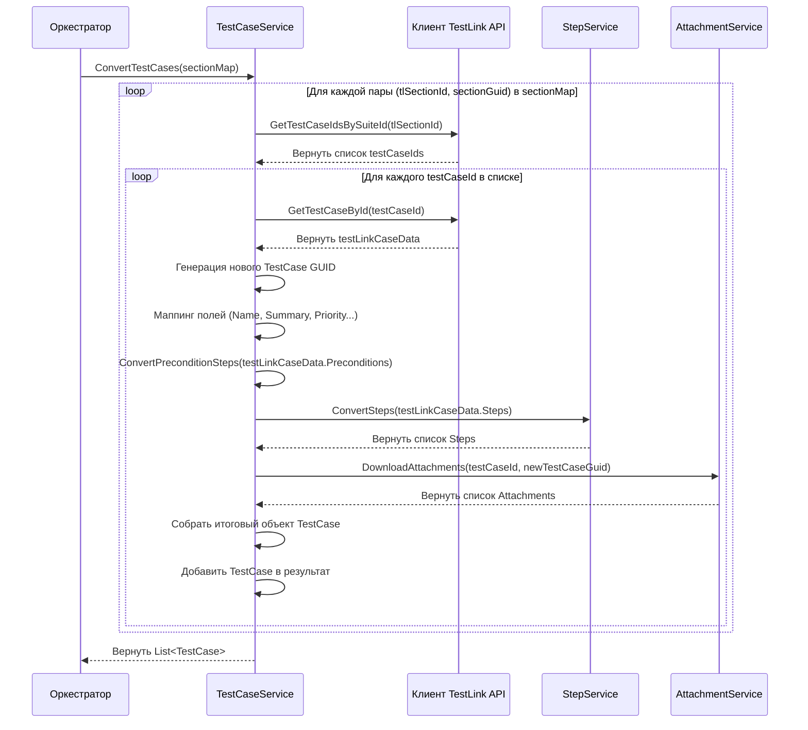

# Chapter 6: Преобразование Тест-кейсов


В [предыдущей главе](05_преобразование_секций__тест_сьютов__.md) мы научились наводить порядок в структуре нашего проекта, превращая папки (тест-сьюты) из TestLink в аккуратные секции с уникальными идентификаторами. Мы словно расставили папки по полкам в нашей новой библиотеке. Теперь пришло время заглянуть внутрь этих папок и разобраться с их содержимым — самими тест-кейсами.

Представьте, что у вас есть анкета (тест-кейс) из TestLink, написанная на одном "языке" и со своим набором полей (название, важность, шаги, предусловия). Ваша задача — взять эту анкету и заполнить на ее основе новую, совершенно другую анкету в формате, который понимает система, куда мы хотим импортировать данные. При этом нужно не просто скопировать значения, а "перевести" их: например, поле "Важность" из TestLink превратить в поле "Приоритет" в новой анкете, а также присвоить этой новой анкете уникальный номер, не связанный с TestLink.

Именно этим и занимается **Сервис Преобразования Тест-кейсов** (`TestCaseService`) в `TestLinkExporter`. Он берет данные конкретного тест-кейса из TestLink и превращает их в стандартизированную модель `TestCase`, понятную для нашей системы экспорта.

## Ключевые Задачи Преобразования Тест-кейсов

Преобразование одного тест-кейса — это не просто копирование. Оно включает несколько важных шагов:

1.  **Связь с Секцией:** В предыдущей главе мы создали карту `SectionMap`, которая связывает ID папки в TestLink с новым GUID нашей секции. Когда мы обрабатываем тест-кейс, мы используем эту карту, чтобы точно знать, в какую новую секцию (по GUID) его нужно поместить.
2.  **Генерация Уникального ID:** Как и секциям, каждому преобразованному тест-кейсу присваивается свой собственный, уникальный идентификатор **GUID**. Это гарантирует, что у нас не будет конфликтов, даже если ID тест-кейсов в TestLink повторяются в разных проектах.
3.  **Преобразование (Маппинг) Полей:** Данные из полей тест-кейса TestLink переносятся в соответствующие поля нашей модели `TestCase`. При этом некоторые значения могут "переводиться":
    *   `Summary` (Краткое описание) из TestLink -> `Description` (Описание) в `TestCase`.
    *   `Name` (Название) -> `Name`.
    *   `Importance` (Важность: 1, 2, 3) -> `Priority` (Приоритет: Low, Medium, High).
    *   `Preconditions` (Предусловия) -> `PreconditionSteps` (Шаги предусловий).
4.  **Делегирование Специалистам:** Преобразование тест-кейса — сложная задача. Поэтому `TestCaseService` не делает все сам. Он делегирует часть работы другим сервисам:
    *   Преобразование шагов тест-кейса поручается [Сервису Преобразования Шагов](07_преобразование_шагов_тест_кейса_.md).
    *   Скачивание и обработка вложений поручается [Сервису Обработки Вложений](08_обработка_вложений_.md).

## Как Используется `TestCaseService`?

Давайте вспомним нашего "режиссера" — [Оркестратор Экспорта](03_оркестратор_экспорта_.md). После того как он получил готовую структуру секций (`sectionData`, включающую `SectionMap`) от `SectionService`, он передает эту карту `SectionMap` в `TestCaseService`:

```csharp
// Фрагмент из Services/ExportService.cs (Оркестратор Экспорта)

// Шаг 3: Обработать тест-кейсы
// Вызываем сервис тест-кейсов, передавая ему информацию о секциях (карту)
var testCases = await _testCaseService.ConvertTestCases(sectionData.SectionMap); // <<-- Вот здесь!
_logger.LogInformation($"Конвертировано {testCases.Count} тест-кейсов.");
```

*Оркестратор вызывает метод `ConvertTestCases`, передавая ему карту `sectionMap`, чтобы сервис знал, как связать тест-кейсы с правильными секциями.*

`TestCaseService` берет эту карту и начинает свою работу: для каждой секции из карты он запрашивает у [Клиента TestLink API](04_клиент_testlink_api_.md) список тест-кейсов, а затем преобразует каждый из них.

## Внутреннее Устройство: `TestCaseService`

Компонент, отвечающий за преобразование, находится в файле `Services/TestCaseService.cs`. Как и другие сервисы, он получает необходимых "помощников" при создании:

```csharp
// Фрагмент из Services/TestCaseService.cs
public class TestCaseService : ITestCaseService
{
    private readonly ILogger<TestCaseService> _logger; // Для логов
    private readonly IClient _client; // Для получения данных из TestLink
    private readonly IStepService _stepService; // Для обработки шагов
    private readonly IAttachmentService _attachmentService; // Для обработки вложений
    // ... другие поля ...

    // Конструктор: получаем всех нужных помощников
    public TestCaseService(ILogger<TestCaseService> logger, IClient client, IStepService stepService,
        IAttachmentService attachmentService)
    {
        _logger = logger;
        _client = client; // Получаем Клиента API
        _stepService = stepService; // Получаем Сервис Шагов
        _attachmentService = attachmentService; // Получаем Сервис Вложений
    }
    // ... методы преобразования ...
}
```

*Конструктор показывает, что `TestCaseService` зависит от `IClient` (чтобы получать данные тест-кейсов из TestLink), `IStepService` (чтобы преобразовывать шаги) и `IAttachmentService` (чтобы обрабатывать прикрепленные файлы).*

## Пошаговый Процесс Преобразования

Давайте представим, что `TestCaseService` — это наш "переводчик анкет", `IClient` — его курьер в TestLink, а `IStepService` и `IAttachmentService` — узкие специалисты.

1.  **(Запрос от Оркестратора):** Оркестратор дает `TestCaseService` команду `ConvertTestCases`, передавая карту `sectionMap` (например, `{50: abc-123, 65: def-456}`).
2.  **(Цикл по Секциям):** `TestCaseService` смотрит на первую запись в карте: TestLink ID `50` соответствует нашему GUID `abc-123`.
3.  **(Запрос ID Тест-кейсов):** "Переводчик" просит курьера `IClient`: "Принеси мне список ID всех тест-кейсов из папки с ID `50` в TestLink". `IClient` возвращает список, например `[101, 102]`.
4.  **(Цикл по Тест-кейсам):** `TestCaseService` берет первый ID `101`.
5.  **(Запрос Деталей Тест-кейса):** "Переводчик" снова просит `IClient`: "Принеси мне полную информацию (анкету) для тест-кейса с ID `101`". `IClient` приносит данные `TestLinkTestCase` (название, важность, шаги и т.д.).
6.  **(Основное Преобразование):** "Переводчик" (`TestCaseService`) начинает заполнять новую анкету (`TestCase`):
    *   Генерирует **новый GUID** для `TestCase`, например `xyz-987`.
    *   Копирует `Name`.
    *   Смотрит на `Importance` (например, `3`) и переводит его в `Priority` (`High`) с помощью специальной функции.
    *   Копирует `Summary` в `Description`.
    *   Берет `Preconditions` (например, `<p>Пользователь авторизован</p>`) и преобразует их в простой список шагов (`PreconditionSteps`).
    *   **Делегирует Шаги:** Отдает список "сырых" шагов (`Steps` из `TestLinkTestCase`) специалисту `IStepService` и просит: "Преобразуй эти шаги". `IStepService` возвращает готовый список `Steps` для новой анкеты. ([Глава 7](07_преобразование_шагов_тест_кейса_.md))
    *   **Делегирует Вложения:** Отдает ID тест-кейса из TestLink (`101`) и новый GUID (`xyz-987`) специалисту `IAttachmentService` и просит: "Скачай вложения для этого кейса". `IAttachmentService` скачивает файлы и возвращает список имен файлов (`Attachments`). ([Глава 8](08_обработка_вложений_.md))
    *   Устанавливает `SectionId` равным `abc-123` (GUID секции, из которой мы взяли этот тест-кейс).
    *   Заполняет остальные поля `TestCase` стандартными значениями (State, Duration и т.д.).
7.  **(Добавление в Список):** Готовый `TestCase` (с GUID `xyz-987`) добавляется в общий список результатов.
8.  **(Повтор):** Шаги 4-7 повторяются для следующего ID тест-кейса (`102`).
9.  **(Повтор для Других Секций):** Шаги 2-8 повторяются для следующей записи в `sectionMap` (ID `65` -> GUID `def-456`).
10. **(Возврат Результата):** Когда все секции и все тест-кейсы в них обработаны, `TestCaseService` возвращает Оркестратору полный список созданных объектов `TestCase`.

Вот как это выглядит на схеме:



## Заглянем в Код `TestCaseService`

**1. Интерфейс `ITestCaseService`**

Как и у других сервисов, у `TestCaseService` есть свой "контракт" — интерфейс, описывающий, что он должен уметь делать.

```csharp
// Файл: Services/ITestCaseService.cs
using Models; // Подключаем пространство имен с нашими моделями

namespace TestLinkExporter.Services;

// Интерфейс описывает главную возможность сервиса
public interface ITestCaseService
{
    // Обещает принять карту секций и вернуть список преобразованных тест-кейсов
    // Task<> означает, что операция может быть асинхронной (например, из-за скачивания файлов)
    Task<List<TestCase>> ConvertTestCases(Dictionary<int, Guid> sectionMap);
}
```

*Этот интерфейс определяет один метод `ConvertTestCases`, который является точкой входа для [Оркестратора Экспорта](03_оркестратор_экспорта_.md).*

**2. Публичный Метод `ConvertTestCases`**

Это основной метод, который вызывается Оркестратором. Он организует циклы по секциям и тест-кейсам.

```csharp
// Фрагмент из Services/TestCaseService.cs
public async Task<List<TestCase>> ConvertTestCases(Dictionary<int, Guid> sectionMap)
{
    _logger.LogInformation("Начинаем конвертацию тест-кейсов");

    var testCases = new List<TestCase>(); // Список для готовых тест-кейсов

    // Проходим по каждой секции из карты, полученной от Оркестратора
    foreach (var section in sectionMap) // section.Key = ID из TestLink, section.Value = наш GUID
    {
        // 1. Получаем ID всех тест-кейсов в этой секции через Клиента
        var testCaseIds = _client.GetTestCaseIdsBySuiteId(section.Key);
        _logger.LogDebug($"Найдено {testCaseIds.Count} тест-кейсов в секции {section.Key}");

        // 2. Проходим по каждому ID тест-кейса
        foreach (var testCaseId in testCaseIds)
        {
            // Получаем полные данные тест-кейса из TestLink через Клиента
            var testLinkCase = _client.GetTestCaseById(testCaseId);
            // Вызываем приватный метод для преобразования конкретного тест-кейса
            var convertedCase = await ConvertTestCase(testLinkCase, section.Value);
            testCases.Add(convertedCase); // Добавляем результат в список
        }
    }

    _logger.LogInformation("Конвертация тест-кейсов завершена");
    return testCases; // Возвращаем список Оркестратору
}
```

*Этот метод перебирает секции из `sectionMap`, для каждой получает список ID тест-кейсов (`_client.GetTestCaseIdsBySuiteId`), а затем для каждого ID получает полные данные (`_client.GetTestCaseById`) и вызывает приватный метод `ConvertTestCase` для выполнения основного преобразования.* `await` используется, так как `ConvertTestCase` может выполнять асинхронные операции (скачивание вложений).

**3. Приватный Метод `ConvertTestCase` (преобразование одного кейса)**

Этот метод выполняет основную работу по маппингу полей и вызову других сервисов для одного тест-кейса.

```csharp
// Фрагмент из Services/TestCaseService.cs
// Приватный метод, отвечающий за преобразование ОДНОГО тест-кейса
private async Task<TestCase> ConvertTestCase(TestLinkTestCase testCase, Guid sectionId)
{
    var testCaseId = Guid.NewGuid(); // Генерируем НОВЫЙ уникальный ID для нашего TestCase

    return new TestCase // Создаем и заполняем объект TestCase
    {
        Id = testCaseId, // Используем новый GUID
        Description = testCase.Summary, // Копируем Summary в Description
        Name = testCase.Name, // Копируем Name
        SectionId = sectionId, // Устанавливаем GUID родительской секции
        State = StateType.NotReady, // Статус по умолчанию
        Priority = ConvertPriority(testCase.Importance), // Преобразуем важность в приоритет
        // Преобразуем предусловия (удаляя HTML теги)
        PreconditionSteps = ConvertPreconditionSteps(testCase.Preconditions),
        // Вызываем Сервис Шагов для преобразования основных шагов
        Steps = _stepService.ConvertSteps(testCase.Steps),
        PostconditionSteps = new List<Step>(), // Постусловия пока пустые
        Duration = _duration, // Устанавливаем длительность по умолчанию
        Attributes = new List<CaseAttribute>(), // Атрибуты пока пустые
        Tags = new List<string>(), // Теги пока пустые
        // Вызываем Сервис Вложений для скачивания файлов
        Attachments = await _attachmentService.DownloadAttachments(testCase.Id, testCaseId),
        Iterations = new List<Iteration>(), // Итерации пока пустые
        Links = new List<Link>(), // Линки пока пустые
    };
}
```

*Этот метод — сердце преобразования. Он создает новый объект `TestCase`, присваивает ему новый `Id` (GUID), копирует и преобразует поля из `TestLinkTestCase` (полученного от клиента), вызывает `ConvertPriority` и `ConvertPreconditionSteps`, а также делегирует работу `_stepService.ConvertSteps` и `_attachmentService.DownloadAttachments`. Наконец, он возвращает полностью сформированный объект `TestCase`.*

**4. Вспомогательные Методы: `ConvertPriority` и `ConvertPreconditionSteps`**

Эти небольшие методы выполняют специфичные задачи преобразования.

```csharp
// Фрагмент из Services/TestCaseService.cs

// Преобразует числовую важность TestLink в тип Priority
private static PriorityType ConvertPriority(int priority)
{
    // Используем конструкцию switch для сопоставления значений
    return priority switch
    {
        3 => PriorityType.High,   // Если важность 3 -> Приоритет Высокий
        2 => PriorityType.Medium, // Если важность 2 -> Приоритет Средний
        1 => PriorityType.Low,    // Если важность 1 -> Приоритет Низкий
        _ => PriorityType.Medium // Во всех остальных случаях -> Средний (по умолчанию)
    };
}

// Преобразует строку с предусловиями (может содержать HTML) в список шагов
private static List<Step> ConvertPreconditionSteps(string preconditions)
{
    // Создаем один шаг, помещая туда текст предусловий, очищенный от HTML тегов
    return new List<Step> {
        new Step
        {
            // Regex.Replace убирает все, что похоже на <тег>
            Action = Regex.Replace(preconditions, "<.*?>", String.Empty),
            Expected = string.Empty, // Остальные поля шага оставляем пустыми
            TestData = string.Empty,
            ActionAttachments = new List<string>(),
            ExpectedAttachments = new List<string>(),
            TestDataAttachments = new List<string>()
        }
    };
}
```

*`ConvertPriority` просто сопоставляет числа 1, 2, 3 значениям Low, Medium, High. `ConvertPreconditionSteps` берет строку предусловий из TestLink, удаляет из нее HTML-теги с помощью регулярного выражения (`Regex.Replace`) и создает один объект `Step`, помещая очищенный текст в поле `Action`.*

## Модели Данных

*   **Входные данные (от `IClient` для одного кейса):** `TestLinkTestCase` - содержит "сырые" данные из TestLink. (Структуру см. в Context).
*   **Выходные данные (результат работы `TestCaseService`):** `TestCase` - наша внутренняя, стандартизированная модель тест-кейса, готовая к записи в файл. (Структура этой модели будет видна в итоговых JSON файлах).

## Заключение

В этой главе мы погрузились в процесс преобразования отдельных тест-кейсов. Мы узнали, как `TestCaseService` использует `SectionMap` из предыдущей главы для связи кейсов с правильными секциями, как он получает детальную информацию о каждом тест-кейсе от [Клиента TestLink API](04_клиент_testlink_api_.md), и как он преобразует данные из формата TestLink в нашу внутреннюю модель `TestCase`.

Ключевые моменты этого процесса — это генерация уникальных GUID для каждого `TestCase`, маппинг полей (включая перевод значений, как Importance -> Priority), и делегирование специализированных задач, таких как обработка шагов и вложений, другим сервисам.

Мы разобрали основной код `TestCaseService`, включая его публичный метод для оркестрации и приватный метод для конвертации одного тест-кейса, а также вспомогательные функции.

Теперь, когда мы понимаем, как преобразуется "оболочка" тест-кейса, самое время детально рассмотреть, что происходит с его содержимым — шагами. В следующей главе, [Преобразование Шагов Тест-кейса](07_преобразование_шагов_тест_кейса_.md), мы узнаем, как `TestLinkExporter` обрабатывает шаги действий и ожидаемых результатов.

---

Generated by [AI Codebase Knowledge Builder](https://github.com/The-Pocket/Tutorial-Codebase-Knowledge)