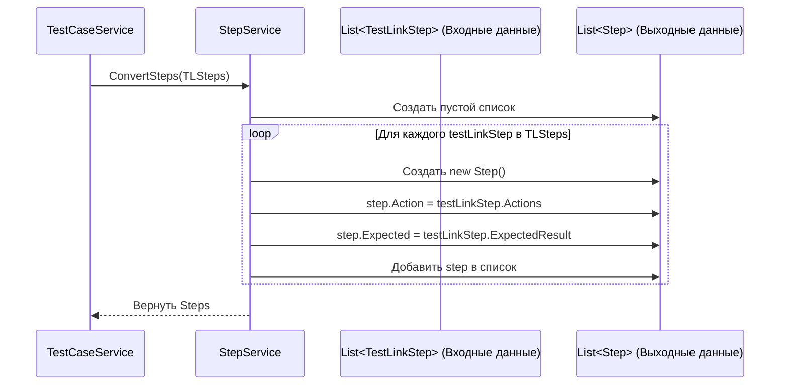

# Chapter 7: Преобразование Шагов Тест-кейса


В [предыдущей главе](06_преобразование_тест_кейсов_.md) мы научились преобразовывать общую информацию о тест-кейсе: его название, описание, приоритет и другие "верхнеуровневые" детали. Мы создали "оболочку" для нашего целевого тест-кейса. Теперь пришло время заглянуть внутрь этой оболочки и разобраться с самой сутью тест-кейса — его шагами.

Представьте, что вы получили черновик инструкции (шаги из TestLink). В этом черновике в одной строке может быть написано и что нужно сделать ("Нажать кнопку 'Войти'"), и что должно произойти ("Откроется главная страница"). Ваша задача на этом этапе — взять этот черновик и переформатировать его по стандарту: четко разделить "Действие" и "Ожидаемый результат" в отдельные колонки. При этом картинки или файлы, упомянутые в черновике, вы пока откладываете в сторону — ими займутся позже.

Именно этим и занимается **Сервис Преобразования Шагов** (`StepService`) в `TestLinkExporter`. Он берет список "сырых" шагов из тест-кейса TestLink и превращает их в структурированный список шагов нашего целевого формата (`Step`), где действие и ожидаемый результат — это отдельные поля.

## Основная Задача: Разделение Действия и Результата

В TestLink каждый шаг обычно содержит два основных текстовых поля:
*   `Actions`: Описание того, что нужно сделать.
*   `Expected Results`: Описание того, какой результат ожидается после выполнения действия.

Наша целевая модель `Step` также имеет поля для этого, но они называются немного иначе и являются четко разделенными:
*   `Action`: Сюда мы поместим текст из `Actions` TestLink.
*   `Expected`: Сюда мы поместим текст из `Expected Results` TestLink.

Задача `StepService` — выполнить это простое, но важное преобразование для каждого шага тест-кейса. Он **не** занимается поиском или обработкой вложений (файлов), упомянутых в тексте шагов — это задача [Сервиса Обработки Вложений](08_обработка_вложений_.md).

## Кто Отвечает за Шаги? `StepService`

Эту конкретную задачу выполняет компонент `StepService`, расположенный в файле `Services/StepService.cs`. Как мы видели в [Главе 6: Преобразование Тест-кейсов](06_преобразование_тест_кейсов_.md), сервис `TestCaseService` вызывает `StepService` в процессе преобразования информации о тест-кейсе:

```csharp
// Фрагмент из Services/TestCaseService.cs (метод ConvertTestCase)

// ... (маппинг других полей тест-кейса) ...

// Вызываем Сервис Шагов для преобразования основных шагов
Steps = _stepService.ConvertSteps(testCase.Steps), // <<-- Вот здесь!

// ... (обработка вложений и т.д.) ...
```
*Этот код показывает, как `TestCaseService` передает список "сырых" шагов (`testCase.Steps`), полученных от [Клиента TestLink API](04_клиент_testlink_api_.md), на обработку в `_stepService`.*

`StepService` получает этот список и возвращает новый список шагов в нужном нам формате.

## Как Происходит Преобразование? Очень Просто!

Процесс преобразования шагов довольно прямолинейный:

1.  **Получение Списка:** `StepService` получает на вход список объектов `TestLinkStep` из `TestCaseService`.
2.  **Создание Нового Списка:** Он создает пустой список, который будет содержать преобразованные шаги (`List<Step>`).
3.  **Цикл по Шагам:** Сервис проходит по каждому `TestLinkStep` из входного списка.
4.  **Создание Нового Шага:** Для каждого `TestLinkStep` он создает новый объект `Step` (нашей целевой модели).
5.  **Копирование Данных:**
    *   Значение из `testLinkStep.Actions` копируется в поле `Action` нового объекта `Step`.
    *   Значение из `testLinkStep.ExpectedResult` копируется в поле `Expected` нового объекта `Step`.
    *   Поля, связанные с вложениями или тестовыми данными (`ActionAttachments`, `ExpectedAttachments`, `TestDataAttachments`, `TestData`), пока остаются пустыми списками или строками. Их обработка происходит в других местах.
6.  **Добавление в Результат:** Новый, заполненный объект `Step` добавляется в список результатов.
7.  **Возврат Результата:** После обработки всех шагов из входного списка, `StepService` возвращает `TestCaseService` новый список с преобразованными объектами `Step`.

## Заглянем в Код `StepService`

**1. Модель Входных Данных: `TestLinkStep`**

Это простой класс, представляющий один шаг так, как он приходит из TestLink API (через нашего [Клиента TestLink API](04_клиент_testlink_api_.md)).

```csharp
// Файл: Models\TestLinkStep.cs
namespace TestLinkExporter.Models;

// Представляет один шаг из TestLink
public class TestLinkStep
{
    // Текст действия
    public string Actions { get; set; }
    // Текст ожидаемого результата
    public string ExpectedResult { get; set; }
    // Номер шага (в текущей реализации не используется при конвертации)
    public int StepNumber { get; set; }
}
```
*Этот класс содержит поля `Actions` и `ExpectedResult`, которые мы будем преобразовывать.*

**2. Интерфейс Сервиса: `IStepService`**

"Контракт", описывающий, что должен уметь наш сервис шагов.

```csharp
// Файл: Services\IStepService.cs
using Models; // Наша целевая модель шага Step
using TestLinkExporter.Models; // Модель шага из TestLink

namespace TestLinkExporter.Services;

// Интерфейс сервиса преобразования шагов
public interface IStepService
{
    // Обещает принять список шагов TestLink и вернуть список наших шагов Step
    List<Step> ConvertSteps(List<TestLinkStep> testLinkSteps);
}
```
*Интерфейс объявляет единственный метод `ConvertSteps`, который и выполняет всю работу.*

**3. Реализация Сервиса: `StepService`**

Сам код, выполняющий преобразование.

```csharp
// Файл: Services\StepService.cs
using TestLinkExporter.Models; // Модель TestLinkStep
using Microsoft.Extensions.Logging; // Для логирования
using Models; // Наша модель Step

namespace TestLinkExporter.Services;

public class StepService : IStepService
{
    private readonly ILogger<StepService> _logger; // Для записи логов

    // Конструктор: получает только логгер
    public StepService(ILogger<StepService> logger)
    {
        _logger = logger;
    }

    // Реализация метода преобразования шагов
    public List<Step> ConvertSteps(List<TestLinkStep> testLinkSteps)
    {
        _logger.LogDebug("Получены шаги для конвертации: {@Steps}", testLinkSteps);

        var steps = new List<Step>(); // Создаем пустой список для результата

        // Проходим по каждому шагу из TestLink
        foreach (var testLinkStep in testLinkSteps)
        {
            // Создаем и добавляем новый шаг в нашем формате
            steps.Add(
                new Step
                {
                    // Копируем действие
                    Action = testLinkStep.Actions,
                    // Копируем ожидаемый результат
                    Expected = testLinkStep.ExpectedResult,
                    // Поля для вложений пока оставляем пустыми
                    ActionAttachments = new List<string>(),
                    ExpectedAttachments = new List<string>(),
                    TestDataAttachments = new List<string>(),
                    // Поле для тестовых данных тоже пока пустое
                    TestData = string.Empty
                }
            );
        }
        _logger.LogDebug("Конвертированные шаги: {@Steps}", steps);

        return steps; // Возвращаем список преобразованных шагов
    }
}
```
*Этот код очень прост: он получает логгер в конструкторе. Метод `ConvertSteps` создает пустой список `steps`, затем в цикле `foreach` перебирает все `testLinkStep` из входного списка. Внутри цикла он создает новый объект `Step`, копирует поля `Actions` и `ExpectedResult` в `Action` и `Expected` соответственно, и добавляет этот новый `Step` в список `steps`. Наконец, он возвращает заполненный список `steps`.*

**4. Модель Выходных Данных: `Step`**

Это наша целевая модель шага (предполагается, что она определена где-то в папке `Models`). Она будет содержать разделенные поля `Action`, `Expected`, а также списки для вложений и тестовых данных.

```csharp
// Примерная структура нашей целевой модели Step (из Models)
public class Step
{
    public string Action { get; set; } // Действие
    public string Expected { get; set; } // Ожидаемый результат
    public string TestData { get; set; } // Тестовые данные (пока пустые)
    public List<string> ActionAttachments { get; set; } // Вложения к действию
    public List<string> ExpectedAttachments { get; set; } // Вложения к результату
    public List<string> TestDataAttachments { get; set; } // Вложения к тест. данным
}
```
*Эта модель представляет шаг в формате, готовом для экспорта, с отдельными полями для действия, результата и (пока пустых) списков вложений.*

## Схема Взаимодействия

Процесс вызова `StepService` очень прост:


*Диаграмма показывает, как `TestCaseService` вызывает `StepService`, передавая ему список шагов из TestLink (`TLSteps`). `StepService` обрабатывает этот список и возвращает новый список в целевом формате (`Steps`).*

## Заключение

Мы рассмотрели работу `StepService` — компонента, отвечающего за преобразование шагов тест-кейса. Мы увидели, что его главная и довольно простая задача — взять список шагов из TestLink, где действие и ожидаемый результат могут быть нечетко разделены, и преобразовать его в структурированный список `Step`, где `Action` и `Expected` являются отдельными полями. Этот сервис намеренно не занимается вложениями, оставляя эту работу для другого специализированного компонента.

Теперь, когда у нас есть преобразованная "оболочка" тест-кейса и его основные шаги, мы готовы разобраться с последней важной частью — файлами, которые могли быть прикреплены к этим шагам или самому тест-кейсу. В следующей главе, [Обработка Вложений](08_обработка_вложений_.md), мы узнаем, как `TestLinkExporter` находит, скачивает и связывает эти файлы с нашими экспортированными данными.

---

Generated by [AI Codebase Knowledge Builder](https://github.com/The-Pocket/Tutorial-Codebase-Knowledge)