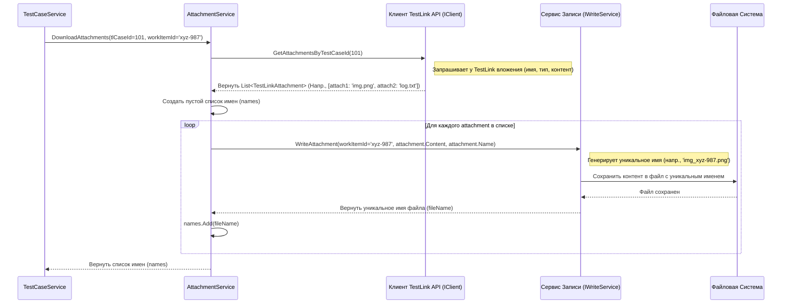

# Chapter 8: Обработка Вложений


В [предыдущей главе](07_преобразование_шагов_тест_кейса_.md) мы аккуратно разобрали и преобразовали шаги тест-кейсов, отделив действия от ожидаемых результатов. Теперь, когда сама структура тест-кейса и его шаги готовы, осталась последняя, но важная деталь: файлы, которые могли быть прикреплены к тест-кейсу в TestLink. Это могут быть скриншоты, лог-файлы, примеры данных или любые другие документы. Наша задача — не потерять их при экспорте.

Представьте себе почтовую службу, специализирующуюся на **посылках**. Эта служба (наш `AttachmentService`) получает запрос: "Для письма (тест-кейса) с таким-то номером (ID из TestLink) нужно забрать все прикрепленные к нему посылки (вложения)".
1.  Служба идет на "склад" (TestLink) и забирает эти посылки.
2.  Каждую посылку она упаковывает в новую коробку и присваивает ей уникальный "трек-номер" (имя файла), связанный с основным письмом (новый GUID нашего тест-кейса).
3.  Затем она передает отправителю (сервису [Преобразование Тест-кейсов](06_преобразование_тест_кейсов__.md)) список этих "трек-номеров", чтобы он знал, какие файлы теперь относятся к этому письму.

Без этой службы все прикрепленные файлы были бы просто потеряны при экспорте. **`AttachmentService`** гарантирует, что все вложения будут скачаны, сохранены и правильно связаны с соответствующим тест-кейсом.

## Кто и Как Использует Сервис Вложений?

Как мы видели в [Главе 6: Преобразование Тест-кейсов](06_преобразование_тест_кейсов__.md), главный сервис по обработке тест-кейсов (`TestCaseService`) делегирует задачу работы с вложениями нашему `AttachmentService`. Внутри метода, который преобразует один тест-кейс (`ConvertTestCase`), происходит следующий вызов:

```csharp
// Фрагмент из Services/TestCaseService.cs (метод ConvertTestCase)

    // ... создание объекта TestCase ...
    return new TestCase
    {
        // ... другие поля ...

        // Вызываем Сервис Вложений для скачивания файлов
        // Передаем ему ID из TestLink и наш НОВЫЙ Guid тест-кейса
        Attachments = await _attachmentService.DownloadAttachments(testCase.Id, testCaseId), // <<-- Вот здесь!

        // ... другие поля ...
    };
```
*Здесь `TestCaseService` говорит: "Эй, `AttachmentService`! Вот тебе ID тест-кейса из TestLink (`testCase.Id`) и вот уникальный GUID, который я только что присвоил нашему новому, преобразованному тест-кейсу (`testCaseId`). Пожалуйста, скачай все вложения для этого ID и сохрани их так, чтобы они были связаны с этим GUID."*

`_attachmentService.DownloadAttachments` выполняет всю работу и возвращает список имен файлов, которые были сохранены. Этот список имен затем записывается в поле `Attachments` нашего объекта `TestCase`.

## Шаг за Шагом: Как Работает Скачивание

Давайте проследим путь одного вложения от TestLink до вашего жесткого диска:

1.  **(Команда):** `TestCaseService` вызывает `DownloadAttachments`, передавая `testCase.Id` (например, 101) и `testCaseId` (новый GUID, например, `xyz-987`).
2.  **(Запрос Данных):** `AttachmentService` обращается к своему помощнику, [Клиенту TestLink API](04_клиент_testlink_api_.md) (`_client`), и просит: "Дай мне список всех вложений для тест-кейса с ID 101".
3.  **(Получение "Посылок"):** `_client` связывается с TestLink и получает список объектов `TestLinkAttachment`. Каждый такой объект содержит имя файла (например, `error_screenshot.png`), тип файла и, самое главное, его содержимое в виде массива байт (`byte[]`).
4.  **(Создание Списка для Результатов):** `AttachmentService` создает пустой список, куда он будет складывать имена сохраненных файлов.
5.  **(Цикл по Вложениям):** Сервис берет первое вложение из списка, полученного от `_client` (например, то самое `error_screenshot.png`).
6.  **(Сохранение Файла):** `AttachmentService` обращается к другому своему помощнику — сервису записи `IWriteService` (который отвечает за фактическую запись файлов на диск) — и говорит: "Сохрани вот это содержимое (`byte[]`) под оригинальным именем `error_screenshot.png`, но свяжи его с нашим тест-кейсом `xyz-987`".
7.  **(Уникальное Имя и Запись):** `IWriteService` берет содержимое, смотрит на GUID `xyz-987` и оригинальное имя `error_screenshot.png`. Он создает специальную папку для вложений (обычно `attachments/` внутри папки `resultPath`) и сохраняет файл с уникальным именем, чтобы избежать конфликтов (например, `error_screenshot_xyz-987.png` или что-то подобное, зависящее от реализации `IWriteService`). Он возвращает это *новое, уникальное имя файла* сервису `AttachmentService`.
8.  **(Добавление в Список):** `AttachmentService` добавляет полученное уникальное имя файла (например, `error_screenshot_xyz-987.png`) в свой список результатов.
9.  **(Повтор):** Шаги 5-8 повторяются для всех остальных вложений, полученных от `_client` для тест-кейса 101.
10. **(Возврат Списка Имен):** Когда все вложения обработаны, `AttachmentService` возвращает `TestCaseService` итоговый список уникальных имен сохраненных файлов (например, `["error_screenshot_xyz-987.png", "details_log_xyz-987.txt"]`).

## Схема Взаимодействия

Вот как выглядит этот процесс на диаграмме:



## Заглянем в Код `AttachmentService`

**1. Интерфейс `IAttachmentService`**

"Контракт", который описывает, что должен уметь сервис вложений.

```csharp
// Файл: Services\IAttachmentService.cs
using TestLinkExporter.Models; // Не используется напрямую здесь, но для контекста

namespace TestLinkExporter.Services;

// Интерфейс сервиса обработки вложений
public interface IAttachmentService
{
    // Обещает скачать вложения для тест-кейса с ID из TestLink (Id)
    // и связать их с нашим внутренним workItemId (GUID).
    // Возвращает список имен сохраненных файлов.
    // Task<> означает асинхронную операцию (запись файла может занять время).
    Task<List<string>> DownloadAttachments(int Id, Guid workItemId);
}

```
*Интерфейс определяет единственный асинхронный метод `DownloadAttachments`.*

**2. Реализация `AttachmentService.cs`**

Сам код сервиса.

*   **Конструктор:**

    ```csharp
    // Фрагмент из Services/AttachmentService.cs
    using JsonWriter; // Для IWriteService (предполагается, что он из этой библиотеки/пространства имен)
    using Microsoft.Extensions.Logging;
    using TestLinkExporter.Client; // Для IClient

    namespace TestLinkExporter.Services;

    public class AttachmentService : IAttachmentService
    {
        private readonly ILogger<AttachmentService> _logger; // Логгер
        private readonly IClient _client; // Клиент для связи с TestLink
        private readonly IWriteService _writeService; // Сервис для записи файлов

        // Конструктор получает всех необходимых помощников
        public AttachmentService(ILogger<AttachmentService> logger, IClient client, IWriteService writeService)
        {
            _logger = logger;
            _client = client; // Сохраняем ссылку на Клиента API
            _writeService = writeService; // Сохраняем ссылку на Сервис Записи
        }
        // ... метод DownloadAttachments ...
    }
    ```
    *Конструктор просто сохраняет ссылки на логгер, [Клиент TestLink API](04_клиент_testlink_api_.md) и сервис записи файлов (`IWriteService`), которые предоставляются ему при запуске приложения.*

*   **Метод `DownloadAttachments`:**

    ```csharp
    // Фрагмент из Services/AttachmentService.cs
    public async Task<List<string>> DownloadAttachments(int id, Guid workItemId)
    {
        _logger.LogInformation("Получаем вложения для тест-кейса с ID: {Id}", id);

        // 1. Запрашиваем информацию о вложениях у Клиента API
        var attachments = _client.GetAttachmentsByTestCaseId(id);

        // 2. Создаем список для хранения имен сохраненных файлов
        var names = new List<string>();

        // 3. Проходим по каждому полученному вложению
        foreach (var attachment in attachments)
        {
            _logger.LogDebug("Скачиваем вложение: {Name}", attachment.Name);

            // 4. Вызываем сервис записи для сохранения файла на диск
            //    Передаем GUID нашего тест-кейса, содержимое файла и его оригинальное имя
            //    await нужен, т.к. запись файла может быть асинхронной
            var name = await _writeService.WriteAttachment(workItemId, attachment.Content, attachment.Name);

            // 5. Добавляем УНИКАЛЬНОЕ имя сохраненного файла в наш список
            names.Add(name);
        }

        _logger.LogDebug("Завершено скачивание вложений: {@Names}", names);

        // 6. Возвращаем список имен сохраненных файлов
        return names;
    }
    ```
    *Этот метод точно следует шагам, которые мы описали ранее: получает данные от `_client`, итерирует по ним, вызывает `_writeService.WriteAttachment` для каждого, собирает возвращенные уникальные имена файлов и возвращает итоговый список.*

**3. Модель `TestLinkAttachment`**

Модель данных, которую `IClient` возвращает для каждого вложения.

```csharp
// Файл: Models\TestLinkAttachment.cs
namespace TestLinkExporter.Models;

// Представляет вложение, полученное от TestLink API
public class TestLinkAttachment
{
    // Содержимое файла в виде массива байт
    public byte[] Content { get; set; }
    // Тип файла (например, "image/png")
    public string FileType { get; set; }
    // Оригинальное имя файла
    public string Name { get; set; }
}
```
*Эта структура содержит все необходимое: имя файла, его тип и само содержимое (`Content`), которое `AttachmentService` передает в `IWriteService` для сохранения.*

## Заключение

В этой главе мы разобрались с последним элементом данных, которые нужно извлечь из TestLink, — вложениями. Мы узнали, как `AttachmentService` работает в связке с [Клиентом TestLink API](04_клиент_testlink_api_.md) (для получения данных) и `IWriteService` (для сохранения файлов на диск). Klючевая роль `AttachmentService` — оркестрировать процесс скачивания файлов и возвращать список их уникальных сохраненных имен, чтобы их можно было связать с соответствующим тест-кейсом в итоговом экспорте.

Теперь, когда мы рассмотрели основные этапы преобразования для каждого типа данных (секции, тест-кейсы, шаги, вложения), мы имеем полное представление о том, как `TestLinkExporter` обрабатывает информацию, полученную из TestLink, и готовит ее к записи в файлы. Это завершает наш обзор основных компонентов, участвующих в процессе преобразования данных.

---

Generated by [AI Codebase Knowledge Builder](https://github.com/The-Pocket/Tutorial-Codebase-Knowledge)