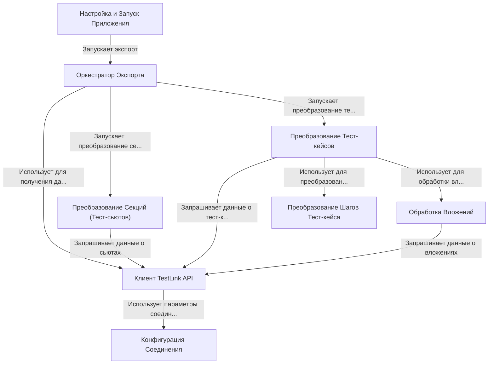

# Tutorial: TestLinkExporter

Этот проект работает как **экспортер** данных из системы управления тестированием *TestLink*.
Он подключается к вашему TestLink, используя указанный адрес и токен, находит нужный проект, а затем
выгружает структуру тестов: **тест-сьюты** (папки) и **тест-кейсы**, включая их *шаги*, *предусловия* и *вложения*.
Вся информация преобразуется и сохраняется в виде файлов (*.json* и вложения) в указанную папку,
готовых для дальнейшего использования, например, для импорта в другую систему.

**Source Repository:** [None](None)

## Chapters

1. [Конфигурация Соединения
](01_конфигурация_соединения_.md)
2. [Настройка и Запуск Приложения
](02_настройка_и_запуск_приложения_.md)
3. [Оркестратор Экспорта
](03_оркестратор_экспорта_.md)
4. [Клиент TestLink API
](04_клиент_testlink_api_.md)
5. [Преобразование Секций (Тест-сьютов)
](05_преобразование_секций__тест_сьютов__.md)
6. [Преобразование Тест-кейсов
](06_преобразование_тест_кейсов_.md)
7. [Преобразование Шагов Тест-кейса
](07_преобразование_шагов_тест_кейса_.md)
8. [Обработка Вложений
](08_обработка_вложений_.md)

---

Generated by [AI Codebase Knowledge Builder](https://github.com/The-Pocket/Tutorial-Codebase-Knowledge)