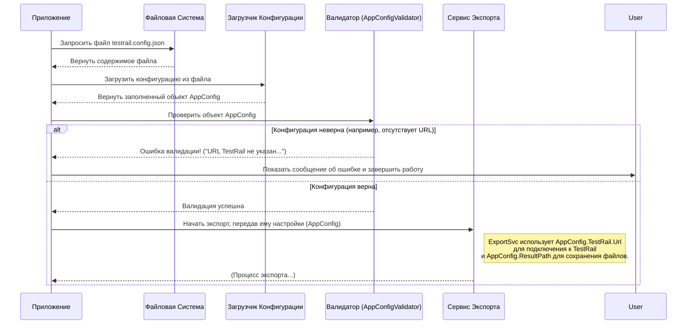

# Chapter 1: Конфигурация Приложения

Добро пожаловать в руководство по `TestRailExporter`! В этой первой главе мы познакомимся с самым первым шагом, необходимым для работы нашего инструмента — **Конфигурацией Приложения**.

Представьте, что вы купили новое сложное устройство, например, 3D-принтер. Прежде чем начать печатать, вам нужно его настроить: указать тип пластика, температуру, скорость печати и так далее. Без этих настроек принтер просто не будет знать, что делать.

Конфигурация `TestRailExporter` — это как раз такой набор настроек, или "технический паспорт" нашего экспортера. Она сообщает приложению всю необходимую информацию:
*   Где находится ваш TestRail (его веб-адрес)?
*   Как в него войти (логин и пароль)?
*   Из какого проекта нужно экспортировать данные?
*   Куда сохранить результат экспорта?

Без этой информации экспортер будет как потерявшийся путник — не зная, откуда идти и куда прийти.

## Зачем нужна конфигурация?

Основная задача конфигурации — отделить изменяемые параметры (адреса, пароли, пути) от самого кода приложения. Это позволяет:

1.  **Гибкость:** Легко адаптировать экспортер для разных серверов TestRail и проектов, не переписывая код.
2.  **Безопасность:** Хранить учетные данные вне кода, что более безопасно.
3.  **Удобство:** Менять настройки в простом текстовом файле, не требуя специальных знаний в программировании.

## Файл конфигурации: `testrail.config.json`

Все настройки `TestRailExporter` хранятся в одном файле с именем `testrail.config.json`. Этот файл должен находиться в той же папке, где лежит сам исполняемый файл экспортера.

Вот как выглядит типичный файл `testrail.config.json`:

```json
{
  "resultPath": "/Users/user01/Documents/importer",
  "testrail": {
    "url": "https://instance.testrail.io/",
    "login": "User",
    "password": "pass",
    "projectName": "ProjectName"
  }
}
```

Давайте разберем его по частям:

*   `resultPath`: Это **путь к папке** на вашем компьютере, куда экспортер сохранит все файлы с данными из TestRail. Убедитесь, что указанный путь существует и у приложения есть права на запись в эту папку.
*   `testrail`: Этот раздел содержит все настройки, связанные непосредственно с подключением к TestRail.
    *   `url`: Полный **веб-адрес** вашего сервера TestRail. Обычно он заканчивается на `/`.
    *   `login`: Ваш **логин** (имя пользователя) для входа в TestRail.
    *   `password`: Ваш **пароль** для входа в TestRail.
    *   `projectName`: **Имя** вашего проекта в TestRail, из которого вы хотите выгрузить данные. Важно указать точное имя проекта, как оно отображается в TestRail.

**Важно:** Вам нужно создать этот файл (`testrail.config.json`) вручную и заполнить его *вашими* реальными данными перед запуском экспортера.

## Как приложение читает конфигурацию?

Когда вы запускаете `TestRailExporter`, одним из первых шагов является чтение этого файла `testrail.config.json`. Давайте заглянем "под капот" и посмотрим, как это происходит (очень упрощенно).

1.  **Поиск и чтение файла:** Приложение ищет файл `testrail.config.json` в своей папке. Код, отвечающий за это, находится в файле `Program.cs`.

    ```csharp
    // Фрагмент из Program.cs
    private static IConfiguration SetupConfiguration()
    {
        return new ConfigurationBuilder()
            // Указываем, где искать файлы конфигурации (текущая папка)
            .SetBasePath(Directory.GetCurrentDirectory())
            // Добавляем наш JSON файл как источник настроек
            .AddJsonFile("testrail.config.json")
            // Можно добавлять и другие источники (переменные среды и т.д.)
            .AddEnvironmentVariables()
            .Build(); // Собираем конфигурацию
    }
    ```
    Этот код создает объект конфигурации, который "умеет" читать данные из указанного JSON-файла.

2.  **Преобразование в объекты:** Просто прочитать файл недостаточно. Чтобы с настройками было удобно работать в коде, они преобразуются в специальные C# объекты. Для этого у нас есть классы `AppConfig` и `TestRailConfig` в файле `Models/Client/AppConfig.cs`.

    ```csharp
    // Файл: Models/Client/AppConfig.cs

    // Класс для хранения настроек подключения к TestRail
    public class TestRailConfig
    {
        [Required] // Атрибут [Required] означает, что это поле обязательно
        public string Url { get; set; } = string.Empty; // Адрес TestRail
        [Required]
        public string ProjectName { get; set; } = string.Empty; // Имя проекта
        [Required]
        public string Login { get; set; } = string.Empty; // Логин пользователя
        [Required]
        public string Password { get; set; } = string.Empty; // Пароль пользователя
    }

    // Основной класс конфигурации всего приложения
    public class AppConfig
    {
        [Required]
        public string ResultPath { get; set; } = string.Empty; // Путь для сохранения результатов
        [Required]
        public TestRailConfig TestRail { get; set; } = new(); // Вложенный объект с настройками TestRail
    }
    ```
    Эти классы точно повторяют структуру нашего JSON-файла. Атрибут `[Required]` помогает указать, какие поля являются обязательными.

3.  **Регистрация и Доступность:** Чтобы другие части приложения, например, [Сервис Экспорта](02_сервис_экспорта.md), могли легко получить доступ к этим настройкам, конфигурация "регистрируется" в системе управления зависимостями. Это делается в файле `Extensions/ServiceCollectionExtensions.cs`.

    ```csharp
    // Фрагмент из Extensions/ServiceCollectionExtensions.cs
    public static void RegisterAppConfig(this IServiceCollection services)
    {
        services
            // Настраиваем чтение AppConfig из источников конфигурации
            .AddOptions<AppConfig>()
            // Привязываем конфигурацию к классу AppConfig
            .BindConfiguration("") // "" означает чтение с корня файла
            // Включаем проверку атрибутов [Required]
            .ValidateDataAnnotations()
            // Валидировать конфигурацию при старте приложения
            .ValidateOnStart();

        // Регистрируем наш специальный валидатор (о нем ниже)
        services.AddSingleton<IValidateOptions<AppConfig>, AppConfigValidator>();
    }
    ```
    Этот код связывает прочитанные настройки с объектом `AppConfig` и делает его доступным для всего приложения.

## Проверка Конфигурации: Валидация

Что произойдет, если вы забудете указать URL вашего TestRail или путь для сохранения результатов в файле `testrail.config.json`? Приложение может столкнуться с ошибкой в самый неожиданный момент. Чтобы предотвратить это, существует механизм **валидации** конфигурации.

Сразу после чтения настроек, но *перед* началом основной работы, специальный компонент — `AppConfigValidator` — проверяет, все ли важные параметры на месте.

Вот как выглядит сам валидатор (`Validators/AppConfigValidator.cs`):

```csharp
// Файл: Validators/AppConfigValidator.cs
using Microsoft.Extensions.Options;
using TestRailExporter.Models.Client; // Используем наши классы AppConfig

namespace ZephyrScaleServerExporter.Validators;

// Класс для проверки корректности настроек AppConfig
public class AppConfigValidator : IValidateOptions<AppConfig>
{
    // Метод Validate вызывается автоматически при старте
    public ValidateOptionsResult Validate(string? name, AppConfig options)
    {
        // Проверяем, указан ли путь для сохранения результатов
        if (string.IsNullOrEmpty(options.ResultPath))
            // Если нет - выбрасываем исключение с понятным сообщением
            throw new ArgumentException("Не указан путь для сохранения результатов (ResultPath) в файле testrail.config.json");

        // Проверяем настройки TestRail
        if (string.IsNullOrEmpty(options.TestRail.Url))
            throw new ArgumentException("Не указан URL TestRail (testrail.url) в файле testrail.config.json");
        if (string.IsNullOrEmpty(options.TestRail.ProjectName))
           throw new ArgumentException("Не указано имя проекта (testrail.projectName) в файле testrail.config.json");
        // Здесь можно добавить проверки для Login и Password, если нужно

        // Если все обязательные поля заполнены, валидация считается успешной
        return ValidateOptionsResult.Success;
    }
}
```

Этот валидатор просто проверяет, что строки `ResultPath`, `Url` и `ProjectName` не пустые. Если какое-то из обязательных полей отсутствует, приложение немедленно остановится и выведет сообщение об ошибке, указывающее, какой именно параметр нужно исправить в `testrail.config.json`. Это помогает быстро найти и исправить проблему до начала долгого процесса экспорта.

### Как всё происходит вместе (упрощенная схема)

Давайте представим последовательность действий при запуске приложения:



Эта схема показывает, как приложение сначала читает файл, преобразует его в объект, проверяет этот объект с помощью валидатора и только потом, если все в порядке, передает настройки основному сервису для выполнения экспорта.

## Заключение

В этой главе мы узнали, что такое **Конфигурация Приложения** в `TestRailExporter` и почему она так важна. Мы разобрали структуру основного конфигурационного файла `testrail.config.json` и его ключевые параметры: `resultPath`, `url`, `login`, `password` и `projectName`. Мы также заглянули "под капот" и увидели, как приложение читает, обрабатывает и проверяет (валидирует) эти настройки перед началом работы.

Правильная настройка файла `testrail.config.json` — это фундамент для успешного экспорта данных из TestRail.

Теперь, когда наше приложение знает, *где* находится TestRail, *как* к нему подключиться и *куда* сохранять результаты, мы можем перейти к следующему шагу — рассмотрению основного механизма, который будет выполнять всю работу по экспорту.

**В следующей главе:** Мы подробно изучим [Сервис Экспорта](02_сервис_экспорта.md), который оркестрирует весь процесс получения данных из TestRail и их сохранения.

---

Generated by [AI Codebase Knowledge Builder](https://github.com/The-Pocket/Tutorial-Codebase-Knowledge)