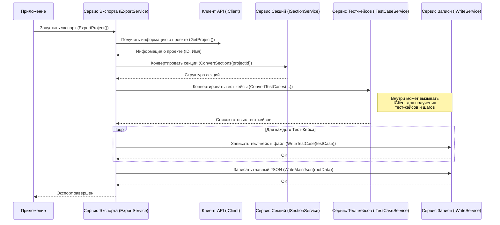

# Chapter 2: Сервис Экспорта

В предыдущей главе, [Конфигурация Приложения](01_конфигурация_приложения.md), мы подготовили наш `TestRailExporter`, создав для него "паспорт" — файл `testrail.config.json`. Теперь приложение знает, куда подключаться и куда сохранять результаты. Но кто же будет выполнять саму работу по экспорту?

Встречайте главного героя этой главы — **Сервис Экспорта** (`ExportService`).

## Зачем нужен "дирижер"?

Представьте себе оркестр. Множество музыкантов с разными инструментами: скрипки, трубы, барабаны... Если каждый будет играть сам по себе, получится хаос. Нужен дирижер, который будет руководить процессом, указывать, кому и когда вступать, чтобы получилась гармоничная мелодия.

В `TestRailExporter` много компонентов, выполняющих конкретные задачи:
*   Один "умеет" общаться с TestRail и забирать оттуда данные.
*   Другой преобразует структуру папок (секций).
*   Третий занимается тест-кейсами.
*   Четвертый отвечает за сохранение файлов.

**Сервис Экспорта (`ExportService`)** — это и есть наш дирижер. Его основная задача — **координировать** работу всех этих компонентов в правильной последовательности, чтобы в итоге мы получили аккуратно экспортированные данные из TestRail в нужном нам формате. Он сам не скачивает данные и не конвертирует их, но он точно знает, кого и когда попросить это сделать.

## Как работает Сервис Экспорта?

Сервис Экспорта действует по четко заданному сценарию:

1.  **Получить информацию о проекте:** Сначала он обращается к [Клиенту TestRail API](03_клиент_testrail_api.md) (`IClient`), чтобы узнать основную информацию о проекте, который мы указали в конфигурации (например, его ID и имя).
2.  **Конвертировать секции:** Затем он просит Сервис Конвертации Секций (`ISectionService`) получить структуру папок (секций) из TestRail и преобразовать ее в наш внутренний формат. Подробнее об этом в главе [Конвертация Секций](04_конвертация_секций.md).
3.  **(Опционально) Конвертировать общие шаги:** Если в проекте используются общие шаги (reusable steps), Сервис Экспорта запросит их конвертацию у соответствующего сервиса (`ISharedStepService`).
4.  **Конвертировать тест-кейсы:** Получив структуру секций и информацию об общих шагах, он передает эту информацию Сервису Конвертации Тест-кейсов (`ITestCaseService`), который запрашивает все тест-кейсы из TestRail и преобразует их, включая их шаги. Об этом подробно в главах [Конвертация Тест-кейсов](05_конвертация_тест_кейсов.md) и [Конвертация Шагов](06_конвертация_шагов.md).
5.  **Сохранить результаты:** Наконец, когда все данные получены и преобразованы, Сервис Экспорта передает их Сервису Записи (`IWriteService`), который аккуратно сохраняет всю информацию в файлы в папке, указанной нами в `resultPath` в конфигурации.

Весь этот процесс запускается одним вызовом метода `ExportProject()` у Сервиса Экспорта.

## Как запускается экспорт?

Вам, как пользователю, не нужно напрямую вызывать Сервис Экспорта. Когда вы запускаете приложение `TestRailExporter`, самая главная часть программы (`App.cs`) сама находит этот сервис и просит его начать работу.

```csharp
// Фрагмент из файла App.cs
// ... другие строки кода ...

public class App(ILogger<App> logger, IExportService exportService) // App получает сервис экспорта
{
    public void Run(string[] args)
    {
        logger.LogInformation("Starting application"); // Запись в лог о начале работы

        try
        {
            // Вот здесь и происходит запуск всего процесса!
            exportService.ExportProject().Wait();
        }
        catch (Exception e)
        {
            // Если что-то пошло не так, записать ошибку в лог
            logger.LogError(e, "Error occurred during export");
            throw; // и остановить приложение
        }

        logger.LogInformation("Ending application"); // Запись в лог об окончании работы
    }
}
```

Этот код показывает, что класс `App` при запуске (`Run`) просто вызывает метод `ExportProject()` у нашего `exportService`. Вся магия оркестровки скрыта внутри этого метода.

## Заглянем "под капот": Внутреннее устройство

Давайте немного подробнее разберемся, как Сервис Экспорта выполняет свою работу.

**1. Получение "инструментов" (Зависимостей):**

Прежде чем дирижер сможет управлять оркестром, ему нужны музыканты. Точно так же `ExportService` нуждается в других сервисах (`IClient`, `ISectionService` и т.д.). Он не создает их сам, а получает готовыми при своем создании. Этот механизм называется "Внедрение зависимостей" (Dependency Injection) и настраивается в файле `Extensions/ServiceCollectionExtensions.cs`.

```csharp
// Фрагмент из файла Services/Implementations/ExportService.cs

// Объявление класса ExportService, который реализует интерфейс IExportService
public class ExportService : IExportService
{
    // Поля для хранения ссылок на другие сервисы ("музыканты")
    private readonly ILogger<ExportService> _logger;
    private readonly IClient _client;
    private readonly IWriteService _writeService;
    private readonly ISectionService _sectionService;
    private readonly ISharedStepService _sharedStepService;
    private readonly ITestCaseService _testCaseService;

    // Конструктор: сюда система автоматически передает нужные сервисы
    public ExportService(
        ILogger<ExportService> logger,
        IClient client,
        IWriteService writeService,
        ISectionService sectionService,
        ISharedStepService sharedStepService,
        ITestCaseService testCaseService)
    {
        // Сохраняем полученные сервисы в поля класса для дальнейшего использования
        _logger = logger;
        _client = client;
        _writeService = writeService;
        _sectionService = sectionService;
        _sharedStepService = sharedStepService;
        _testCaseService = testCaseService;
    }

    // Основной метод, который выполняет экспорт (рассмотрим его ниже)
    public virtual async Task ExportProject()
    {
        // ... (логика вызова других сервисов) ...
    }
}
```

При запуске приложения специальный механизм (контейнер зависимостей) "видит", что `ExportService` нужны `IClient`, `IWriteService` и другие. Он находит соответствующие реализации этих сервисов (например, `Client.Client` для `IClient`) и передает их в конструктор `ExportService`.

**2. Сценарий экспорта (Метод `ExportProject`):**

Теперь посмотрим на сам "сценарий", по которому работает наш "дирижер" — метод `ExportProject`.

```csharp
// Фрагмент из файла Services/Implementations/ExportService.cs

public virtual async Task ExportProject() // async Task означает, что метод асинхронный
{
    _logger.LogInformation("Starting export"); // Сообщаем о начале

    // Шаг 1: Получаем основную информацию о проекте от Клиента API
    var project = await _client.GetProject();
    _logger.LogInformation($"Found project '{project.Name}' (ID: {project.Id})");

    // Шаг 2: Обрабатываем секции (папки)
    var sectionsInfo = await _sectionService.ConvertSections(project.Id);
    _logger.LogInformation("Sections converted");

    // Шаг 3: Обрабатываем общие шаги (если есть)
    var sharedStepsInfo = await _sharedStepService.ConvertSharedSteps(project.Id, sectionsInfo.MainSection.Id);
    _logger.LogInformation($"{sharedStepsInfo.SharedSteps.Count} shared steps converted");

    // Шаг 4: Обрабатываем тест-кейсы, передавая им информацию о секциях и общих шагах
    var testCases = await _testCaseService.ConvertTestCases(project.Id, sharedStepsInfo.SharedStepsMap, sectionsInfo);
    _logger.LogInformation($"{testCases.Count} test cases converted");

    // Шаг 5.1: Сохраняем общие шаги в отдельные файлы
    foreach (var sharedStep in sharedStepsInfo.SharedSteps)
    {
        await _writeService.WriteSharedStep(sharedStep);
    }
    _logger.LogInformation("Shared steps written to files");

    // Шаг 5.2: Сохраняем тест-кейсы в отдельные файлы
    foreach (var testCase in testCases)
    {
        await _writeService.WriteTestCase(testCase);
    }
    _logger.LogInformation("Test cases written to files");

    // Шаг 5.3: Создаем и сохраняем главный JSON-файл со ссылками на все остальное
    var mainJson = new Root
    {
        ProjectName = project.Name,
        Sections = new List<Section> { sectionsInfo.MainSection }, // Корневая секция со всей иерархией
        TestCases = testCases.Select(t => t.Id).ToList(), // Список ID всех тест-кейсов
        SharedSteps = sharedStepsInfo.SharedSteps.Select(s => s.Id).ToList(), // Список ID общих шагов
    };
    await _writeService.WriteMainJson(mainJson);
    _logger.LogInformation("Main JSON file 'index.json' written");

    _logger.LogInformation("Ending export"); // Сообщаем о завершении
}

```

Как видите, этот метод похож на рецепт: шаг за шагом он вызывает нужные сервисы в правильном порядке. `await` перед вызовами означает, что `ExportService` будет терпеливо ждать, пока каждый подчиненный сервис завершит свою (потенциально долгую) задачу, прежде чем приступить к следующему шагу. Например, он не начнет конвертировать тест-кейсы (`_testCaseService.ConvertTestCases`), пока не получит результат конвертации секций (`_sectionService.ConvertSections`).

**3. Визуализация процесса:**

Давайте представим этот поток работы в виде диаграммы:



Эта диаграмма наглядно показывает, как `ExportService` действует как центральный координатор, общаясь с другими сервисами для выполнения общей задачи экспорта.

## Заключение

В этой главе мы познакомились с **Сервисом Экспорта (`ExportService`)** — сердцем нашего `TestRailExporter`. Мы узнали, что он не выполняет работу сам, а выступает в роли "дирижера" или "режиссера", который координирует вызовы других специализированных сервисов:
*   `IClient` для получения данных из TestRail.
*   `ISectionService`, `ITestCaseService`, `ISharedStepService` для преобразования этих данных.
*   `IWriteService` для сохранения результатов на диск.

Мы увидели, как он последовательно выполняет шаги экспорта внутри метода `ExportProject` и как он получает необходимые ему "инструменты" (другие сервисы) с помощью механизма внедрения зависимостей.

Теперь, когда мы понимаем, кто управляет всем процессом, самое время разобраться, как наш экспортер получает исходные данные.

**В следующей главе:** Мы подробно рассмотрим [Клиент TestRail API](03_клиент_testrail_api.md), который отвечает за всё взаимодействие с сервером TestRail.

---

Generated by [AI Codebase Knowledge Builder](https://github.com/The-Pocket/Tutorial-Codebase-Knowledge)