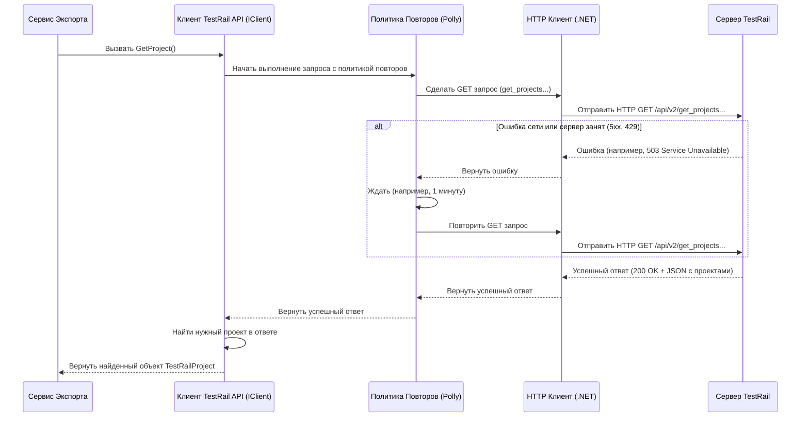

# Chapter 3: Клиент TestRail API

В предыдущей главе, [Сервис Экспорта](02_сервис_экспорта.md), мы узнали о "дирижере" нашего приложения, который управляет всем процессом экспорта. Но откуда этот дирижер берет "ноты" — то есть, сами данные, которые нужно экспортировать? Ответ прост: он просит их у **Клиента TestRail API**.

Представьте, что TestRail — это большая и важная библиотека за границей, которая хранит все наши тест-кейсы. Мы не можем просто зайти туда и взять что нужно. Нам нужен специальный помощник:
*   Он говорит на языке библиотеки (понимает её API).
*   У него есть пропуск (данные для входа — логин и пароль).
*   Он знает, как правильно запросить нужные книги и документы (тест-кейсы, секции, шаги).
*   Он умеет забирать информацию не всю сразу, а по частям, если ее много (пагинация).
*   И даже если его отправили не туда или дверь оказалась временно заперта (сетевая ошибка), он попробует еще раз (политики повторных запросов).

В нашем `TestRailExporter` роль такого помощника выполняет **Клиент TestRail API** (`Client`). Это компонент, отвечающий за *все* общение с вашим сервером TestRail.

## Зачем нужен Клиент API?

TestRail предоставляет специальный интерфейс для программ — **API** (Application Programming Interface). Это набор правил и команд, с помощью которых другие приложения могут запрашивать у TestRail данные или отправлять ему команды.

Общение через API — это как разговор на особом техническом языке. Клиент TestRail API берет на себя всю эту сложную работу:

1.  **Формирует запросы:** Он знает, по какому адресу (URL) нужно обратиться к TestRail и какие параметры добавить, чтобы получить, например, список всех секций конкретного проекта.
2.  **Проходит аутентификацию:** Он использует логин и пароль из вашей [Конфигурации Приложения](01_конфигурация_приложения.md), чтобы доказать TestRail, что у него есть право на доступ к данным.
3.  **Обрабатывает ответы:** Он получает ответ от TestRail (обычно в формате JSON), разбирает его и передает запрошенные данные другим частям приложения в удобном виде.
4.  **Справляется с большим объемом данных (Пагинация):** Если данных очень много (например, тысячи тест-кейсов), TestRail API часто отдает их не все сразу, а "страницами" (например, по 100 штук). Клиент автоматически запрашивает страницу за страницей, пока не соберет все данные.
5.  **Обеспечивает надежность (Политики повторов):** Если при обращении к TestRail произошла временная сетевая ошибка, Клиент не сдается сразу, а пытается повторить запрос несколько раз через некоторое время. Для этого используется специальная библиотека `Polly`.

Без Клиента API каждому компоненту пришлось бы самому разбираться во всех тонкостях общения с TestRail, что сделало бы код намного сложнее и менее надежным. Клиент скрывает всю эту сложность за простым интерфейсом.

## Как Клиент API общается с TestRail?

Давайте рассмотрим несколько ключевых моментов его работы.

### 1. Аутентификация: "Предъявите ваш пропуск!"

Чтобы получить доступ к данным, Клиент должен представиться серверу TestRail. Он использует метод "Basic Authentication", который просто объединяет ваш логин и пароль (из файла `testrail.config.json`) и отправляет их в специальном заголовке каждого запроса.

```csharp
// Фрагмент из Client/Client.cs

// Этот метод создает нужный заголовок для аутентификации
private static string? GetAuthHeaderBy(string login, string password)
{
    if (string.IsNullOrEmpty(login) || string.IsNullOrEmpty(password))
    {
        return null; // Если логин или пароль не указаны
    }

    // Соединяем "логин:пароль"
    var loginPassPair = $"{login}:{password}";
    // Кодируем эту строку в специальный формат Base64
    var basicAuthenticationValue = Convert.ToBase64String(Encoding.ASCII.GetBytes(loginPassPair));
    // Формируем заголовок "Basic <закодированная строка>"
    return "Basic " + basicAuthenticationValue;
}

// Метод InitHttpClient вызывается при создании Клиента
private void InitHttpClient()
{
    // Устанавливаем базовый адрес из конфигурации
    _httpClient.BaseAddress = new Uri(_config.TestRail.Url);

    // Получаем заголовок аутентификации
    var header = GetAuthHeaderBy(_config.TestRail.Login, _config.TestRail.Password);
    if (header == null)
    {
        throw new ArgumentException("Логин/пароль не указаны");
    }
    // Добавляем этот заголовок ко всем будущим запросам
    _httpClient.DefaultRequestHeaders
        .Add("Authorization", header);
}
```
Этот код выполняется один раз при запуске приложения. После этого каждый запрос, отправляемый Клиентом, будет автоматически содержать нужный заголовок `Authorization`, и TestRail будет знать, кто к нему обращается.

### 2. Получение данных: "Дайте мне информацию о проекте"

Клиент предоставляет простые методы для получения разных типов данных. Например, чтобы получить информацию о проекте по его имени (указанному в конфигурации), [Сервис Экспорта](02_сервис_экспорта.md) вызывает метод `GetProject()`.

```csharp
// Фрагмент из Client/Client.cs

// Метод для получения информации о проекте по имени
public async Task<TestRailProject> GetProject()
{
    _logger.LogInformation("Получение проекта по имени {Name}", _projectName);
    var offset = 0; // Смещение (с какой записи начинать)
    var size = 0;   // Сколько записей получено в последнем запросе
    var limit = 100; // Сколько записей запрашивать за раз (размер страницы)

    do
    {
        // 1. Формируем URL для запроса списка проектов с учетом смещения и лимита
        var response = await _httpClient.GetAsync($"index.php?/api/v2/get_projects&offset={offset}&limit={limit}");

        // 2. Проверяем, успешен ли запрос
        if (!response.IsSuccessStatusCode)
        {
            // Если ошибка - логируем и выбрасываем исключение
            _logger.LogError("Не удалось получить проект. Статус: {StatusCode}", response.StatusCode);
            throw new Exception($"Не удалось получить проект. Статус: {response.StatusCode}");
        }

        // 3. Читаем и разбираем (десериализуем) JSON-ответ
        var content = await response.Content.ReadAsStringAsync();
        var projects = JsonSerializer.Deserialize<TestRailProjects>(content)!;

        // 4. Ищем нужный проект по имени в полученном списке
        var project = projects.Projects.Find(p => p.Name.Equals(_projectName));

        if (project != null)
        {
            // Если нашли - возвращаем его
            _logger.LogInformation("Найден проект: {@Project}", project);
            return project;
        }

        // 5. Готовимся к следующему запросу (если проект не найден на этой "странице")
        size = projects.Size; // Узнаем, сколько проектов было в ответе
        offset += size;       // Увеличиваем смещение для следующего запроса

    } while (size > 0); // Повторяем, пока API возвращает непустые списки

    // Если прошли все страницы и не нашли - ошибка
    _logger.LogError("Проект \"{Name}\" не найден", _projectName);
    throw new Exception($"Проект \"{_projectName}\" не найден");
}
```

Этот пример показывает сразу несколько важных вещей:
*   **Формирование URL:** Часть URL (`index.php?/api/v2/get_projects`) — это конкретная "команда" для TestRail API, а `&offset={offset}&limit={limit}` — параметры для пагинации.
*   **Отправка запроса:** `_httpClient.GetAsync(...)` отправляет GET-запрос по указанному адресу. `await` означает, что мы ждем ответа от сервера.
*   **Обработка ответа:** Мы проверяем код статуса (`response.IsSuccessStatusCode`) и читаем тело ответа (`response.Content.ReadAsStringAsync()`). Затем `JsonSerializer.Deserialize` превращает текст JSON в C#-объекты.
*   **Пагинация:** Цикл `do...while (size > 0)` и переменные `offset` и `limit` реализуют механизм постраничной загрузки. Клиент запрашивает проекты порциями по `limit` штук, увеличивая `offset` на каждой итерации, пока не найдет нужный проект или пока TestRail не перестанет возвращать новые проекты (`size` станет 0).
*   **Логирование:** Строки с `_logger.LogInformation` и `_logger.LogError` записывают информацию о ходе работы в лог-файл, что помогает понять, что происходит, и диагностировать проблемы.

Аналогично работают и другие методы клиента, например, `GetSectionsByProjectId` (получить секции), `GetTestCaseIdsByProjectIdAndSectionId` (получить тест-кейсы), `GetAttachmentsByTestCaseId` (получить вложения) и т.д. Все они скрывают детали API-запросов, пагинации и обработки ответов.

### 3. Надежность: "Если не получилось с первого раза..." (Polly)

Сеть — штука ненадежная. Иногда запрос к TestRail может не пройти из-за временных проблем со связью или кратковременной перегрузки сервера TestRail. Чтобы экспорт не прерывался из-за таких мелочей, Клиент API использует библиотеку `Polly` для автоматических повторных попыток.

Настройка этой логики происходит при регистрации клиента в системе (в файле `Extensions/ServiceCollectionExtensions.cs`):

```csharp
// Фрагмент из Extensions/ServiceCollectionExtensions.cs
public static void RegisterClient(this IServiceCollection services)
{
    services.AddHttpClient("ClientApi", /* ... */)
        // Добавляем обработчик политик Polly
        .AddPolicyHandler((provider, request) =>
            // Политика применяется только для GET-запросов (получение данных)
            request.Method == HttpMethod.Get
                ? provider.GetRetryPolicy() // Получаем политику повторов
                : Policy.NoOpAsync<HttpResponseMessage>() // Для других методов (POST, PUT...) ничего не делаем
        );
    // ... остальная конфигурация HttpClient ...
}
```

Этот код говорит: "Когда Клиент API будет делать GET-запрос, используй политику повторов, которую вернет метод `GetRetryPolicy()`". А сам метод `GetRetryPolicy()` (в файле `Extensions/ServiceProviderPolicyExtensions.cs`) определяет правила повтора:

```csharp
// Фрагмент из Extensions/ServiceProviderPolicyExtensions.cs
internal static class ServiceProviderPolicyExtensions
{
    public static AsyncRetryPolicy<HttpResponseMessage> GetRetryPolicy(this IServiceProvider provider)
    {
        return HttpPolicyExtensions
            // Указываем, какие ошибки считать временными (сетевые проблемы, некоторые HTTP-статусы)
            .HandleTransientHttpError()
            // Дополнительно считаем временной ошибку "Слишком много запросов" (429)
            .OrResult(msg => msg.StatusCode == HttpStatusCode.TooManyRequests)
            // Настроить ожидание и количество повторов:
            // - Повторить 3 раза
            // - Ждать 1 минуту перед каждой следующей попыткой
            .WaitAndRetryAsync(3, retryAttempt => TimeSpan.FromMinutes(1),
                // Действие при каждой повторной попытке (здесь просто пустое)
                (outcome, timespan, retryAttempt, context) => { });
    }
}
```
Эта политика означает: если GET-запрос завершился временной ошибкой (проблемы с сетью, сервер занят и вернул 5xx или 429), подожди одну минуту и попробуй снова. Если опять ошибка — подожди еще минуту и попробуй в третий раз. Если и третья попытка неудачна, только тогда Клиент "сдастся" и вернет ошибку. Это значительно повышает шансы на успешное завершение экспорта при нестабильном соединении.

## Внутреннее устройство: Интерфейс и Реализация

Как и другие сервисы в приложении, Клиент API состоит из двух частей:

1.  **Интерфейс (`IClient`):** Это "контракт" или "описание возможностей" клиента. Он перечисляет все действия, которые клиент должен уметь выполнять (получить проект, получить секции и т.д.), но не говорит, *как* именно он это делает.

    ```csharp
    // Фрагмент из Client/IClient.cs
    namespace TestRailExporter.Client;

    public interface IClient
    {
        // Получить информацию о проекте
        Task<TestRailProject> GetProject();
        // Получить список наборов тестов (suites) для проекта
        Task<List<TestRailSuite>> GetSuitesByProjectId(int projectId);
        // Получить список секций для проекта (без указания suite)
        Task<List<TestRailSection>> GetSectionsByProjectId(int projectId);
        // Получить список секций для конкретного набора тестов (suite) в проекте
        Task<List<TestRailSection>> GetSectionsByProjectIdAndSuiteId(int projectId, int suiteId);
        // Получить список ID тест-кейсов в секции (используя suite)
        Task<List<TestRailCase>> GetTestCaseIdsByProjectIdAndSuiteIdAndSectionId(int projectId, int suiteId, int sectionId);
        // Получить список вложений для тест-кейса
        Task<List<TestRailAttachment>> GetAttachmentsByTestCaseId(int testCaseId);
        // Скачать содержимое вложения по его ID
        Task<byte[]> GetAttachmentById(int attachmentId);
        // ... и другие методы ...
    }
    ```
    Другие сервисы (например, [Сервис Экспорта](02_сервис_экспорта.md)) зависят именно от интерфейса `IClient`, а не от его конкретной реализации.

2.  **Реализация (`Client`):** Это конкретный класс, который *реализует* интерфейс `IClient`. Именно здесь находится весь код, который мы рассматривали выше: формирование URL, отправка запросов через `HttpClient`, обработка ответов, пагинация, аутентификация.

    ```csharp
    // Фрагмент из Client/Client.cs
    namespace TestRailExporter.Client;

    // Класс Client реализует (наследует) интерфейс IClient
    public class Client : IClient
    {
        private readonly ILogger<Client> _logger; // Для логирования
        private readonly HttpClient _httpClient;  // Для отправки HTTP-запросов
        private readonly AppConfig _config;      // Доступ к конфигурации (URL, логин, пароль)
        private readonly string _projectName;   // Имя проекта из конфигурации
        // ... другие поля ...

        // Конструктор: получает нужные зависимости (логгер, HttpClient, конфигурацию)
        public Client(ILogger<Client> logger, HttpClient httpClient, IOptions<AppConfig> config)
        {
            _config = config.Value;
            _logger = logger;
            _projectName = _config.TestRail.ProjectName;
            _httpClient = httpClient; // Получаем настроенный HttpClient (с Polly!)

            InitHttpClient(); // Выполняем инициализацию (добавление заголовка аутентификации)
        }

        // Реализация методов интерфейса IClient
        public async Task<TestRailProject> GetProject()
        {
            // ... код для получения проекта ...
        }

        public async Task<List<TestRailSection>> GetSectionsByProjectId(int projectId)
        {
            // ... код для получения секций ...
        }

        // ... реализации остальных методов ...
    }
    ```

Такое разделение на интерфейс и реализацию делает систему гибкой. Например, если бы нам понадобилось для тестов создать "фальшивого" клиента, который возвращает заранее заданные данные без реального обращения к TestRail, мы могли бы создать другой класс, реализующий `IClient`, и подменить им настоящий `Client` без изменения остального кода.

## Схема взаимодействия

Давайте визуализируем, как [Сервис Экспорта](02_сервис_экспорта.md) использует Клиент API для получения данных о проекте:



Эта схема показывает, как запрос от Сервиса Экспорта проходит через Клиента API, обертывается политикой повторов Polly, выполняется с помощью HttpClient и, в случае успеха (возможно, не с первой попытки), данные от TestRail возвращаются обратно.

## Заключение

В этой главе мы подробно рассмотрели **Клиент TestRail API** — незаменимого "переводчика и курьера" в `TestRailExporter`. Мы узнали, что он берет на себя всю сложную работу по взаимодействию с сервером TestRail:
*   Формирует и отправляет API-запросы.
*   Выполняет аутентификацию.
*   Обрабатывает ответы и извлекает нужные данные.
*   Автоматически обрабатывает пагинацию (получение данных частями).
*   Использует политики повторных запросов `Polly` для повышения надежности при сбоях сети.

Благодаря Клиенту API, остальные части приложения, такие как [Сервис Экспорта](02_сервис_экспорта.md), могут получать нужные данные из TestRail простыми вызовами методов, не вникая в детали протокола HTTP, формата JSON, аутентификации или обработки ошибок.

Теперь, когда мы знаем, как приложение получает "сырые" данные из TestRail, пора посмотреть, как оно преобразует их в структуру, удобную для дальнейшей обработки и импорта в другую систему.

**В следующей главе:** Мы изучим, как происходит [Конвертация Секций](04_конвертация_секций.md), то есть преобразование структуры папок проекта из TestRail в наш внутренний формат.

---

Generated by [AI Codebase Knowledge Builder](https://github.com/The-Pocket/Tutorial-Codebase-Knowledge)