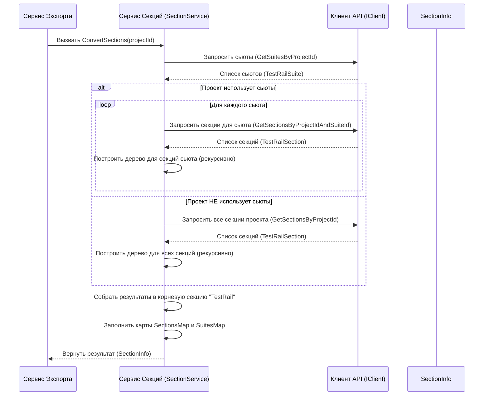

# Chapter 4: Конвертация Секций

В предыдущей главе, [Клиент TestRail API](03_клиент_testrail_api.md), мы разобрались, как наш `TestRailExporter` получает "сырые" данные прямо из TestRail – списки секций, тест-кейсов и прочего. Но просто получить данные недостаточно. Представьте, что вы получили коробку с разобранным конструктором LEGO – куча деталей разной формы и размера. Прежде чем собрать что-то осмысленное, вам нужно рассортировать эти детали и понять, как они соединяются друг с другом.

Точно так же и с данными из TestRail. Секции (папки для тест-кейсов) могут быть организованы по-разному: они могут быть вложены друг в друга, а в некоторых проектах они могут быть дополнительно сгруппированы в "сьюты" (Test Suites). Наша целевая система (например, Test IT) может ожидать иную организацию, например, единое дерево папок.

Именно здесь на сцену выходит **Конвертер Секций** (`SectionService`). Его задача – взять "россыпь" секций и сьютов из TestRail и построить из них аккуратную, иерархическую структуру папок, понятную для целевой системы. Это похоже на работу архитектора, который берет разрозненные чертежи комнат и этажей (данные TestRail) и создает единый, логичный план всего здания (структуру секций для Test IT).

## Зачем нужна конвертация секций?

Основная цель конвертации секций:

1.  **Создать Иерархию:** Превратить плоский список секций, который мы получаем от [Клиента TestRail API](03_клиент_testrail_api.md), в древовидную структуру, где секции вложены друг в друга так же, как в TestRail.
2.  **Учесть Сьюты (Test Suites):** Некоторые проекты в TestRail используют "сьюты" как верхний уровень группировки секций. Конвертер должен уметь работать с такими проектами, создавая дополнительные уровни в иерархии для каждого сьюта.
3.  **Подготовить к Импорту:** Представить эту структуру в формате, который будет использоваться для генерации итоговых файлов, готовых к импорту в другую систему.
4.  **Запомнить Связи:** Создать "карту соответствия", которая связывает ID секций из TestRail с новыми, уникальными ID, созданными для целевой системы. Это критически важно для того, чтобы потом правильно разместить тест-кейсы по папкам.

## Как работает Конвертер Секций?

За эту работу отвечает сервис `SectionService`, который реализует интерфейс `ISectionService`. Основной метод, который запускает весь процесс — `ConvertSections(int projectId)`. Давайте посмотрим, что он делает шаг за шагом:

1.  **Запрос Данных:** `SectionService` обращается к [Клиенту TestRail API](03_клиент_testrail_api.md) (`IClient`) и запрашивает сначала список сьютов (если они есть в проекте), а затем список всех секций для этого проекта (или для каждого сьюта отдельно).
2.  **Построение Дерева:** Получив списки секций (объекты `TestRailSection`), сервис начинает строить иерархическое дерево. Он находит корневые секции (у которых нет родителя или родитель — это сьют), а затем рекурсивно находит дочерние секции для каждой из них, используя поле `parent_id`.
3.  **Обработка Сьютов:** Если в проекте используются сьюты, `SectionService` создает верхнеуровневые папки для каждого сьюта, а уже внутри них размещает дерево секций, принадлежащих этому сьюту. Если сьютов нет, дерево секций строится сразу под корневым элементом.
4.  **Генерация Новых ID:** Для каждой создаваемой "новой" секции в нашей целевой структуре генерируется уникальный идентификатор (`Guid`). Это нужно, потому что ID из TestRail (числа) могут пересекаться или не подходить для целевой системы.
5.  **Создание Карты Соответствия:** В процессе построения дерева сервис запоминает связь между старым ID секции из TestRail (число) и новым ID (Guid). Эта карта (`SectionsMap`) будет использоваться позже, при [Конвертации Тест-кейсов](05_конвертация_тест_кейсов.md), чтобы понять, в какую новую папку положить каждый тест-кейс. Дополнительно может создаваться карта `SuitesMap`, связывающая ID секции с ID её сьюта в TestRail.
6.  **Возврат Результата:** В конце работы сервис возвращает объект `SectionInfo`, который содержит:
    *   `MainSection`: Корневой узел построенного дерева секций. Внутри него — вся иерархия.
    *   `SectionsMap`: Словарь для связи старых ID секций с новыми (`Dictionary<int, Guid>`).
    *   `SuitesMap`: Словарь для связи ID секций с ID их сьютов (`Dictionary<int, int>`).

### Пример Результата: Объект `SectionInfo`

Вот как может выглядеть структура объекта `SectionInfo`, который возвращает `SectionService`:

```csharp
// Файл: Models/Commons/SectionInfo.cs
using Models; // Пространство имен для базовой модели Section

namespace TestRailExporter.Models.Commons;

public class SectionInfo
{
    // Корневой узел дерева секций (со всей вложенностью)
    public Section MainSection { get; set; }
    // Карта: ID секции в TestRail -> Новый Guid секции
    public Dictionary<int, Guid> SectionsMap { get; set; }
    // Карта: ID секции в TestRail -> ID сьюта в TestRail
    public Dictionary<int, int> SuitesMap { get; set; }
}
```

А вот упрощенная структура самой "целевой" секции (`Section` из библиотеки `Models`), которую использует `TestRailExporter`:

```csharp
// Файл: Models/Section.cs (Упрощенно)
namespace Models;

public class Section
{
    public Guid Id { get; set; } // Новый уникальный ID
    public string Name { get; set; } // Имя секции
    public List<Section> Sections { get; set; } = new(); // Список вложенных секций
    public List<Step> PreconditionSteps { get; set; } = new(); // Для описания секции
    // ... другие поля ...
}
```

`SectionService` строит дерево из этих объектов `Section`, рекурсивно заполняя список `Sections`.

## Заглянем "под капот": Внутренняя реализация

Давайте разберемся, как `SectionService` выполняет свою работу.

**1. Общая Схема Работы:**

Когда [Сервис Экспорта](02_сервис_экспорта.md) вызывает `sectionService.ConvertSections(projectId)`, происходит следующее:



Эта диаграмма показывает основной поток: получение данных через `IClient` и последующая обработка внутри `SectionService` для построения дерева и карт.

**2. Код Конвертации:**

Давайте посмотрим на ключевые фрагменты кода в `Services/Implementations/SectionService.cs`.

*   **Главный метод `ConvertSections`:**
    Он просто вызывает вспомогательный метод для реальной работы и оборачивает результат в корневую секцию с именем "TestRail".

    ```csharp
    // Файл: Services/Implementations/SectionService.cs

    public class SectionService(ILogger<SectionService> logger, IClient client) : ISectionService
    {
        // Карты для хранения соответствия ID
        private readonly Dictionary<int, Guid> _sectionIdMap = new();
        private readonly Dictionary<int, int> _suiteIdMap = new();
        private const string _mainSectionName = "TestRail"; // Имя корневой секции

        public async Task<SectionInfo> ConvertSections(int projectId)
        {
            logger.LogInformation("Начинаем конвертацию секций");

            // Получаем дочерние секции (обработанные с учетом сьютов)
            var childSections = await ConvertSectionsWithSuites(projectId);

            // Создаем главную корневую секцию
            var mainSection = new Section
            {
                Id = Guid.NewGuid(), // Уникальный ID для корня
                Name = _mainSectionName,
                Sections = childSections, // Вкладываем результат обработки
                // ... другие поля инициализируются пустыми ...
            };

            logger.LogInformation("Конвертация секций завершена");

            // Возвращаем результат в объекте SectionInfo
            return new SectionInfo
            {
                MainSection = mainSection,
                SectionsMap = _sectionIdMap, // Наша карта ID
                SuitesMap = _suiteIdMap      // Карта сьютов
            };
        }
        // ... другие методы ...
    }
    ```
    Этот код создает "контейнер" верхнего уровня для всех секций проекта.

*   **Обработка сьютов `ConvertSectionsWithSuites`:**
    Этот метод определяет, есть ли в проекте сьюты, и действует соответственно.

    ```csharp
    // Файл: Services/Implementations/SectionService.cs (продолжение)
    private async Task<List<Section>> ConvertSectionsWithSuites(int projectId)
    {
        // Запрашиваем сьюты у клиента API
        var testRailSuites = await client.GetSuitesByProjectId(projectId);

        // Если сьютов нет (список пуст)
        if (testRailSuites.Count == 0)
        {
            // Запрашиваем все секции проекта напрямую
            var testRailSections = await client.GetSectionsByProjectId(projectId);
            // Вызываем рекурсивный конвертер для всех секций сразу
            return await ConvertSections(testRailSections, null); // null - ищем корневые секции
        }
        else // Если сьюты есть
        {
            var sections = new List<Section>();
            // Проходим по каждому сьюту
            foreach (var testRailSuite in testRailSuites)
            {
                // Запрашиваем секции ТОЛЬКО для этого сьюта
                var testRailSections = await client.GetSectionsByProjectIdAndSuiteId(projectId, testRailSuite.Id);
                // Рекурсивно конвертируем секции этого сьюта
                var childSections = await ConvertSections(testRailSections, null); // null - ищем корневые в рамках сьюта

                // Создаем секцию-контейнер для сьюта
                var section = new Section
                {
                    Id = Guid.NewGuid(),
                    Name = testRailSuite.Name, // Имя секции = имя сьюта
                    Sections = childSections   // Вкладываем дочерние секции сьюта
                };
                // Здесь можно добавить описание сьюта, если оно есть

                sections.Add(section); // Добавляем секцию сьюта в общий список
            }
            return sections; // Возвращаем список секций, представляющих сьюты
        }
    }
    ```
    Этот метод решает, как организовать самый верхний уровень: либо сразу секции проекта, либо сначала папки для сьютов.

*   **Рекурсивная конвертация `ConvertSections(List<TestRailSection> testRailSections, int? parentId)`:**
    Это "сердце" построения дерева. Метод находит все секции с заданным `parentId`, создает для них `Section` объекты, добавляет их в карту `_sectionIdMap` и рекурсивно вызывает сам себя для поиска их дочерних секций.

    ```csharp
    // Файл: Services/Implementations/SectionService.cs (продолжение)

    // testRailSections - ПОЛНЫЙ список секций (для текущего проекта или сьюта)
    // parentId - ID родительской секции, чьих детей мы ищем (null для корневых)
    private async Task<List<Section>> ConvertSections(List<TestRailSection> testRailSections, int? parentId)
    {
        var sections = new List<Section>();
        // Находим все секции из списка, у которых ParentId совпадает с искомым
        var directChildren = testRailSections.FindAll(s => s.ParentId == parentId);

        // Обрабатываем каждого найденного прямого потомка
        foreach (var testRailSection in directChildren)
        {
            // РЕКУРСИВНЫЙ ВЫЗОВ: Ищем детей для ТЕКУЩЕЙ секции
            var childSections = await ConvertSections(testRailSections, testRailSection.Id);

            // Создаем объект Section для целевой системы
            var section = new Section
            {
                Id = Guid.NewGuid(), // Генерируем новый ID
                Name = testRailSection.Name,
                Sections = childSections, // Вкладываем найденных детей
                // Можно добавить описание testRailSection.Description в PreconditionSteps
            };

            sections.Add(section); // Добавляем созданную секцию к списку детей родителя

            // Заполняем карты соответствия!
            _sectionIdMap.Add(testRailSection.Id, section.Id); // Связь ID TestRail -> Новый Guid
            if (testRailSection.SuiteId != null)
            {
                _suiteIdMap.Add(testRailSection.Id, testRailSection.SuiteId.Value); // Связь ID секции -> ID Сьюта
            }
        }

        return sections; // Возвращаем список созданных дочерних секций
    }
    ```
    Ключевые моменты здесь:
    *   **Фильтрация:** `testRailSections.FindAll(s => s.ParentId == parentId)` находит нужные секции на текущем уровне.
    *   **Рекурсия:** `await ConvertSections(testRailSections, testRailSection.Id)` погружается на следующий уровень иерархии.
    *   **Создание объекта:** `new Section { ... }` формирует узел для целевой структуры.
    *   **Заполнение карт:** `_sectionIdMap.Add(...)` и `_suiteIdMap.Add(...)` сохраняют критически важную информацию о соответствии идентификаторов.

**3. Важность Карты Соответствия (`_sectionIdMap`)**

Почему так важна карта `_sectionIdMap`, которая сохраняется в `SectionInfo.SectionsMap`?

Когда мы перейдем к [Конвертации Тест-кейсов](05_конвертация_тест_кейсов.md), мы получим из TestRail информацию о том, к какой секции (по её числовому ID из TestRail) принадлежит каждый тест-кейс. Но в нашей новой структуре у секций уже другие ID (типа `Guid`). Карта `SectionsMap` позволит нам быстро найти новый `Guid` секции, зная старый числовой ID из TestRail, и таким образом правильно разместить тест-кейс в построенном дереве папок. Без этой карты мы бы не смогли связать тест-кейсы с их новыми "домами".

## Заключение

В этой главе мы познакомились с **Конвертером Секций** (`SectionService`). Мы узнали, что он играет роль "архитектора", который:

*   Запрашивает информацию о сьютах и секциях у [Клиента TestRail API](03_клиент_testrail_api.md).
*   Преобразует плоские списки из TestRail в иерархическое дерево секций, учитывая вложенность и наличие сьютов.
*   Создает новую структуру секций с уникальными идентификаторами (`Guid`).
*   Самое главное: строит **карту соответствия** (`SectionsMap`) между старыми ID секций TestRail и новыми ID, что необходимо для последующего размещения тест-кейсов.

Результатом его работы является объект `SectionInfo`, содержащий готовую структуру папок (`MainSection`) и карты соответствия (`SectionsMap`, `SuitesMap`).

Теперь, когда у нас есть готовый "план здания" – иерархия папок – мы можем приступить к самому главному: расставить "мебель", то есть конвертировать сами тест-кейсы и разместить их в правильных секциях.

**В следующей главе:** Мы подробно рассмотрим процесс [Конвертации Тест-кейсов](05_конвертация_тест_кейсов.md).

---

Generated by [AI Codebase Knowledge Builder](https://github.com/The-Pocket/Tutorial-Codebase-Knowledge)