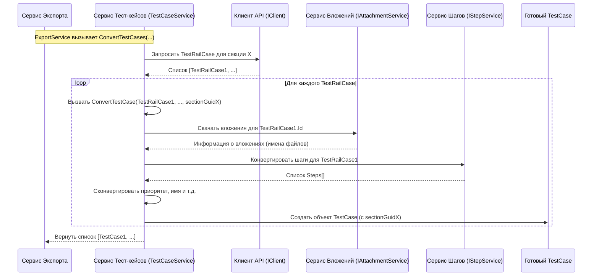

# Chapter 5: Конвертация Тест-кейсов

В предыдущей главе, [Конвертация Секций](04_конвертация_секций.md), мы построили "скелет" нашего экспорта — иерархическую структуру папок (секций), в которую мы будем помещать наши тест-кейсы. Мы создали план здания, и теперь пришло время расставить "мебель" – сами тест-кейсы.

Представьте себе реставратора, который получил старую, возможно немного поврежденную картину (тест-кейс из TestRail). Его задача — не просто перенести её на новый холст, а аккуратно очистить, восстановить детали (например, шаги и связанные эскизы-вложения), определить её ценность (приоритет) и подготовить к выставке в новом музее (формат Test IT).

**Сервис Конвертации Тест-кейсов (`TestCaseService`)** в `TestRailExporter` выполняет именно такую роль. Он берет каждый тест-кейс из TestRail, извлекает из него всю важную информацию, приводит ее в нужный формат и определяет, в какую секцию (созданную на предыдущем шаге) его поместить.

## Зачем нужна конвертация тест-кейсов?

Данные о тест-кейсе в TestRail могут отличаться от того, как они должны быть представлены в целевой системе (например, Test IT):

1.  **Структура Данных:** Формат хранения шагов, предусловий, приоритетов может быть разным.
2.  **Обработка Шагов:** Шаги в TestRail могут быть простым текстом или структурированными. Их нужно преобразовать в единый формат шагов для Test IT.
3.  **Обработка Вложений:** Файлы, прикрепленные к тест-кейсу в TestRail, нужно скачать и связать с новым тест-кейсом.
4.  **Связь с Секциями:** Тест-кейс из TestRail привязан к секции по её числовому ID. Нам нужно использовать карту соответствия, созданную [Конвертером Секций](04_конвертация_секций.md), чтобы найти новый ID (Guid) правильной секции в нашей целевой структуре.
5.  **Преобразование Атрибутов:** Значения некоторых полей, например, приоритета (числа в TestRail), нужно перевести в соответствующий формат целевой системы (например, перечисление Low, Medium, High).

`TestCaseService` решает все эти задачи, выступая как центральный узел для преобразования именно тест-кейсов.

## Как происходит конвертация?

Весь процесс управляется [Сервисом Экспорта](02_сервис_экспорта.md), который вызывает основной метод нашего конвертера — `ConvertTestCases`. Вот что происходит дальше:

1.  **Перебор Секций:** `TestCaseService` получает `SectionInfo` от [Конвертера Секций](04_конвертация_секций.md). Он использует карту `SectionsMap` (и `SuitesMap`, если нужно) из этого объекта, чтобы узнать оригинальные ID секций и сьютов в TestRail.
2.  **Запрос Тест-кейсов:** Для каждой секции из карты он обращается к [Клиенту TestRail API](03_клиент_testrail_api.md) (`IClient`) и запрашивает список тест-кейсов, принадлежащих *именно этой* оригинальной секции (и сьюту) в TestRail.
3.  **Конвертация Каждого Тест-кейса:** Получив список "сырых" тест-кейсов (`TestRailCase`) для одной секции, сервис обрабатывает каждый из них по очереди, вызывая внутренний метод `ConvertTestCase`.
4.  **Делегирование Задач:** Внутри `ConvertTestCase` происходит основная работа по "реставрации":
    *   Генерируется новый, уникальный ID (`Guid`) для тест-кейса в целевой системе.
    *   Вызывается `IAttachmentService` для скачивания всех вложений, связанных с этим тест-кейсом TestRail.
    *   Извлекаются и преобразуются основные поля: Название (`Title`), Приоритет (`PriorityId`), Предусловия (`custom_preconds`).
    *   **Самое важное:** Вызывается `IStepService` для конвертации шагов тест-кейса. Это сложный процесс, которому посвящена следующая глава: [Конвертация Шагов](06_конвертация_шагов.md).
    *   Все преобразованные данные собираются в новый объект `TestCase` (из библиотеки `Models`), куда также записывается *новый* `Guid` секции, которой должен принадлежать этот тест-кейс (полученный из карты `SectionsMap`).
5.  **Сбор Результатов:** Сконвертированные объекты `TestCase` из всех секций собираются в один общий список.
6.  **Возврат Списка:** Готовый список объектов `TestCase` возвращается [Сервису Экспорта](02_сервис_экспорта.md), который затем передаст их сервису записи (`IWriteService`) для сохранения в файлы.

## Заглянем "под капот": Внутреннее устройство

Давайте посмотрим на ключевые компоненты и код, отвечающий за конвертацию тест-кейсов.

**1. Зависимости:**

`TestCaseService` не работает в одиночку. Ему нужны помощники:

*   `ILogger`: Для записи информации о ходе работы.
*   `IClient`: Для получения данных о тест-кейсах из TestRail ([Клиент TestRail API](03_клиент_testrail_api.md)).
*   `IAttachmentService`: Для обработки вложений.
*   `IStepService`: Для обработки шагов ([Конвертация Шагов](06_конвертация_шагов.md)).

Эти зависимости передаются ему при создании через конструктор (механизм внедрения зависимостей).

```csharp
// Файл: Services/Implementations/TestCaseService.cs

// Объявление класса и его зависимостей
public class TestCaseService(
    ILogger<TestCaseService> logger, // Логгер
    IClient client,                  // Клиент API для TestRail
    IAttachmentService attachmentService, // Сервис для вложений
    IStepService stepService)       // Сервис для шагов
    : ITestCaseService // Реализуем интерфейс ITestCaseService
{
    // ... (методы конвертации) ...
}
```

**2. Основной метод: `ConvertTestCases`**

Этот метод оркестрирует получение и конвертацию тест-кейсов по секциям.

```csharp
// Файл: Services/Implementations/TestCaseService.cs (продолжение)

public async Task<List<TestCase>> ConvertTestCases(int projectId, Dictionary<int, SharedStep> sharedStepMap,
    SectionInfo sectionInfo) // Принимаем ID проекта, карту общих шагов и информацию о секциях
{
    // Получаем карты соответствия ID секций и сьютов
    var sectionIdMap = sectionInfo.SectionsMap;
    var suiteIdMap = sectionInfo.SuitesMap;
    logger.LogInformation("Начинаем конвертацию тест-кейсов");

    var allTestCases = new List<TestCase>(); // Список для всех сконвертированных кейсов

    // Проходим по каждой секции, которую мы сконвертировали ранее
    foreach (var sectionEntry in sectionIdMap)
    {
        // sectionEntry.Key = ID секции в TestRail
        // sectionEntry.Value = Новый Guid секции для Test IT

        var testRailSectionId = sectionEntry.Key;
        var targetSectionGuid = sectionEntry.Value;

        var testRailCases = new List<TestRailCase>();

        // Пытаемся найти ID сьюта для этой секции
        if (suiteIdMap.TryGetValue(testRailSectionId, out int suiteId))
        {
            // Если сьют есть, запрашиваем кейсы с учетом ID проекта, сьюта и секции
            testRailCases = await client.GetTestCaseIdsByProjectIdAndSuiteIdAndSectionId(projectId, suiteId, testRailSectionId);
        }
        else
        {
            // Если сьюта нет, запрашиваем кейсы только по ID проекта и секции
            testRailCases = await client.GetTestCaseIdsByProjectIdAndSectionId(projectId, testRailSectionId);
        }

        // Конвертируем полученные "сырые" кейсы из TestRail
        // Передаем им новый Guid секции, к которой они будут принадлежать
        var convertedCasesInSection = await ConvertTestCases(testRailCases, sharedStepMap, targetSectionGuid);

        // Добавляем сконвертированные кейсы из этой секции в общий список
        allTestCases.AddRange(convertedCasesInSection);
    }

    logger.LogInformation("Завершаем конвертацию тест-кейсов");
    return allTestCases; // Возвращаем полный список
}

// Вспомогательный метод для конвертации списка кейсов одной секции
private async Task<List<TestCase>> ConvertTestCases(
    List<TestRailCase> testRailCases,      // Список "сырых" кейсов
    Dictionary<int, SharedStep> sharedStepMap, // Карта общих шагов
    Guid sectionId)                        // Новый Guid секции назначения
{
    var testCases = new List<TestCase>();
    foreach (var testRailCase in testRailCases)
    {
        // Вызываем конвертацию для каждого отдельного кейса
        var testCase = await ConvertTestCase(testRailCase, sharedStepMap, sectionId);
        testCases.Add(testCase);
    }
    return testCases;
}
```
Этот код наглядно показывает, как используются карты `sectionIdMap` и `suiteIdMap` для запроса данных из TestRail через `client` и как затем результат передается дальше для поштучной конвертации, при этом каждому тест-кейсу сразу присваивается *новый* `sectionId`.

**3. Конвертация одного тест-кейса: `ConvertTestCase`**

Это сердце процесса "реставрации" для одного элемента.

```csharp
// Файл: Services/Implementations/TestCaseService.cs (продолжение)

protected async Task<TestCase> ConvertTestCase(
    TestRailCase testRailCase,              // "Сырой" кейс из TestRail
    Dictionary<int, SharedStep> sharedStepMap, // Карта общих шагов
    Guid sectionId)                        // Новый Guid секции назначения
{
    logger.LogDebug("Конвертируем тест-кейс: {@Case}", testRailCase);

    // 1. Генерируем уникальный ID для нового тест-кейса
    var testCaseGuid = Guid.NewGuid();

    // 2. Вызываем AttachmentService для скачивания вложений
    // Передаем ID из TestRail и новый Guid для организации папок с файлами
    var attachmentsInfo = await attachmentService.DownloadAttachmentsByCaseId(testRailCase.Id, testCaseGuid);

    // 3. Преобразуем Предусловия (если есть)
    var preconditionSteps = testRailCase.TextPreconds != null
        ? [new Step { Action = testRailCase.TextPreconds }] // Создаем список с одним шагом
        : new List<Step>(); // Создаем пустой список

    // 4. Вызываем StepService для конвертации шагов (детали в следующей главе)
    // Передаем сырой кейс, новый Guid, карту общих шагов и информацию о скачанных вложениях
    var steps = await stepService.ConvertStepsForTestCase(testRailCase, testCaseGuid, sharedStepMap, attachmentsInfo);

    // 5. Обработка имени (обрезка, если слишком длинное)
    var originalTitle = testRailCase.Title;
    if (originalTitle.Length > 255)
    {
        logger.LogWarning($"Имя тест-кейса {testRailCase.Id} обрезано до 255 символов.");
        originalTitle = "[ОБРЕЗАНО] " + originalTitle.Substring(0, 246) + "..."; // Укорачиваем
    }

    // 6. Собираем финальный объект TestCase
    var testCase = new TestCase
    {
        Id = testCaseGuid,                     // Новый Guid
        Name = originalTitle,                  // Имя (возможно, обрезанное)
        State = StateType.NotReady,            // Статус по умолчанию
        Priority = ConvertPriority(testRailCase.PriorityId), // Преобразованный приоритет
        SectionId = sectionId,                 // НОВЫЙ Guid секции!
        PreconditionSteps = preconditionSteps, // Предусловия
        Steps = steps,                         // Сконвертированные шаги
        Attachments = attachmentsInfo.AttachmentNames, // Имена скачанных файлов
        PostconditionSteps = new List<Step>(), // Постусловий в TestRail нет
        Tags = new List<string>(),             // Тегов в этой логике нет
        Iterations = new List<Iteration>(),    // Итераций нет
    };

    logger.LogDebug("Сконвертированный тест-кейс: {@TestCase}", testCase);
    return testCase; // Возвращаем готовый объект
}
```
В этом методе видна последовательность действий: генерация ID, обращение к другим сервисам (вложения, шаги), преобразование простых полей и сборка итогового объекта `TestCase`. Обратите внимание, как `sectionId` (новый Guid) используется при создании финального объекта.

**4. Преобразование Приоритета:**

Это простой пример преобразования значения из одного формата в другой.

```csharp
// Файл: Services/Implementations/TestCaseService.cs (продолжение)

// Преобразует числовой ID приоритета из TestRail в тип PriorityType
private static PriorityType ConvertPriority(int priority)
{
    return priority switch // Используем конструкцию switch expression
    {
        1 => PriorityType.Low,     // Если в TestRail PriorityId = 1, то это Низкий
        2 => PriorityType.Medium,  // Если 2 -> Средний
        3 => PriorityType.High,    // Если 3 -> Высокий
        4 => PriorityType.Highest, // Если 4 -> Самый высокий
        _ => PriorityType.Medium   // Для всех остальных случаев -> Средний (по умолчанию)
    };
}
```

**5. Схема взаимодействия:**

Давайте посмотрим на упрощенную схему вызовов при конвертации одного тест-кейса:


Эта диаграмма показывает, как `TestCaseService` получает "сырые" данные от `IClient`, затем для каждого тест-кейса делегирует обработку вложений `IAttachmentService`, обработку шагов `IStepService`, выполняет собственную логику преобразования и собирает финальный объект `TestCase`.

## Заключение

В этой главе мы погрузились в процесс **Конвертации Тест-кейсов**. Мы узнали, что `TestCaseService` действует как "реставратор":

*   Он получает "сырые" данные тест-кейсов из TestRail, используя [Клиента TestRail API](03_клиент_testrail_api.md) и информацию о секциях от [Конвертера Секций](04_конвертация_секций.md).
*   Он преобразует основные атрибуты тест-кейса (имя, приоритет, предусловия).
*   Он определяет правильную секцию назначения для каждого тест-кейса в новой структуре.
*   Он делегирует сложную работу по обработке вложений и шагов специализированным сервисам (`IAttachmentService` и `IStepService`).
*   Результатом его работы является список готовых объектов `TestCase`, готовых к сохранению.

Мы увидели, как этот сервис координирует получение данных и их преобразование, шаг за шагом "восстанавливая" каждый тест-кейс для его новой "экспозиции" в целевой системе.

Однако, мы лишь упомянули один из самых сложных этапов реставрации — восстановление шагов тест-кейса. Как `TestRailExporter` разбирает разные форматы шагов из TestRail и превращает их в структурированный вид?

**В следующей главе:** Мы подробно рассмотрим [Конвертацию Шагов](06_конвертация_шагов.md) и узнаем, как `IStepService` справляется с этой задачей.

---

Generated by [AI Codebase Knowledge Builder](https://github.com/The-Pocket/Tutorial-Codebase-Knowledge)