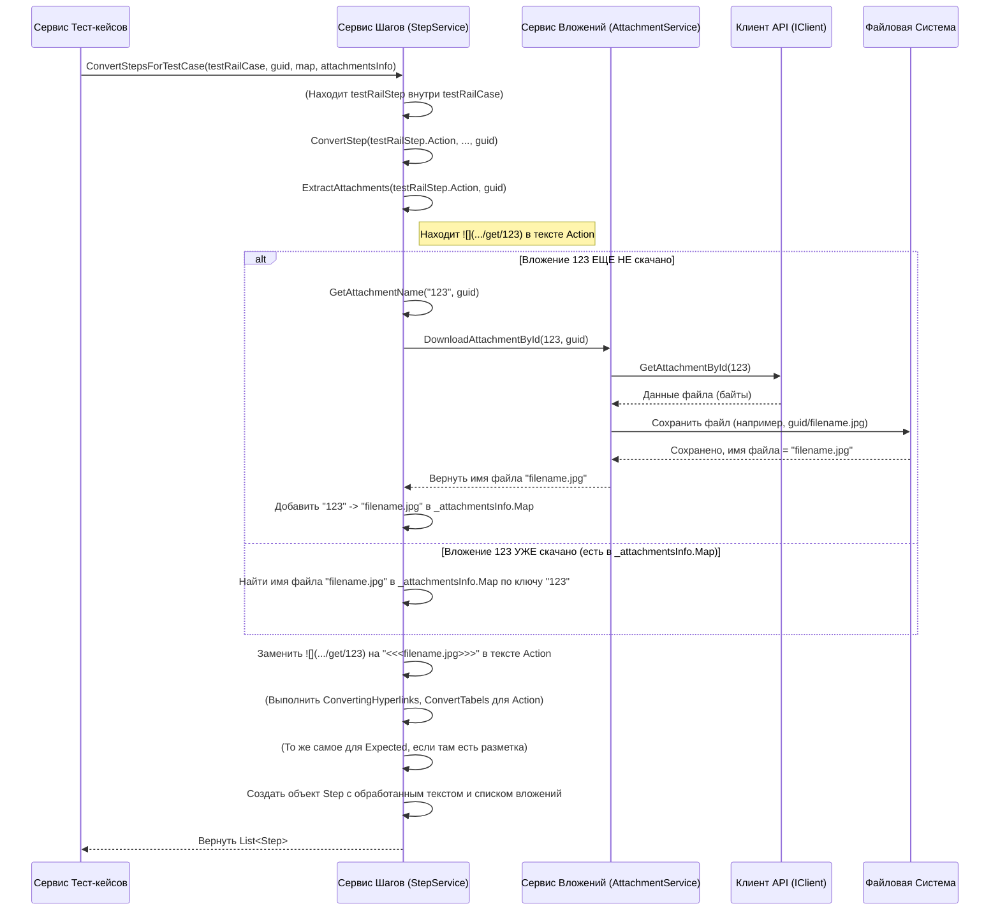

# Chapter 6: Конвертация Шагов

В предыдущей главе, [Конвертация Тест-кейсов](05_конвертация_тест_кейсов.md), мы узнали, как `TestRailExporter` "реставрирует" общую информацию о тест-кейсах: название, приоритет, предусловия, и как он находит для них правильное место в новой структуре папок. Но сердце любого тест-кейса — это его шаги: последовательность действий и ожидаемых результатов.

Представьте, что тест-кейс — это сложный рецепт. В Главе 5 мы разобрались с названием блюда, его сложностью и необходимыми подготовительными этапами (предусловиями). Теперь нам нужно детально изучить сами шаги приготовления: нарезать лук, обжарить мясо, добавить специи... Но что, если рецепты (шаги в TestRail) записаны по-разному?
*   Где-то это нумерованный список действий и результатов.
*   Где-то — просто абзац текста с описанием процесса.
*   В рецепте могут быть ссылки на другие рецепты ("приготовьте соус по рецепту №5" — это как Общие Шаги).
*   Могут быть картинки ингредиентов или готовых этапов (Вложения).
*   Сложные инструкции могут быть оформлены в виде таблиц (Форматирование).

**Сервис Конвертации Шагов (`StepService`)** — это наш шеф-повар, который берет все эти разнообразные записи шагов из TestRail и переводит их в единый, понятный формат для нашей "новой кухни" (целевой системы, например, Test IT). Он вычитывает каждый шаг, расшифровывает форматирование, находит и прикрепляет нужные картинки (вложения) и вставляет ссылки на другие рецепты (общие шаги).

## Зачем нужна конвертация шагов?

Без `StepService` наши сконвертированные тест-кейсы были бы неполными. Его главные задачи:

1.  **Разобрать Разные Форматы:** TestRail позволяет хранить шаги как минимум тремя способами: структурированные шаги (действие + результат), простой текст (одно поле), и сценарии. `StepService` должен уметь работать со всеми.
2.  **Обработать Форматирование TestRail:** Текст шагов в TestRail часто содержит специальную разметку для ссылок (`[текст](URL)`), изображений (``), таблиц (`|| Заголовок || ...`). Конвертер должен преобразовать это в стандартный HTML, понятный целевой системе.
3.  **Найти и Связать Вложения:** Если в шаге есть ссылка на вложение (``), `StepService` должен:
    *   Распознать эту ссылку.
    *   Понять, какой файл ей соответствует (используя информацию от `AttachmentService`).
    *   Заменить ссылку TestRail на специальный маркер (`<<<имя_файла.jpg>>>`), который целевая система сможет использовать для отображения вложения.
4.  **Подставить Общие Шаги (Shared Steps):** Если тест-кейс использует общий шаг (в TestRail это выглядит как специальный шаг со ссылкой `shared_step_id`), `StepService` заменяет этот "заполнитель" на ссылку на уже сконвертированный общий шаг.
5.  **Сформировать Структуру Шагов:** Представить результат в виде списка объектов `Step`, где каждый объект содержит поля `Action`, `Expected`, `ActionAttachments`, `ExpectedAttachments`, `SharedStepId`.

## Как происходит конвертация шагов?

[Сервис Конвертации Тест-кейсов](05_конвертация_тест_кейсов.md) вызывает `StepService`, когда обрабатывает конкретный тест-кейс или общий шаг.

*   Для **тест-кейса** вызывается метод `ConvertStepsForTestCase`. Ему передаются:
    *   `testCase`: "Сырой" объект `TestRailCase` из TestRail.
    *   `testCaseId`: Новый `Guid` тест-кейса (нужен для скачивания вложений, если их еще нет).
    *   `sharedStepMap`: Карта уже сконвертированных общих шагов (`Dictionary<int, SharedStep>`).
    *   `attachmentsInfo`: Информация об уже скачанных для этого тест-кейса вложениях.
    Он возвращает `Task<List<Step>>` — список сконвертированных шагов для этого кейса.

*   Для **общего шага** вызывается метод `ConvertStepsForSharedStep`. Ему передаются:
    *   `sharedStep`: "Сырой" объект `TestRailSharedStep`.
    *   `sharedStepId`: Новый `Guid` общего шага.
    Он возвращает `Task<StepsInfo>`, который содержит список сконвертированных шагов (`Steps`) и список имен вложений, найденных внутри этих шагов (`StepAttachmentNames`).

### Целевая структура шага (`Step`)

Результатом конвертации является список объектов `Step` (из библиотеки `Models`), который выглядит примерно так (упрощенно):

```csharp
// Фрагмент из Models/Step.cs (упрощенно)
namespace Models;

public class Step
{
    // Текст действия (уже в HTML)
    public string? Action { get; set; }
    // Текст ожидаемого результата (уже в HTML)
    public string? Expected { get; set; }
    // Список имен файлов-вложений для Поля Действие
    public List<string> ActionAttachments { get; set; } = new();
    // Список имен файлов-вложений для Поля Ожидаемый результат
    public List<string> ExpectedAttachments { get; set; } = new();
    // ID связанного общего шага (если это шаг-ссылка)
    public Guid? SharedStepId { get; set; }
    // ... другие поля ...
}
```

`StepService` заполняет эти поля, преобразуя данные из TestRail.

## Заглянем "под капот": Внутреннее устройство

Как же `StepService` справляется со всеми этими задачами? Давайте разберем основной поток работы.

**1. Определение формата шагов в тест-кейсе:**

Когда вызывается `ConvertStepsForTestCase`, первым делом сервис смотрит, в каком поле `TestRailCase` лежат шаги:

```csharp
// Файл: Services/Implementations/StepService.cs

public async Task<List<Step>> ConvertStepsForTestCase(TestRailCase testCase, Guid testCaseId,
    Dictionary<int, SharedStep> sharedStepMap, AttachmentsInfo attachmentsInfo)
{
    logger.LogDebug("Конвертируем шаги для тест-кейса {Name}", testCase.Title);
    _attachmentsInfo = attachmentsInfo; // Сохраняем информацию о вложениях

    // Формат 1: Структурированные шаги (действие + результат)
    if (testCase.Steps != null)
    {
        // Вызываем специальный метод для списка шагов
        return await ConvertListStepsForTestCase(testCase.Steps, testCaseId, sharedStepMap);
    }
    // Формат 2: Простой текст (текст действия + текст результата в отдельных полях)
    else if (testCase.TextSteps != null || testCase.TextExpected != null)
    {
        // Конвертируем как один шаг
        var step = await ConvertStep(testCase.TextSteps, testCase.TextExpected, testCaseId);
        return new List<Step> { step };
    }
    // Формат 3: Миссия/Цели (похоже на простой текст)
    else if (testCase.TextMission != null || testCase.TextGoals != null)
    {
        var step = await ConvertStep(testCase.TextMission, testCase.TextGoals, testCaseId);
        return new List<Step> { step };
    }
    // Формат 4: Сценарии (список текстовых полей)
    else if (testCase.TextScenarios != null)
    {
        // Разбираем JSON со сценариями и конвертируем их
        var scenarios = JsonSerializer.Deserialize<List<TestRailScenario>>(testCase.TextScenarios)!;
        return await ConvertScenariosForTestCase(scenarios, testCaseId);
    }

    // Если шагов нет ни в одном формате
    return new List<Step>();
}
```
Этот код действует как диспетчер, выбирая правильный метод обработки в зависимости от того, как шаги были заданы в TestRail.

**2. Обработка списка структурированных шагов:**

Метод `ConvertListStepsForTestCase` проходит по списку шагов из `testCase.Steps`.

```csharp
// Файл: Services/Implementations/StepService.cs

private async Task<List<Step>> ConvertListStepsForTestCase(List<TestRailStep> testRailSteps, Guid id, Dictionary<int, SharedStep> sharedStepMap)
{
    var steps = new List<Step>(); // Результат: список сконвертированных шагов

    for (var i = 0; i < testRailSteps.Count; i++)
    {
        var testRailStep = testRailSteps[i]; // Берем текущий шаг из TestRail

        // Проверяем, является ли это ссылкой на Общий Шаг
        if (testRailStep.SharedStepId != null)
        {
            // Да, это ссылка! Находим соответствующий *уже сконвертированный* общий шаг в карте
            var sharedStep = sharedStepMap[(int)testRailStep.SharedStepId];

            // Создаем шаг-ссылку, указывая Guid общего шага
            steps.Add(
                new Step { SharedStepId = sharedStep.Id }
            );

            /* ВАЖНО: Пропускаем следующие шаги в списке TestRail,
               если они являются частью вставленного общего шага.
               TestRail включает шаги из shared step прямо в список,
               но нам нужна только одна ссылка.
               Количество шагов в общем шаге берем из sharedStep.Steps.Count */
            i += sharedStep.Steps.Count - 1;

            continue; // Переходим к следующей итерации цикла
        }

        // Если это НЕ ссылка на общий шаг, конвертируем его как обычный
        // Вызываем основной метод конвертации одного шага
        var step = await ConvertStep(testRailStep.Action, testRailStep.Expected, id);
        steps.Add(step); // Добавляем результат в список
    }

    return steps; // Возвращаем готовый список шагов
}
```
Ключевой момент здесь — обработка `SharedStepId`. Если он есть, создается специальный шаг-ссылка, и внутренние шаги общего шага (которые TestRail тоже может возвращать в списке) пропускаются. Иначе вызывается `ConvertStep` для обычного шага.

**3. Конвертация одного шага (`ConvertStep`): Форматирование и Вложения**

Это "рабочая лошадка", которая обрабатывает текст действия и ожидаемого результата.

```csharp
// Файл: Services/Implementations/StepService.cs

private async Task<Step> ConvertStep(string? textAction, string? textExpected, Guid id)
{
    // 1. Обрабатываем текст Действия: ищем вложения, заменяем ссылки
    var actionData = await ExtractAttachments(textAction, id);
    var convertedAction = ConvertTabels(ConvertingHyperlinks(actionData.Description));

    // 2. Обрабатываем текст Ожидаемого результата: так же
    var expectedData = await ExtractAttachments(textExpected, id);
    var convertedExpected = ConvertTabels(ConvertingHyperlinks(expectedData.Description));

    // 3. Создаем и возвращаем объект Step с обработанными данными
    return new Step
    {
        Action = convertedAction,                  // HTML-текст действия
        Expected = convertedExpected,              // HTML-текст результата
        ActionAttachments = actionData.AttachmentNames, // Найденные вложения в действии
        ExpectedAttachments = expectedData.AttachmentNames, // Найденные вложения в результате
    };
}
```
Этот метод последовательно применяет три основные операции к тексту:
*   `ExtractAttachments`: Находит картинки ``, скачивает их (если нужно) и заменяет на `<<<файл>>>`.
*   `ConvertingHyperlinks`: Находит ссылки `[]()` и превращает их в HTML `<a href="...">`.
*   `ConvertTabels`: Находит таблицы `||...||` и превращает их в HTML `<table>...`.

**4. Извлечение вложений (`ExtractAttachments`):**

Это самая сложная часть, так как она может взаимодействовать с `AttachmentService`.

```csharp
// Файл: Services/Implementations/StepService.cs

// Регулярное выражение для поиска синтаксиса изображений TestRail: 
private static readonly Regex _ImgRegex = new Regex(@"!\[\]\(([^)]*)\)");

private async Task<DescriptionInfo> ExtractAttachments(string? description, Guid id)
{
    // Если описания нет, возвращаем пустой результат
    if (string.IsNullOrEmpty(description))
    {
        return new DescriptionInfo { Description = string.Empty, AttachmentNames = new List<string>() };
    }

    var info = new DescriptionInfo
    {
        Description = description, // Начнем с исходного текста
        AttachmentNames = new List<string>() // Список имен найденных вложений
    };

    // Ищем все совпадения  в тексте
    var matches = _ImgRegex.Matches(description);
    if (matches.Count == 0) return info; // Если картинок нет, выходим

    // Обрабатываем каждое найденное изображение
    foreach (Match match in matches)
    {
        // match.Value содержит всю строку, например: 
        // match.Groups[1].Value содержит только URL: index.php?/attachments/get/123
        var url = match.Groups[1].Value;
        // Извлекаем ID вложения (последняя часть URL)
        var attachmentId = url.Split('/').Last();
        var fileName = string.Empty;

        // Проверяем, скачивали ли мы уже это вложение (по его ID из TestRail)?
        // _attachmentsInfo - это поле класса, заполненное ранее AttachmentService
        if (!_attachmentsInfo.AttachmentsMap.TryGetValue(attachmentId, out fileName))
        {
             // Если нет, вызываем метод, который скачает его СЕЙЧАС
             fileName = await GetAttachmentName(attachmentId, id);
        }

        // Если скачать не удалось (например, ID не число)
        if (fileName == string.Empty)
        {
            logger.LogWarning("Не удалось обработать вложение с ID {AttachmentId}", attachmentId);
            continue; // Пропускаем это изображение
        }

        // Заменяем синтаксис TestRail  на наш маркер <<<имя_файла>>>
        info.Description = info.Description.Replace(match.Value, $"<<<{fileName}>>>");
        // Добавляем имя файла в список вложений для этого поля (Action или Expected)
        info.AttachmentNames.Add(fileName);
    }

    // Возвращаем обработанный текст и список имен вложений
    return info;
}

// Вспомогательный метод для скачивания вложения, если его еще нет
private async Task<string> GetAttachmentName(string attachmentId, Guid id)
{
    // Пытаемся преобразовать ID в число
    if (!int.TryParse(attachmentId, out int value))
    {
        return string.Empty; // Не числовой ID
    }

    // Вызываем AttachmentService для загрузки файла по числовому ID
    // id (Guid тест-кейса/общего шага) нужен для правильного именования файла
    var fileName = await attachmentService.DownloadAttachmentById(value, id);

    // Добавляем скачанный файл в общую карту вложений (_attachmentsInfo)
    // чтобы не скачивать его повторно, если он встретится еще раз
    _attachmentsInfo.AttachmentNames.Add(fileName);
    _attachmentsInfo.AttachmentsMap.Add(attachmentId, fileName); // Ключ - ID из TestRail

    return fileName;
}
```
Этот код ищет ссылки на картинки, извлекает ID вложения, проверяет, не скачали ли мы его уже. Если нет — вызывает `AttachmentService` для скачивания, а затем заменяет исходную разметку TestRail на маркер `<<<имя_файла>>>`.

**5. Преобразование ссылок и таблиц:**

Методы `ConvertingHyperlinks` и `ConvertTabels` используют регулярные выражения для поиска соответствующей разметки и замены её на стандартный HTML.

```csharp
// Файл: Services/Implementations/StepService.cs (фрагмент)

// Ищет [текст ссылки](URL)
private static readonly Regex _HyperlinkRegex = new Regex(@"\[[^\[\]]*\]\([^()\s]*\)");
// Ищет || заголовок || тело || ...
private static readonly Regex _TableRegex = new Regex(@"(\|{2,}[^\n]*\n)+");


public static string ConvertingHyperlinks(string description)
{
    // Находим все ссылки [...]...(...)
    var matches = _HyperlinkRegex.Matches(description);
    // ... (код для извлечения URL и текста ссылки) ...
    // Заменяем найденное на <a href="URL">текст ссылки</a>
    description = description.Replace(match.Value, $"<a target=\"_blank\" rel=\"noopener noreferrer\" href=\"{url}\">{title}</a>");
    // ... (повторяем для всех найденных ссылок) ...
    return description;
}

private static string ConvertTabels(string description)
{
    // Находим блоки таблиц ||...
    var tableMatches = _TableRegex.Matches(description);
    // ... (код для разбивки таблицы на строки и ячейки) ...
    // Заменяем найденное на <table...><tbody><tr><td>...</td></tr>...</tbody></table>
    description = description.Replace(table, convertedTable);
    // ... (повторяем для всех найденных таблиц) ...
    return description;
}
```
Эти методы превращают специальную разметку TestRail в HTML, который должен корректно отображаться в целевой системе.

**6. Схема взаимодействия:**

Давайте посмотрим, как `StepService` взаимодействует с другими компонентами при обработке шага с изображением:


Эта диаграмма показывает, как `StepService` разбирает текст шага, при необходимости обращается к `AttachmentService` для скачивания вложений через [Клиент TestRail API](03_клиент_testrail_api.md) и в итоге формирует готовый объект `Step`.

## Заключение

В этой главе мы разобрались с **Конвертацией Шагов** — одним из самых детальных и важных этапов экспорта. Мы узнали, что `StepService` выполняет кропотливую работу "шеф-повара" или "редактора":

*   Он понимает разные форматы записи шагов в TestRail.
*   Он преобразует специальную разметку TestRail (ссылки, изображения, таблицы) в стандартный HTML.
*   Он находит ссылки на вложения в тексте шагов, координирует их скачивание с `AttachmentService` и заменяет ссылки на маркеры для целевой системы.
*   Он правильно обрабатывает ссылки на Общие Шаги (Shared Steps).
*   Результатом его работы является структурированный список шагов (`List<Step>`), готовый для включения в итоговый тест-кейс.

Мы последовательно рассмотрели, как конвертируются Секции, Тест-кейсы и, наконец, Шаги. Теперь все основные данные из TestRail извлечены, преобразованы и подготовлены в формате, который требуется для импорта. [Сервис Экспорта](02_сервис_экспорта.md), получив эти обработанные данные, передаст их сервису записи (`IWriteService`), который сохранит их в JSON-файлы в указанной вами папке. На этом основной процесс конвертации данных завершен!

---

Generated by [AI Codebase Knowledge Builder](https://github.com/The-Pocket/Tutorial-Codebase-Knowledge)