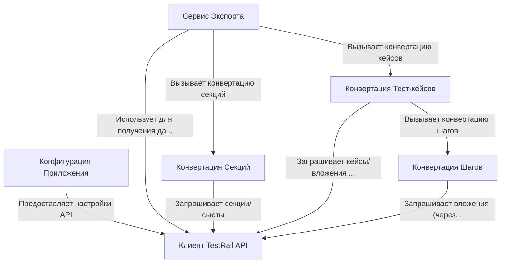

# Tutorial: TestRailExporter

Проект **TestRailExporter** предназначен для *автоматической выгрузки* данных о тест-кейсах, секциях и шагах из системы **TestRail**.
Он читает *настройки подключения* и параметры проекта из конфигурационного файла, запрашивает данные через *TestRail API*, преобразует их в нужный формат и сохраняет результат для последующего импорта в другую систему (например, Test IT).

## Chapters

1. [Конфигурация Приложения](01_конфигурация_приложения.md)
2. [Сервис Экспорта](02_сервис_экспорта.md)
3. [Клиент TestRail API](03_клиент_testrail_api.md)
4. [Конвертация Секций](04_конвертация_секций.md)
5. [Конвертация Тест-кейсов](05_конвертация_тест_кейсов.md)
6. [Конвертация Шагов](06_конвертация_шагов.md)

---

Generated by [AI Codebase Knowledge Builder](https://github.com/The-Pocket/Tutorial-Codebase-Knowledge)