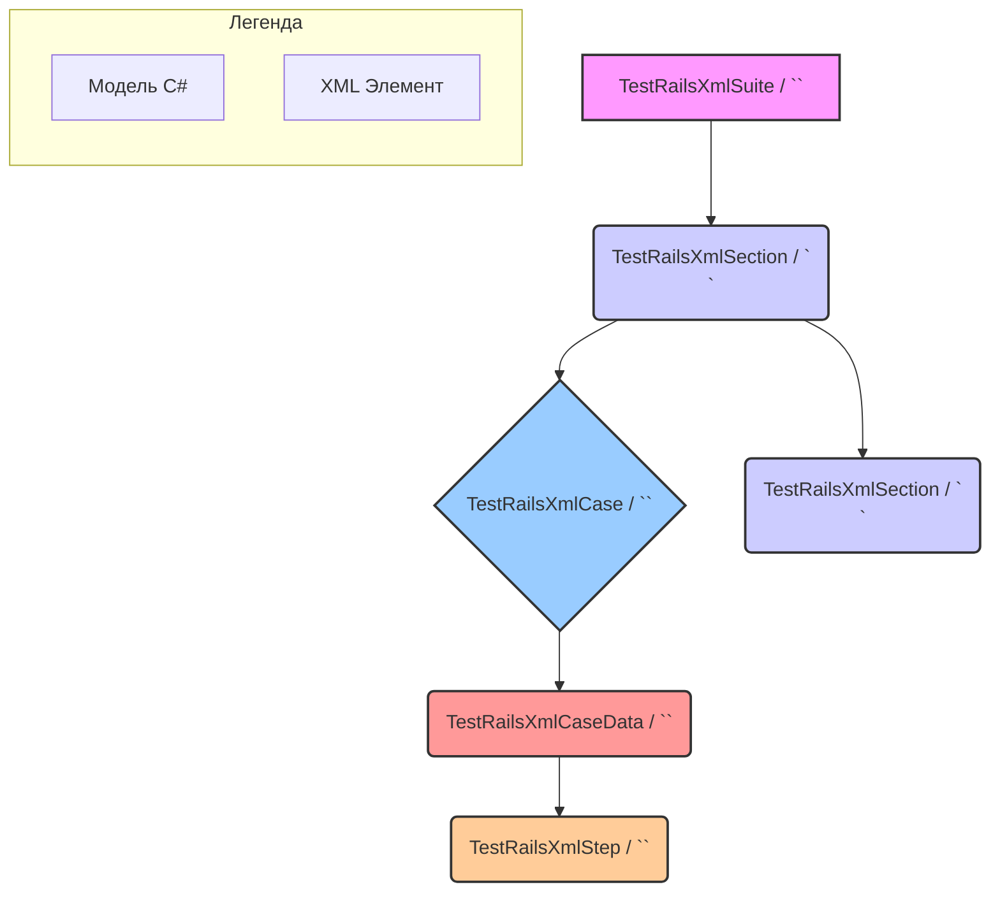
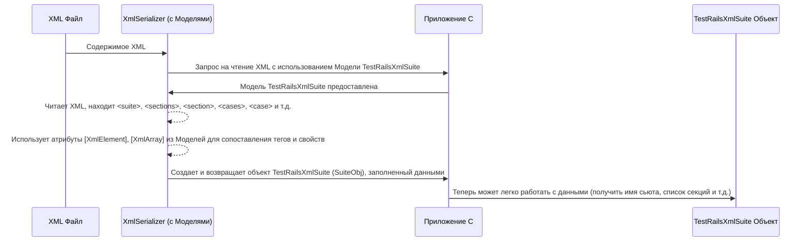

# Chapter 1: Модели Данных TestRail XML


Добро пожаловать в руководство по `TestRailXmlExporter`! В этой первой главе мы разберем, что такое "Модели Данных TestRail XML" и почему они так важны для нашего инструмента.

Представьте, что вы получили из TestRail большой файл в формате XML. Это как огромная инструкция, написанная на немного специфическом языке. Как вашей программе на C# понять, где в этой инструкции находится название тест-кейса, где его шаги, а где – ожидаемый результат? Просто так прочитать текст и догадаться не получится.

Вот здесь на помощь приходят **Модели Данных**.

## Зачем нужны Модели Данных?

Модели данных – это как **чертежи** или **формы для выпечки**. Они заранее описывают, какую структуру мы ожидаем увидеть в XML-файле. Когда наша программа получает XML-файл, она использует эти "чертежи", чтобы правильно "разложить" информацию по полочкам – то есть, создать удобные для работы объекты в коде.

В нашем проекте `TestRailXmlExporter` эти "чертежи" – это специальные классы (точнее, `record struct`) в C#, такие как `TestRailsXmlSuite`, `TestRailsXmlSection`, `TestRailsXmlCase` и другие. Каждый такой класс описывает одну конкретную часть данных из TestRail:
*   `TestRailsXmlSuite`: Представляет весь тест-сьют (набор тестов).
*   `TestRailsXmlSection`: Представляет секцию (папку) внутри сьюта. Секции могут содержать другие секции или тест-кейсы.
*   `TestRailsXmlCase`: Представляет отдельный тест-кейс со всеми его деталями.
*   `TestRailsXmlStep`: Представляет один шаг внутри тест-кейса.
*   `TestRailsXmlCaseData`: Содержит поля с шагами и пользовательские поля тест-кейса.

**Аналогия:** XML-файл – это как разобранный конструктор Lego в коробке. Модели данных – это инструкция по сборке, которая говорит: "Эта деталь – корпус машины (`TestRailsXmlSuite`), вот эти детали – двери (`TestRailsXmlSection`), а эти маленькие – колеса (`TestRailsXmlCase`)". Без инструкции собрать что-то осмысленное было бы сложно!

## Как выглядят Модели Данных?

Давайте посмотрим на пример модели для Тест-кейса (`TestRailsXmlCase`).

```csharp
// --- File: Models\TestRailsXmlCase.cs ---
using System.Xml.Serialization;

namespace TestRailXmlExporter.Models;

// Атрибут [XmlRoot] говорит, что этот класс соответствует XML-элементу <case>
[XmlRoot(ElementName = "case")]
public record struct TestRailsXmlCase
{
    // Атрибут [XmlElement] связывает свойство Title с XML-элементом <title>
    [XmlElement(ElementName = "title")]
    public string? Title { get; set; } // Название тест-кейса

    // Другие стандартные поля TestRail
    [XmlElement(ElementName = "template")]
    public string? Template { get; set; } // Шаблон

    [XmlElement(ElementName = "type")]
    public string? Type { get; set; } // Тип

    [XmlElement(ElementName = "priority")]
    public string? Priority { get; set; } // Приоритет

    // ... другие поля ...

    // Это поле содержит пользовательские данные и шаги
    [XmlElement(ElementName = "custom")]
    public TestRailsXmlCaseData? Custom { get; set; }
}
```

Что здесь важно для новичка:

1.  `public record struct TestRailsXmlCase`: Мы объявляем структуру данных C# с именем `TestRailsXmlCase`.
2.  `[XmlRoot(ElementName = "case")]`: Эта строка (атрибут) говорит: "Эта структура соответствует корневому XML-элементу с именем `<case>`".
3.  `[XmlElement(ElementName = "title")] public string? Title { get; set; }`: Эта строка говорит: "Найди внутри `<case>` элемент `<title>`, и его содержимое запиши в свойство `Title`".
4.  `public TestRailsXmlCaseData? Custom { get; set; }`: Это свойство само является другой моделью (`TestRailsXmlCaseData`), которая будет содержать шаги теста и другие пользовательские поля, описанные внутри тега `<custom>`.

Таким образом, каждая модель точно описывает, какие данные и с какими именами (тегами) мы ожидаем найти в соответствующей части XML.

## Иерархия Моделей

Данные в TestRail (и в XML-экспорте) имеют иерархическую структуру, и наши модели её отражают:



*   На самом верху у нас `<suite>` (`TestRailsXmlSuite`).
*   Внутри сьюта находятся секции `<sections>` (`TestRailsXmlSection[]`).
*   Каждая секция может содержать либо другие вложенные секции (`TestRailsXmlSection[]`), либо тест-кейсы `<cases>` (`TestRailsXmlCase[]`).
*   Каждый тест-кейс `<case>` (`TestRailsXmlCase`) содержит свои поля (название, тип, приоритет и т.д.) и специальный элемент `<custom>` (`TestRailsXmlCaseData`).
*   Внутри `<custom>` находятся шаги `<steps_separated>` или `<steps_case>` (`TestRailsXmlStep[]`) и другие пользовательские поля.

Посмотрим на модель Секции (`TestRailsXmlSection`):

```csharp
// --- File: Models\TestRailsXmlSection.cs ---
using System.Xml.Serialization;

namespace TestRailXmlExporter.Models;

[XmlRoot(ElementName = "section")]
public record struct TestRailsXmlSection
{
    [XmlElement(ElementName = "name")]
    public string? Name { get; set; } // Имя секции

    // Секция может содержать вложенные секции
    [XmlArray(ElementName = "sections")] // Ищем XML-элемент <sections>
    // Каждый элемент внутри <sections> называется <section> и соответствует TestRailsXmlSection
    [XmlArrayItem("section", Type = typeof(TestRailsXmlSection))]
    public TestRailsXmlSection[]? Sections { get; set; }

    // Или секция может содержать тест-кейсы
    [XmlArray(ElementName = "cases")] // Ищем XML-элемент <cases>
    // Каждый элемент внутри <cases> называется <case> и соответствует TestRailsXmlCase
    [XmlArrayItem("case", Type = typeof(TestRailsXmlCase))]
    public TestRailsXmlCase[]? Cases { get; set; }

    [XmlElement(ElementName = "description")]
    public string? Description { get; set; } // Описание секции
}
```

Здесь мы видим атрибуты `[XmlArray]` и `[XmlArrayItem]`. Они используются для списков (массивов) элементов.
*   `[XmlArray("sections")]` говорит: "Ищи элемент `<sections>`".
*   `[XmlArrayItem("section", ...)]` говорит: "Внутри `<sections>` будут элементы `<section>`, каждый из которых соответствует модели `TestRailsXmlSection`".

## Как это работает "под капотом"?

Когда наша программа читает XML-файл, происходит процесс, называемый **десериализацией**. Специальный компонент .NET (`XmlSerializer`) берет XML-текст и наши Модели Данных (классы с атрибутами `[Xml...]`) и автоматически создает объекты C# с данными из XML.

Процесс выглядит примерно так:



`XmlSerializer` делает всю "грязную" работу по разбору XML, опираясь на структуру, которую мы описали в Моделях Данных. Нам не нужно вручную искать теги в тексте – достаточно правильно описать модели.

За непосредственное чтение XML и использование этих моделей отвечает [Сервис Импорта XML](03_сервис_импорта_xml_.md), о котором мы поговорим в одной из следующих глав.

## Пользовательские поля

Обратите внимание на поле `CustomAttributes` в модели `TestRailsXmlCaseData`:

```csharp
// --- File: Models\TestRailsXmlCaseData.cs ---
using System.Xml;
using System.Xml.Serialization;

namespace TestRailXmlExporter.Models;

// ... другие поля ...

public record struct TestRailsXmlCaseData
{
    // ... стандартные поля типа preconditions, steps ...

    // Этот атрибут позволяет "захватить" любые другие XML-элементы внутри <custom>,
    // которые не были явно описаны другими свойствами.
    // Это используется для пользовательских полей TestRail.
    [XmlAnyElement]
    public XmlElement[]? CustomAttributes { get; set; }
}
```

Атрибут `[XmlAnyElement]` очень важен. Он позволяет нашей модели "собирать" все те XML-элементы внутри `<custom>`, которые не соответствуют явно объявленным полям (вроде `preconds`, `steps_separated`). Именно так мы получаем доступ к **пользовательским полям**, которые вы могли создать в TestRail. Подробнее о том, как мы работаем с этими специфичными полями, мы поговорим в следующей главе: [Пользовательские Атрибуты](02_пользовательские_атрибуты_.md).

## Заключение

В этой главе мы познакомились с Моделями Данных TestRail XML (`TestRailsXmlSuite`, `TestRailsXmlSection`, `TestRailsXmlCase` и др.). Мы узнали, что:

*   Это C# классы (`record struct`), которые служат "чертежами" для структуры данных в XML-экспорте из TestRail.
*   Они используют специальные атрибуты (`[XmlRoot]`, `[XmlElement]`, `[XmlArray]`) для связи свойств класса с XML-элементами.
*   Они позволяют легко и структурированно читать (десериализовать) XML-данные с помощью стандартных средств .NET.
*   Они отражают иерархию данных TestRail (сьют -> секции -> кейсы -> шаги).

Эти модели – фундамент для импорта данных из TestRail в наш инструмент. Без них программа не смогла бы "понять" содержимое XML-файла.

В следующей главе мы углубимся в одну интересную особенность этих моделей: как они помогают работать с нестандартными, **пользовательскими полями**, которые часто встречаются в TestRail. Переходите к главе [Пользовательские Атрибуты](02_пользовательские_атрибуты_.md), чтобы узнать больше!

---

Generated by [AI Codebase Knowledge Builder](https://github.com/The-Pocket/Tutorial-Codebase-Knowledge)