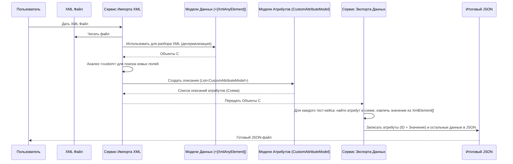

# Chapter 2: Пользовательские Атрибуты


В предыдущей главе, [Модели Данных TestRail XML](01_модели_данных_testrail_xml_.md), мы разобрали, как `TestRailXmlExporter` использует C# модели для понимания структуры стандартных данных в XML-файле из TestRail. Мы также кратко упомянули `[XmlAnyElement]` для обработки нестандартных полей. В этой главе мы подробно остановимся именно на этих нестандартных полях – **Пользовательских Атрибутах**.

## Проблема: Гибкость TestRail и Неизвестные Поля

TestRail – очень гибкий инструмент. Он позволяет вам добавлять **собственные поля** к тест-кейсам. Например, вы можете добавить:

*   Список "Целевой браузер" (`chrome`, `firefox`, `edge`)
*   Текстовое поле "ID Задачи в Jira"
*   Флажок "Автоматизирован"
*   Поле для выбора пользователя "Тестировщик"

Это очень удобно для адаптации TestRail под ваши нужды. Но когда вы экспортируете данные в XML, эти поля тоже попадают в файл! Вот как может выглядеть фрагмент XML для тест-кейса с пользовательскими полями внутри тега `<custom>`:

```xml
<case>
  <title>Проверка входа в систему</title>
  <!-- ... другие стандартные поля ... -->
  <custom>
    <!-- Стандартные поля, как шаги -->
    <steps_separated>
       <step>
         <action>Открыть страницу входа</action>
         <expected>Страница открылась</expected>
       </step>
    </steps_separated>
    <!-- А вот и наши пользовательские поля! -->
    <target_browser> <!-- Имя поля: target_browser -->
        <id>1</id>     <!-- ID опции (если это список) -->
        <value>chrome</value> <!-- Значение: chrome -->
    </target_browser>
    <jira_issue> <!-- Имя поля: jira_issue -->
        ISSUE-123      <!-- Значение: ISSUE-123 (просто текст) -->
    </jira_issue>
    <automated> <!-- Имя поля: automated -->
        true           <!-- Значение: true (флажок) -->
    </automated>
  </custom>
</case>
```

Проблема для нашего `TestRailXmlExporter` в том, что он **заранее не знает**, какие пользовательские поля (`target_browser`, `jira_issue`, `automated`) вы создали в вашем TestRail. Их имена и типы (список, текст, флажок) могут быть любыми!

Как же тогда программе понять структуру этих полей и правильно их обработать?

## Решение: Обнаружение и Моделирование Атрибутов

`TestRailXmlExporter` решает эту проблему в два этапа:

1.  **Обнаружение:** Во время чтения XML-файла, специальный компонент ([Сервис Импорта XML](03_сервис_импорта_xml_.md)) анализирует содержимое тега `<custom>` и находит все неизвестные ему элементы. Он пытается определить их структуру (имя, тип, возможные опции для списков).
2.  **Моделирование:** Информация об обнаруженных пользовательских полях сохраняется в виде структурированных объектов C# с помощью Mоделей Пользовательских Атрибутов.

Давайте рассмотрим эти модели.

### Модели для Описания Структуры Атрибутов

Чтобы описать структуру найденных пользовательских полей, мы используем специальные модели:

*   `CustomAttributeModel`: Описывает сам атрибут – его имя, тип, является ли он обязательным и т.д.
*   `CustomAttributeOptionModel`: Описывает одну опцию для атрибута типа "список" (как `chrome` или `firefox` для `target_browser`).

Посмотрим на упрощенную структуру `CustomAttributeModel`:

```csharp
// --- File: Models\CustomAttributeModel.cs ---
using TestRailXmlExporter.Enums; // Содержит CustomAttributeTypesEnum

namespace TestRailXmlExporter.Models;

// Класс для описания структуры пользовательского атрибута
public record class CustomAttributeModel
{
    // Уникальный ID (генерируется программой)
    public Guid Id { get; set; }

    // Имя атрибута (например, "target_browser", "jira_issue")
    public string Name { get; set; } = null!;

    // Тип атрибута (строка, список, флажок и т.д.)
    // Определяется во время анализа XML
    public CustomAttributeTypesEnum Type { get; set; }

    // Список опций (для атрибутов типа "options", "multipleOptions")
    public List<CustomAttributeOptionModel>? Options { get; set; } = new();

    // Другие свойства: IsEnabled, IsRequired, IsGlobal, IsDeleted...
}
```

*   `Name`: Хранит имя поля, как оно было в XML (например, `target_browser`).
*   `Type`: Хранит тип поля, который определил [Сервис Импорта XML](03_сервис_импорта_xml_.md) (например, `Options`, `String`, `CheckBox`). Использует перечисление `CustomAttributeTypesEnum`.
*   `Options`: Если тип – `Options` (список), здесь будет список объектов `CustomAttributeOptionModel`, описывающих каждый вариант выбора.

А вот структура `CustomAttributeOptionModel`:

```csharp
// --- File: Models\CustomAttributeOptionModel.cs ---
namespace TestRailXmlExporter.Models;

// Класс для описания опции выбора в пользовательском атрибуте-списке
public record class CustomAttributeOptionModel
{
    // Уникальный ID опции (генерируется программой)
    public Guid Id { get; set; }

    // Значение опции (например, "chrome", "firefox")
    public string? Value { get; set; }

    // Является ли эта опция значением по умолчанию
    public bool IsDefault { get; set; }

    // Свойство IsDeleted для управления опцией
    public bool IsDeleted { get; set; }
}
```

Эти модели НЕ используются для чтения XML напрямую (этим занимается `[XmlAnyElement]` в `TestRailsXmlCaseData`, как мы помним из [Главы 1](01_модели_данных_testrail_xml_.md)). Они нужны, чтобы **описать структуру** обнаруженных пользовательских полей для дальнейшей обработки, в основном для [Сервиса Экспорта Данных](04_сервис_экспорта_данных_.md).

**Аналогия:** Представьте, что вы получили анкету (`<custom>` в XML) с дополнительными, неизвестными вам вопросами.
*   Сначала вы **обнаруживаете** эти вопросы (`target_browser`, `jira_issue`).
*   Затем вы создаете **описание** каждого вопроса (`CustomAttributeModel`): "Вопрос 'target_browser' – это выпадающий список (`Options`) с вариантами ('chrome', 'firefox'). Вопрос 'jira_issue' – это текстовое поле (`String`)."

## Как Это Работает: От XML к JSON

Весь процесс обработки пользовательских атрибутов включает два основных сервиса:

1.  **[Сервис Импорта XML](03_сервис_импорта_xml_.md):** Обнаруживает атрибуты и создает их описание (список `CustomAttributeModel`).
2.  **[Сервис Экспорта Данных](04_сервис_экспорта_данных_.md):** Использует это описание и фактические значения из XML для формирования конечного JSON-файла.

### Шаг 1: Обнаружение Структуры (`ImportService`)

Когда `ImportService` читает XML, он не только заполняет стандартные модели данных, но и выполняет специальную логику для поиска пользовательских атрибутов.

```csharp
// --- Упрощенный фрагмент из Services\ImportService.cs ---

// Этот метод анализирует XML, чтобы найти пользовательские атрибуты
private static async Task<List<CustomAttributeModel>> GetCustomAttributesAsync(Stream fileStream)
{
    // Загружаем XML
    var xml = await XDocument.LoadAsync(fileStream, ...);

    // Ищем все элементы внутри <custom>, кроме известных (steps, preconds и т.д.)
    var customAttributesOfTestCases = xml.Descendants("custom")
        .SelectMany(x => x.Elements()) // Берем все дочерние элементы <custom>
        .Where(el => IsKnownElement(el.Name.LocalName) == false) // Фильтруем стандартные
        .GroupBy(el => el.Name.LocalName); // Группируем по имени (target_browser, jira_issue...)

    var attributesScheme = new List<CustomAttributeModel>();

    foreach (var attributeGroup in customAttributesOfTestCases)
    {
        // Определяем тип атрибута (String, Options, CheckBox...)
        // анализируя структуру его XML-элементов
        var attributeType = GetAttributeType(attributeGroup);

        var attributeModel = new CustomAttributeModel
        {
            Name = attributeGroup.Key, // Имя атрибута
            Type = attributeType,      // Определенный тип
            // ... другие свойства ...
        };

        // Если тип - список (Options), извлекаем опции
        if (attributeType == CustomAttributeTypesEnum.Options ||
            attributeType == CustomAttributeTypesEnum.MultipleOptions)
        {
            // Логика извлечения <value> из XML-элементов
            attributeModel.Options = ExtractOptions(attributeGroup);
        }

        attributesScheme.Add(attributeModel); // Добавляем описание атрибута в список
    }
    // ... (логика для других полей, вроде References, Type) ...

    return attributesScheme; // Возвращаем список описаний всех найденных атрибутов
}
```

*   `GetCustomAttributesAsync` читает XML и ищет "неопознанные" теги внутри `<custom>`.
*   Функция `GetAttributeType` (ее код здесь опущен для простоты) смотрит на структуру XML-элементов внутри группы (например, есть ли там `<id>` и `<value>`, или просто текст, или `true`/`false`) и определяет тип: `Options`, `String` или `CheckBox`.
*   Для списков извлекаются все уникальные значения (`ExtractOptions`).
*   В результате метод возвращает `List<CustomAttributeModel>` – полное описание всех пользовательских атрибутов, найденных в XML.

Важно: Сам `XmlSerializer` все еще использует `[XmlAnyElement]` в `TestRailsXmlCaseData` для "захвата" этих пользовательских тегов в виде `XmlElement[]` для *каждого* тест-кейса. Метод `GetCustomAttributesAsync` лишь создает общую "схему" этих атрибутов для всего файла.

### Шаг 2: Формирование Выходных Данных (`ExportService`)

[Сервис Экспорта Данных](04_сервис_экспорта_данных_.md) получает на вход:

1.  Данные из XML, прочитанные с помощью моделей (включая `XmlElement[] CustomAttributes` для каждого кейса).
2.  Список `List<CustomAttributeModel>`, созданный `ImportService` (описание структуры всех пользовательских атрибутов).

Его задача – объединить эту информацию и записать ее в финальный JSON-файл в нужном формате.

```csharp
// --- Упрощенный фрагмент из Services\ExportService.cs ---

// Метод, который обрабатывает данные одного тест-кейса из XML
private List<CaseAttribute> GetTestCaseAttributes(
    TestRailsXmlCase testRailCase, // Данные <case> из XML
    List<Attribute> customAttributesSchema) // Описание атрибутов (уже преобразованное для JSON)
{
    var testCaseAttributes = new List<CaseAttribute>();

    // Берем "сырые" XML-элементы пользовательских полей из этого кейса
    var rawXmlAttributes = testRailCase.Custom?.CustomAttributes; // Это XmlElement[]

    if (rawXmlAttributes != null)
    {
        foreach (var xmlElement in rawXmlAttributes)
        {
            // Находим описание этого атрибута по имени (из схемы)
            var attributeSchema = customAttributesSchema.FirstOrDefault(a => a.Name == xmlElement.Name);
            if (attributeSchema == null) continue; // Пропускаем, если не нашли описание

            // Извлекаем ЗНАЧЕНИЕ атрибута из XML-элемента
            string value = ExtractValueFromXmlElement(xmlElement); // (зависит от типа)

            // Создаем объект для JSON, связывая ID атрибута из схемы и его значение
            testCaseAttributes.Add(new CaseAttribute()
            {
                Id = attributeSchema.Id, // ID из описания атрибута
                Value = value             // Извлеченное значение
            });
        }
    }
    // ... (добавляем стандартные поля TestRail, которые тоже считаем атрибутами, вроде Type, References) ...

    // Сортируем для единообразия
    testCaseAttributes.Sort(...);

    return testCaseAttributes; // Возвращаем список атрибутов {ID, Значение} для этого тест-кейса
}
```

*   `GetTestCaseAttributes` работает для одного конкретного `TestRailsXmlCase`.
*   Он берет `XmlElement[] CustomAttributes`, ранее захваченные `[XmlAnyElement]`.
*   Для каждого `XmlElement` (например, `<target_browser>...</target_browser>`) он:
    *   Находит соответствующее описание (`Attribute` – это версия `CustomAttributeModel`, подготовленная для JSON) в `customAttributesSchema` по имени (`target_browser`).
    *   Извлекает фактическое значение (`chrome`) из `XmlElement`.
    *   Создает объект `CaseAttribute`, который хранит `Id` атрибута (из схемы) и его `Value` (из XML).
*   Эти объекты `CaseAttribute` затем используются при формировании JSON-файла для каждого тест-кейса.

### Общая Картина



Этот двухэтапный процесс (обнаружение схемы -> комбинирование схемы и значений при экспорте) позволяет `TestRailXmlExporter` гибко работать с любыми пользовательскими полями, которые вы могли определить в TestRail.

## Заключение

В этой главе мы узнали, как `TestRailXmlExporter` справляется с пользовательскими полями TestRail:

*   **Пользовательские атрибуты** – это дополнительные поля (текст, списки, флажки и т.д.), созданные пользователем в TestRail.
*   В XML-экспорте они появляются как неизвестные теги внутри элемента `<custom>`.
*   **[Сервис Импорта XML](03_сервис_импорта_xml_.md)** обнаруживает эти поля, определяет их тип и создает их **описание** с помощью моделей `CustomAttributeModel` и `CustomAttributeOptionModel`.
*   **[Сервис Экспорта Данных](04_сервис_экспорта_данных_.md)** использует это описание вместе с фактическими значениями атрибутов (полученными через `[XmlAnyElement]` из [Главы 1](01_модели_данных_testrail_xml_.md)) для формирования корректного представления пользовательских данных в итоговом JSON-файле.

Теперь, когда мы понимаем, как устроены модели данных и как обрабатываются пользовательские поля, мы готовы погрузиться в детали процесса чтения XML.

В следующей главе, **[Сервис Импорта XML](03_сервис_импорта_xml_.md)**, мы подробно рассмотрим, как именно происходит загрузка и разбор XML-файла с использованием наших моделей данных.

---

Generated by [AI Codebase Knowledge Builder](https://github.com/The-Pocket/Tutorial-Codebase-Knowledge)