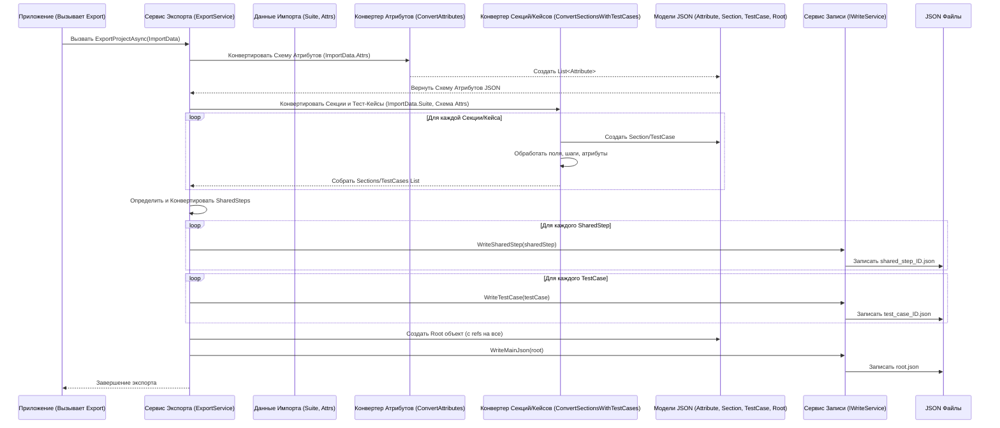

# Chapter 4: Сервис Экспорта Данных


В предыдущей главе, [Сервис Импорта XML](03_сервис_импорта_xml_.md), мы разобрались, как `TestRailXmlExporter` читает XML-файл и превращает его содержимое в удобные для работы C# объекты (`TestRailsXmlSuite`) и описания пользовательских полей (`List<CustomAttributeModel>`). Теперь у нас есть "сырье" – данные в понятном для программы виде.

Но что дальше? Часто бывает так, что эти данные нужно передать другому инструменту или системе, которая ожидает их в совершенно другом формате. Например, наша цель – подготовить данные для миграции в другую систему управления тестами, и она понимает только формат **JSON**.

Именно здесь на сцену выходит **Сервис Экспорта Данных (`ExportService`)**.

## Зачем Нужен Сервис Экспорта?

Представьте, что [Сервис Импорта XML](03_сервис_импорта_xml_.md) – это исследователь, который принес вам из экспедиции (из XML-файла) коллекцию артефактов (C# объекты `TestRailsXmlSuite` и т.д.). Эти артефакты понятны вам (программе), но чтобы выставить их в музее (передать другой системе), их нужно подготовить: почистить, снабдить этикетками и разложить по витринам в определенном порядке (преобразовать в формат JSON).

**Сервис Экспорта Данных** – это как **редактор-издатель**. Он берет "рукопись", подготовленную автором-исследователем (структурированные C# объекты от `ImportService`), и превращает ее в готовую "книгу" (финальные JSON-файлы), которую смогут прочитать читатели (следующий инструмент в цепочке миграции).

Его главная задача – взять внутренние C# объекты (`TestRailsXmlSuite`, `TestRailsXmlSection`, `TestRailsXmlCase`, `List<CustomAttributeModel>`) и **преобразовать (трансформировать)** их в структуру JSON, которая требуется для следующего шага.

## Что Делает Сервис Экспорта?

Основные задачи `ExportService`:

1.  **Прием Данных:** Получает на вход два ключевых элемента, подготовленных [Сервисом Импорта XML](03_сервис_импорта_xml_.md):
    *   Объект `TestRailsXmlSuite`, содержащий иерархию секций и тест-кейсов.
    *   Список `List<CustomAttributeModel>`, описывающий структуру всех пользовательских атрибутов.
2.  **Трансформация Атрибутов:** Преобразует `List<CustomAttributeModel>` (описание атрибутов из XML) в формат, нужный для JSON (список объектов `Attribute` из целевых JSON-моделей).
3.  **Трансформация Секций и Тест-кейсов:** Рекурсивно обходит все секции и тест-кейсы в `TestRailsXmlSuite`. Для каждого элемента:
    *   Создает соответствующий объект для JSON (`Section`, `TestCase`).
    *   Копирует и адаптирует стандартные поля (название, описание, шаги, приоритет и т.д.).
    *   **Сопоставляет Пользовательские Атрибуты:** Для каждого тест-кейса находит его пользовательские атрибуты (которые хранятся как `XmlElement[]` в `TestRailsXmlCase.Custom.CustomAttributes`) и, используя общую схему атрибутов (преобразованную на шаге 2), извлекает *значения* и записывает их в JSON-объект тест-кейса в формате `{ Id_атрибута, Значение }`.
    *   Форматирует шаги, извлекает предусловия и т.д.
    *   Может выполнять сложную логику, например, определять, какие тест-кейсы являются "Общими Шагами" (Shared Steps) в целевой системе, и готовить их соответствующим образом.
4.  **Генерация Итоговой Структуры:** Собирает все преобразованные атрибуты, секции, тест-кейсы и общие шаги в один корневой JSON-объект (`Root`).
5.  **Запись Файлов:** Использует вспомогательный сервис (`IWriteService` из проекта `JsonWriter`) для записи преобразованных данных в несколько JSON-файлов (один основной `root.json` и отдельные файлы для каждого тест-кейса и общего шага).

**Аналогия:** Издатель (ExportService):
*   Берет рукопись (`TestRailsXmlSuite`) и заметки о терминах (`List<CustomAttributeModel>`).
*   Редактирует термины (`ConvertAttributes`).
*   Перебирает главы и параграфы (`ConvertSectionsWithTestCases`), форматирует текст (шаги, описание), добавляет сноски (пользовательские атрибуты, связывая термин с его значением в тексте).
*   Определяет, какие части текста станут отдельными приложениями (Shared Steps).
*   Составляет оглавление (`Root` object).
*   Отправляет всё в типографию (`IWriteService`) для печати книги (JSON-файлов).

## Как Использовать Сервис Экспорта?

Обычно `ExportService` вызывается после того, как `ImportService` успешно прочитал и подготовил данные.

```csharp
// --- Пример вызова ExportService (упрощенно) ---
using TestRailXmlExporter.Services;
using TestRailXmlExporter.Models;
using JsonWriter; // Нужен для IWriteService
using Microsoft.Extensions.Logging; // Для логгера (запись сообщений о процессе)

// --- Предположим, эти данные мы получили от ImportService ---
TestRailsXmlSuite importedSuiteData = GetSuiteDataFromImport(); // Фиктивная функция
List<CustomAttributeModel> importedAttributesSchema = GetAttributesFromImport(); // Фиктивная функция
// ----------------------------------------------------------

// Нам нужен сервис для записи JSON файлов (IWriteService).
// Обычно он создается через систему зависимостей.
IWriteService writeService = new JsonWriteService("./output"); // Указываем папку для JSON

// Нам также нужен логгер для вывода сообщений.
// Обычно он тоже создается через систему зависимостей.
ILogger<ExportService> logger = CreateLogger(); // Фиктивная функция

// Создаем сам Сервис Экспорта, передавая ему логгер и сервис записи
var exportService = new ExportService(logger, writeService);

// Вызываем главный метод экспорта, передавая ему данные от импорта
await exportService.ExportProjectAsync(importedSuiteData, importedAttributesSchema);

Console.WriteLine("Экспорт завершен! JSON-файлы созданы в папке ./output.");

// Фиктивные функции для примера
TestRailsXmlSuite GetSuiteDataFromImport() { return new TestRailsXmlSuite(); /* ... с данными ... */ }
List<CustomAttributeModel> GetAttributesFromImport() { return new List<CustomAttributeModel>(); /* ... с данными ... */ }
ILogger<ExportService> CreateLogger() { /* ... код создания логгера ... */ return null!; }
```

**Что происходит:**

1.  Мы получаем `importedSuiteData` и `importedAttributesSchema` от [Сервиса Импорта XML](03_сервис_импорта_xml_.md).
2.  Мы создаем `ExportService`, передавая ему зависимости: `logger` (для записи сообщений) и `writeService` (для записи JSON-файлов в папку `./output`).
3.  Вызываем `exportService.ExportProjectAsync()`, передавая данные для обработки.
4.  **Результат:** Сервис выполнит всю работу по трансформации и записи. В папке `./output` появятся JSON-файлы, содержащие информацию о проекте, атрибутах, секциях, тест-кейсах и общих шагах в нужном формате.

## Как Это Работает "Под Капотом"?

Давайте рассмотрим шаги, которые выполняет `ExportService` внутри метода `ExportProjectAsync`.

**Пошаговый Процесс:**

1.  **Прием Данных:** Метод получает `TestRailsXmlSuite` и `List<CustomAttributeModel>`.
2.  **Конвертация Схемы Атрибутов:** Вызывается внутренний метод `ConvertAttributes`. Он перебирает `List<CustomAttributeModel>` и создает новый список `List<Attribute>` (где `Attribute` – это модель для JSON). Он также генерирует уникальные ID (`Guid`) для атрибутов, если их еще нет.
3.  **Рекурсивная Конвертация Секций и Кейсов:** Вызывается метод `ConvertSectionsWithTestCases`. Он работает рекурсивно:
    *   Для каждой секции из `TestRailsXmlSuite.Sections` создается JSON-объект `Section`.
    *   Если в секции есть вложенные секции, метод вызывает сам себя для них.
    *   Если в секции есть тест-кейсы (`TestRailsXmlCase`), он перебирает их:
        *   Для каждого `TestRailsXmlCase` создается JSON-объект `TestCase`.
        *   Стандартные поля (Title -> Name, Estimate -> Duration и т.д.) копируются и преобразуются.
        *   Шаги (`Steps`) конвертируются с помощью `ConvertSteps`.
        *   Предусловия (`Preconditions`) извлекаются с помощью `ExtractPreconditions`.
        *   **Пользовательские Атрибуты:** Вызывается `GetTestCaseAttributes`. Этот хитрей метод получает список `XmlElement[]` из `testRailCase.Custom.CustomAttributes`. Для каждого `XmlElement` он:
            *   Находит соответствующий `Attribute` в сконвертированной схеме (из шага 2) по имени тега XML.
            *   Извлекает **значение** из `XmlElement` (например, текст внутри тега или значение вложенного тега `<value>`).
            *   Создает объект `CaseAttribute` для JSON, содержащий `Id` атрибута (из схемы) и его извлеченное `Value`.
        *   Созданный `TestCase` добавляется во внутренний список `_testCasesData`.
    *   Созданные `Section` добавляются во внутренний список `_sectionsData` (для корневых секций) или возвращаются рекурсивно.
4.  **Обработка Общих Шагов (Shared Steps):** Сервис определяет, какие `TestCase` должны быть представлены как `SharedStep` в итоговом JSON (логика использует поле `SharedStepId` внутри шагов). Для каждого такого ID он находит соответствующий `TestCase`, конвертирует его в `SharedStep` с помощью `ConvertTestCaseToSharedStep` и записывает с помощью `_writeService.WriteSharedStep`.
5.  **Запись Тест-кейсов:** Сервис перебирает все собранные `TestCase` в `_testCasesData` и записывает каждый в отдельный JSON-файл с помощью `_writeService.WriteTestCase`.
6.  **Создание и Запись Корневого Файла:** Сервис создает объект `Root`, который содержит имя проекта, список всех атрибутов (`List<Attribute>`), иерархию секций (`_sectionsData`), список ID общих шагов и список ID всех тест-кейсов. Затем этот `Root` объект записывается в главный файл `root.json` с помощью `_writeService.WriteMainJson`.

**Диаграмма Последовательности:**



### Погружение в Код

Давайте посмотрим на некоторые упрощенные фрагменты кода `ExportService`.

**Основной метод `ExportProjectAsync`:**

```csharp
// --- Файл: Services\ExportService.cs ---
using JsonWriter;
using Models;
using TestRailXmlExporter.Models;
// ...

public class ExportService
{
    private readonly List<Section> _sectionsData = new(); // Хранилище для корневых секций JSON
    private readonly List<Guid> _sharedStepsIds = new();  // Хранилище ID общих шагов
    private readonly List<TestCase> _testCasesData = new(); // Хранилище всех тест-кейсов JSON

    private readonly ILogger<ExportService> _logger;
    private readonly IWriteService _writeService; // Сервис для записи файлов

    public ExportService(ILogger<ExportService> logger, IWriteService writeService)
    {
        _logger = logger;
        _writeService = writeService;
    }

    public async Task ExportProjectAsync(TestRailsXmlSuite testRailsXmlSuite, List<CustomAttributeModel> customAttributes)
    {
        _logger.LogInformation("Начало экспорта проекта");

        // 1. Конвертируем схему атрибутов
        var attributeData = ConvertAttributes(customAttributes).Distinct().ToList();

        // 2. Конвертируем секции и кейсы (рекурсивно)
        // Результаты сохраняются в _sectionsData и _testCasesData
        ConvertSectionsWithTestCases(testRailsXmlSuite.Sections, attributeData, testRailsXmlSuite.Name);

        // 3. Обрабатываем и записываем Общие шаги
        foreach (var sharedStepId in _sharedStepsIds)
        {
            var testCase = _testCasesData.FirstOrDefault(tc => tc.Id == sharedStepId);
            var sharedStep = ConvertTestCaseToSharedStep(testCase); // Конвертируем TestCase в SharedStep
            if (sharedStep != null)
            {
                await _writeService.WriteSharedStep(sharedStep); // Записываем файл
            }
        }

        // 4. Записываем Тест-кейсы
        foreach (var testCase in _testCasesData)
        {
            await _writeService.WriteTestCase(testCase); // Записываем файл
        }

        // 5. Создаем корневой объект
        var root = new Root
        {
            ProjectName = testRailsXmlSuite.Name ?? string.Empty,
            Attributes = attributeData.OrderBy(a => a.Name).ToList(),
            Sections = _sectionsData, // Корневые секции
            SharedSteps = _sharedStepsIds, // Список ID
            TestCases = _testCasesData.Select(tc => tc.Id).ToList() // Список ID
        };

        // 6. Записываем корневой файл
        await _writeService.WriteMainJson(root);

        _logger.LogInformation("Экспорт завершен");
    }

    // ... другие методы ...
}
```

Этот код показывает общую структуру: вызов конвертеров, затем циклы записи файлов с помощью `_writeService`, и в конце создание и запись `root.json`.

**Конвертация Атрибутов (`ConvertAttributes`):**

```csharp
// --- Файл: Services\ExportService.cs ---
using Models; // Содержит модели JSON: Attribute, AttributeType
using TestRailXmlExporter.Models; // Содержит CustomAttributeModel

private static List<Attribute> ConvertAttributes(IEnumerable<CustomAttributeModel> customAttributes)
{
    // Используем LINQ Select для преобразования каждого CustomAttributeModel в Attribute
    var attributes = customAttributes.Select(customAttribute =>
    {
        var attribute = new Attribute // Создаем JSON-модель Атрибута
        {
            // Генерируем новый Guid ID, если он не был задан при импорте
            Id = customAttribute.Id == Guid.Empty ? Guid.NewGuid() : customAttribute.Id,
            Name = customAttribute.Name, // Копируем имя
             // Преобразуем тип из перечисления импорта в перечисление JSON
            Type = (AttributeType)customAttribute.Type,
            IsRequired = customAttribute.IsRequired, // Копируем флаг обязательности
            IsActive = !customAttribute.IsDeleted, // Инвертируем флаг удаления
            // Преобразуем опции списка (если они есть)
            Options = customAttribute.Options?.Select(option => option.Value ?? string.Empty).ToList()
                        ?? new List<string>() // Или пустой список, если опций нет
        };
        return attribute;
    });

    return attributes.ToList(); // Возвращаем список готовых JSON-атрибутов
}
```

Этот метод просто перекладывает данные из `CustomAttributeModel` в `Attribute`, выполняя необходимые преобразования типов и генерируя ID.

**Получение Атрибутов Тест-Кейса (`GetTestCaseAttributes`):**

Это один из самых важных методов, связывающий схему атрибутов со значениями для конкретного кейса.

```csharp
// --- Файл: Services\ExportService.cs ---
using System.Xml.Linq; // Для работы с XML через XElement
using Models; // Модели JSON (Attribute, CaseAttribute)
using TestRailXmlExporter.Models; // Модели XML (TestRailsXmlCase, TestRailsXmlCaseData)

// Получает XML-представление кейса и общую схему атрибутов
private static List<CaseAttribute> GetTestCaseAttributes(
    TestRailsXmlCase testRailCase, // Данные из XML для одного <case>
    List<Attribute> customAttributesSchema) // Сконвертированная схема атрибутов JSON
{
    // Список для хранения атрибутов этого кейса в формате {Id, Value} для JSON
    var testCaseAttributes = new List<CaseAttribute>();

    // 1. Обрабатываем пользовательские атрибуты из <custom>
    // testRailCase.Custom.CustomAttributes - это XmlElement[] - "сырые" XML-элементы
    var rawXmlAttributes = testRailCase.Custom?.CustomAttributes;

    if (rawXmlAttributes != null)
    {
        foreach (var xmlElement in rawXmlAttributes) // Перебираем <target_browser>, <jira_issue>...
        {
            // Ищем описание этого атрибута в общей схеме по имени XML-тега
            var attributeSchema = customAttributesSchema.FirstOrDefault(a => a.Name == xmlElement.Name); // например, ищем "target_browser" в схеме
            if (attributeSchema == null) continue; // Если не нашли, пропускаем

            // Извлекаем ЗНАЧЕНИЕ атрибута из XML-элемента.
            // Используем XElement для парсинга XML строки элемента.
            // Пытаемся найти вложенный тег '<value>'; если его нет, берем просто текст элемента.
            // (Упрощенная логика, реальная может быть сложнее)
            string value = XElement.Parse(xmlElement.OuterXml) // Парсим строку <tag>...</tag>
                                ?.Element("value")?.Value     // Ищем <value> внутри и берем его текст
                                ?? xmlElement.InnerText;      // Или берем весь внутренний текст <tag>

            // Создаем объект для JSON, связывая ID атрибута из схемы и его значение
            testCaseAttributes.Add(new CaseAttribute()
            {
                Id = attributeSchema.Id, // ID атрибута из схемы
                Value = value             // Извлеченное значение
            });
        }
    }

    // 2. Обрабатываем стандартные поля TestRail, которые мы тоже считаем "атрибутами"
    // (Например, поля References, Type, которые в XML не внутри <custom>)
    // ... (похожая логика: ищем атрибут в схеме по имени поля, берем значение из testRailCase) ...

    // 3. Сортируем атрибуты по имени для единообразия вывода
    testCaseAttributes.Sort(/* ... логика сортировки по имени из схемы ... */);

    return testCaseAttributes; // Возвращаем список атрибутов {ID, Значение} для этого кейса
}
```

Этот метод демонстрирует ключевой момент: как `ExportService` использует схему атрибутов (полученную из `List<CustomAttributeModel>`) и "сырые" XML-данные пользовательских полей (`XmlElement[]`) из каждого тест-кейса, чтобы правильно сопоставить ID атрибута с его конкретным значением для этого кейса и подготовить их для JSON. Извлечение значения (`Value`) показано упрощенно с использованием `XElement`.

## Заключение

В этой главе мы изучили **Сервис Экспорта Данных (`ExportService`)**. Мы узнали, что:

*   Он является "издателем", который берет структурированные данные от [Сервиса Импорта XML](03_сервис_импорта_xml_.md) и преобразует их в финальный формат JSON.
*   Он выполняет **трансформацию** данных: переводит C# модели импорта в C# модели, соответствующие структуре JSON.
*   Он корректно обрабатывает как **стандартные поля** TestRail, так и **пользовательские атрибуты**, связывая общую схему атрибутов с конкретными значениями для каждого тест-кейса.
*   Он может выполнять дополнительную логику, например, выделять **Общие Шаги** (Shared Steps).
*   Для записи итоговых JSON-файлов он использует **вспомогательный сервис** (`IWriteService`).
*   Результатом его работы является набор JSON-файлов, готовых для использования следующей системой в процессе миграции.

Теперь, когда мы понимаем, как данные импортируются и экспортируются, возникает вопрос: а как настроить весь этот процесс? Например, где указать путь к входному XML-файлу или папку для выходных JSON-файлов?

Об этом мы поговорим в следующей главе: [Управление Конфигурацией](05_управление_конфигурацией_.md).

---

Generated by [AI Codebase Knowledge Builder](https://github.com/The-Pocket/Tutorial-Codebase-Knowledge)