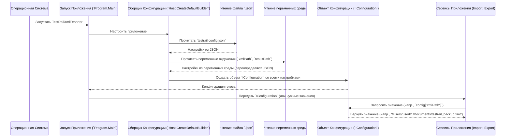

# Chapter 5: Управление Конфигурацией


В предыдущей главе, [Сервис Экспорта Данных](04_сервис_экспорта_данных_.md), мы увидели, как `TestRailXmlExporter` берет импортированные данные и преобразует их в конечные JSON-файлы. Мы получили результат, готовый для следующего шага. Но подождите... как программа вообще узнала, какой XML-файл нужно было прочитать? И куда именно она должна была сохранить итоговые JSON-файлы?

Представьте, что вы запускаете приложение-конвертер. Без каких-либо настроек оно просто не будет знать, с какими файлами работать. Ему нужны указания! Вот тут-то и вступает в игру **Управление Конфигурацией**.

## Зачем Нужно Управлять Конфигурацией?

Конфигурация – это набор настроек, который сообщает приложению, *как* ему работать. В нашем случае, `TestRailXmlExporter` должен знать как минимум две важные вещи:

1.  **Где взять исходный файл?** (`xmlPath`) – Путь к XML-файлу, который мы выгрузили из TestRail.
2.  **Куда положить результат?** (`resultPath`) – Путь к папке, где будут сохранены созданные JSON-файлы.

Без этих настроек программа была бы как навигатор без заданного маршрута – она бы просто не смогла начать работу.

**Аналогия:** Управление конфигурацией – это как **панель настроек в вашем телефоне**. Прежде чем начать пользоваться новым телефоном, вы обычно заходите в настройки и указываете язык, подключаетесь к Wi-Fi, настраиваете громкость. Точно так же `TestRailXmlExporter` нуждается в настройках, чтобы знать основные "правила игры" – откуда брать данные и куда складывать результат.

## Откуда Берутся Настройки?

`TestRailXmlExporter` получает свои настройки из двух основных источников при запуске:

1.  **Файл `testrail.config.json`:** Это специальный текстовый файл в формате JSON, который лежит рядом с исполняемым файлом приложения. В нем вы можете явно указать нужные пути. Это основной и самый простой способ настройки.
2.  **Переменные Окружения (Environment Variables):** Это настройки, которые можно задать на уровне операционной системы. Они могут переопределять значения из файла `testrail.config.json`, что полезно для автоматизации или запуска в разных средах (например, на сервере сборки).

### Файл `testrail.config.json`

Это самый удобный способ для большинства пользователей. Просто создайте или отредактируйте файл `testrail.config.json` в той же папке, где находится `TestRailXmlExporter`.

Вот так он выглядит:

```json
// --- Файл: testrail.config.json ---
{
  "resultPath": "/Users/user01/Documents/tms-migration/output_json",
  "xmlPath": "/Users/user01/Documents/testrail_backup.xml"
}
```

**Что здесь важно:**

*   `resultPath`: Указывает путь к папке, куда будут сохранены JSON-файлы. **Убедитесь, что эта папка существует!** Программа не создаст ее сама. В примере это папка `/Users/user01/Documents/tms-migration/output_json`.
*   `xmlPath`: Указывает полный путь к вашему XML-файлу, экспортированному из TestRail. В примере это файл `/Users/user01/Documents/testrail_backup.xml`.

**Важно:** Указывайте пути в формате, который понятен вашей операционной системе (Windows, macOS, Linux). Используйте `/` или `\` в зависимости от вашей системы.

### Переменные Окружения

Это более продвинутый способ. Вы можете задать те же самые настройки через переменные окружения вашей системы. Имена переменных должны совпадать с именами в JSON-файле (`resultPath` и `xmlPath`).

Например, в Linux или macOS это можно сделать так перед запуском:

```bash
export resultPath="/server/ci/output"
export xmlPath="/server/build/data.xml"
./TestRailXmlExporter
```

В Windows:

```cmd
set resultPath="C:\CI\Output"
set xmlPath="C:\Build\data.xml"
.\TestRailXmlExporter.exe
```

**Приоритет:** Если настройка указана и в `testrail.config.json`, и в переменных окружения, то **значение из переменной окружения будет иметь приоритет**. Это позволяет легко переопределять стандартные пути для специфических запусков.

## Как Это Используется?

Вам не нужно делать ничего особенного в коде, чтобы конфигурация заработала. Когда вы запускаете `TestRailXmlExporter` (как показано в README или примере выше с переменными окружения), он *автоматически* при старте ищет файл `testrail.config.json` и читает переменные окружения.

Эти прочитанные значения (пути `xmlPath` и `resultPath`) затем используются внутри программы:
*   `xmlPath` передается в [Сервис Импорта XML](03_сервис_импорта_xml_.md), чтобы он знал, какой файл читать (`ImportXmlAsync(xmlPath)`).
*   `resultPath` передается в сервис записи `JsonWriter` (который использует [Сервис Экспорта Данных](04_сервис_экспорта_данных_.md)), чтобы он знал, куда сохранять JSON-файлы (`new JsonWriteService(resultPath)`).

## Как Это Работает "Под Капотом"?

Когда приложение запускается, происходит стандартный для .NET приложений процесс загрузки конфигурации. За это отвечает система `Microsoft.Extensions.Configuration`.

Вот упрощенная последовательность действий:



1.  **Запуск:** Вы запускаете приложение.
2.  **Сборка Конфигурации:** Код в `Program.cs` использует `Host.CreateDefaultBuilder()` и `ConfigurationBuilder`, чтобы настроить источники конфигурации.
3.  **Чтение `testrail.config.json`:** Система автоматически ищет файл `testrail.config.json` в текущей директории и загружает из него настройки.
4.  **Чтение Переменных Окружения:** Затем система считывает переменные окружения. Если там есть переменные с такими же именами (`xmlPath`, `resultPath`), их значения заменят те, что были прочитаны из JSON-файла.
5.  **Создание `IConfiguration`:** Все прочитанные настройки собираются в единый объект `IConfiguration`.
6.  **Использование:** Этот объект `IConfiguration` становится доступен различным частям приложения (сервисам, основному классу `App`). Когда какому-то сервису нужен путь к XML, он обращается к `IConfiguration` и запрашивает значение по ключу `"xmlPath"`.

### Взгляд на Код (`Program.cs`)

Файл `Program.cs` содержит код, который настраивает чтение конфигурации.

```csharp
// --- Файл: Program.cs ---
using Microsoft.Extensions.Configuration;
using Microsoft.Extensions.Hosting;
// ... другие using ...

internal class Program
{
    // ... (Метод Main, который запускает CreateHostBuilder) ...

    private static IHostBuilder CreateHostBuilder()
    {
        // ... (Настройка логирования Serilog) ...
        return Host.CreateDefaultBuilder() // Используем стандартный построитель хоста
            // ... (Настройка Serilog) ...
            .ConfigureServices((_, services) => // Настройка сервисов
            {
                services.AddScoped<App>(); // Добавляем основной класс приложения
                // !!! Вот здесь добавляется конфигурация в сервисы !!!
                services.AddSingleton(SetupConfiguration());
                // ... (Регистрация ImportService, ExportService, XmlSerializer, IWriteService) ...
            });
    }

    // Этот метод создает объект конфигурации IConfiguration
    private static IConfiguration SetupConfiguration()
    {
        return new ConfigurationBuilder() // Создаем построитель конфигурации
            .SetBasePath(Directory.GetCurrentDirectory()) // Искать файлы в текущей папке
            .AddJsonFile("testrail.config.json") // !!! Читать из testrail.config.json !!!
            .AddEnvironmentVariables() // !!! Читать из переменных окружения !!!
            .Build(); // Построить объект IConfiguration
    }
}
```

**Ключевые моменты:**

*   `SetupConfiguration()`: Этот метод отвечает за создание объекта `IConfiguration`.
*   `.AddJsonFile("testrail.config.json")`: Эта строка говорит системе конфигурации прочитать настройки из указанного JSON-файла.
*   `.AddEnvironmentVariables()`: Эта строка говорит системе прочитать настройки из переменных окружения (и они переопределят значения из JSON, если имена совпадают).
*   `services.AddSingleton(SetupConfiguration())`: Эта строка делает созданный объект `IConfiguration` доступным для других частей приложения через механизм внедрения зависимостей (DI).

Затем, например, в классе `App` (который координирует работу, см. [следующую главу](06_оркестрация_приложения_.md)), можно получить доступ к этим настройкам:

```csharp
// --- Упрощенный пример использования в классе App ---
using Microsoft.Extensions.Configuration;
// ...

public class App
{
    private readonly IConfiguration _configuration;
    private readonly ImportService _importService;
    // ... другие сервисы ...

    // Конфигурация "внедряется" через конструктор
    public App(IConfiguration configuration, ImportService importService /*...*/)
    {
        _configuration = configuration;
        _importService = importService;
        // ...
    }

    public async Task RunAsync()
    {
        // Получаем пути из конфигурации
        string? xmlFilePath = _configuration["xmlPath"];
        string? resultFolderPath = _configuration["resultPath"];

        // Проверяем, что пути заданы
        if (string.IsNullOrEmpty(xmlFilePath) || string.IsNullOrEmpty(resultFolderPath))
        {
            Console.Error.WriteLine("Ошибка: Пути xmlPath или resultPath не заданы в конфигурации!");
            return;
        }

        // Используем пути при вызове сервисов
        var (suiteData, attributes) = await _importService.ImportXmlAsync(xmlFilePath);
        // ... (дальнейшая логика с ExportService, используя resultFolderPath) ...
    }
}
```

Этот пример показывает, как класс `App` получает объект `_configuration` и использует его для извлечения путей `xmlPath` и `resultPath`, которые затем используются для запуска процессов импорта и экспорта.

## Заключение

В этой главе мы узнали об **Управлении Конфигурацией** в `TestRailXmlExporter`. Мы поняли, что:

*   Конфигурация необходима, чтобы сообщить приложению **где** взять исходный XML-файл (`xmlPath`) и **куда** положить итоговые JSON-файлы (`resultPath`).
*   Настройки можно задать в файле **`testrail.config.json`** или через **переменные окружения**, причем последние имеют приоритет.
*   Приложение автоматически читает эти настройки при старте с помощью стандартной системы конфигурации .NET (`IConfiguration`).
*   Эти настройки затем используются сервисами импорта и экспорта для выполнения своих задач.

Теперь, когда мы разобрались с моделями данных ([Глава 1](01_модели_данных_testrail_xml_.md)), обработкой пользовательских полей ([Глава 2](02_пользовательские_атрибуты_.md)), сервисами импорта ([Глава 3](03_сервис_импорта_xml_.md)) и экспорта ([Глава 4](04_сервис_экспорта_данных_.md)), а также с конфигурацией, мы готовы посмотреть, как все эти части собираются вместе и работают как единое целое.

В следующей, заключительной главе, [Оркестрация Приложения](06_оркестрация_приложения_.md), мы увидим, как главный класс приложения (`App`) управляет всем процессом от начала до конца.

---

Generated by [AI Codebase Knowledge Builder](https://github.com/The-Pocket/Tutorial-Codebase-Knowledge)