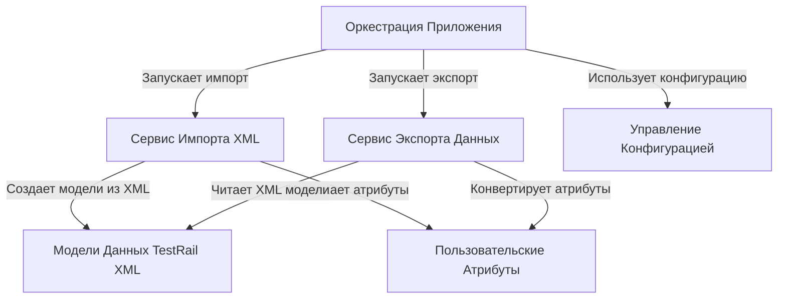

# Tutorial: TestRailXmlExporter

Этот инструмент **конвертирует** *экспорт тестов* из TestRail в формате XML в файлы формата JSON.
Главная задача - подготовить данные, включая *пользовательские поля*, для последующей миграции в другую систему управления тестированием.

## Chapters

1. [Модели Данных TestRail XML
](01_модели_данных_testrail_xml_.md)
2. [Пользовательские Атрибуты
](02_пользовательские_атрибуты_.md)
3. [Сервис Импорта XML
](03_сервис_импорта_xml_.md)
4. [Сервис Экспорта Данных
](04_сервис_экспорта_данных_.md)
5. [Управление Конфигурацией
](05_управление_конфигурацией_.md)
6. [Оркестрация Приложения
](06_оркестрация_приложения_.md)

---

Generated by [AI Codebase Knowledge Builder](https://github.com/The-Pocket/Tutorial-Codebase-Knowledge)