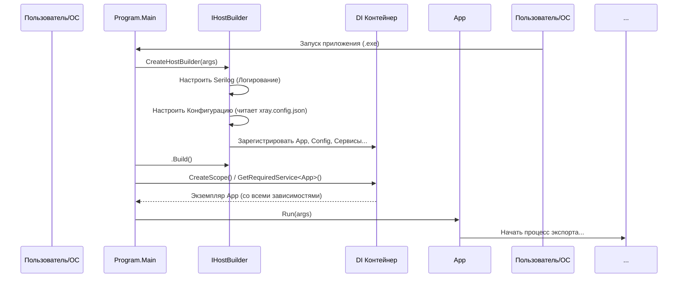

# Chapter 1: Точка Входа и Конфигурация


Добро пожаловать в руководство по `XRayExporter`! В этой первой главе мы разберемся с самым началом работы нашего приложения – его **точкой входа** и процессом **начальной настройки (конфигурации)**.

Представьте себе дирижера перед большим оркестром. Прежде чем заиграет музыка, дирижер должен убедиться, что все музыканты на своих местах, инструменты настроены, а ноты разложены. Точно так же и наше приложение `XRayExporter` нуждается в начальной подготовке перед тем, как начать свою основную работу – экспорт данных из XRay.

Компонент, который мы сегодня изучаем, действует как этот дирижер (или как диспетчер на вокзале из нашего описания): он собирает все необходимые части приложения вместе, загружает настройки, включает систему "записи событий" (логирование) и дает команду "старт!".

## Зачем нужна точка входа и конфигурация?

Любая программа должна с чего-то начинаться. Точка входа – это как дверь, через которую мы входим в дом. В нашем случае это специальный метод `Main` в файле `Program.cs`.

Но просто войти недостаточно. Нужно включить свет, проверить, есть ли вода в кране, узнать адрес дома. Вот для этого и нужна конфигурация:

*   **Сборка "команды":** Приложение состоит из разных модулей (сервисов), каждый отвечает за свою задачу (например, один общается с XRay, другой преобразует данные). Точка входа "знакомит" их друг с другом и готовит к работе. Этот процесс называется **Внедрение зависимостей (Dependency Injection или DI)**. Мы не будем глубоко погружаться в DI, просто знайте, что это способ организовать совместную работу разных частей программы.
*   **Чтение настроек:** Откуда приложению знать, к какому серверу XRay подключаться? Какой проект экспортировать? Эти параметры хранятся в отдельном файле `xray.config.json`. Точка входа отвечает за чтение этого файла.
*   **Настройка "журнала событий":** Во время работы могут происходить разные события – ошибки, успешные операции, предупреждения. Чтобы понимать, что происходит "под капотом", приложение ведет журнал (логи). Точка входа настраивает, куда и как записывать эти события (в файл на диске и/или выводить на экран). Этот процесс называется **Логирование (Logging)**.

## Как это работает: Запуск приложения

Когда вы запускаете `XRayExporter` (например, из командной строки), операционная система и среда .NET ищут специальный метод `Main` – это и есть наша точка входа.

```csharp
// File: Program.cs
internal class Program
{
    static void Main(string[] args) // <-- Вот она, точка входа!
    {
        // 1. Создаем и настраиваем "хост" приложения
        using var host = CreateHostBuilder(args).Build();
        // 2. Создаем "область видимости" для сервисов
        using var scope = host.Services.CreateScope();

        // 3. Получаем главный сервис приложения
        var services = scope.ServiceProvider;
        try
        {
            // 4. Запускаем основную логику
            services.GetRequiredService<App>().Run(args);
        }
        catch (Exception e)
        {
            // Если что-то пошло не так, выводим ошибку
            Console.WriteLine(e.Message);
        }
    }

    // ... (остальной код ниже)
}
```

**Объяснение:**

1.  `Main` – это самый первый метод, который выполняется при запуске.
2.  `CreateHostBuilder(args).Build()` – здесь происходит вся магия! Вызывается другой метод (`CreateHostBuilder`), который настраивает всё: конфигурацию, логирование, сервисы. `.Build()` "собирает" настроенное приложение.
3.  `host.Services.CreateScope()` и `scope.ServiceProvider` – это шаги для получения доступа к "службам" (сервисам), которые мы настроили.
4.  `services.GetRequiredService<App>().Run(args)` – мы "просим" предоставить нам главный сервис `App` (о нем чуть позже) и вызываем его метод `Run`, который и запускает процесс экспорта. `App` в свою очередь будет использовать [Оркестратор Экспорта](02_оркестратор_экспорта_.md) для управления процессом.

## Настройка приложения: Метод `CreateHostBuilder`

Этот метод – сердце конфигурации. Он использует стандартный для .NET механизм `HostBuilder` для последовательной настройки приложения.

```csharp
// File: Program.cs (часть)
static IHostBuilder CreateHostBuilder(string[] strings)
{
    // ... (настройки для Serilog)

    return Host.CreateDefaultBuilder() // Создаем стандартный построитель
        .UseSerilog((context, services, configuration) => configuration // Настраиваем Логирование (Serilog)
            // Читаем настройки логера из конфигурации и сервисов
            .ReadFrom.Configuration(context.Configuration, options)
            .ReadFrom.Services(services)
            .Enrich.FromLogContext()
            .MinimumLevel.Debug() // Минимальный уровень для записи - Debug
            .WriteTo.File("logs/log.txt", // Писать логи в файл logs/log.txt
                /* ... параметры формата ... */)
            .WriteTo.Console(LogEventLevel.Information) // Выводить важные сообщения (Information и выше) в консоль
        )
        .ConfigureServices((_, services) => // Настраиваем Сервисы (Внедрение Зависимостей)
        {
            services.AddSingleton<App>(); // Главный класс приложения
            services.AddSingleton(SetupConfiguration()); // Конфигурация из файла
            services.AddSingleton<IClient, Client.Client>(); // Клиент для XRay API
            services.AddSingleton<IExportService, ExportService>(); // Оркестратор
            services.AddSingleton<ISectionService, SectionService>(); // Сервис для секций
            services.AddSingleton<ITestCaseService, TestCaseService>(); // Сервис для тест-кейсов            
            services.AddSingleton<IWriteService, WriteService>(); // Сервис для записи JSON
            services.AddSingleton<IAttachmentService, AttachmentService>(); // Сервис для вложений
        });
}
```

**Объяснение:**

1.  `Host.CreateDefaultBuilder()`: Создает основу для нашего приложения с некоторыми стандартными настройками.
2.  `.UseSerilog(...)`: Подключает и настраивает систему логирования Serilog. Здесь указывается, куда писать логи (`WriteTo.File`, `WriteTo.Console`) и с какой детализацией (`MinimumLevel`).
3.  `.ConfigureServices(...)`: Самая важная часть для сборки приложения. Здесь мы "регистрируем" все наши сервисы.
    *   `services.AddSingleton<ТИП_СЕРВИСА, ЕГО_РЕАЛИЗАЦИЯ>()`: Эта команда говорит: "Когда кому-то понадобится сервис типа `ТИП_СЕРВИСА` (например, `IClient`), создай один раз экземпляр класса `ЕГО_РЕАЛИЗАЦИЯ` (например, `Client.Client`) и используй его везде". Это и есть основа Внедрения Зависимостей.
    *   Мы регистрируем наш главный класс `App`, нашу конфигурацию (через `SetupConfiguration()`), [Клиент API XRay](03_клиент_api_xray_.md), [Оркестратор Экспорта](02_оркестратор_экспорта_.md), и другие вспомогательные сервисы, которые будут рассмотрены в следующих главах ([Конвертер Тест-кейсов](04_конвертер_тест_кейсов_.md), [Конвертер Секций](05_конвертер_секций_.md) и т.д.).

## Чтение конфигурации: Метод `SetupConfiguration` и `xray.config.json`

Приложению нужны настройки. Метод `SetupConfiguration` отвечает за их загрузку.

```csharp
// File: Program.cs (часть)
private static IConfiguration SetupConfiguration()
{
    return new ConfigurationBuilder() // Создаем построитель конфигурации
        // Указываем, где искать файлы (в папке с приложением)
        .SetBasePath(Directory.GetCurrentDirectory())
        // Добавляем чтение из файла xray.config.json
        .AddJsonFile("xray.config.json")
        // Добавляем возможность переопределять настройки через переменные окружения
        .AddEnvironmentVariables()
        // Собираем конфигурацию
        .Build();
}
```

**Объяснение:**
Этот код создает объект `ConfigurationBuilder`, который умеет читать настройки из разных источников:

*   `SetBasePath(Directory.GetCurrentDirectory())`: Указывает, что файлы конфигурации нужно искать в той же папке, где запущено приложение.
*   `AddJsonFile("xray.config.json")`: Главная команда – прочитать настройки из файла `xray.config.json`. Этот файл должен лежать рядом с исполняемым файлом `XRayExporter.exe`.
*   `AddEnvironmentVariables()`: Позволяет переопределить настройки из файла с помощью переменных окружения операционной системы (это более продвинутая опция).
*   `Build()`: Создает и возвращает объект конфигурации, который затем регистрируется в `ConfigureServices`.

**Файл `xray.config.json`:**
Это обычный текстовый файл в формате JSON, где хранятся настройки. Пример может выглядеть так:

```json
// File: xray.config.json (Пример)
{
  "XRay": {
    "BaseUrl": "https://ваш-jira-сервер.com/rest/raven/latest", // Адрес XRay API
    "ProjectKey": "PROJECT_KEY",                             // Ключ проекта в Jira
    "TestPlanKey": "TP-123",                                // Ключ Тест Плана для экспорта
    "Username": "ВАШ_ЛОГИН",                               // Имя пользователя Jira (или email)
    "ApiToken": "ВАШ_API_ТОКЕН"                             // API Токен Jira/XRay
  },
  "Export": {
    "OutputDirectory": "ExportedData", // Папка для сохранения результатов
    "FileName": "exported_tests.json" // Имя файла с результатами
  },
  "Serilog": { // Настройки логирования (могут быть здесь или в appsettings.json)
     // ...
  }
}
```
**Важно:** Убедитесь, что файл `xray.config.json` существует и находится в той же папке, что и исполняемый файл приложения. В файле проекта `XRayExporter.csproj` есть специальная секция, которая гарантирует копирование этого файла при сборке:

```xml
<!-- File: XRayExporter.csproj (часть) -->
<ItemGroup>
  <None Update="xray.config.json">
    <CopyToOutputDirectory>Always</CopyToOutputDirectory> <!-- Копировать всегда -->
  </None>
</ItemGroup>
```

## Что происходит "под капотом": Пошаговый запуск

Давайте представим последовательность действий при запуске `XRayExporter`:

1.  **Запуск:** Пользователь (или система) запускает `XRayExporter.exe`.
2.  **Вход:** Выполняется метод `Program.Main`.
3.  **Создание Хоста:** `Main` вызывает `CreateHostBuilder`.
4.  **Настройка Логирования:** `CreateHostBuilder` настраивает Serilog (куда и как писать логи).
5.  **Чтение Конфигурации:** `CreateHostBuilder` вызывает `SetupConfiguration`, который читает `xray.config.json`.
6.  **Регистрация Сервисов:** `CreateHostBuilder` вызывает `ConfigureServices`. Все компоненты (`App`, `IClient`, `IExportService` и т.д.) регистрируются в контейнере зависимостей. Теперь система знает, как создавать каждый из этих компонентов.
7.  **Сборка Хоста:** `CreateHostBuilder` завершает работу и возвращает настроенный `IHostBuilder`. Метод `Main` вызывает `.Build()`, создавая "готовое к работе" приложение (`host`).
8.  **Получение `App`:** `Main` запрашивает у контейнера зависимостей (`host.Services`) главный сервис `App`. Контейнер создает экземпляр `App` (и все зависимости, которые нужны `App`).
9.  **Запуск Логики:** `Main` вызывает метод `App.Run()`.
10. **Начало Экспорта:** `App` начинает координировать процесс экспорта, скорее всего, передавая управление [Оркестратору Экспорта](02_оркестратор_экспорта_.md).

Вот как это можно представить в виде диаграммы:



## Заключение

В этой главе мы познакомились с фундаментом нашего приложения `XRayExporter` – его точкой входа (`Program.Main`) и процессом конфигурации. Мы увидели, как приложение:

*   Начинает свою работу с метода `Main`.
*   Использует `HostBuilder` для настройки логирования (Serilog) и внедрения зависимостей (DI).
*   Читает важные параметры (адрес сервера, ключ проекта и т.д.) из файла `xray.config.json`.
*   Регистрирует все необходимые сервисы, чтобы они были готовы к работе.
*   Запускает главный класс `App`, который инициирует основную логику.

Теперь, когда "оркестр" собран и настроен, самое время узнать, кто же будет им "дирижировать" во время самого экспорта. Этим занимается следующий важный компонент.

**Следующий шаг:** Переходим к изучению главного координатора процесса экспорта в главе [Глава 2: Оркестратор Экспорта](02_оркестратор_экспорта_.md).

---

Generated by [AI Codebase Knowledge Builder](https://github.com/The-Pocket/Tutorial-Codebase-Knowledge)