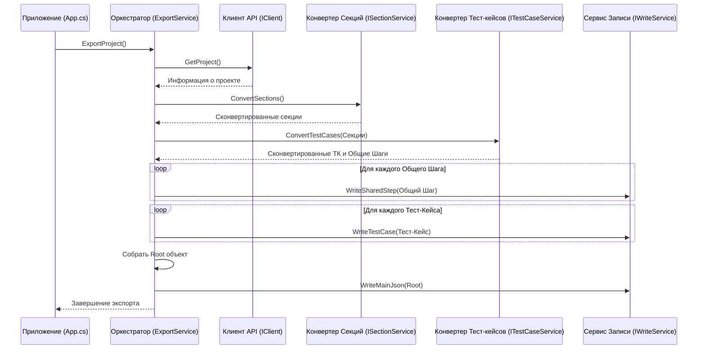

# Chapter 2: Оркестратор Экспорта


В предыдущей главе, [Глава 1: Точка Входа и Конфигурация](01_%D1%82%D0%BE%D1%87%D0%BA%D0%B0_%D0%B2%D1%85%D0%BE%D0%B4%D0%B0_%D0%B8_%D0%BA%D0%BE%D0%BD%D1%84%D0%B8%D0%B3%D1%83%D1%80%D0%B0%D1%86%D0%B8%D1%8F_.md), мы подготовили наше приложение к работе: настроили конфигурацию, логирование и "собрали команду" из различных сервисов с помощью Внедрения Зависимостей (DI). Мы узнали, что класс `App` запускает основную логику. Но кто же непосредственно управляет самим процессом экспорта данных из XRay?

Эту роль выполняет **Оркестратор Экспорта**.

## Зачем нужен Оркестратор? Представьте себе режиссера...

Представьте себе процесс создания фильма. Есть сценарист (пишет историю), оператор (снимает), актеры (играют роли), монтажер (собирает все вместе). Но кто говорит им, *что* делать, *когда* делать и в *какой последовательности*? Это **режиссер**. Он не пишет сценарий сам и не стоит за камерой, но он руководит всем процессом, чтобы в итоге получился цельный фильм.

В `XRayExporter` Оркестратор Экспорта работает точно так же. Его основная задача – не выполнять каждую мелкую операцию самостоятельно, а координировать работу других специализированных сервисов:

1.  **Запросить данные:** Сказать [Клиенту API XRay](03_клиент_api_xray_.md), чтобы он получил нужную информацию из Jira/XRay.
2.  **Преобразовать данные:** Передать полученные данные [Конвертеру Секций](05_конвертер_секций_.md) и [Конвертеру Тест-кейсов](04_конвертер_тест_кейсов_.md), чтобы они привели их в нужный формат.
3.  **Сохранить результат:** Отдать обработанные данные Сервису Записи, чтобы он сохранил их в файлы.

Оркестратор определяет *последовательность* этих шагов и гарантирует, что все части работают слаженно для достижения конечной цели – успешного экспорта данных.

## Знакомство с Оркестратором: `IExportService` и `ExportService`

В коде Оркестратор представлен интерфейсом `IExportService` и его конкретной реализацией `ExportService`. Интерфейс определяет, *что* должен уметь делать Оркестратор, а класс реализует эту логику.

**Интерфейс `IExportService`:**

Этот файл определяет "контракт" – единственное действие, которое должен выполнять Оркестратор.

```csharp
// File: Services\IExportService.cs
namespace XRayExporter.Services;

// Описывает, что должен уметь Оркестратор
public interface IExportService
{
    // Главный метод для запуска всего процесса экспорта
    Task ExportProject();
}
```

Здесь все просто: любой сервис, который хочет быть Оркестратором, должен реализовать метод `ExportProject()`.

**Реализация `ExportService`:**

Это основной класс, где происходит вся координация. Обратите внимание на конструктор – он "просит" предоставить ему все необходимые сервисы-помощники. Это как раз работа Внедрения Зависимостей (DI), настроенного в Главе 1.

```csharp
// File: Services\ExportService.cs (начало)
using JsonWriter; // Для записи JSON
using Microsoft.Extensions.Logging; // Для логирования
using Models; // Для моделей данных (см. Главу 6)
using XRayExporter.Client; // Для Клиента API (Глава 3)

namespace XRayExporter.Services;

// Основной класс-оркестратор
public class ExportService : IExportService
{
    // Поля для хранения ссылок на другие сервисы
    private readonly ILogger<ExportService> _logger; // Сервис для записи логов
    private readonly IClient _client;                   // Клиент для общения с XRay API (Глава 3)
    private readonly ISectionService _sectionService;   // Сервис для конвертации секций (Глава 5)
    private readonly ITestCaseService _testCaseService; // Сервис для конвертации тест-кейсов (Глава 4)
    private readonly IWriteService _writeService;       // Сервис для записи файлов

    // Конструктор: Получает все нужные сервисы через DI
    public ExportService(ILogger<ExportService> logger, IClient client, ISectionService sectionService,
        ITestCaseService testCaseService, IWriteService writeService)
    {
        // Сохраняем полученные сервисы для дальнейшего использования
        _logger = logger;
        _client = client;
        _sectionService = sectionService;
        _testCaseService = testCaseService;
        _writeService = writeService;
    }

    // ... Метод ExportProject() будет ниже ...
}
```

**Объяснение:**

*   Класс `ExportService` реализует интерфейс `IExportService`.
*   Через **конструктор** он получает экземпляры всех сервисов, с которыми ему нужно взаимодействовать: логгер, клиент API, конвертеры секций и тест-кейсов, сервис записи. DI-контейнер, настроенный в `Program.cs`, автоматически предоставляет эти зависимости при создании `ExportService`.

## Как работает экспорт: Метод `ExportProject`

Теперь посмотрим на главный метод `ExportProject`, который и выполняет всю работу по координации.

```csharp
// File: Services\ExportService.cs (продолжение)
public async Task ExportProject()
{
    _logger.LogInformation("Начинается экспорт проекта..."); // Записываем в лог о начале

    // 1. Получаем общую информацию о проекте от Клиента API
    var project = await _client.GetProject();
    _logger.LogInformation($"Получена информация о проекте: {project.Name}");

    // 2. Запускаем конвертацию секций (папок)
    _logger.LogInformation("Начинается конвертация секций...");
    var sections = await _sectionService.ConvertSections();
    _logger.LogInformation($"Секции сконвертированы.");

    // 3. Запускаем конвертацию тест-кейсов, передавая информацию о секциях
    _logger.LogInformation("Начинается конвертация тест-кейсов...");
    var testCases = await _testCaseService.ConvertTestCases(sections.SectionMap);
    _logger.LogInformation($"Тест-кейсы и общие шаги сконвертированы.");

    // 4. Сохраняем Общие Шаги (если они есть) с помощью Сервиса Записи
    foreach (var sharedStep in testCases.SharedSteps)
    {
        await _writeService.WriteSharedStep(sharedStep);
    }
    _logger.LogInformation("Общие шаги записаны в файлы.");

    // 5. Сохраняем Тест-кейсы с помощью Сервиса Записи
    foreach (var testCase in testCases.TestCases)
    {
        await _writeService.WriteTestCase(testCase);
    }
    _logger.LogInformation("Тест-кейсы записаны в файлы.");

    // 6. Готовим корневой объект для главного JSON-файла
    var root = new Root
    {
        ProjectName = project.Name,
        Attributes = testCases.Attributes,
        Sections = sections.Sections,
        SharedSteps = testCases.SharedSteps.Select(s => s.Id).ToList(),
        TestCases = testCases.TestCases.Select(t => t.Id).ToList()
    };

    // 7. Сохраняем главный JSON-файл
    await _writeService.WriteMainJson(root);
    _logger.LogInformation("Главный JSON-файл экспорта записан.");

    _logger.LogInformation("Экспорт проекта завершен успешно!");
}
```

**Объяснение По Шагам:**

1.  **Получить информацию о проекте:** Оркестратор обращается к `_client` ([Клиент API XRay](03_клиент_api_xray_.md)) и просит его выполнить метод `GetProject()`. Клиент сходит в XRay и вернет данные о проекте (например, его имя).
2.  **Конвертировать секции:** Оркестратор вызывает `_sectionService.ConvertSections()` ([Конвертер Секций](05_конвертер_секций_.md)). Этот сервис самостоятельно получит нужные данные о папках из XRay (через тот же `_client`) и преобразует их во внутренний формат. Результат (список секций и карта для быстрого поиска) возвращается Оркестратору.
3.  **Конвертировать тест-кейсы:** Оркестратор вызывает `_testCaseService.ConvertTestCases(...)` ([Конвертер Тест-кейсов](04_конвертер_тест_кейсов_.md)), передавая ему информацию о секциях, полученную на шаге 2. Этот сервис также сам получит данные о тест-кейсах из XRay и преобразует их, возможно, создавая и *общие шаги* (shared steps). Результат (списки тест-кейсов, общих шагов и атрибутов) возвращается Оркестратору.
4.  **Записать общие шаги:** Оркестратор перебирает все созданные `sharedStep` и для каждого вызывает метод `_writeService.WriteSharedStep()`. Сервис записи сохранит каждый общий шаг в отдельный файл.
5.  **Записать тест-кейсы:** Аналогично, Оркестратор перебирает `testCase` и вызывает `_writeService.WriteTestCase()`, который сохраняет каждый тест-кейс в свой файл.
6.  **Создать корневой объект:** Оркестратор собирает всю ключевую информацию (имя проекта, списки ID секций, тест-кейсов, общих шагов, атрибуты) в специальный объект `Root`. Этот объект описан в [Модели Данных](06_модели_данных_.md).
7.  **Записать главный файл:** Оркестратор передает объект `Root` сервису записи с помощью `_writeService.WriteMainJson()`. Этот метод создает главный `json`-файл, который содержит общую структуру экспорта и ссылки на файлы тест-кейсов и общих шагов.

Как видите, `ExportService` сам не ходит в XRay и не форматирует данные в JSON. Он действует как диспетчер, вызывая нужные сервисы в правильном порядке и передавая данные между ними.

## Схема взаимодействия

Давайте визуализируем поток работы при вызове `ExportProject()`:



Эта диаграмма показывает, как Оркестратор последовательно вызывает другие компоненты для выполнения задач.

## Как Оркестратор запускается?

Вспомним код из [Главы 1](01_%D1%82%D0%BE%D1%87%D0%BA%D0%B0_%D0%B2%D1%85%D0%BE%D0%B4%D0%B0_%D0%B8_%D0%BA%D0%BE%D0%BD%D1%84%D0%B8%D0%B3%D1%83%D1%80%D0%B0%D1%86%D0%B8%D1%8F_.md), где запускается наше приложение:

```csharp
// File: App.cs
public class App
{
    private readonly ILogger<App> _logger;
    private readonly IExportService _exportService; // <-- Оркестратор здесь!

    // DI передает Оркестратор в конструктор App
    public App(ILogger<App> logger,  IExportService exportService)
    {
        _logger = logger;
        _exportService = exportService; // Сохраняем его
    }

    public void Run(string[] args)
    {
        _logger.LogInformation("Запуск приложения");

        // Вот здесь App вызывает главный метод Оркестратора!
        _exportService.ExportProject().Wait();

        _logger.LogInformation("Завершение приложения");
    }
}
```

Класс `App`, который является общей точкой входа в логику приложения, получает экземпляр `IExportService` через DI и просто вызывает его метод `ExportProject()`. То есть `App` делегирует всю работу по экспорту Оркестратору.

## Заключение

В этой главе мы рассмотрели **Оркестратор Экспорта** (`ExportService`) – центральный компонент `XRayExporter`, который управляет всем процессом экспорта. Мы узнали, что:

*   Оркестратор действует как "режиссер", координируя работу других специализированных сервисов.
*   Он определяет последовательность шагов: получить данные -> преобразовать секции -> преобразовать тест-кейсы -> сохранить результаты.
*   Основная логика координации находится в методе `ExportProject()`.
*   Оркестратор получает необходимые ему сервисы ([Клиент API](03_клиент_api_xray_.md), [Конвертеры](04_конвертер_тест_кейсов_.md), [Сервис Записи](05_конвертер_секций_.md)) через Внедрение Зависимостей (DI).
*   Класс `App` инициирует процесс, вызывая метод Оркестратора.

Теперь, когда мы понимаем, *кто* управляет процессом, самое время погрузиться в детали того, как Оркестратор получает исходные данные. Этим занимается Клиент API.

**Следующий шаг:** Переходим к изучению компонента, который общается непосредственно с XRay в [Глава 3: Клиент API XRay](03_клиент_api_xray_.md).

---

Generated by [AI Codebase Knowledge Builder](https://github.com/The-Pocket/Tutorial-Codebase-Knowledge)