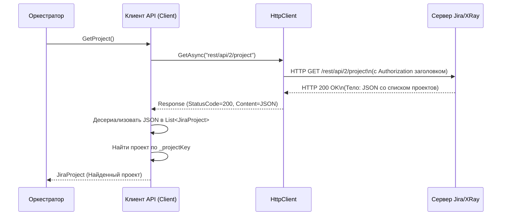

# Chapter 3: Клиент API XRay


В предыдущей главе, [Глава 2: Оркестратор Экспорта](02_оркестратор_экспорта_.md), мы познакомились с дирижером нашего процесса – `ExportService`. Он знает, *какие* шаги нужно выполнить для экспорта, но *сам* не ходит за данными на удаленный сервер. Ему нужен помощник, который умеет общаться с внешним миром, а именно – с сервером XRay в Jira.

Этим помощником и является **Клиент API XRay**.

## Зачем нужен Клиент API? Знакомьтесь, ваш "Курьер-Переводчик"

Представьте, что Оркестратор Экспорта (наш "режиссер" из прошлой главы) находится в России, а вся нужная ему информация (сценарии, списки актеров, реквизит) хранится в архиве XRay, который находится в Jira где-то за границей и "говорит" только на специальном техническом языке (языке API).

Наш режиссер не может сам поехать туда и не знает этого языка. Ему нужен специальный человек: **курьер-переводчик**.

*   **Переводчик:** Оркестратор дает задание на русском: "Принеси мне список всех папок тест-кейсов из проекта 'Omega'". Курьер-переводчик переводит этот запрос на язык API XRay.
*   **Курьер:** Он берет этот переведенный запрос, едет (по сети) к серверу XRay, передает запрос.
*   **Получение ответа:** Сервер XRay обрабатывает запрос, собирает нужные данные (список папок) и отдает их курьеру, опять же, на языке API.
*   **Обратный перевод:** Курьер возвращается к Оркестратору и переводит ответ с языка API обратно на понятный "русский" (в нашем случае, в объекты C#).

Вот эту роль курьера-переводчика и выполняет **Клиент API XRay** (`Client`). Он берет на себя всю сложную работу по:

1.  **Подключению** к серверу Jira/XRay по указанному адресу.
2.  **Аутентификации:** Предоставлению "паспорта" (API токена), чтобы сервер знал, что мы имеем право запрашивать данные.
3.  **Формированию запросов** на языке API XRay (специальные URL и параметры).
4.  **Отправке запросов** по сети (используя HTTP).
5.  **Получению ответов** от сервера (обычно в формате JSON).
6.  **Обработке ответов:** Проверке на ошибки и "переводу" данных из JSON в объекты C#, понятные другим частям нашего приложения ([Модели Данных](06_модели_данных_.md)).

**Основной решаемый вопрос:** Как получить данные (информацию о проекте, папки, тесты, вложения) с удаленного сервера XRay/Jira, не вдаваясь в детали сетевого взаимодействия и формата данных?

**Простой пример:** Оркестратор хочет узнать имя проекта, который нужно экспортировать. Он не будет сам формировать HTTP-запрос, он просто скажет Клиенту API: "Дай мне информацию о проекте". Клиент API сделает всю "грязную" работу и вернет Оркестратору готовый объект с именем проекта.

## Ключевые идеи

*   **API (Application Programming Interface):** Это как меню в ресторане или набор команд для управления устройством. XRay предоставляет набор правил и URL-адресов (API), с помощью которых другие программы (как наш `XRayExporter`) могут взаимодействовать с ним: запрашивать данные, а иногда и изменять их.
*   **HTTP Запросы:** Общение с API происходит с помощью стандартных веб-запросов, точно так же, как ваш браузер запрашивает веб-страницы. Чаще всего используется метод `GET` для получения данных.
*   **Аутентификация (Токен):** Чтобы XRay знал, кто запрашивает данные и можно ли ему их давать, наш Клиент должен представиться. В нашем случае он использует специальный `API Token` (получается в настройках Jira), который добавляется в каждый запрос. Это как пропуск или секретный ключ.
*   **JSON (JavaScript Object Notation):** Когда сервер XRay отвечает, он присылает данные в структурированном текстовом формате JSON. Он легко читается и машинами, и людьми (с некоторой привычкой). Пример: `{"key": "OMEGA", "name": "Проект Омега"}`.
*   **Десериализация:** Клиент API получает этот JSON-текст и превращает его в готовые объекты C# (например, объект `JiraProject` с полями `Key` и `Name`). Этот процесс называется десериализацией.

## Как Клиент API используется? Контракт `IClient`

Прежде чем смотреть на реализацию, давайте посмотрим на "меню услуг", которое предоставляет наш Клиент. Это описывается в интерфейсе `IClient`. Интерфейс – это обещание, которое говорит: "Любой, кто реализует этот интерфейс, *обязан* предоставить вот такие методы".

```csharp
// File: Client\IClient.cs
using XRayExporter.Models; // Используем модели данных (Глава 6)

namespace XRayExporter.Client;

// Описание того, что должен уметь делать Клиент API
public interface IClient
{
    // Получить общую информацию о проекте Jira
    Task<JiraProject> GetProject();

    // Получить список всех папок (секций) тестов в репозитории XRay
    Task<List<XrayFolder>> GetFolders();

    // Получить краткую информацию о тестах внутри конкретной папки
    Task<List<XRayTest>> GetTestFromFolder(int folderId);

    // Получить полную информацию о конкретном тесте по его ключу (например, "OMEGA-123")
    Task<XRayTestFull> GetTest(string testKey);

    // Получить информацию о связанной задаче Jira (например, требовании) по ссылке
    Task<JiraItem> GetItem(string link);

    // Скачать содержимое вложения (файл) по ссылке
    Task<byte[]> DownloadAttachment(string link);
}
```

**Объяснение:**

*   Интерфейс `IClient` определяет шесть основных действий, которые может выполнить наш Клиент.
*   Каждый метод возвращает `Task<T>`, что означает асинхронную операцию (запрос по сети может занять время) и возвращаемый тип данных (`JiraProject`, `List<XrayFolder>` и т.д.). Эти типы данных описаны в [Модели Данных](06_модели_данных_.md).
*   [Оркестратор Экспорта](02_оркестратор_экспорта_.md) и другие сервисы будут использовать именно этот интерфейс (`IClient`), не зная деталей конкретной реализации.

## Реализация: Заглянем под капот `Client.cs`

Теперь посмотрим, как эти "обещания" выполняются в классе `Client`.

### 1. Настройка и Подготовка (Конструктор)

Когда `Client` создается (это происходит при запуске приложения благодаря DI, см. [Главу 1](01_%D1%82%D0%BE%D1%87%D0%BA%D0%B0_%D0%B8_%D0%BA%D0%BE%D0%BD%D1%84%D0%B8%D0%B3%D1%83%D1%80%D0%B0%D1%86%D0%B8%D1%8F_.md)), ему нужно получить настройки и подготовить инструмент для отправки запросов.

```csharp
// File: Client\Client.cs (начало)
using System.Net.Http.Headers; // Для заголовка аутентификации
using System.Text.Json;       // Для работы с JSON
using Microsoft.Extensions.Configuration; // Для чтения конфигурации
using Microsoft.Extensions.Logging;     // Для логирования
using XRayExporter.Models;     // Используем модели данных

namespace XRayExporter.Client;

public class Client : IClient // Реализуем интерфейс IClient
{
    private readonly ILogger<Client> _logger; // Логгер для записи событий
    private readonly HttpClient _httpClient;  // Инструмент для HTTP-запросов
    private readonly string _projectKey;      // Ключ проекта для использования в запросах

    // Конструктор: Получает логгер и конфигурацию через DI
    public Client(ILogger<Client> logger, IConfiguration configuration)
    {
        _logger = logger;

        // Читаем секцию "xray" из файла xray.config.json
        var section = configuration.GetSection("XRay"); // Было "xray", но по json это "XRay"
        var baseUrl = section["BaseUrl"]; // Адрес Jira/XRay был "url" стало BaseUrl
        var apiToken = section["ApiToken"]; // Токен для доступа был "token" стало ApiToken
        _projectKey = section["ProjectKey"]; // Ключ проекта

        // Проверяем, что все нужные настройки указаны
        if (string.IsNullOrEmpty(baseUrl)) /*...*/ ;
        if (string.IsNullOrEmpty(apiToken)) /*...*/ ;
        if (string.IsNullOrEmpty(_projectKey)) /*...*/ ;

        _logger.LogDebug($"Настройка клиента API XRay: BaseUrl={baseUrl}, ProjectKey={_projectKey}");

        // Создаем и настраиваем HttpClient
        _httpClient = new HttpClient();
        _httpClient.BaseAddress = new Uri(baseUrl); // Устанавливаем базовый адрес
        // Добавляем заголовок Authorization для каждого запроса
        _httpClient.DefaultRequestHeaders.Authorization =
            new AuthenticationHeaderValue("Bearer", apiToken);
    }

    // ... Реализации методов GetProject, GetFolders и т.д. ...
}
```

**Объяснение:**

*   Конструктор получает сервис `IConfiguration`, который содержит настройки из файла `xray.config.json`.
*   Он извлекает базовый URL сервера XRay (`BaseUrl`), API токен (`ApiToken`) и ключ проекта (`ProjectKey`).
*   Создается объект `HttpClient` – это стандартный класс .NET для отправки HTTP-запросов.
*   `_httpClient.BaseAddress` устанавливается на URL сервера XRay, чтобы в дальнейшем указывать только относительные пути API.
*   Самое важное: `_httpClient.DefaultRequestHeaders.Authorization` настраивает заголовок, который будет автоматически добавляться ко *всем* запросам этого клиента. Он содержит тип аутентификации (`Bearer`) и сам `apiToken`. Теперь сервер XRay будет знать, кто мы.

### 2. Пример: Получение Информации о Проекте (`GetProject`)

Давайте разберем, как работает один из методов – `GetProject()`, который [Оркестратор Экспорта](02_оркестратор_экспорта_.md) использует в самом начале.

```csharp
// File: Client\Client.cs (часть)
public async Task<JiraProject> GetProject()
{
    // 1. Логируем начало операции
    _logger.LogInformation("Получение информации о проекте {ProjectKey}", _projectKey);

    // 2. Формируем относительный путь к API Jira для получения проектов
    //    Полный URL получится примерно: https://ваш-jira/rest/api/2/project
    var requestUrl = "rest/api/2/project";

    // 3. Отправляем GET запрос с помощью _httpClient
    var response = await _httpClient.GetAsync(requestUrl);

    // 4. Проверяем, успешен ли ответ (код 2xx, например, 200 OK)
    if (!response.IsSuccessStatusCode)
    {
        // Если ошибка, логируем детали и выбрасываем исключение
        _logger.LogError("Не удалось получить проект. Код: {StatusCode}. Ответ: {Response}",
            response.StatusCode, await response.Content.ReadAsStringAsync());
        throw new Exception($"Не удалось получить проект. Код: {response.StatusCode}");
    }

    // 5. Читаем тело ответа как строку (это будет JSON)
    var content = await response.Content.ReadAsStringAsync();
    _logger.LogTrace("Получен ответ от API проектов: {ResponseJson}", content); // Лог для отладки

    // 6. Десериализуем JSON-строку в список объектов JiraProject
    //    JsonSerializer "переводит" текст в объекты C#
    var projects = JsonSerializer.Deserialize<List<JiraProject>>(content);

    // 7. Ищем в списке наш проект по ключу _projectKey (игнорируя регистр)
    var project = projects!.FirstOrDefault(p =>
        string.Equals(p.Key, _projectKey, StringComparison.InvariantCultureIgnoreCase));

    // 8. Если проект не найден - ошибка
    if (project == null)
    {
        _logger.LogError("Проект {ProjectKey} не найден в ответе API", _projectKey);
        throw new Exception($"Проект {_projectKey} не найден");
    }

    // 9. Возвращаем найденный объект проекта
    _logger.LogDebug("Проект {ProjectKey} успешно найден: {ProjectName}", project.Key, project.Name);
    return project;
}
```

**Объяснение:**

1.  **Логирование:** Записываем в лог, что мы начинаем делать.
2.  **URL Запроса:** Определяем *относительный* путь к нужной функции API (`rest/api/2/project`). Базовый адрес (`https://ваш-jira/`) подставится автоматически из настроек `_httpClient`.
3.  **Отправка Запроса:** `_httpClient.GetAsync(requestUrl)` отправляет HTTP GET запрос на собранный URL. Ключевое слово `await` означает, что мы ждем завершения сетевой операции. Заголовок `Authorization` с токеном добавляется автоматически.
4.  **Проверка Статуса:** Сервер отвечает кодом состояния (например, 200 - Успешно, 404 - Не найдено, 401 - Не авторизован, 500 - Ошибка сервера). Мы проверяем, что код указывает на успех (`IsSuccessStatusCode`). Если нет – логируем ошибку и прекращаем работу (выбрасываем `Exception`).
5.  **Чтение Ответа:** `response.Content.ReadAsStringAsync()` читает тело ответа, которое содержит данные в формате JSON.
6.  **Десериализация:** `JsonSerializer.Deserialize<List<JiraProject>>(content)` – это магия! Библиотека `System.Text.Json` анализирует JSON-строку и создает на ее основе список объектов типа `JiraProject` ([Модели Данных](06_модели_данных_.md)).
7.  **Поиск Проекта:** API Jira `rest/api/2/project` возвращает *все* проекты, к которым у пользователя есть доступ. Нам нужен только один, указанный в `xray.config.json`. Мы ищем его в списке `projects` по ключу `_projectKey`.
8.  **Проверка Наличия:** Убеждаемся, что проект найден.
9.  **Возврат Результата:** Метод возвращает найденный объект `JiraProject` тому, кто его вызвал (в нашем случае, [Оркестратору Экспорта](02_оркестратор_экспорта_.md)).

Остальные методы (`GetFolders`, `GetTest`, `DownloadAttachment` и т.д.) работают по очень схожей схеме: формируют правильный URL для нужного API XRay, отправляют запрос, проверяют успех, десериализуют JSON (или получают байты файла для `DownloadAttachment`) и возвращают результат.

## Как это работает: Пошаговый разбор

Давайте еще раз проследим путь запроса, используя нашу аналогию с курьером-переводчиком, на примере вызова `GetProject()` Оркестратором:

1.  **Заказ:** Оркестратор вызывает `client.GetProject()`.
2.  **Подготовка Курьера:** Клиент API (`Client`) уже настроен: знает адрес (`BaseAddress`) и имеет "пропуск" (`Authorization` заголовок с токеном).
3.  **Формирование Запроса (Перевод):** Клиент определяет нужный путь к API (`rest/api/2/project`) и тип запроса (`GET`).
4.  **Доставка:** `HttpClient` отправляет HTTP GET запрос на `https://ваш-jira/rest/api/2/project` с заголовком `Authorization: Bearer ВАШ_API_ТОКЕН`.
5.  **Обработка на Сервере:** Сервер Jira/XRay получает запрос, проверяет токен, находит все доступные проекты и формирует ответ в виде JSON-строки.
6.  **Получение Ответа:** Клиент API получает ответ от сервера (код состояния 200 и JSON-строку в теле).
7.  **Проверка:** Клиент видит код 200 - все хорошо.
8.  **Обратный Перевод (Десериализация):** Клиент использует `JsonSerializer` для преобразования JSON-строки `"[{\"key\":\"OMEGA\", \"name\":\"Проект Омега\"}, ... ]"` в список объектов `JiraProject`.
9.  **Фильтрация:** Клиент находит в списке объект `JiraProject` с ключом `OMEGA` (который хранится в `_projectKey`).
10. **Передача Результата:** Клиент возвращает найденный объект `JiraProject` Оркестратору.

Визуально этот процесс можно представить так:



## Заключение

В этой главе мы разобрались с **Клиентом API XRay** – незаменимым компонентом `XRayExporter`, который отвечает за всё взаимодействие с удаленным сервером Jira и XRay. Мы узнали, что:

*   Клиент API действует как "курьер-переводчик", скрывая сложности сетевого общения, аутентификации и обработки данных API.
*   Он использует `HttpClient` для отправки HTTP-запросов к API XRay/Jira.
*   Аутентификация происходит с помощью API токена, передаваемого в заголовке `Authorization`.
*   Полученные от сервера данные в формате JSON десериализуются в понятные C# объекты ([Модели Данных](06_модели_данных_.md)).
*   Интерфейс `IClient` определяет "контракт" (список доступных операций), а класс `Client` предоставляет конкретную реализацию.
*   Методы вроде `GetProject`, `GetFolders`, `GetTest` инкапсулируют логику запроса конкретных данных.

Теперь, когда Оркестратор может получить "сырые" данные из XRay с помощью Клиента API, возникает следующий вопрос: как превратить эти данные (например, объекты `XRayTestFull`) в формат, который нужен для нашей конечной цели экспорта? Этим занимаются Конвертеры.

**Следующий шаг:** Начнем с преобразования тест-кейсов в главе [Глава 4: Конвертер Тест-кейсов](04_конвертер_тест_кейсов_.md).

---

Generated by [AI Codebase Knowledge Builder](https://github.com/The-Pocket/Tutorial-Codebase-Knowledge)