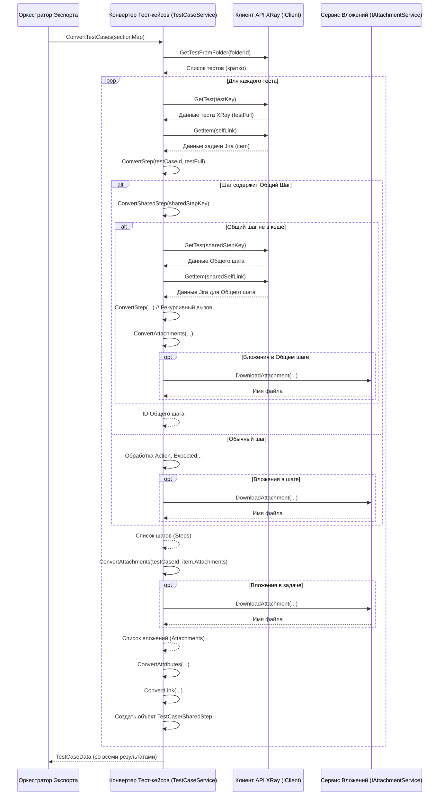

# Chapter 4: Конвертер Тест-кейсов


В [Главе 3: Клиент API XRay](03_клиент_api_xray_.md) мы узнали, как наш "курьер-переводчик" (`Client`) достает для нас "сырые" данные прямо из системы XRay в Jira. Он приносит нам информацию о проекте, папках, деталях тестов, но в том виде, в каком их отдает XRay API – часто это сложные объекты с множеством полей, не всегда удобных для нашей конечной цели.

Представьте, что курьер принес нам с рынка свежие овощи, мясо, специи (данные из XRay). Они отличного качества, но это еще не готовое блюдо. Нам нужен **шеф-повар**, который возьмет эти ингредиенты и приготовит из них восхитительное угощение по определенному рецепту.

В нашем проекте `XRayExporter` таким шеф-поваром выступает **Конвертер Тест-кейсов** (`TestCaseService`).

## Зачем нужен Конвертер Тест-кейсов? Превращаем "сырье" в "блюдо"

Основная задача Конвертера Тест-кейсов – взять детальную информацию об одном тест-кейсе, полученную от [Клиента API XRay](03_клиент_api_xray_.md), и преобразовать ее в структурированный формат, который определен в наших [Моделях Данных](06_модели_данных_.md) (это наш "рецепт").

**Проблема:** Данные из XRay API (`XRayTestFull`, `JiraItem`) содержат много информации, но:
*   Структура может быть неудобной (например, шаги и вложения могут быть разбросаны).
*   Некоторые данные нужно дополнительно обработать (например, скачать вложения по ссылкам).
*   Нужно обработать специальные случаи, такие как "Общие шаги" (Shared Steps).
*   Нужно собрать информацию об атрибутах (статус, тип и т.д.) со всех тестов.

**Решение:** Конвертер Тест-кейсов инкапсулирует всю логику этой трансформации. [Оркестратор Экспорта](02_оркестратор_экспорта_.md) просто говорит ему: "Вот ID тестов, которые нужно обработать", а конвертер возвращает готовые к записи объекты `TestCase` и `SharedStep`.

**Ключевые задачи Конвертера:**

1.  **Обработка Основной Информации:** Преобразование названия (`summary`), описания (`description`), меток (`labels`) из данных Jira/XRay в поля нашей модели `TestCase`.
2.  **Преобразование Шагов:** Перевод шагов теста из формата XRay (действие, данные, ожидаемый результат) в нашу структуру `Step`.
3.  **Работа с Предусловиями:** Конвертация предусловий XRay в шаги типа "предусловие".
4.  **Управление Атрибутами:** Извлечение стандартных атрибутов XRay (статус, тип) и пользовательских атрибутов, сбор всех возможных значений для создания общих списков.
5.  **Обработка Вложений:**
    *   Обнаружение ссылок на вложения в описании шагов или в общем списке вложений задачи Jira.
    *   Вызов специального сервиса `IAttachmentService` для скачивания файла по ссылке.
    *   Сохранение информации о скачанном файле (его новое имя) в данных тест-кейса.
6.  **Связи с Задачами:** Преобразование информации о связях с другими задачами Jira (например, "связано с требованием...") в наш формат `Link`.
7.  **Обработка "Общих Шагов" (Shared Steps):** Это одна из самых хитрых задач.
    *   Обнаружение, что шаг в тесте является ссылкой на другой тест-кейс (который используется как общий шаг).
    *   Получение данных этого *другого* тест-кейса с помощью [Клиента API XRay](03_клиент_api_xray_.md).
    *   Преобразование этого *другого* тест-кейса не в обычный `TestCase`, а в специальный объект `SharedStep` (оба описаны в [Моделях Данных](06_модели_данных_.md)).
    *   В основном тесте создание шага, который просто ссылается на ID созданного `SharedStep`.

## Как это работает: Процесс Конвертации

Когда [Оркестратор Экспорта](02_оркестратор_экспорта_.md) вызывает метод `ConvertTestCases`, происходит примерно следующее:

1.  **Получение Задания:** Конвертер получает список папок (секций) и их ID (от [Конвертера Секций](05_конвертер_секций_.md), который будет рассмотрен позже).
2.  **Цикл по Папкам:** Конвертер перебирает каждую папку.
3.  **Запрос Тестов в Папке:** Для каждой папки он просит [Клиент API XRay](03_клиент_api_xray_.md) дать список тестов, которые в ней находятся (метод `GetTestFromFolder`).
4.  **Цикл по Тестам:** Конвертер перебирает каждый тест из списка.
5.  **Запрос Полных Данных:** Для каждого теста он запрашивает полную информацию у [Клиента API XRay](03_клиент_api_xray_.md) (методы `GetTest` и `GetItem`).
6.  **Преобразование:** Выполняется основная магия:
    *   Создается новый пустой объект `TestCase` (из [Моделей Данных](06_модели_данных_.md)).
    *   Поля этого объекта (`Name`, `Description`, `Tags` и т.д.) заполняются данными из ответа API.
    *   Вызывается внутренняя функция для конвертации шагов (`ConvertStep`).
    *   Эта функция обрабатывает каждый шаг, скачивает вложения через `IAttachmentService`, если нужно, и обрабатывает общие шаги (вызывая `ConvertSharedStep`).
    *   Вызываются функции для конвертации атрибутов (`ConvertAttributes`), предусловий, связей (`ConvertLink`).
7.  **Сохранение Результата:** Готовый объект `TestCase` (или `SharedStep`, если это был общий шаг) сохраняется во внутреннем списке конвертера.
8.  **Возврат Итогов:** После обработки всех тестов во всех папках, конвертер возвращает [Оркестратору](02_оркестратор_экспорта_.md) собранные списки: `TestCases`, `SharedSteps` и `Attributes`.

## "Рецепты": Модели `TestCase` и `SharedStep`

Прежде чем смотреть на код конвертера, важно понимать, *во что* он превращает данные. Он создает объекты на основе классов, описанных в [Моделях Данных](06_модели_данных_.md). Два ключевых класса:

*   **`TestCase`**: Представляет обычный тест-кейс с шагами, атрибутами, ссылками и т.д.
*   **`SharedStep`**: Очень похож на `TestCase` (имеет шаги, описание и т.д.), но используется для представления переиспользуемых блоков шагов. В основном тесте будет ссылка на ID этого `SharedStep`, а не сами шаги.

Конвертер должен решить, создавать ли `TestCase` или `SharedStep`, и правильно заполнить все поля согласно этим "рецептам".

## Заглянем на "Кухню": Код `TestCaseService.cs`

Теперь посмотрим, как реализована логика "шеф-повара".

### 1. Подготовка (Конструктор)

Как и другие сервисы, `TestCaseService` получает нужные ему инструменты через Внедрение Зависимостей (DI).

```csharp
// File: Services\TestCaseService.cs (начало)
using Microsoft.Extensions.Logging;
using Models; // Наши "рецепты" из Моделей Данных
using XRayExporter.Client; // "Курьер" для получения данных
using XRayExporter.Models; // Вспомогательные модели
// ... и другие using ...

namespace XRayExporter.Services;

public class TestCaseService : ITestCaseService // Реализуем интерфейс
{
    private readonly ILogger<TestCaseService> _logger; // Для логов
    private readonly IClient _client;                   // Для общения с XRay API
    private readonly IAttachmentService _attachmentService; // Для скачивания вложений

    // Словари для хранения результатов и промежуточных данных
    private readonly Dictionary<string, Attribute> _attributeMap; // Карта атрибутов (чтобы не дублировать)
    private readonly Dictionary<string, SharedStep> _sharedSteps; // Карта уже сконвертированных общих шагов
    private readonly Dictionary<string, TestCase> _testCases;     // Карта уже сконвертированных тест-кейсов

    // Конструктор: Получаем зависимости
    public TestCaseService(ILogger<TestCaseService> logger, IClient client, IAttachmentService attachmentService)
    {
        _logger = logger;
        _client = client;
        _attachmentService = attachmentService; // Сервис для работы с вложениями

        // Инициализируем пустые словари
        _attributeMap = new Dictionary<string, Attribute>();
        _sharedSteps = new Dictionary<string, SharedStep>();
        _testCases = new Dictionary<string, TestCase>();
    }

    // ... Основной метод ConvertTestCases и вспомогательные методы ниже ...
}
```

**Объяснение:**
*   Сервис получает логгер, [Клиент API](03_клиент_api_xray_.md) и `IAttachmentService`. Обратите внимание, он не получает напрямую Сервис Записи (`IWriteService`) – скачиванием и сохранением вложений занимается `AttachmentService`.
*   Инициализируются словари (`Dictionary`) для хранения результатов: `_testCases` и `_sharedSteps`. Использование словарей с ключом (Jira Key, например "PRJ-123") позволяет легко проверять, не обрабатывали ли мы уже этот тест (например, как общий шаг). `_attributeMap` хранит информацию об атрибутах проекта.

### 2. Основной Метод: `ConvertTestCases`

Этот метод запускает весь процесс, оркестрируя получение и конвертацию тестов по папкам.

```csharp
// File: Services\TestCaseService.cs (часть)
public async Task<TestCaseData> ConvertTestCases(Dictionary<int, Guid> sectionMap)
{
    _logger.LogInformation("Начинается конвертация тест-кейсов...");

    // Инициализируем базовые атрибуты (Статус, Тип и т.д.)
    InitializeAttributes();

    // Перебираем папки (секции), информацию о которых получили от Оркестратора
    foreach (var section in sectionMap) // section.Key = ID папки в XRay, section.Value = наш GUID для секции
    {
        // 1. Получаем список тестов в этой папке от Клиента API
        var testsInFolder = await _client.GetTestFromFolder(section.Key);

        // Перебираем каждый тест в папке
        foreach (var testInfo in testsInFolder) // testInfo содержит ключ теста (напр., "PRJ-123")
        {
            // Проверяем, не обрабатывали ли мы этот тест уже как общий шаг
            if (_sharedSteps.ContainsKey(testInfo.Key))
            {
                // Если да, просто обновляем ID секции в нём (если нужно) и пропускаем
                _sharedSteps[testInfo.Key].SectionId = section.Value;
                continue;
            }

            // 2. Получаем полные данные о тесте и связанной Jira-задаче
            var testFull = await _client.GetTest(testInfo.Key); // Данные из XRay
            var item = await _client.GetItem(testFull.Self);     // Данные из Jira (название, описание...)

            // 3. Генерируем уникальный ID для нашего тест-кейса
            var testCaseId = Guid.NewGuid();

            // 4. Конвертируем шаги (самая сложная часть)
            var steps = await ConvertStep(testCaseId, testFull);

            // 5. Конвертируем вложения Jira-задачи
            var attachments = await ConvertAttachments(testCaseId, item.Fields.Attachments);

            // (Простая логика добавления имен вложений шагов в общий список, если требуется)

            // 6. Создаем и заполняем объект TestCase по нашему "рецепту"
            var newTestCase = new TestCase
            {
                Id = testCaseId,
                Name = item.Fields.Summary, // Название из Jira
                Description = item.Fields.Description, // Описание
                SectionId = section.Value,      // ID нашей секции (папки)
                Steps = steps,                   // Сконвертированные шаги
                Attributes = ConvertAttributes(testFull), // Атрибуты (статус, тип...)
                PreconditionSteps = ConvertPreconditionSteps(testFull.Preconditions), // Предусловия
                Attachments = attachments,       // Вложения
                Tags = item.Fields.Labels,       // Метки Jira
                Links = ConvertLink(item.Fields.IssueLinks), // Связанные задачи
                // ... другие поля по умолчанию ...
                State = StateType.NotReady,
                Priority = PriorityType.Medium,
                Duration = DefaultDuration // Значение по умолчанию для длительности
            };

            // 7. Добавляем созданный TestCase в наш словарь
            _testCases.Add(testInfo.Key, newTestCase);
        }
    }

    _logger.LogInformation("Конвертация тест-кейсов завершена.");

    // 8. Возвращаем результат Оркестратору
    return new TestCaseData
    {
        TestCases = _testCases.Values.ToList(), // Список всех TestCase
        SharedSteps = _sharedSteps.Values.ToList(), // Список всех SharedStep
        Attributes = _attributeMap.Values.ToList()  // Список всех атрибутов
    };
}
```

**Объяснение:**
*   Метод перебирает папки (`sectionMap`).
*   Для каждой папки получает список тестов (`GetTestFromFolder`).
*   Для каждого теста получает полные данные (`GetTest`, `GetItem`).
*   **Важно:** Перед полной обработкой идет проверка, не был ли этот `testInfo.Key` уже обработан как общий шаг (`_sharedSteps.ContainsKey`). Это предотвращает дублирование и лишние запросы API.
*   Вызывает вспомогательные методы (`ConvertStep`, `ConvertAttachments`, `ConvertAttributes`, `ConvertLink`, `ConvertPreconditionSteps`) для преобразования отдельных частей.
*   Собирает все в объект `TestCase` (согласно [Моделям Данных](06_модели_данных_.md)).
*   Добавляет результат в словарь `_testCases`.
*   В конце формирует и возвращает объект `TestCaseData`, содержащий все сконвертированные тесты, общие шаги и атрибуты.

### 3. Конвертация Шагов: `ConvertStep`

Это сердце конвертации тест-кейса. Здесь обрабатываются обычные шаги, вложения в шагах и происходит магия с общими шагами.

```csharp
// File: Services\TestCaseService.cs (часть)
private async Task<List<Step>> ConvertStep(Guid testCaseId, XRayTestFull test)
{
    var steps = new List<Step>(); // Список для сконвертированных шагов

    foreach (var stepInfo in test.Definition.Steps) // Перебираем шаги из XRay API
    {
        // Проверка на специальную метку, указывающую на ОБЩИЙ ШАГ
        // (В XRay при вставке Общего шага часто добавляется специфичный HTML)
        if (stepInfo.Step.Rendered.Contains(SharedStepMark, StringComparison.InvariantCultureIgnoreCase))
        {
            // Пытаемся извлечь ссылку на тест-кейс Общего шага (используя регулярное выражение)
            var match = Regex.Match(stepInfo.Step.Rendered, SharedStepRegex);

            if (match.Success)
            {
                // Извлекаем ключ теста (например, "PRJ-456") из ссылки
                var sharedStepKey = match.Groups[1].Value.Split("/").Last();

                // Вызываем специальный метод для конвертации этого теста как Общего Шага
                var sharedStepId = await ConvertSharedStep(sharedStepKey);

                // Добавляем в наш список шагов специальный шаг-ссылку
                steps.Add(new Step
                {
                    SharedStepId = sharedStepId, // Указываем ID общего шага
                    // Остальные поля (Action, Expected) пустые для шага-ссылки
                    Action = string.Empty,
                    Expected = string.Empty,
                    TestData = string.Empty
                    // ... списки вложений тоже пустые ...
                });

                continue; // Переходим к следующему шагу XRay
            }
        }

        // Если это ОБЫЧНЫЙ шаг (не общий)
        var newStep = new Step
        {
            // Берем данные из полей ответа API XRay
            Action = stepInfo.Step.Rendered,
            Expected = stepInfo.Result.Rendered,
            TestData = stepInfo.Data.Rendered,
            // Инициализируем пустые списки для вложений этого шага
            ActionAttachments = new List<string>(),
            ExpectedAttachments = new List<string>(),
            TestDataAttachments = new List<string>()
        };

        // Обрабатываем вложения, прикрепленные к этому конкретному ШАГУ
        foreach (var attachmentInfo in stepInfo.Attachments)
        {
            // Вызываем сервис вложений для скачивания файла
            var attachmentName = await _attachmentService.DownloadAttachment(
                testCaseId, // ID текущего тест-кейса (для организации папок)
                attachmentInfo.FileURL, // Ссылка на скачивание
                attachmentInfo.FileName // Исходное имя файла
            );
            // Добавляем имя скачанного файла к шагу
            newStep.ActionAttachments.Add(attachmentName);
            // Можно также добавить ссылку в текст шага, если нужно
            // newStep.Action += $"<br><p><<<{attachmentName}>>></p>";
        }

        steps.Add(newStep); // Добавляем сконвертированный обычный шаг в список
    }

    return steps; // Возвращаем список готовых шагов
}
```

**Объяснение:**
*   Метод перебирает шаги (`stepInfo`) из данных XRay.
*   **Обнаружение Общего Шага:** Ищет специальный текст (`SharedStepMark`) в HTML-коде шага. Если находит, извлекает ключ связанного тест-кейса (`sharedStepKey`) с помощью регулярного выражения (`Regex.Match`).
*   **Конвертация Общего Шага:** Вызывает `ConvertSharedStep(sharedStepKey)`. Этот метод (рассмотрим ниже) вернет `Guid` (ID) сконвертированного общего шага. Создается "шаг-ссылка", у которого заполнено только поле `SharedStepId`.
*   **Конвертация Обычного Шага:** Если это не общий шаг, создается обычный объект `Step`, поля `Action`, `Expected`, `TestData` заполняются из `stepInfo`.
*   **Вложения Шага:** Если у шага есть свои вложения (`stepInfo.Attachments`), они скачиваются с помощью `_attachmentService.DownloadAttachment`. Сервис вложений сам сохранит файл и вернет его новое уникальное имя (`attachmentName`), которое добавляется в список `ActionAttachments` шага.
*   Готовый шаг (обычный или ссылка) добавляется в список `steps`.

### 4. Магия Общих Шагов: `ConvertSharedStep`

Этот метод отвечает за то, чтобы тест-кейс, используемый как общий шаг, был сконвертирован один раз и в правильный формат (`SharedStep`).

```csharp
// File: Services\TestCaseService.cs (часть)
private async Task<Guid> ConvertSharedStep(string itemKey) // itemKey - ключ теста Общего шага (e.g., "PRJ-456")
{
    // 1. Проверяем, не конвертировали ли мы УЖЕ этот общий шаг?
    if (_sharedSteps.TryGetValue(itemKey, out var existingSharedStep))
    {
        return existingSharedStep.Id; // Если да, просто возвращаем его ID
    }

    // 2. Проверяем, не начали ли мы конвертировать этот тест как ОБЫЧНЫЙ TestCase?
    //    (Может случиться, если порядок обхода тестов такой)
    if (_testCases.TryGetValue(itemKey, out var existingTestCase))
    {
        // Если да, "переделываем" его из TestCase в SharedStep
        var convertedSharedStep = new SharedStep
        {
            // Копируем все данные из existingTestCase в новый SharedStep
            Id = existingTestCase.Id,
            Name = existingTestCase.Name,
            Description = existingTestCase.Description,
            Steps = existingTestCase.Steps, // Важно: шаги уже были сконвертированы!
            Attributes = existingTestCase.Attributes,
            Attachments = existingTestCase.Attachments,
            Tags = existingTestCase.Tags,
            Links = existingTestCase.Links,
            SectionId = existingTestCase.SectionId, // Сохраняем исходную папку
             // ... другие поля ...
            State = StateType.NotReady,
            Priority = PriorityType.Medium,
        };

        // Удаляем его из списка обычных тест-кейсов
        _testCases.Remove(itemKey);
        // Добавляем в словарь общих шагов
        _sharedSteps.Add(itemKey, convertedSharedStep);

        _logger.LogDebug("Тест {ItemKey} переконвертирован из TestCase в SharedStep", itemKey);
        return convertedSharedStep.Id; // Возвращаем ID
    }

    // 3. Если мы встречаем этот itemKey ВПЕРВЫЕ:
    _logger.LogDebug("Конвертация нового Общего Шага: {ItemKey}", itemKey);
    // Получаем его данные через API (так же, как для обычного теста)
    var testFull = await _client.GetTest(itemKey);
    var item = await _client.GetItem(testFull.Self);
    var sharedStepId = Guid.NewGuid(); // Генерируем новый ID

    // Рекурсивно(!) конвертируем его шаги (он ведь тоже может содержать общие шаги)
    var steps = await ConvertStep(sharedStepId, testFull);
    // Конвертируем его вложения
    var attachments = await ConvertAttachments(sharedStepId, item.Fields.Attachments);

    // Создаем объект SharedStep
    var newSharedStep = new SharedStep
    {
        Id = sharedStepId,
        Name = item.Fields.Summary,
        Description = item.Fields.Description,
        Steps = steps,
        Attributes = ConvertAttributes(testFull),
        Attachments = attachments,
        Tags = item.Fields.Labels,
        Links = ConvertLink(item.Fields.IssueLinks), // Общие шаги тоже могут иметь связи
        // ... другие поля ...
         State = StateType.NotReady,
         Priority = PriorityType.Medium
    };

    // Добавляем его в словарь общих шагов
    _sharedSteps.Add(itemKey, newSharedStep);
    return sharedStepId; // Возвращаем ID
}

```

**Объяснение:**
*   **Шаг 1: Проверка кеша `_sharedSteps`:** Самый частый случай – мы уже обработали этот общий шаг ранее. Просто возвращаем его `Id`.
*   **Шаг 2: Проверка кеша `_testCases`:** Если мы начали обрабатывать этот тест как обычный, но теперь поняли, что он используется как общий шаг, мы "переквалифицируем" его. Создаем `SharedStep` из данных `TestCase`, удаляем его из `_testCases` и добавляем в `_sharedSteps`. Это гарантирует, что он будет экспортирован как `SharedStep`, а не как `TestCase`.
*   **Шаг 3: Новая конвертация:** Если этот ключ (`itemKey`) встречается впервые, мы получаем его данные из XRay, конвертируем его шаги (вызывая `ConvertStep` – да, рекурсивно!), вложения, атрибуты и т.д., создаем объект `SharedStep` и добавляем его в `_sharedSteps`.

Эта логика гарантирует, что каждый тест-кейс, используемый как общий шаг, будет сконвертирован только один раз и именно в формате `SharedStep`.

### 5. Преобразование Других Данных

Есть еще несколько вспомогательных методов:

*   `ConvertAttributes`: Собирает атрибуты (Статус, Тип, Приоритет XRay и т.д.), добавляет их значения в общую карту атрибутов (`_attributeMap`), чтобы [Оркестратор](02_оркестратор_экспорта_.md) мог сформировать список всех используемых атрибутов в проекте. Возвращает список атрибутов для конкретного тест-кейса.
*   `ConvertPreconditionSteps`: Превращает список предусловий XRay в список объектов `Step` нашего формата.
*   `ConvertAttachments`: Обрабатывает вложения, прикрепленные к самой задаче Jira (не к шагам). Для каждого вложения вызывает `_attachmentService.DownloadAttachment` и возвращает список имен скачанных файлов.
*   `ConvertLink`: Преобразует связи Jira (`JiraLink`) в наш формат `Link`, извлекая тип связи и формируя URL для просмотра связанной задачи в Jira.
*   `InitializeAttributes`: Создает базовые записи в `_attributeMap` для стандартных атрибутов XRay при старте конвертации.

## Схема Взаимодействия

Давайте представим, как `TestCaseService` взаимодействует с другими компонентами во время своей работы:



Эта диаграмма показывает основной поток: Оркестратор запускает Конвертер, который для каждого теста обращается к Клиенту API за данными, а затем использует Сервис Вложений для скачивания файлов и внутренние методы для преобразования шагов (включая рекурсивную обработку общих шагов) и других полей.

## Заключение

В этой главе мы погрузились в работу **Конвертера Тест-кейсов** (`TestCaseService`) – ключевого компонента, который превращает "сырые" данные из XRay в структурированные `TestCase` и `SharedStep` объекты, готовые для экспорта. Мы узнали:

*   Конвертер действует как "шеф-повар", обрабатывая данные по "рецептам" из [Моделей Данных](06_модели_данных_.md).
*   Он отвечает за преобразование всех аспектов тест-кейса: основной информации, шагов, предусловий, атрибутов, связей и меток.
*   Особое внимание уделяется **вложениям** (через вызов `IAttachmentService`) и **общим шагам** (сложная логика с кешированием и рекурсивной конвертацией).
*   Методы `ConvertTestCases`, `ConvertStep` и `ConvertSharedStep` содержат основную логику преобразования.
*   Результатом работы является объект `TestCaseData`, содержащий списки готовых `TestCase`, `SharedStep` и `Attribute`.

Но тест-кейсы в XRay часто организованы в папки (секции репозитория). Как мы получаем и преобразуем эту структуру папок? Этим занимается другой конвертер.

**Следующий шаг:** Переходим к изучению компонента, отвечающего за структуру папок, в [Глава 5: Конвертер Секций](05_конвертер_секций_.md).

---

Generated by [AI Codebase Knowledge Builder](https://github.com/The-Pocket/Tutorial-Codebase-Knowledge)