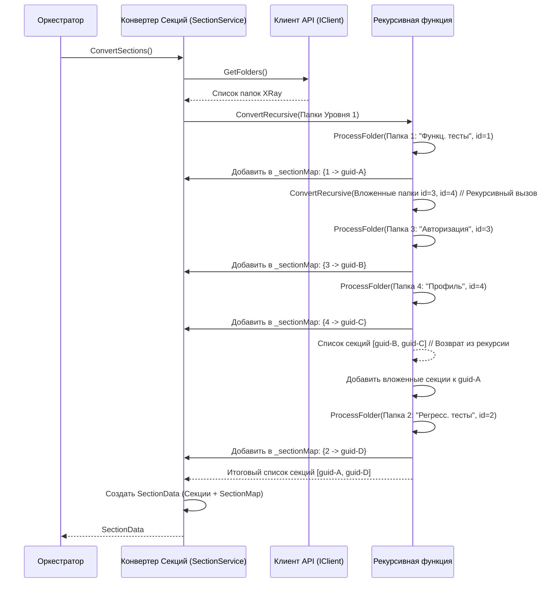

# Chapter 5: Конвертер Секций


В предыдущей главе, [Глава 4: Конвертер Тест-кейсов](04_конвертер_тест_кейсов_.md), мы разобрались, как наш "шеф-повар" (`TestCaseService`) превращает "сырые" данные из XRay в готовые к экспорту тест-кейсы (`TestCase`) и общие шаги (`SharedStep`). Но тест-кейсы в XRay редко существуют сами по себе — они обычно организованы в папки (секции). Как же нам воссоздать эту структуру папок в нашем файле экспорта?

За эту задачу отвечает **Конвертер Секций**.

## Зачем нужен Конвертер Секций? Представьте себе библиотекаря...

Вспомним нашу аналогию с библиотекарем. Тест-кейсы — это книги. Мы научились обрабатывать каждую книгу (конвертировать тест-кейсы). Но теперь представьте, что [Клиент API XRay](03_клиент_api_xray_.md) принес нам не просто стопку книг, а целые коробки, подписанные как "Фантастика", "Детективы", "Научная литература", причем внутри коробки "Фантастика" могут быть еще коробки "Космическая опера" и "Фэнтези". Это и есть структура папок в XRay Test Repository.

Просто иметь список обработанных книг (тест-кейсов) недостаточно. Нам нужно расставить их по полкам в библиотеке (нашем файле экспорта) так, чтобы сохранить исходную иерархию: детективы на одну полку, фантастику — на другую, а фэнтези — на подполку внутри раздела "Фантастика".

**Конвертер Секций** (`SectionService`) работает как этот методичный библиотекарь:

1.  **Получает информацию:** Он берет список всех папок и их вложенность, полученный от [Клиента API XRay](03_клиент_api_xray_.md).
2.  **Разбирает структуру:** Рекурсивно (то есть, заглядывая внутрь каждой папки, а потом внутрь вложенных папок, и так далее) обходит это дерево папок.
3.  **Создает "полки":** Для каждой папки XRay он создает соответствующий объект "Секция" (`Section`) в нашем внутреннем формате ([Модели Данных](06_модели_данных_.md)).
4.  **Сохраняет иерархию:** Если у папки XRay были вложенные папки, он добавляет созданные для них "подсекции" внутрь родительской секции.
5.  **Создает "карту":** Он также создает специальный "каталог" (`SectionMap`), который помогает быстро найти созданную нами секцию по её исходному номеру (ID) из XRay. Это понадобится [Конвертеру Тест-кейсов](04_конвертер_тест_кейсов_.md), чтобы понять, в какую секцию положить каждый тест-кейс.

**Основная решаемая задача:** Как преобразовать иерархическую структуру папок из XRay Test Repository в структуру секций для итогового файла экспорта?

## Ключевая идея: Рекурсия

Главный инструмент Конвертера Секций — это **рекурсия**. Представьте, что вам нужно описать содержимое большого ящика с матрешками. Вы открываете ящик, видите несколько матрешек. Для каждой матрешки вы:

1.  Записываете её имя (например, "Большая Красная").
2.  Открываете её.
3.  Если внутри есть еще матрешки, вы *повторяете тот же самый процесс* для них (описываете их имена, открываете, проверяете содержимое).
4.  Когда матрешка пуста, вы возвращаетесь к предыдущей.

Конвертер Секций делает то же самое с папками XRay:

1.  Берет список папок верхнего уровня.
2.  Для каждой папки создает объект `Section`.
3.  Проверяет, есть ли у этой папки вложенные папки.
4.  Если есть, он *вызывает сам себя* для обработки списка этих вложенных папок.
5.  Результат (список вложенных секций) добавляется к родительской секции.

Это позволяет элегантно обработать структуру папок любой глубины вложенности.

## Как это используется?

[Оркестратор Экспорта](02_оркестратор_экспорта_.md) использует Конвертер Секций перед тем, как начать конвертировать тест-кейсы.

1.  **Вызов:** Оркестратор вызывает метод `ConvertSections()` у `SectionService`.
2.  **Входные данные (неявные):** `SectionService` внутри себя запросит у [Клиента API XRay](03_клиент_api_xray_.md) список папок проекта (метод `client.GetFolders()`). Ответ от API будет выглядеть примерно так (упрощенно):
    ```json
    // Примерный ответ от XRay API (список папок)
    [
      { "id": 1, "name": "Функциональные тесты", "folders": [
          { "id": 3, "name": "Авторизация", "folders": [] },
          { "id": 4, "name": "Профиль пользователя", "folders": [] }
      ]},
      { "id": 2, "name": "Регрессионные тесты", "folders": [] }
    ]
    ```
3.  **Выходные данные:** `ConvertSections()` вернет Оркестратору объект `SectionData`, который содержит:
    *   `Sections`: Список объектов `Section` верхнего уровня с вложенными секциями, представляющий нашу структуру полок.
    *   `SectionMap`: Словарь (карту), где ключ - это `id` папки из XRay (например, `1`, `2`, `3`, `4`), а значение - это уникальный `Id` (Guid), который мы присвоили нашей созданной секции. Это нужно [Конвертеру Тест-кейсов](04_конвертер_тест_кейсов_.md), чтобы знать, в какую новую секцию (_Guid_) поместить тесты из старой папки (_id_).

## Знакомство с интерфейсом: `ISectionService`

Как и другие сервисы, Конвертер Секций имеет свой "контракт" – интерфейс `ISectionService`, который определяет, что он должен уметь делать.

```csharp
// File: Services\ISectionService.cs
using XRayExporter.Models; // Используем вспомогательные модели

namespace XRayExporter.Services;

// Описывает контракт для Конвертера Секций
public interface ISectionService
{
    // Главный метод для конвертации всех секций проекта
    Task<SectionData> ConvertSections();
}
```

Интерфейс очень простой: он требует реализовать всего один метод `ConvertSections`, который асинхронно возвращает объект `SectionData`.

## Как это работает под капотом: Пошаговый разбор

Давайте проследим, что происходит, когда [Оркестратор Экспорта](02_оркестратор_экспорта_.md) вызывает `ConvertSections()`.

1.  **Запрос Оркестратора:** Оркестратор вызывает `sectionService.ConvertSections()`.
2.  **Получение папок:** `SectionService` обращается к [Клиенту API XRay](03_клиент_api_xray_.md) с просьбой `client.GetFolders()`.
3.  **Ответ от API:** Клиент возвращает список "сырых" объектов папок XRay (как в примере JSON выше).
4.  **Запуск рекурсии:** `SectionService` вызывает свой внутренний рекурсивный метод (назовем его `ConvertRecursive`), передавая ему этот список папок.
5.  **Обработка папки (уровень 1):**
    *   `ConvertRecursive` берет первую папку ("Функциональные тесты", `id=1`).
    *   Создает новый объект `Section` со своим уникальным `Id` (например, `guid-A`) и именем "Функциональные тесты".
    *   Записывает в карту `_sectionMap`: `1 -> guid-A`.
    *   Видит, что у папки есть вложенные папки (`id=3`, `id=4`).
    *   **Рекурсивный вызов:** `ConvertRecursive` вызывает *сам себя* для списка `[{id=3}, {id=4}]`.
6.  **Обработка вложенных папок (уровень 2):**
    *   Внутренний вызов `ConvertRecursive` берет папку "Авторизация" (`id=3`).
    *   Создает `Section` (`guid-B`, "Авторизация").
    *   Записывает: `3 -> guid-B`.
    *   Видит, что вложенных папок нет.
    *   Берет папку "Профиль пользователя" (`id=4`).
    *   Создает `Section` (`guid-C`, "Профиль пользователя").
    *   Записывает: `4 -> guid-C`.
    *   Видит, что вложенных папок нет.
    *   Возвращает список созданных секций: `[ {Id=guid-B}, {Id=guid-C} ]`.
7.  **Завершение обработки папки (уровень 1):**
    *   Первый вызов `ConvertRecursive` получает список `[ {Id=guid-B}, {Id=guid-C} ]`.
    *   Добавляет этот список как вложенные секции к объекту `Section` для папки "Функциональные тесты" (`Id=guid-A`).
    *   Переходит к следующей папке первого уровня ("Регрессионные тесты", `id=2`).
    *   Создает `Section` (`guid-D`, "Регрессионные тесты").
    *   Записывает: `2 -> guid-D`.
    *   Видит, что вложенных папок нет.
8.  **Возврат результата:** `ConvertRecursive` завершает обработку папок первого уровня и возвращает список: `[ {Id=guid-A, Sections=[{Id=guid-B}, {Id=guid-C}]}, {Id=guid-D} ]`.
9.  **Формирование `SectionData`:** Основной метод `ConvertSections` берет этот список секций и карту `_sectionMap` и упаковывает их в объект `SectionData`.
10. **Ответ Оркестратору:** `SectionData` возвращается Оркестратору.

Визуально процесс можно представить так:



## Заглянем в код: `SectionService.cs`

Теперь посмотрим, как это реализовано в коде.

### 1. Конструктор и Поля

Класс `SectionService` получает зависимости и инициализирует поля.

```csharp
// File: Services\SectionService.cs (начало)
using Microsoft.Extensions.Logging;
using Models; // Наша модель Section из Главы 6
using XRayExporter.Client; // Клиент API для получения папок
using XRayExporter.Models; // Вспомогательные модели XRayFolder, SectionData
using Step = Models.Step; // Уточнение для типа Step из основной модели

namespace XRayExporter.Services;

public class SectionService : ISectionService // Реализуем интерфейс
{
    private readonly ILogger<SectionService> _logger; // Логгер
    private readonly IClient _client; // Клиент API
    // Карта для связи ID папки XRay с нашим ID секции (Guid)
    private readonly Dictionary<int, Guid> _sectionMap;

    // Конструктор: получаем зависимости через DI
    public SectionService(ILogger<SectionService> logger, IClient client)
    {
        _logger = logger;
        _client = client;
        // Создаем пустой словарь при создании сервиса
        _sectionMap = new Dictionary<int, Guid>();
    }

    // ... методы ConvertSections ниже ...
}
```

**Объяснение:**
*   Сервис зависит от Логгера (`ILogger`) и [Клиента API](03_клиент_api_xray_.md) (`IClient`).
*   Поле `_sectionMap` будет хранить соответствие между ID папки из XRay (тип `int`) и сгенерированным уникальным ID нашей секции (тип `Guid`).

### 2. Основной метод `ConvertSections`

Этот метод является точкой входа в логику конвертации секций.

```csharp
// File: Services\SectionService.cs (часть)
public async Task<SectionData> ConvertSections()
{
    _logger.LogInformation("Начинается конвертация секций...");

    // 1. Получаем "сырые" данные о папках от Клиента API
    var folders = await _client.GetFolders();
    _logger.LogDebug("Получено {Count} папок верхнего уровня от API.", folders.Count);

    // 2. Вызываем рекурсивный хелпер для преобразования структуры
    var sections = ConvertSectionsRecursive(folders); // Название хелпера изменено для ясности

    // 3. Создаем итоговый объект SectionData
    var sectionData = new SectionData
    {
        Sections = sections, // Список секций верхнего уровня с вложениями
        SectionMap = _sectionMap // Карта ID XRay -> наш Guid
    };

    _logger.LogInformation("Конвертация секций завершена. Создано {Count} секций верхнего уровня.", sections.Count);

    // 4. Возвращаем результат Оркестратору
    return sectionData;
}
```

**Объяснение:**
*   Метод объявляется как `async Task<SectionData>`, так как он использует `await` для вызова `_client.GetFolders()` и возвращает `Task`.
*   Он получает список папок XRay (`folders`).
*   Вызывает приватный рекурсивный метод `ConvertSectionsRecursive` (мы назвали его так для понятности, в исходном коде он может называться так же `ConvertSections`, но принимать другой тип аргумента), передавая ему полученный список папок.
*   Собирает результат (`sections`) и карту (`_sectionMap`, которую заполнил рекурсивный метод) в объект `SectionData` ([Модели Данных](06_модели_данных_.md)).
*   Возвращает `SectionData`.

### 3. Рекурсивный Хелпер `ConvertSectionsRecursive`

Это и есть тот самый "библиотекарь", который разбирает "коробки с коробками".

```csharp
// File: Services\SectionService.cs (часть)
// Приватный рекурсивный метод для обхода дерева папок
private List<Section> ConvertSectionsRecursive(IEnumerable<XrayFolder> folders)
{
    var xrayFolders = folders.ToList(); // Преобразуем в список для удобства

    // Базовый случай рекурсии: если список папок пуст, возвращаем пустой список секций
    if (!xrayFolders.Any())
    {
        return new List<Section>();
    }

    var sections = new List<Section>(); // Список для создаваемых секций на этом уровне

    // Перебираем каждую папку XRay на текущем уровне
    foreach (var childFolder in xrayFolders)
    {
        _logger.LogTrace("Конвертация папки: {FolderName} (ID: {FolderId})", childFolder.Name, childFolder.Id);

        // Создаем новый объект Section для текущей папки
        var section = new Section
        {
            Id = Guid.NewGuid(), // Генерируем уникальный ID для нашей секции
            Name = childFolder.Name, // Копируем имя из папки XRay
            // ВАЖНО: Рекурсивный вызов для обработки вложенных папок!
            Sections = ConvertSectionsRecursive(childFolder.Folders),
            // Инициализируем пустые списки шагов (они могут быть добавлены позже, если потребуется)
            PostconditionSteps = new List<Step>(),
            PreconditionSteps = new List<Step>()
        };

        // Добавляем созданную секцию в список для текущего уровня
        sections.Add(section);
        // Заполняем карту: ID папки XRay -> наш новый Guid
        _sectionMap.Add(childFolder.Id, section.Id);
    }

    // Возвращаем список созданных секций (с их вложенными секциями)
    return sections;
}
```

**Объяснение:**
*   Метод принимает список папок XRay (`folders`) для текущего уровня иерархии.
*   **Базовый случай:** Если список пуст (`!xrayFolders.Any()`), значит, мы дошли до конца ветки (или папка была пустой), и мы возвращаем пустой список. Рекурсия должна иметь точку выхода!
*   **Шаг рекурсии:**
    *   Создаем пустой список `sections` для хранения результатов этого уровня.
    *   Перебираем каждую папку XRay (`childFolder`) в полученном списке.
    *   Для каждой папки создаем наш объект `Section`, присваиваем ему новый `Guid` и имя.
    *   **Рекурсивный вызов:** Самое главное - поле `Sections` нашего нового объекта заполняется результатом вызова `ConvertSectionsRecursive(childFolder.Folders)`. То есть, мы просим этот же метод обработать *вложенные* папки текущей папки.
    *   Добавляем созданную `Section` в список `sections`.
    *   **Заполнение карты:** Добавляем пару `childFolder.Id -> section.Id` в общий словарь `_sectionMap`. Это важно для последующей привязки тест-кейсов к секциям.
*   Метод возвращает список `sections`, созданных на этом уровне (каждая из которых уже содержит свои полностью обработанные вложенные секции благодаря рекурсии).

## Заключение

В этой главе мы изучили **Конвертер Секций** (`SectionService`). Теперь мы знаем:

*   Он отвечает за преобразование иерархической структуры папок (Test Repository) из XRay в соответствующую структуру объектов `Section` для нашего экспорта.
*   Он использует **рекурсию** для обхода вложенных папок любой глубины.
*   Для каждой папки XRay создается объект `Section` с уникальным `Guid`.
*   Конвертер также создает `SectionMap` – карту, связывающую ID папки XRay с `Guid`'ом созданной секции, что необходимо для [Конвертера Тест-кейсов](04_конвертер_тест_кейсов_.md).
*   [Оркестратор Экспорта](02_оркестратор_экспорта_.md) использует этот сервис для подготовки структуры секций перед обработкой тест-кейсов.

Мы рассмотрели почти все основные компоненты нашего `XRayExporter`: точку входа, оркестратор, клиент API и конвертеры. Но все они оперируют определенными структурами данных – теми самыми "рецептами" (`TestCase`, `Section`, `SharedStep` и т.д.). В следующей главе мы подробно рассмотрим эти структуры.

**Следующий шаг:** Переходим к изучению структур данных, используемых во всем приложении, в [Глава 6: Модели Данных](06_модели_данных_.md).

---

Generated by [AI Codebase Knowledge Builder](https://github.com/The-Pocket/Tutorial-Codebase-Knowledge)