# Chapter 6: Модели Данных


В предыдущей главе, [Глава 5: Конвертер Секций](05_конвертер_секций_.md), мы изучили, как `SectionService` рекурсивно обходит папки из XRay и создает для них структурированный список секций (`Section`) для нашего итогового экспорта. Мы видели, что и [Конвертер Тест-кейсов](04_конвертер_тест_кейсов_.md), и [Конвертер Секций](05_конвертер_секций_.md) создают объекты определенного типа (`TestCase`, `SharedStep`, `Section`). Но что это за типы? Откуда они берутся?

В этой главе мы погрузимся в **Модели Данных** – фундаментальные "чертежи", которые определяют структуру всей информации, с которой работает `XRayExporter`.

## Зачем нужны Модели Данных? Чертежи для Информации

Представьте, что вы строите дом. У вас есть разные материалы: кирпичи, доски, цемент, окна, двери. Это как "сырые" данные, которые мы получаем от XRay API. Чтобы построить из них дом, вам нужен **чертеж**. Чертеж точно описывает, какой формы должна быть стена, где будет окно, какого размера дверь. Без чертежа каждый строитель строил бы по-своему, и результат был бы хаотичным.

Модели Данных в `XRayExporter` – это и есть такие **чертежи** для нашей информации. Они представляют собой набор описаний (в виде классов C#), которые точно определяют:

*   **Какую структуру** имеют данные, приходящие от [Клиента API XRay](03_клиент_api_xray_.md) (например, как выглядит информация о тесте или папке в формате XRay).
*   **Какую структуру** должны иметь данные в нашем **итоговом файле экспорта** (например, как должен выглядеть тест-кейс или секция в конечном JSON).

**Зачем это нужно?**

1.  **Стандартизация:** Все компоненты приложения "договариваются" использовать одни и те же "чертежи". [Клиент API](03_клиент_api_xray_.md) знает, в каком виде отдать данные, а [Конвертеры](04_конвертер_тест_кейсов_.md) знают, в каком виде их принять и в какой формат преобразовать для записи.
2.  **Типизация:** Благодаря моделям, язык программирования C# помогает нам избежать ошибок. Мы не можем случайно положить "окно" туда, где по чертежу должна быть "дверь". Компилятор проверит, что мы используем данные правильного типа.
3.  **Понятность:** Четко определенные модели делают код более читаемым и понятным. Видя объект типа `TestCase`, разработчик сразу понимает, какую информацию он содержит.

Используем еще одну аналогию из описания: это как **контейнеры разной формы и размера**. `XRayExporter` использует два основных набора контейнеров:

*   **Контейнеры для данных от XRay:** Специальной формы, чтобы точно соответствовать тому, что присылает XRay API.
*   **Контейнеры для данных на экспорт:** Другой формы, оптимизированной для удобного сохранения в итоговые JSON-файлы.

## Два типа Моделей

В `XRayExporter` используются два основных вида моделей данных:

1.  **Модели ответа XRay API:** Эти классы описывают структуру JSON-данных, которые возвращает XRay и Jira API. Их главная задача – помочь [Клиенту API XRay](03_клиент_api_xray_.md) "разобрать" (десериализовать) ответ от сервера. Они находятся в папке `Models` проекта, но их имена часто отражают исходные сущности (например, `XRayTest`, `XrayFolder`, `JiraItem`).
2.  **Модели для Экспорта (формат `JsonWriter`):** Эти классы описывают структуру данных, которую мы хотим видеть в *наших* итоговых JSON-файлах. Они используются [Конвертерами](04_конвертер_тест_кейсов_.md) и Сервисом Записи (`JsonWriter` / `WriteService`). Примеры: `TestCase`, `Section`, `SharedStep`, `Attribute`, `Root`. Эти модели часто находятся в отдельной библиотеке или проекте (в нашем случае, видимо, в проекте, который использует `JsonWriter`).

Давайте рассмотрим несколько примеров из каждого типа.

### 1. Модели ответа XRay API

Эти классы содержат специальные "подсказки" (`[JsonPropertyName(...)]`) для десериализатора JSON, чтобы он знал, какое поле в JSON-ответе соответствует какому свойству в нашем C# классе.

**Пример: `JiraItem.cs` (упрощенно)**
Этот класс описывает общую структуру ответа Jira API при запросе информации о задаче (issue).

```csharp
// File: Models\JiraItem.cs (упрощенный фрагмент)
using System.Text.Json.Serialization;

namespace XRayExporter.Models;

// Описывает общую структуру задачи Jira
public class JiraItem
{
    [JsonPropertyName("fields")] // <-- Подсказка для JSON: ищи поле "fields"
    public Fields Fields { get; set; } // Содержит основные поля задачи
}

// Описывает сами поля задачи
public class Fields
{
    // Описание задачи
    [JsonPropertyName("description")]
    public string Description { get; set; }

    // Название (Summary) задачи
    [JsonPropertyName("summary")]
    public string Summary { get; set; }

    // Метки (Labels) задачи
    [JsonPropertyName("labels")]
    public List<string> Labels { get; set; }

    // Список вложений (Attachments)
    [JsonPropertyName("attachment")]
    public List<Attachment> Attachments { get; set; } // Каждый элемент - объект Attachment

    // Список связей (Links)
    [JsonPropertyName("issuelinks")]
    public List<JiraLink> IssueLinks { get; set; } // Каждый элемент - объект JiraLink
}

// Описывает вложение
public class Attachment
{
    [JsonPropertyName("filename")]
    public string FileName { get; set; } // Имя файла

    [JsonPropertyName("content")]
    public string Content { get; set; } // Ссылка на скачивание файла
}

// Описывает связь с другой задачей
public class JiraLink
{
    // ... поля для типа связи и связанной задачи ...
}
```

**Объяснение:**
*   Классы `JiraItem`, `Fields`, `Attachment`, `JiraLink` моделируют ответ от Jira API.
*   `[JsonPropertyName("...")]` указывает, как называется соответствующее поле в JSON. Например, `public string Summary { get; set; }` будет заполнено значением из поля `"summary"` в JSON.
*   [Клиент API XRay](03_клиент_api_xray_.md) использует эти модели, когда получает ответ на запрос `GetItem` и десериализует его.

**Пример: `XRayTestFull.cs` (упрощенно)**
Описывает полную информацию о тесте из XRay.

```csharp
// File: Models\XRayTests.cs (упрощенный фрагмент XRayTestFull)
using System.Text.Json.Serialization;

namespace XRayExporter.Models;

// Полная информация о тесте XRay (наследуется от XRayTest с ID и Key)
public class XRayTestFull : XRayTest
{
    // ... (другие поля как Status, Type, Reporter...)

    [JsonPropertyName("definition")] // Определение теста (шаги)
    public Definition Definition { get; set; }

    [JsonPropertyName("precondition")] // Предусловия
    public List<Precondition> Preconditions { get; set; }
}

// Определяет шаги теста
public class Definition
{
    [JsonPropertyName("steps")]
    public List<Steps> Steps { get; set; } // Список шагов
}

// Описывает один шаг
public class Steps
{
    [JsonPropertyName("step")] // Действие шага
    public Step Step { get; set; }

    [JsonPropertyName("data")] // Данные шага
    public Data Data { get; set; }

    [JsonPropertyName("result")] // Ожидаемый результат шага
    public Result Result { get; set; }

    [JsonPropertyName("attachments")] // Вложения, прикрепленные к шагу
    public List<XRayAttachments> Attachments { get; set; }
}

// Представляет текст поля (например, действия)
public class Step // Имена совпадают с моделями экспорта, но это разные классы!
{
    [JsonPropertyName("rendered")] // Обычно берем отрендеренный HTML
    public string Rendered { get; set; }
}
// ... (Аналогичные классы Data, Result, XRayAttachments) ...
```

**Объяснение:**
*   Эти классы (`XRayTestFull`, `Definition`, `Steps` и т.д.) точно отражают структуру ответа XRay API на запрос полной информации о тесте.
*   [Клиент API XRay](03_клиент_api_xray_.md), получив JSON от XRay, использует эти "чертежи" для создания объекта `XRayTestFull`, который затем передает [Конвертеру Тест-кейсов](04_конвертер_тест_кейсов_.md).

### 2. Модели для Экспорта

Эти модели определяют, как мы хотим структурировать данные в наших **конечных** файлах. Они используются [Конвертерами](04_конвертер_тест_кейсов_.md) как цель преобразования и Сервисом Записи (`WriteService`) для генерации JSON.

**Пример: `TestCase.cs` (упрощено)**
Наш "идеальный" формат для тест-кейса.

```csharp
// File: Models\TestCase.cs (упрощенный фрагмент, предполагается из библиотеки Models)
namespace Models; // Обратите внимание, это может быть другой namespace

public class TestCase
{
    public Guid Id { get; set; } // Наш уникальный ID
    public string Name { get; set; } // Название теста
    public string Description { get; set; } // Описание
    public Guid SectionId { get; set; } // ID секции, к которой он принадлежит
    public List<Step> Steps { get; set; } // Список шагов теста
    public List<Link> Links { get; set; } // Список связей
    public List<string> Tags { get; set; } // Список меток
    public List<string> Attachments { get; set; } // Список имен вложений
    public List<Guid> Attributes { get; set; } // Список ID атрибутов
    // ... другие поля: State, Priority ...
}

public class Step // Это модель Шага для нашего экспорта
{
    public string Action { get; set; } // Действие
    public string Expected { get; set; } // Ожидаемый результат
    public string TestData { get; set; } // Тестовые данные
    public Guid? SharedStepId { get; set; } // Ссылка на общий шаг (если это шаг-ссылка)
    public List<string> ActionAttachments { get; set; } // Вложения к действию
    // ... (списки вложений для Expected, TestData) ...
}

public class Link
{
    public string Title { get; set; } // Название связи
    public string Url { get; set; }   // URL связанной задачи
    public string Type { get; set; }  // Тип связи
}
```

**Объяснение:**
*   Этот `TestCase` и его вложенный `Step` имеют структуру, удобную *нам* для экспорта. Она отличается от структуры `XRayTestFull`.
*   [Конвертер Тест-кейсов](04_конвертер_тест_кейсов_.md) берет данные из `XRayTestFull` и `JiraItem`, обрабатывает их (например, скачивает вложения, обрабатывает общие шаги) и заполняет поля объекта `TestCase`.
*   Затем этот объект `TestCase` передается Сервису Записи, который превращает его в JSON.

**Пример: `Section.cs` (упрощено)**
Наша модель для папки (секции).

```csharp
// File: Models\Section.cs (упрощенный фрагмент, из библиотеки Models)
namespace Models;

public class Section
{
    public Guid Id { get; set; } // Наш уникальный ID
    public string Name { get; set; } // Имя секции
    public List<Section> Sections { get; set; } // Список ВЛОЖЕННЫХ секций
    public List<Step> PreconditionSteps { get; set; } // Шаги-предусловия для секции
    public List<Step> PostconditionSteps { get; set; } // Шаги-постусловия для секции
}
```

**Объяснение:**
*   Этот класс используется [Конвертером Секций](05_конвертер_секций_.md). Он создает такие объекты, рекурсивно заполняя список `Sections` для вложенных папок.
*   Сервис Записи использует эти объекты для создания иерархической структуры секций в главном JSON-файле.

**Пример: `Root.cs` (Главная модель экспорта)**
Это "самый главный чертеж", описывающий корневую структуру итогового JSON-файла.

```csharp
// File: Models\Root.cs (упрощенный фрагмент, из библиотеки Models)
namespace Models;

public class Root
{
    public string ProjectName { get; set; } // Имя проекта
    public List<Attribute> Attributes { get; set; } // Список ВСЕХ атрибутов проекта
    public List<Section> Sections { get; set; } // Список секций ВЕРХНЕГО уровня
    public List<Guid> SharedSteps { get; set; } // Список ID всех общих шагов
    public List<Guid> TestCases { get; set; } // Список ID всех тест-кейсов
}

public class Attribute // Модель для атрибута
{
     public Guid Id { get; set; } // Уникальный ID атрибута
     public string Name { get; set; } // Имя атрибута (напр., "Статус", "Тип")
     public List<AttributeValue> Values { get; set; } // Возможные значения
}

public class AttributeValue
{
    public Guid Id { get; set; } // Уникальный ID значения
    public string Value { get; set; } // Само значение (напр., "Готов", "В работе")
}
```

**Объяснение:**
*   Объект `Root` собирает всю основную информацию об экспорте.
*   [Оркестратор Экспорта](02_оркестратор_экспорта_.md) создает этот объект в самом конце, перед передачей Сервису Записи для создания главного JSON-файла.
*   Он содержит общую информацию (имя проекта), списки всех атрибутов и секций, а также списки *ID* всех тест-кейсов и общих шагов (сами тесты и общие шаги сохраняются в отдельные файлы).

## Как Модели Связывают Всё Воедино

Модели Данных — это клей, который связывает разные части `XRayExporter`. Они определяют "язык", на котором общаются компоненты.

```mermaid
graph LR
    subgraph "Клиент API XRay (Глава 3)"
        Client([IClient])
        XRayModels[Модели XRay API<br>XRayTest, JiraItem...]
    end

    subgraph "Конвертеры (Главы 4, 5)"
        TC_Converter([Конвертер ТК])
        Sec_Converter([Конвертер Секций])
        ExportModels[Модели Экспорта<br>TestCase, Section...]
    end

    subgraph "Запись в Файл (Глава 2)"
        Writer([IWriteService])
        RootModel(Root)
    end

    XR[XRay/Jira API JSON] -->|Ответ| Client
    Client -- Десериализует в --> XRayModels
    XRayModels -- Используются как вход --> TC_Converter
    XRayModels -- Используются как вход --> Sec_Converter

    TC_Converter -- Преобразует в --> ExportModels
    Sec_Converter -- Преобразует в --> ExportModels

    ExportModels -- Собираются в --> RootModel
    RootModel -- Используется для --> Writer
    Writer --> JSON[Итоговые JSON файлы]

    style XR fill:#f9f,stroke:#333,stroke-width:2px
    style JSON fill:#ccf,stroke:#333,stroke-width:2px
```



**Объяснение Диаграммы:**

1.  **XRay/Jira API** отдает данные в формате JSON.
2.  **[Клиент API XRay](03_клиент_api_xray_.md)** получает JSON и, используя **Модели XRay API** (`XRayTest`, `JiraItem` и т.д.), превращает его в объекты C#.
3.  Эти объекты передаются **[Конвертерам](04_конвертер_тест_кейсов_.md)**.
4.  **[Конвертеры](05_конвертер_секций_.md)**, используя свои внутренние правила, преобразуют данные из Моделей XRay API в **Модели Экспорта** (`TestCase`, `Section`, `SharedStep` и т.д.).
5.  [Оркестратор Экспорта](02_оркестратор_экспорта_.md) собирает результаты конвертации (списки атрибутов, секций, ID тестов и общих шагов) в главный объект **`Root`**.
6.  Объект `Root` и отдельные объекты `TestCase`, `SharedStep` передаются **Сервису Записи** (`WriteService`).
7.  **Сервис Записи** использует эти Модели Экспорта для генерации **Итоговых JSON файлов**.

## Заключение

В этой главе мы рассмотрели **Модели Данных** – основу структуры информации в `XRayExporter`. Мы узнали, что:

*   Модели – это "чертежи" или "контейнеры", определяющие формат данных.
*   Они необходимы для стандартизации, типизации и понятности кода.
*   Существуют два основных типа моделей: для описания ответов **XRay API** и для описания **итогового формата экспорта**.
*   Модели XRay API (`XRayTest`, `JiraItem` и др.) используются [Клиентом API](03_клиент_api_xray_.md) для десериализации ответов сервера.
*   Модели Экспорта (`TestCase`, `Section`, `Root` и др.) используются [Конвертерами](04_конвертер_тест_кейсов_.md) как цель преобразования и Сервисом Записи для генерации JSON.
*   Модели данных служат связующим звеном между всеми основными компонентами приложения, обеспечивая четкий поток информации.

Понимание этих моделей данных помогает лучше понять, как информация передается и трансформируется на каждом этапе работы `XRayExporter`, от запроса к XRay до создания финальных файлов экспорта. На этом мы завершаем наше путешествие по основным компонентам `XRayExporter`. Надеемся, это руководство помогло вам разобраться в его устройстве!

---

Generated by [AI Codebase Knowledge Builder](https://github.com/The-Pocket/Tutorial-Codebase-Knowledge)