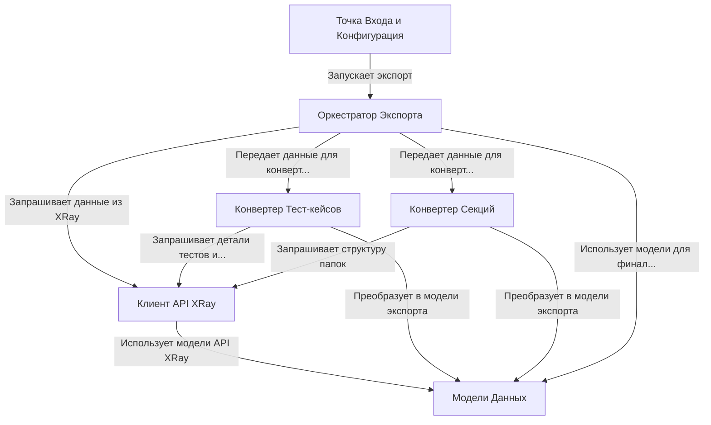

# Tutorial: XRayExporter

Этот проект - инструмент для **экспорта** *тест-кейсов* и структуры папок из **XRay** (для **Jira**).
Он подключается к XRay, *забирает данные* (тесты, папки, вложения), преобразует их во внутренний *формат* и сохраняет результат в виде JSON-файлов и сопутствующих файлов (например, вложений).
Это позволяет переносить тестовую документацию в другие системы управления тестированием.

## Chapters

1. [Точка Входа и Конфигурация
](01_точка_входа_и_конфигурация_.md)
2. [Оркестратор Экспорта
](02_оркестратор_экспорта_.md)
3. [Клиент API XRay
](03_клиент_api_xray_.md)
4. [Конвертер Тест-кейсов
](04_конвертер_тест_кейсов_.md)
5. [Конвертер Секций
](05_конвертер_секций_.md)
6. [Модели Данных
](06_модели_данных_.md)

---

Generated by [AI Codebase Knowledge Builder](https://github.com/The-Pocket/Tutorial-Codebase-Knowledge)