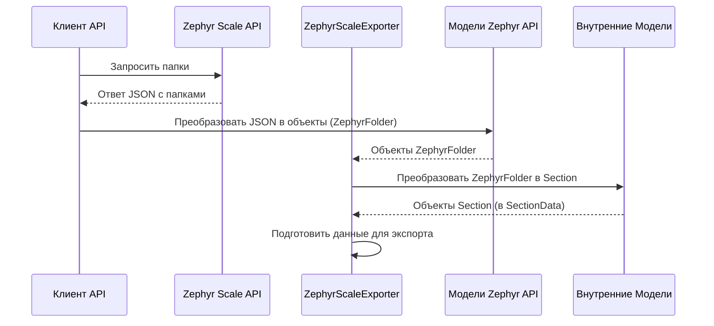

# Chapter 1: Модели Данных


Добро пожаловать в руководство по `ZephyrScaleExporter`! В этой первой главе мы познакомимся с одной из фундаментальных концепций любого приложения, работающего с данными - **Моделями Данных**.

Представьте, что вы строите дом из конструктора LEGO. У вас есть разные типы кубиков: большие, маленькие, плоские, кубики с окошками. Чтобы построить что-то осмысленное, вам нужен план или инструкция, которая говорит, какие кубики использовать и как их соединять.

В программировании **Модели Данных** играют роль таких инструкций или "чертежей" для данных. Это специальные классы (шаблоны) в коде, которые описывают, какую структуру имеют данные, с которыми работает наше приложение `ZephyrScaleExporter`.

## Зачем нужны Модели Данных?

Главная задача `ZephyrScaleExporter` — получить данные из Zephyr Scale (системы управления тестированием) и подготовить их для импорта в другую систему (например, Test IT). Данные из Zephyr Scale приходят в определенном формате, определенном его API (Application Programming Interface - интерфейс, через который программы общаются друг с другом).

Однако формат данных Zephyr Scale может не совпадать с тем, как мы хотим их использовать внутри нашего приложения или с тем, какой формат требуется для конечного экспорта.

Вот тут-то и приходят на помощь Модели Данных. Они позволяют нам:

1.  **Структурировать данные из Zephyr API:** Когда мы получаем информацию из Zephyr (например, список тест-кейсов или папок), мы "раскладываем" ее по формочкам-моделям, соответствующим структуре ответа API. Это помогает программе понять, какие поля есть у тест-кейса (название, описание, шаги и т.д.).
2.  **Определить структуру для внутреннего использования и экспорта:** Мы также создаем модели, которые описывают, как данные должны выглядеть *после* обработки и подготовки к экспорту.

Думайте об этом как о формочках для печенья: есть формочки для сырого теста (данные из API), а есть формы для уже испеченного и украшенного печенья (данные для экспорта). Модели данных — это наши формочки.

## Типы Моделей в `ZephyrScaleExporter`

В нашем проекте есть два основных типа моделей:

### 1. Модели Данных Zephyr API

Эти модели точно отражают структуру данных, как мы их получаем от Zephyr Scale API. Они обычно содержат атрибуты `JsonPropertyName`, которые помогают автоматически преобразовать ответ API (в формате JSON) в объекты нашего приложения.

**Пример: Папка в Zephyr (`ZephyrFolder`)**

Zephyr Scale организует тест-кейсы по папкам. Когда мы запрашиваем список папок через API, Zephyr возвращает данные примерно такого вида (в формате JSON):

```json
// Пример ответа от Zephyr API (упрощенно)
{
  "values": [
    { "id": 101, "parentId": null, "name": "Функциональные тесты" },
    { "id": 102, "parentId": 101, "name": "Авторизация" }
  ]
}
```

Чтобы работать с этими данными в коде C#, у нас есть модель `ZephyrFolder`:

```csharp
// File: Models\ZephyrFolder.cs
using System.Text.Json.Serialization;

namespace ZephyrScaleExporter.Models;

public class ZephyrFolder
{
    // Атрибут указывает, какому полю в JSON соответствует это свойство
    [JsonPropertyName("id")]
    public int Id { get; set; }

    [JsonPropertyName("parentId")]
    public int? ParentId { get; set; } // null, если это папка верхнего уровня

    [JsonPropertyName("name")]
    public string Name { get; set; }
}

// Эта модель представляет собой контейнер для списка папок
public class ZephyrFolders
{
    [JsonPropertyName("values")]
    public List<ZephyrFolder> Folders { get; set; }
}
```

*   `ZephyrFolder` описывает одну папку с ее `Id`, `ParentId` (ID родительской папки) и `Name`.
*   `ZephyrFolders` содержит список (`List`) таких папок, потому что API обычно возвращает сразу несколько элементов.
*   `[JsonPropertyName("...")]` — это "подсказка" для системы, которая связывает поле в JSON (например, `"id"`) со свойством в нашем C# классе (например, `Id`).

Точно так же существуют модели для других сущностей Zephyr:

*   `ZephyrTestCase`: Представляет тест-кейс со всеми его полями (название, описание, шаги, статус, приоритет и т.д.).
*   `ZephyrStep`: Описывает один шаг внутри тест-кейса.
*   `ZephyrPriority`, `ZephyrStatus`: Представляют соответственно приоритеты и статусы, используемые в Zephyr.
*   `ZephyrProject`: Модель для проекта Zephyr.
*   `BaseModel`: Базовая модель, содержащая общие поля для ответов API, которые возвращают списки данных с пагинацией (возможностью загружать данные по частям), такие как `Next` (ссылка на следующую страницу), `Total` (общее количество элементов), `IsLast` (является ли эта страница последней).

### 2. Модели для Внутреннего Использования / Экспорта

Эти модели определяют структуру данных в том виде, в каком они нужны нам *после* обработки или для финального экспорта. Они могут отличаться от моделей Zephyr API.

**Пример: Данные о Разделах (`SectionData`)**

Предположим, для экспорта нам нужно представить папки Zephyr как "Разделы" (Sections) в целевой системе. Модель `SectionData` помогает организовать эту информацию:

```csharp
// File: Models\SectionData.cs
using Models; // Предполагается, что класс Models.Section существует в другом месте

namespace ZephyrScaleExporter.Models;

public class SectionData
{
    // Список обработанных разделов (преобразованных из ZephyrFolder)
    public List<Section> Sections { get; set; }
    // Словарь для быстрого поиска: ID папки Zephyr -> ID созданного раздела в целевой системе
    public Dictionary<int, Guid> SectionMap { get; set; }
}
```

*   `Sections`: Это список объектов `Section` (предположим, это модель целевой системы), которые мы создали на основе `ZephyrFolder`.
*   `SectionMap`: Это словарь (как записная книжка "ключ-значение"), который помогает быстро найти ID нового раздела (`Guid`), зная ID исходной папки Zephyr (`int`). Это очень полезно при связывании тест-кейсов с правильными разделами.

Другие примеры таких моделей:

*   `AttributeData`: Хранит информацию об атрибутах (например, статус, приоритет) и их соответствия между Zephyr и целевой системой.
*   `TestCaseData`: Содержит список обработанных тест-кейсов (`List<TestCase>`) и связанных с ними атрибутов.
*   `ZephyrDescriptionData`: Хотя название содержит "Zephyr", эта модель используется для хранения обработанного описания и списка вложений, извлеченных из него.

## Как это работает вместе?

Модели данных — это строительные блоки. Сам процесс экспорта, который мы рассмотрим в следующих главах, выглядит примерно так:

1.  **Запрос данных:** С помощью [Клиент API Zephyr Scale](02_клиент_api_zephyr_scale_.md) мы отправляем запрос к Zephyr Scale API (например, "дай мне все папки проекта X").
2.  **Получение и Десериализация:** Zephyr API возвращает данные в формате JSON. Наш клиент API использует модели Zephyr (например, `ZephyrFolders` и `ZephyrFolder`), чтобы автоматически преобразовать этот JSON в объекты C#, с которыми легко работать.
3.  **Трансформация:** [Сервис Экспорта](03_сервис_экспорта_.md) и связанные с ним компоненты (например, [Преобразование Структуры Проекта (Папки и Атрибуты)](04_преобразование_структуры_проекта__папки_и_атрибуты_.md) и [Преобразование Тест-кейсов](05_преобразование_тест_кейсов_.md)) берут данные из моделей Zephyr API и преобразуют их в формат, необходимый для экспорта, используя внутренние/экспортные модели (например, `SectionData`, `TestCaseData`).
4.  **Экспорт:** Подготовленные данные в формате внутренних моделей используются для создания файла экспорта или отправки данных в целевую систему.



На этой диаграмме показан упрощенный процесс для папок: Клиент запрашивает данные, получает JSON, преобразует его с помощью Моделей Zephyr API (`ZephyrFolder`), затем `ZephyrScaleExporter` преобразует их во Внутренние Модели (`Section`) и готовит к экспорту.

## Немного про реализацию

Как вы видели в примерах, модели данных — это, по сути, простые классы C# (их иногда называют POCO - Plain Old C# Objects).

*   **Свойства:** Они содержат свойства (`public int Id { get; set; }`), которые соответствуют полям данных. `get; set;` означает, что значение свойства можно и читать, и записывать.
*   **Атрибуты Сериализации:** Атрибут `[JsonPropertyName("json_field_name")]` из пространства имен `System.Text.Json.Serialization` используется для указания того, как свойство класса C# соотносится с полем в JSON-ответе от API. Это позволяет автоматически заполнять объекты данными из JSON.
*   **Коллекции:** Для представления списков элементов (например, несколько папок или тест-кейсов) используется `List<T>` (например, `List<ZephyrFolder>`).
*   **Словари:** Для быстрого поиска или сопоставления идентификаторов используется `Dictionary<TKey, TValue>` (например, `Dictionary<int, Guid> SectionMap`). Это как справочник, где по ключу (например, ID папки Zephyr) можно быстро найти значение (например, ID раздела в новой системе).

```csharp
// File: Models\AttributeData.cs (Пример использования List и Dictionary)
using Attribute = Models.Attribute; // Предполагается, что Models.Attribute определен

namespace ZephyrScaleExporter.Models;

public class AttributeData
{
    // Список всех атрибутов для целевой системы
    public List<Attribute> Attributes { get; set; }

    // Словарь для сопоставления: Имя атрибута -> его ID в целевой системе
    public Dictionary<string, Guid> AttributeMap { get; set; }

    // Словарь для сопоставления: ID статуса Zephyr -> Имя статуса
    public Dictionary<int, string> StateMap { get; set; }

    // Словарь для сопоставления: ID приоритета Zephyr -> Имя приоритета
    public Dictionary<int, string> PriorityMap { get; set; }
}
```

Этот пример `AttributeData` показывает, как модели могут комбинировать списки (`List`) для хранения набора элементов и словари (`Dictionary`) для эффективного сопоставления данных между системами.

## Заключение

В этой главе мы узнали, что такое **Модели Данных** в `ZephyrScaleExporter`. Это "чертежи", описывающие структуру данных, которые мы получаем из Zephyr Scale API и которые используем внутри приложения для подготовки к экспорту. Мы увидели, что существуют разные типы моделей для разных целей и как они помогают организовать процесс работы с данными.

Понимание моделей данных — это первый шаг. Теперь, когда мы знаем, *в каком виде* мы получаем и храним данные, пора узнать, *как* мы их получаем.

В следующей главе мы рассмотрим [Клиент API Zephyr Scale](02_клиент_api_zephyr_scale_.md), компонент, отвечающий за взаимодействие с Zephyr Scale API и получение необработанных данных.

---

Generated by [AI Codebase Knowledge Builder](https://github.com/The-Pocket/Tutorial-Codebase-Knowledge)