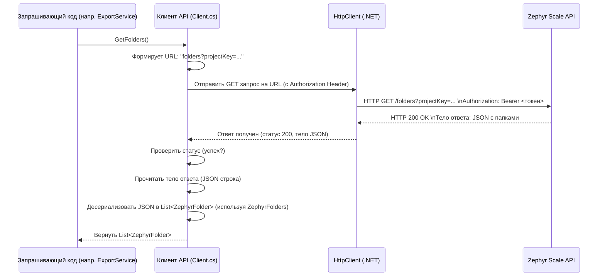

# Chapter 2: Клиент API Zephyr Scale


В [предыдущей главе](01_модели_данных_.md) мы разобрались с **Моделями Данных** — нашими "чертежами" для информации, которую мы получаем из Zephyr Scale и используем внутри `ZephyrScaleExporter`. Мы узнали, *в каком виде* эти данные существуют в нашем коде. Теперь настало время узнать, *как* мы их получаем.

Представьте, что Zephyr Scale — это другая страна, говорящая на своем языке (языке API). Чтобы получить оттуда нужные нам "товары" (данные о тест-кейсах, папках, проектах), нам нужен кто-то, кто умеет общаться с этой страной.

Именно эту роль и выполняет **Клиент API Zephyr Scale** (или просто `Client`). Это компонент нашего приложения, который действует как переводчик или дипломат:

*   Он знает "адрес" Zephyr Scale (его URL).
*   У него есть "ключ доступа" (API токен) для аутентификации.
*   Он умеет "говорить" на языке Zephyr API — то есть отправлять правильно сформированные запросы (например, "дай мне список папок для проекта X").
*   Он умеет "понимать" ответы от Zephyr (данные в формате JSON) и преобразовывать их в понятные нашему приложению объекты C#, используя [Модели Данных](01_модели_данных_.md), которые мы изучили ранее.

Без Клиента API наше приложение было бы изолировано и не смогло бы получить никакую информацию из Zephyr Scale.

## Зачем нужен Клиент API?

Основная задача `ZephyrScaleExporter` — получить данные из Zephyr. Клиент API решает именно эту задачу. Он инкапсулирует (прячет внутри себя) всю логику взаимодействия с внешним сервисом:

1.  **Подключение:** Устанавливает соединение с сервером Zephyr Scale.
2.  **Аутентификация:** Предъявляет API токен, чтобы Zephyr понял, что у нас есть право запрашивать данные.
3.  **Формирование Запросов:** Создает HTTP-запросы к нужным "точкам входа" (endpoints) API Zephyr. Например, для получения папок это будет один URL, для получения тест-кейсов — другой.
4.  **Отправка Запросов:** Посылает эти запросы по сети.
5.  **Получение Ответов:** Принимает ответы от Zephyr API (обычно в формате JSON).
6.  **Обработка Ответов:** Проверяет, успешно ли выполнен запрос, и, если да, преобразует (десериализует) JSON-ответ в объекты C# с помощью [Моделей Данных](01_модели_данных_.md).
7.  **Обработка Ошибок:** Если что-то пошло не так (неверный токен, Zephyr недоступен, запрашиваемый проект не найден), Клиент сообщает об ошибке.

Думайте о нем как о курьере, который едет по указанному адресу (URL), показывает пропуск (токен), забирает посылку (JSON-ответ) и привозит ее вам в распакованном виде (C# объекты).

## Как использовать Клиент API?

Обычно вам не нужно создавать Клиента вручную каждый раз. В современных приложениях используется механизм "Внедрения Зависимостей" (Dependency Injection), который автоматически создает и предоставляет Клиента тому компоненту, которому он нужен (например, [Сервису Экспорта](03_сервис_экспорта_.md)). Настройка этого процесса происходит при запуске приложения, о чем мы подробнее поговорим в главе [Точка Входа и Конфигурация](07_точка_входа_и_конфигурация_.md).

Для использования Клиента вам нужно знать его "контракт" — какие методы он предоставляет. Этот контракт описан в интерфейсе `IClient`.

```csharp
// File: Client\IClient.cs (Упрощенный пример)
using ZephyrScaleExporter.Models;

namespace ZephyrScaleExporter.Client;

// Интерфейс описывает "меню" действий, которые может выполнять Клиент
public interface IClient
{
    // Получить информацию о проекте
    Task<ZephyrProject> GetProject();
    // Получить список папок
    Task<List<ZephyrFolder>> GetFolders();
    // Получить список тест-кейсов для конкретной папки
    Task<List<ZephyrTestCase>> GetTestCases(int folderId);
    // Получить шаги для конкретного тест-кейса
    Task<List<ZephyrStep>> GetSteps(string testCaseKey);
    // Получить скрипт (предусловие/постусловие) для тест-кейса
    Task<ZephyrTestScript> GetTestScript(string testCaseKey);
    // Скачать вложение по URL
    Task<byte[]> DownloadAttachment(string url);
    // ... и другие методы для получения статусов, приоритетов и т.д.
}
```

Этот интерфейс `IClient` говорит нам, что мы можем попросить Клиента выполнить определенные действия: получить проект, папки, тест-кейсы и так далее. Обратите внимание на `Task<...>`. Это означает, что методы асинхронные — они работают в фоновом режиме, не блокируя основную программу во время ожидания ответа от сети.

**Пример использования (концептуальный):**

Предположим, у нас есть [Сервис Экспорта](03_сервис_экспорта_.md), и ему нужен список папок. Он получит экземпляр `IClient` (благодаря внедрению зависимостей) и вызовет его метод:

```csharp
// Внутри другого класса (например, ExportService)
public class ExportService
{
    private readonly IClient _zephyrClient; // Получаем клиента через конструктор

    public ExportService(IClient zephyrClient)
    {
        _zephyrClient = zephyrClient;
    }

    public async Task ProcessProjectFolders()
    {
        Console.WriteLine("Запрашиваю папки у Zephyr...");
        // Используем клиент для получения данных
        List<ZephyrFolder> folders = await _zephyrClient.GetFolders(); // Вызов метода клиента

        Console.WriteLine($"Получено папок: {folders.Count}");
        // Дальше эти папки будут обрабатываться...
        // (Например, преобразовываться с помощью [Преобразование Структуры Проекта (Папки и Атрибуты)](04_преобразование_структуры_проекта__папки_и_атрибуты_.md))
    }
}
```

В этом примере `ExportService` просто вызывает `_zephyrClient.GetFolders()`. Клиент делает всю "грязную работу" по общению с API, а сервис получает готовый список объектов `ZephyrFolder`, соответствующих модели данных из Главы 1.

## Как это работает "под капотом"?

Давайте заглянем внутрь `Client.cs` и посмотрим, как реализован, например, метод `GetFolders()`.

**Шаг 1: Инициализация Клиента**

Когда приложение запускается, создается экземпляр класса `Client`. В этот момент происходит чтение конфигурации (URL сервера Zephyr, API токен, имя проекта) и настройка `HttpClient` — стандартного .NET компонента для отправки HTTP-запросов.

```csharp
// File: Client\Client.cs (Конструктор - Упрощенно)
public class Client : IClient
{
    private readonly HttpClient _httpClient; // Для отправки HTTP запросов
    private readonly string _projectName;  // Имя проекта в Zephyr
    private readonly ILogger<Client> _logger; // Для записи логов

    public Client(ILogger<Client> logger, IConfiguration configuration)
    {
        _logger = logger;
        // Читаем настройки из конфигурации
        var section = configuration.GetSection("zephyr");
        var url = section["url"]; // Адрес Zephyr API
        var token = section["token"]; // Наш секретный ключ доступа
        _projectName = section["projectName"];

        // Проверяем, что настройки заданы (код проверок опущен для краткости)

        _httpClient = new HttpClient();
        _httpClient.BaseAddress = new Uri(url); // Устанавливаем базовый адрес
        // Добавляем заголовок авторизации для КАЖДОГО запроса
        _httpClient.DefaultRequestHeaders.Authorization
            = new AuthenticationHeaderValue("Bearer", token);
    }
    // ... остальные методы клиента ...
}
```

Здесь мы создаем `HttpClient`, указываем ему базовый адрес API (`BaseAddress`) и самое важное — добавляем заголовок `Authorization` со схемой `Bearer` и нашим токеном. Этот заголовок будет автоматически добавляться ко всем запросам, которые `_httpClient` будет отправлять.

**Шаг 2: Вызов метода `GetFolders()`**

Когда вызывается метод `GetFolders()`, происходит следующее:



**Шаг 3: Реализация `GetFolders()` в коде**

Вот как это выглядит в коде `Client.cs`:

```csharp
// File: Client\Client.cs (Метод GetFolders - Упрощенно)
public async Task<List<ZephyrFolder>> GetFolders()
{
    _logger.LogInformation("Запрашиваю папки..."); // Запись в лог

    // Формируем часть URL, специфичную для папок, добавляя ключ проекта
    var requestUrl = $"folders?projectKey={_projectName}&folderType=TEST_CASE";

    // Отправляем GET запрос с помощью настроенного _httpClient
    // Базовый адрес и заголовок авторизации добавятся автоматически
    var response = await _httpClient.GetAsync(requestUrl);

    // Проверяем, успешен ли запрос (код статуса 2xx)
    if (!response.IsSuccessStatusCode)
    {
        // Если ошибка, логируем и выбрасываем исключение
        _logger.LogError("Не удалось получить папки. Статус: {StatusCode}", response.StatusCode);
        // В реальном коде здесь может быть более детальная обработка ошибки
        throw new Exception($"Не удалось получить папки. Статус: {response.StatusCode}");
    }

    // Читаем тело ответа как строку (это будет JSON)
    var content = await response.Content.ReadAsStringAsync();

    // Используем JsonSerializer для преобразования JSON строки в объект ZephyrFolders
    // ZephyrFolders - это модель данных, содержащая List<ZephyrFolder> (см. Главу 1)
    var foldersContainer = JsonSerializer.Deserialize<ZephyrFolders>(content);

    _logger.LogDebug("Папки получены."); // Запись в лог (для отладки)

    // Возвращаем список папок из контейнера
    return foldersContainer.Folders;
}
```

Ключевые моменты здесь:

1.  `_httpClient.GetAsync(requestUrl)`: Отправляет GET-запрос. `await` означает, что мы ждем завершения операции без блокировки потока.
2.  `response.IsSuccessStatusCode`: Проверяет код ответа HTTP.
3.  `response.Content.ReadAsStringAsync()`: Читает тело ответа.
4.  `JsonSerializer.Deserialize<ZephyrFolders>(content)`: Магия преобразования JSON в C# объекты с использованием модели `ZephyrFolders`. Библиотека `System.Text.Json` автоматически сопоставляет поля JSON (используя атрибуты `[JsonPropertyName(...)]` из наших моделей) со свойствами C# классов.

Большинство других методов Клиента (например, `GetStatuses`, `GetPriorities`, `GetTestCases`) работают по очень схожему принципу: формируют свой уникальный URL, отправляют запрос, получают JSON и десериализуют его с помощью соответствующей [Модели Данных](01_модели_данных_.md).

Метод `GetTestCases` немного сложнее, так как он поддерживает **пагинацию** — загрузку данных по частям, если их очень много. Он делает запросы в цикле, пока API не скажет, что это последняя страница (`isLast == true`).

Метод `DownloadAttachment` отличается тем, что он ожидает не JSON, а непосредственно байты файла (`byte[]`) и использует для этого `GetByteArrayAsync`.

## Заключение

В этой главе мы познакомились с **Клиентом API Zephyr Scale** — важным компонентом `ZephyrScaleExporter`, который отвечает за все общение с внешним API Zephyr Scale. Мы узнали, что он инкапсулирует детали HTTP-запросов, аутентификации и преобразования ответов JSON в C# объекты с помощью [Моделей Данных](01_модели_данных_.md). Клиент предоставляет простой интерфейс (`IClient`) для получения нужной информации из Zephyr.

Теперь, когда мы знаем, *как* получать необработанные данные из Zephyr Scale, возникает следующий вопрос: что с ними делать дальше? Просто получить данные недостаточно, их нужно обработать, преобразовать и подготовить для экспорта в целевую систему.

Этим занимается следующий ключевой компонент нашего приложения. В [следующей главе](03_сервис_экспорта_.md) мы погрузимся в **Сервис Экспорта**, который оркестрирует весь процесс, используя Клиента для получения данных и другие компоненты для их трансформации.

---

Generated by [AI Codebase Knowledge Builder](https://github.com/The-Pocket/Tutorial-Codebase-Knowledge)