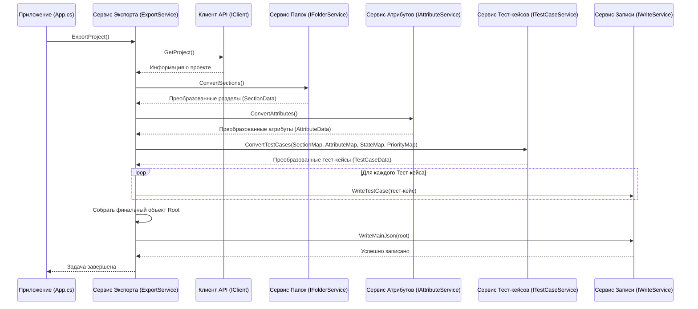

# Chapter 3: Сервис Экспорта


В [предыдущей главе](02_клиент_api_zephyr_scale_.md) мы узнали, как наш [Клиент API Zephyr Scale](02_клиент_api_zephyr_scale_.md) общается с Zephyr и получает оттуда "сырые" данные. Но просто получить данные — это только полдела. Их нужно как-то организовать, преобразовать и подготовить к экспорту в нужный формат. Кто же будет руководить всем этим процессом?

Встречайте **Сервис Экспорта** (`ExportService`)! Это главный координатор всего нашего проекта `ZephyrScaleExporter`.

## Зачем нужен Сервис Экспорта?

Представьте себе съемочную площадку фильма. Есть актеры (специализированные сервисы, которые умеют работать с папками, тест-кейсами, атрибутами), есть оператор (сервис записи файлов), есть сценарист ([Модели Данных](01_модели_данных_.md), описывающие структуру), есть специалист по спецэффектам ([Обработка Вложений](06_обработка_вложений_.md)). Но кто-то должен убедиться, что все они работают слаженно, в правильном порядке и для достижения общей цели — снять фильм (экспортировать проект)?

Эту роль выполняет **режиссер** — наш **Сервис Экспорта**.

`ExportService` не выполняет всю работу сам. Вместо этого, он:

1.  **Инициирует процесс:** Запускает экспорт всего проекта.
2.  **Запрашивает данные:** Использует [Клиент API Zephyr Scale](02_клиент_api_zephyr_scale_.md) для получения исходной информации из Zephyr (детали проекта).
3.  **Вызывает "специалистов":** Просит другие сервисы выполнить их задачи:
    *   Сервис папок ([Преобразование Структуры Проекта (Папки и Атрибуты)](04_преобразование_структуры_проекта__папки_и_атрибуты_.md)) — преобразовать папки Zephyr в разделы целевой системы.
    *   Сервис атрибутов ([Преобразование Структуры Проекта (Папки и Атрибуты)](04_преобразование_структуры_проекта__папки_и_атрибуты__.md)) — преобразовать статусы и приоритеты.
    *   Сервис тест-кейсов ([Преобразование Тест-кейсов](05_преобразование_тест_кейсов_.md)) — преобразовать тест-кейсы, связав их с разделами и атрибутами.
    *   Сервис вложений ([Обработка Вложений](06_обработка_вложений_.md)) — (неявно используется сервисом тест-кейсов) для обработки прикрепленных файлов.
4.  **Собирает результаты:** Получает обработанные данные от других сервисов.
5.  **Организует запись:** Использует сервис записи (`IWriteService`) для сохранения преобразованных тест-кейсов и итогового файла `index.json`.

Без `ExportService` наши специализированные "актеры" не знали бы, когда и что им делать, и весь процесс экспорта превратился бы в хаос. Он — центральный дирижер, который обеспечивает порядок и последовательность действий.

## Как использовать Сервис Экспорта?

Обычно вы не взаимодействуете с `ExportService` напрямую из командной строки. Основное приложение (`App.cs`) при запуске получает экземпляр `ExportService` (благодаря механизму Внедрения Зависимостей, о котором мы поговорим в главе [Точка Входа и Конфигурация](07_точка_входа_и_конфигурация_.md)) и вызывает его единственный метод `ExportProject`.

Вот как это выглядит в главном классе приложения:

```csharp
// File: App.cs (Упрощенный фрагмент)
using Microsoft.Extensions.Logging;
using ZephyrScaleExporter.Services; // Пространство имен для сервисов

namespace ZephyrScaleExporter;

public class App
{
    private readonly ILogger<App> _logger;
    // Поле для хранения сервиса экспорта
    private readonly IExportService _exportService;

    // Сервис экспорта "внедряется" при создании App
    public App(ILogger<App> logger,  IExportService exportService)
    {
        _logger = logger;
        _exportService = exportService; // Сохраняем полученный сервис
    }

    public void Run(string[] args)
    {
        _logger.LogInformation("Starting application"); // "Начинаем работу"

        // Вызываем главный метод сервиса экспорта
        _exportService.ExportProject().Wait(); // Запускаем экспорт и ждем его завершения

        _logger.LogInformation("Ending application"); // "Завершаем работу"
    }
}
```

*   В конструкторе `App` мы получаем готовый `IExportService`. Нам не нужно думать, как его создать.
*   В методе `Run` мы просто вызываем `_exportService.ExportProject()`. Эта единственная строка запускает весь сложный процесс экспорта данных.
*   `.Wait()` используется здесь для того, чтобы программа дождалась завершения асинхронной задачи экспорта перед тем, как завершить свою работу.

Сам контракт сервиса очень прост, он описан в интерфейсе `IExportService`:

```csharp
// File: Services\IExportService.cs
namespace ZephyrScaleExporter.Services;

// Интерфейс описывает, что должен уметь делать ExportService
public interface IExportService
{
    // Единственный метод - запустить экспорт проекта
    Task ExportProject();
}
```

Этот интерфейс говорит: "Любой, кто реализует `IExportService`, должен предоставить метод `ExportProject`". Это делает структуру приложения гибкой — если в будущем мы захотим изменить способ экспорта, нам нужно будет создать новый класс, реализующий этот интерфейс, не меняя остальной код, который его использует (например, `App.cs`).

## Как это работает "под капотом"?

Давайте представим, что мы нажали кнопку "Экспорт" (что эквивалентно запуску `App.Run()`). Что происходит внутри `ExportService`?

**Шаг за Шагом (Аналогия с режиссером):**

1.  _Режиссер (ExportService) кричит: "Свет, камера, мотор!"_ — Метод `ExportProject` вызван.
2.  _Режиссер спрашивает реквизитора (IClient): "Мне нужны детали о локации (проект)!"_ — `ExportService` вызывает `_client.GetProject()`.
3.  _Режиссер говорит художнику-постановщику (IFolderService): "Подготовь декорации (папки)!"_ — `ExportService` вызывает `_folderService.ConvertSections()`. Художник возвращает готовые декорации и список соответствий (что чему соответствует).
4.  _Режиссер говорит гримеру (IAttributeService): "Подготовь костюмы и грим (атрибуты)!"_ — `ExportService` вызывает `_attributeService.ConvertAttributes()`. Гример возвращает подготовленные атрибуты и "таблицы соответствий" (например, какой статус Zephyr какому статусу в новой системе соответствует).
5.  _Режиссер говорит актерам (ITestCaseService): "Ваш выход! Вот декорации (папки), вот костюмы (атрибуты). Играйте свои роли (тест-кейсы)!"_ — `ExportService` вызывает `_testCaseService.ConvertTestCases()`, передавая ему результаты от художника и гримера. Актеры возвращают сыгранные сцены (обработанные тест-кейсы) и, возможно, новые атрибуты, которые они обнаружили по ходу дела.
6.  _Режиссер говорит оператору (IWriteService): "Снимай каждую сцену отдельно!"_ — `ExportService` в цикле проходит по каждому обработанному тест-кейсу и просит `_writeService.WriteTestCase()` сохранить его.
7.  _Режиссер собирает все использованные костюмы (атрибуты) в одну коробку._ — `ExportService` добавляет атрибуты, обнаруженные при обработке тест-кейсов, к общему списку атрибутов.
8.  _Режиссер составляет финальный список сцен и актеров (Root object)._ — `ExportService` создает объект `Root`, который содержит информацию о проекте, все разделы, все атрибуты и список идентификаторов всех тест-кейсов.
9.  _Режиссер говорит оператору (IWriteService): "Снимай финальные титры (основной JSON-файл)!"_ — `ExportService` вызывает `_writeService.WriteMainJson()`, передавая ему собранный `Root` объект.
10. _Режиссер кричит: "Снято!"_ — Метод `ExportProject` завершается.

**Диаграмма Последовательности:**



**Погружение в Код:**

Во-первых, `ExportService` сам зависит от других сервисов. Он получает их "готовыми к использованию" через свой конструктор (это и есть Внедрение Зависимостей):

```csharp
// File: Services\ExportService.cs (Конструктор)
using JsonWriter; // Для IWriteService
using Microsoft.Extensions.Logging;
using Models; // Для Root
using ZephyrScaleExporter.Client; // Для IClient
// ... и другие пространства имен

namespace ZephyrScaleExporter.Services;

public class ExportService : IExportService
{
    // Приватные поля для хранения "помощников"
    private readonly IFolderService _folderService;
    private readonly IAttributeService _attributeService;
    private readonly ITestCaseService _testCaseService;
    private readonly IWriteService _writeService;
    private readonly ILogger<ExportService> _logger;
    private readonly IClient _client;

    // Конструктор принимает все необходимые зависимости
    public ExportService(ILogger<ExportService> logger, IClient client, IFolderService folderService,
        IAttributeService attributeService, ITestCaseService testCaseService, IWriteService writeService)
    {
        // Просто сохраняем полученные сервисы в приватные поля
        _folderService = folderService;
        _attributeService = attributeService;
        _testCaseService = testCaseService;
        _writeService = writeService;
        _logger = logger;
        _client = client;
    }

    // Здесь будет метод ExportProject()...
}
```

Теперь посмотрим на сам метод `ExportProject`, реализующий описанную выше логику:

```csharp
// File: Services\ExportService.cs (Метод ExportProject)

public async Task ExportProject()
{
    _logger.LogInformation("Exporting project"); // "Начинаем экспорт"

    // 1. Получаем информацию о проекте от Клиента API
    var project = await _client.GetProject(); // Используем await для асинхронного вызова

    // 2. Преобразуем папки с помощью Сервиса Папок
    var folders = await _folderService.ConvertSections();
    // 'folders' теперь содержит список Sections и SectionMap (ID Zephyr -> ID Section)

    // 3. Преобразуем атрибуты с помощью Сервиса Атрибутов
    var attributes = await _attributeService.ConvertAttributes();
    // 'attributes' содержит список Attributes, AttributeMap, StateMap, PriorityMap

    // 4. Преобразуем тест-кейсы, передав им карты для связи
    var testCases = await _testCaseService.ConvertTestCases(
        folders.SectionMap, // Карта папок
        attributes.AttributeMap, // Карта атрибутов
        attributes.StateMap,     // Карта статусов
        attributes.PriorityMap   // Карта приоритетов
    );
    // 'testCases' содержит список готовых TestCase и список Attributes, созданных из шагов

    // 5. Записываем каждый тест-кейс в отдельный файл
    foreach (var testCase in testCases.TestCases)
    {
        await _writeService.WriteTestCase(testCase); // Просим сервис записи сохранить
    }

    // 6. Добавляем атрибуты из шагов к общему списку атрибутов
    attributes.Attributes.AddRange(testCases.Attributes);

    // 7. Собираем корневой объект для главного JSON файла
    var root = new Root
    {
        ProjectName = project.Key,          // Ключ проекта из Zephyr
        Attributes = attributes.Attributes, // Полный список атрибутов
        Sections = folders.Sections,        // Список разделов (папок)
        SharedSteps = new List<Guid>(),     // Пока не реализовано, пустой список
        TestCases = testCases.TestCases.Select(t => t.Id).ToList() // Список ID всех тест-кейсов
    };

    // 8. Записываем главный файл index.json
    await _writeService.WriteMainJson(root);

    _logger.LogInformation("Export complete"); // "Экспорт завершен"
}
```

Этот метод наглядно демонстрирует роль `ExportService` как координатора: он сам не занимается сложной логикой преобразований, а делегирует ее специализированным сервисам (`_folderService`, `_attributeService`, `_testCaseService`) и сервису записи (`_writeService`), передавая им необходимые данные и собирая результаты.

## Заключение

В этой главе мы познакомились с **Сервисом Экспорта** (`ExportService`) — сердцем нашего приложения `ZephyrScaleExporter`. Мы поняли, что он действует как режиссер или дирижер, координируя работу других компонентов: получает данные через [Клиент API Zephyr Scale](02_клиент_api_zephyr_scale_.md), поручает их преобразование специализированным сервисам и организует запись результата с помощью сервиса записи. Он обеспечивает правильную последовательность и слаженность всего процесса экспорта.

Теперь, когда мы знаем, кто руководит процессом, самое время посмотреть, как работают его "помощники". Кто и как именно превращает папки и атрибуты проекта в формат, понятный целевой системе?

В [следующей главе](04_преобразование_структуры_проекта__папки_и_атрибуты_.md) мы подробно рассмотрим, как происходит **Преобразование Структуры Проекта (Папки и Атрибуты)**.

---

Generated by [AI Codebase Knowledge Builder](https://github.com/The-Pocket/Tutorial-Codebase-Knowledge)