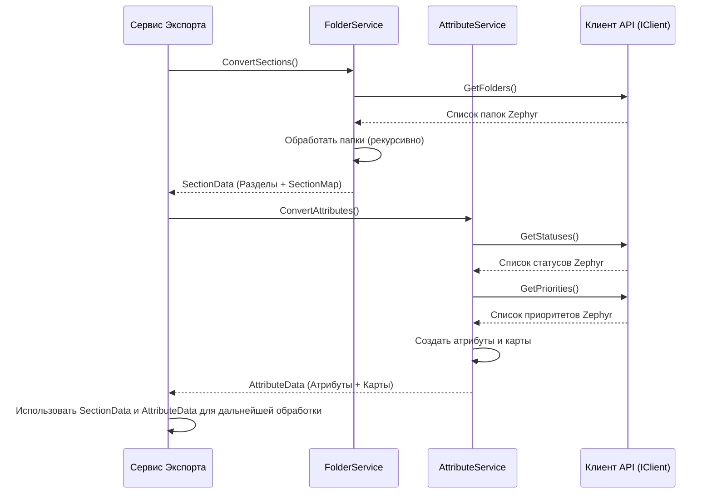

# Chapter 4: Преобразование Структуры Проекта (Папки и Атрибуты)


В [предыдущей главе](03_сервис_экспорта_.md) мы увидели, как [Сервис Экспорта](03_сервис_экспорта_.md) дирижирует всем процессом переноса данных из Zephyr Scale. Он, как режиссер на съемочной площадке, дает команды своим "помощникам". Теперь давайте познакомимся с первыми двумя важными помощниками: теми, кто отвечает за воссоздание *скелета* нашего проекта в новом формате Test IT.

Представьте, что мы переезжаем из одного дома (Zephyr Scale) в другой (Test IT). Прежде чем перевозить вещи (тест-кейсы), нам нужно убедиться, что в новом доме есть комнаты (разделы), похожие на старые, и что у нас есть нужные ярлычки для коробок (атрибуты, такие как "Срочно" или "В процессе").

Именно эту задачу решают два сервиса: `FolderService` (для папок/разделов) и `AttributeService` (для атрибутов). Они строят каркас и добавляют основные характеристики проекта в формате Test IT.

## Зачем нужно преобразовывать структуру?

В Zephyr Scale тест-кейсы организованы в иерархическую структуру папок. Также у тест-кейсов есть системные поля, такие как "Статус" (Например, Draft, Approved) и "Приоритет" (Например, High, Medium, Low).

Целевая система, например Test IT, тоже имеет свою структуру:
*   Вместо папок используются "Разделы" (Sections), которые также могут быть вложенными.
*   Вместо жестко заданных системных полей часто используются настраиваемые "Атрибуты". Мы можем создать атрибут "Статус из Zephyr" и добавить в него все возможные статусы из Zephyr, и то же самое для приоритета.

**Проблема:** Как автоматически воссоздать структуру папок Zephyr в виде разделов Test IT и как перенести системные поля Zephyr (статус, приоритет) в виде пользовательских атрибутов Test IT?

**Решение:** Для этого у нас есть два специализированных сервиса:

1.  **`FolderService` (Архитектор):** Отвечает за преобразование древовидной структуры папок Zephyr в структуру разделов Test IT. Он строит "комнаты" в нашем новом доме.
2.  **`AttributeService` (Декоратор):** Отвечает за обработку системных полей Zephyr (статус, приоритет) и создание соответствующих пользовательских атрибутов в Test IT с их возможными значениями. Он создает "ярлычки" и описания для наших вещей.

Давайте рассмотрим каждый из них подробнее.

## `FolderService`: Строим Каркас из Разделов

`FolderService` берет список всех папок из проекта Zephyr Scale и превращает их в иерархию разделов (Sections) для Test IT.

**Как он это делает? (Пошагово)**

1.  **Запрос папок:** Сначала `FolderService` просит [Клиент API Zephyr Scale](02_клиент_api_zephyr_scale_.md) предоставить ему полный список всех папок из нужного проекта в Zephyr.
2.  **Поиск "Предков":** Затем он ищет в этом списке папки самого верхнего уровня – те, у которых нет родительской папки (`ParentId` равен `null`). Это "корни" нашей структуры.
3.  **Построение "Дерева":** Для каждой папки верхнего уровня он создает соответствующий объект `Section` (модель данных для Test IT, см. [Модели Данных](01_модели_данных_.md)).
4.  **Поиск "Потомков" (Рекурсия):** Самое интересное происходит дальше. Для каждой созданной секции сервис ищет в исходном списке папок Zephyr те, которые являются её прямыми дочерними элементами (у которых `ParentId` равен ID текущей папки). Для каждой найденной дочерней папки он снова создает объект `Section` и рекурсивно повторяет этот шаг – ищет уже её дочерние элементы. Этот процесс продолжается до тех пор, пока не будут обработаны все вложенные папки. Это называется *рекурсией* – метод вызывает сам себя для обработки подзадач.
5.  **Создание "Шпаргалки":** Во время создания каждой секции `FolderService` запоминает соответствие: какой ID был у папки в Zephyr и какой ID (уникальный идентификатор GUID) получила новая секция в Test IT. Эта информация сохраняется в словаре `SectionMap` (`Dictionary<int, Guid>`). Эта "шпаргалка" очень важна – она понадобится позже, чтобы поместить каждый тест-кейс в правильную секцию.

**Аналогия:** Представьте, что вы строите генеалогическое древо семьи по старым записям. Вы находите самых старших предков (папки без `ParentId`), затем ищете их детей (`ParentId` = ID предка), затем внуков и так далее. При этом вы создаете новую карточку для каждого человека (объект `Section`) и записываете в блокнот (`SectionMap`): "Человек #101 из старых записей – это Анна Петрова в нашем новом древе".

**Заглянем в код (`FolderService.cs`)**

Сервис начинается с получения всех папок через клиент API.

```csharp
// File: Services\FolderService.cs (Начало ConvertSections)
public async Task<SectionData> ConvertSections()
{
    // 1. Получаем все папки из Zephyr
    var folders = await _client.GetFolders();
    var sections = new List<Section>(); // Список для готовых секций Test IT

    // 2. Ищем папки верхнего уровня (без родителя)
    foreach (var folder in folders.Where(f => f.ParentId == null))
    {
        _logger.LogDebug("Converting folder {@Folder}", folder); // Запись в лог

        // 3. Создаем секцию для папки верхнего уровня
        var section = new Section
        {
            Id = Guid.NewGuid(), // Генерируем уникальный ID для новой секции
            Name = folder.Name, // Берем имя из папки Zephyr
            // 4. Рекурсивно ищем и создаем дочерние секции
            Sections = GetChildrenSections(folder.Id, folders),
            // PostconditionSteps и PreconditionSteps пока оставляем пустыми
            PostconditionSteps = new List<Step>(),
            PreconditionSteps = new List<Step>()
        };

        sections.Add(section); // Добавляем готовую секцию (с детьми) в список
        // 5. Запоминаем соответствие ID Zephyr -> ID новой секции
        _sectionMap.Add(folder.Id, section.Id);
    }

    // ... (конец метода)
```

*   `await _client.GetFolders()`: Обращаемся к [Клиенту API Zephyr Scale](02_клиент_api_zephyr_scale_.md) за списком папок.
*   `folders.Where(f => f.ParentId == null)`: Отбираем только папки верхнего уровня.
*   `new Section { ... }`: Создаем объект `Section` из [Моделей Данных](01_модели_данных_.md).
*   `Guid.NewGuid()`: Генерируем уникальный идентификатор для новой секции.
*   `GetChildrenSections(folder.Id, folders)`: Вызываем вспомогательный рекурсивный метод для поиска и создания дочерних секций.
*   `_sectionMap.Add(folder.Id, section.Id)`: Добавляем запись в нашу "шпаргалку" (`SectionMap`).

А вот как работает рекурсивный метод `GetChildrenSections`:

```csharp
// File: Services\FolderService.cs (Рекурсивный метод GetChildrenSections)
private List<Section> GetChildrenSections(int? parentFolderId, IEnumerable<ZephyrFolder> allFolders)
{
    // Отбираем папки, у которых ParentId совпадает с ID родителя, для которого мы ищем детей
    var childrenFolders = allFolders.Where(f => f.ParentId == parentFolderId).ToList();

    var childSections = new List<Section>(); // Список для дочерних секций

    foreach (var childFolder in childrenFolders)
    {
        var section = new Section
        {
            Id = Guid.NewGuid(),
            Name = childFolder.Name,
            // ВАЖНО: Снова вызываем GetChildrenSections для текущей дочерней папки
            Sections = GetChildrenSections(childFolder.Id, allFolders),
            PostconditionSteps = new List<Step>(),
            PreconditionSteps = new List<Step>()
        };

        childSections.Add(section);
        // Не забываем добавить дочернюю папку в карту соответствий
        _sectionMap.Add(childFolder.Id, section.Id);
    }

    return childSections; // Возвращаем список созданных дочерних секций
}
```

*   Ключевой момент – `Sections = GetChildrenSections(childFolder.Id, allFolders)`. Метод вызывает сам себя для найденного дочернего элемента (`childFolder`), чтобы найти уже *его* дочерние элементы.

**Результат Работы `FolderService`**

После завершения работы метод `ConvertSections` возвращает объект `SectionData`. Этот объект содержит:

*   `Sections`: Список корневых объектов `Section` (каждый из которых содержит свои вложенные секции). Это и есть наша новая структура разделов.
*   `SectionMap`: Тот самый словарь-шпаргалка (`Dictionary<int, Guid>`), который связывает ID папок из Zephyr с ID новых секций в Test IT.

```csharp
// File: Services\FolderService.cs (Конец ConvertSections)
    // ... (код из первого блока)

    // Создаем объект SectionData для возврата результата
    var sectionData = new SectionData
    {
        Sections = sections, // Готовая иерархия секций
        SectionMap = _sectionMap // Карта соответствий ID
    };

    _logger.LogDebug("Sections: {@SectionData}", sectionData); // Логируем результат

    return sectionData; // Возвращаем SectionData
}
```

Этот `SectionData` затем используется [Сервисом Экспорта](03_сервис_экспорта_.md) и передается [Сервису Преобразования Тест-кейсов](05_преобразование_тест_кейсов_.md).

## `AttributeService`: Добавляем Характеристики (Статус и Приоритет)

После того как `FolderService` построил каркас из разделов, `AttributeService` добавляет важные характеристики – атрибуты для статусов и приоритетов.

**Как он это делает? (Пошагово)**

1.  **Запрос Опций:** Сначала `AttributeService` просит [Клиент API Zephyr Scale](02_клиент_api_zephyr_scale_.md) предоставить ему списки всех возможных *статусов* и *приоритетов*, используемых в проекте Zephyr. Клиент возвращает их вместе с их именами и ID.
2.  **Определение Атрибутов:** Сервис создает два объекта `Attribute` (модель данных Test IT) для представления этих полей. Он использует предопределенные имена, например, "Zephyr State" и "Zephyr Priority" (они хранятся в `Models/Constants.cs` для единообразия). Тип этих атрибутов устанавливается как `AttributeType.Options`, что означает "список выбора".
3.  **Наполнение Опций:** Для каждого созданного атрибута (`"Zephyr State"` и `"Zephyr Priority"`) сервис заполняет его список `Options`, используя имена статусов и приоритетов, полученные на шаге 1. Теперь у нас есть атрибуты Test IT, которые точно отражают возможные значения из Zephyr.
4.  **Создание Карт Соответствий:** Сервис создает несколько словарей-шпаргалок:
    *   `AttributeMap`: Сопоставляет имя атрибута ("Zephyr State", "Zephyr Priority") с его новым уникальным ID (GUID) в Test IT.
    *   `StateMap`: Сопоставляет ID статуса из Zephyr с его *именем* (например, `10001 -> "Draft"`).
    *   `PriorityMap`: Сопоставляет ID приоритета из Zephyr с его *именем* (например, `20002 -> "High"`).
    Эти карты понадобятся позже, чтобы при обработке тест-кейса понять, какой статус или приоритет ему присвоить в Test IT.

**Аналогия:** Представьте, что вы создаете онлайн-анкету (Test IT). Вам нужно добавить два вопроса с выбором ответа: "Статус задачи" и "Приоритет задачи". Сначала вы узнаете все возможные варианты ответов из старой бумажной анкеты (Запрос опций из Zephyr). Затем вы создаете в онлайн-анкете два поля с выпадающим списком (`new Attribute`). После этого вы заполняете варианты ответов для каждого списка (Наполнение опций). Наконец, вы делаете себе пометки (`StateMap`, `PriorityMap`): "Если в старой анкете была галочка напротив 'Срочно' (ID 20002), то в новой анкете нужно выбрать 'High'".

**Заглянем в код (`AttributeService.cs`)**

```csharp
// File: Services\AttributeService.cs (Метод ConvertAttributes)
public async Task<AttributeData> ConvertAttributes()
{
    _logger.LogInformation("Converting attributes"); // "Преобразуем атрибуты"

    // 1. Получаем списки статусов и приоритетов из Zephyr
    var statuses = await _client.GetStatuses();
    var priorities = await _client.GetPriorities();

    // 2. Создаем объекты Attribute для Test IT
    var attributes = new List<Attribute>
    {
        // Атрибут для Статуса
        new()
        {
            Id = Guid.NewGuid(), // Новый уникальный ID
            Name = Constants.StateAttribute, // Имя "Zephyr State" из констант
            Type = AttributeType.Options, // Тип "список выбора"
            IsRequired = false, // Не обязательный
            IsActive = true, // Активный
            // 3. Наполняем опции именами статусов из Zephyr
            Options = statuses.Select(x => x.Name).ToList()
        },
        // Атрибут для Приоритета
        new()
        {
            Id = Guid.NewGuid(), // Новый уникальный ID
            Name = Constants.PriorityAttribute, // Имя "Zephyr Priority"
            IsRequired = false,
            IsActive = true,
            Type = AttributeType.Options,
            // 3. Наполняем опции именами приоритетов из Zephyr
            Options = priorities.Select(x => x.Name).ToList()
        }
    };

    _logger.LogDebug("Attributes: {@Attribute}", attributes); // Логируем созданные атрибуты

    // 4. Создаем карты соответствий и возвращаем результат в объекте AttributeData
    return new AttributeData
    {
        Attributes = attributes, // Список созданных атрибутов Test IT
        // Карта: Имя атрибута -> ID атрибута Test IT
        AttributeMap = attributes.ToDictionary(x => x.Name, x => x.Id),
        // Карта: ID статуса Zephyr -> Имя статуса
        StateMap = statuses.ToDictionary(x => x.Id, x => x.Name),
        // Карта: ID приоритета Zephyr -> Имя приоритета
        PriorityMap = priorities.ToDictionary(x => x.Id, x => x.Name)
    };
}

```

*   `await _client.GetStatuses()` и `await _client.GetPriorities()`: Используем [Клиент API Zephyr Scale](02_клиент_api_zephyr_scale_.md) для получения данных.
*   `new Attribute { ... }`: Создаем объекты атрибутов Test IT.
*   `Constants.StateAttribute` и `Constants.PriorityAttribute`: Используем константные имена для атрибутов.
*   `Options = statuses.Select(x => x.Name).ToList()`: Заполняем список `Options` именами статусов (и аналогично для приоритетов). `Select(x => x.Name)` выбирает только свойство `Name` из каждого объекта статуса/приоритета.
*   `statuses.ToDictionary(x => x.Id, x => x.Name)`: Создает словарь, где ключом является `Id` статуса Zephyr, а значением – его `Name`. (Аналогично для `PriorityMap` и `AttributeMap`).

**Результат Работы `AttributeService`**

Метод `ConvertAttributes` возвращает объект `AttributeData`. Этот объект содержит:

*   `Attributes`: Список созданных объектов `Attribute` ("Zephyr State", "Zephyr Priority") с их опциями.
*   `AttributeMap`: Словарь для поиска ID атрибута Test IT по его имени.
*   `StateMap`: Словарь для поиска имени статуса по его ID в Zephyr.
*   `PriorityMap`: Словарь для поиска имени приоритета по его ID в Zephyr.

Этот `AttributeData` также используется [Сервисом Экспорта](03_сервис_экспорта_.md) и передается [Сервису Преобразования Тест-кейсов](05_преобразование_тест_кейсов_.md).

## Как Все это Работает Вместе?

[Сервис Экспорта](03_сервис_экспорта_.md) сначала вызывает `FolderService.ConvertSections()`, чтобы получить структуру разделов и карту `SectionMap`. Затем он вызывает `AttributeService.ConvertAttributes()`, чтобы получить атрибуты и карты `AttributeMap`, `StateMap`, `PriorityMap`.



Получив `SectionData` и `AttributeData`, [Сервис Экспорта](03_сервис_экспорта_.md) теперь имеет всю необходимую информацию о структуре проекта (разделы, атрибуты) и "шпаргалки" (карты) для правильного преобразования самих тест-кейсов.

## Заключение

В этой главе мы разобрались, как `ZephyrScaleExporter` воссоздает структуру проекта Zepyhr Scale в формате, подходящем для Test IT. Мы узнали, что:

*   `FolderService` действует как архитектор, преобразуя иерархию папок Zephyr в разделы Test IT и создавая карту `SectionMap` для связи старых и новых идентификаторов.
*   `AttributeService` действует как декоратор, создавая атрибуты Test IT для статусов и приоритетов Zephyr, наполняя их нужными опциями и создавая карты (`AttributeMap`, `StateMap`, `PriorityMap`) для последующего использования.

Теперь, когда у нас есть "каркас" (разделы) и "основные характеристики" (атрибуты) нашего нового проекта, мы готовы перейти к самому главному – переносу содержимого, то есть самих тест-кейсов.

В [следующей главе](05_преобразование_тест_кейсов_.md) мы погрузимся в процесс **Преобразования Тест-кейсов**, где увидим, как используются результаты работы `FolderService` и `AttributeService` для корректного переноса каждого тест-кеса со всеми его деталями.

---

Generated by [AI Codebase Knowledge Builder](https://github.com/The-Pocket/Tutorial-Codebase-Knowledge)