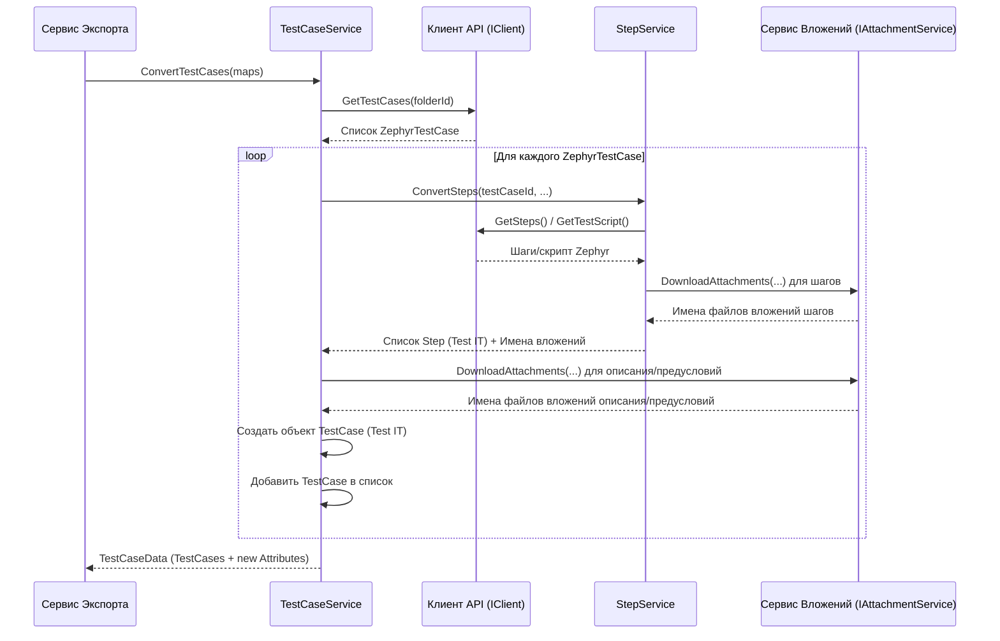

# Chapter 5: Преобразование Тест-кейсов


В [предыдущей главе](04_преобразование_структуры_проекта__папки_и_атрибуты_.md) мы подготовили "фундамент" и "каркас" для нашего нового проекта в формате Test IT. Мы узнали, как `FolderService` воссоздает структуру папок в виде Разделов (Sections) и как `AttributeService` преобразует Статусы и Приоритеты Zephyr в настраиваемые Атрибуты Test IT. Мы также получили важные "шпаргалки" — словари (`SectionMap`, `AttributeMap`, `StateMap`, `PriorityMap`), которые связывают старые идентификаторы Zephyr с новыми.

Теперь, когда у нас есть структура, самое время наполнить ее содержимым — самими **тест-кейсами**. Это самая важная часть экспорта, ведь именно в них содержится ценная информация о проверках.

Представьте, что мы не просто переезжаем, а перевозим целую кухню ресторана. В прошлой главе мы построили новое помещение (`FolderService`) и развесили таблички на полках для ингредиентов (`AttributeService`). Теперь нам нужен главный повар, который возьмет рецепты и ингредиенты из старого ресторана (данные тест-кейсов Zephyr) и приготовит из них блюда для подачи в новом ресторане (тест-кейсы в формате Test IT).

Эту роль выполняет **Сервис Преобразования Тест-кейсов** (`TestCaseService`).

## Зачем нужен Сервис Преобразования Тест-кейсов?

Данные о тест-кейсе в Zephyr Scale и в Test IT хранятся по-разному. Нам нужно не просто скопировать информацию, а аккуратно *преобразовать* ее:

*   **Название и Описание:** Перенести текст, но при этом учесть форматирование и найти ссылки на вложения.
*   **Шаги:** Преобразовать шаги Zephyr (которые могут быть простыми или с полями Действие/Ожидаемый результат/Тестовые данные) в формат шагов Test IT, также обработав вложения внутри шагов.
*   **Предусловия:** Аналогично описанию, перенести текст и извлечь вложения.
*   **Связи:** Преобразовать ссылки на задачи Jira или веб-ссылки в формат связей Test IT.
*   **Метки (Labels):** Перенести их в поле "Теги" (Tags) в Test IT.
*   **Статус и Приоритет:** Используя карты, созданные в прошлой главе (`StateMap`, `PriorityMap`, `AttributeMap`), присвоить тест-кейсу правильные значения атрибутов "Zephyr State" и "Zephyr Priority".
*   **Пользовательские поля (Custom Fields):** Преобразовать их в значения соответствующих атрибутов в Test IT. Если атрибута для какого-то поля еще нет, его нужно создать!
*   **Раздел (Папка):** Поместить тест-кейс в правильный раздел Test IT, используя карту `SectionMap`.
*   **Вложения:** Найти все вложения (в описании, предусловиях, шагах), скачать их (с помощью сервиса вложений) и прикрепить к новому тест-кейсу.

`TestCaseService` — это наш "шеф-повар", который знает "рецепт" (логику конвертации) и координирует работу "помощников" (например, [Сервис Обработки Шагов](#stepservice-преобразование-шагов) и [Сервис Обработки Вложений](06_обработка_вложений_.md)) для приготовления каждого "блюда" (тест-кейса Test IT) из "ингредиентов" (данных Zephyr).

## Как это работает: Рецепт Преобразования

[Сервис Экспорта](03_сервис_экспорта_.md) вызывает единственный публичный метод `TestCaseService` — `ConvertTestCases`, передавая ему все карты соответствий, полученные от `FolderService` и `AttributeService`.

```csharp
// File: Services\ITestCaseService.cs
using ZephyrScaleExporter.Models;

namespace ZephyrScaleExporter.Services;

// Интерфейс описывает, что должен уметь TestCaseService
public interface ITestCaseService
{
    // Главный метод: преобразует тест-кейсы из Zephyr, используя карты
    Task<TestCaseData> ConvertTestCases(
        Dictionary<int, Guid> sectionMap, // Карта папок Zephyr -> Разделы Test IT
        Dictionary<string, Guid> attributeMap, // Карта Имя Атрибута -> ID Атрибута Test IT
        Dictionary<int, string> statusMap, // Карта ID Статуса Zephyr -> Имя Статуса
        Dictionary<int, string> priorityMap // Карта ID Приоритета Zephyr -> Имя Приоритета
    );
}
```

Внутри `ConvertTestCases` происходит следующее (упрощенная логика):

1.  **Перебор Разделов:** Сервис берет карту `sectionMap` и для каждого ID папки Zephyr (ключ словаря) делает следующее:
2.  **Запрос Тест-кейсов:** Просит [Клиент API Zephyr Scale](02_клиент_api_zephyr_scale_.md) дать ему список всех тест-кейсов (`ZephyrTestCase`), находящихся в этой конкретной папке Zephyr.
3.  **Преобразование Каждого Тест-кейса:** Для каждого полученного `ZephyrTestCase` выполняется детальное преобразование:
    *   **Генерация ID:** Создается новый уникальный ID (`Guid`) для будущего тест-кейса Test IT.
    *   **Преобразование Шагов:** Вызывается `StepService` (о нем чуть ниже) для конвертации шагов `ZephyrTestCase`. `StepService` вернет список объектов `Step` в формате Test IT и список имен вложений, найденных в шагах.
    *   **Обработка Описания и Предусловий:** Текст описания и предусловий из `ZephyrTestCase` обрабатывается: из него извлекается "чистый" текст и список ссылок на вложения. Затем вызывается [Сервис Обработки Вложений](06_обработка_вложений_.md) для скачивания этих файлов. Список имен скачанных файлов запоминается.
    *   **Маппинг Полей:** Создается новый объект `TestCase` (модель данных Test IT из [Главы 1](01_модели_данных_.md)). Его поля заполняются данными из `ZephyrTestCase`:
        *   `Id`: Новый сгенерированный Guid.
        *   `Name`: Имя из `ZephyrTestCase.Name`.
        *   `Description`: "Чистый" текст описания.
        *   `Steps`: Список `Step`, полученный от `StepService`.
        *   `PreconditionSteps`: Создается список `Step` (обычно один шаг) с "чистым" текстом предусловия и списком его вложений.
        *   `SectionId`: Находится по `sectionMap` с использованием ID папки Zephyr, в которой лежал `ZephyrTestCase`.
        *   `Tags`: Заполняется из `ZephyrTestCase.Labels`.
        *   `Links`: Преобразуются из `ZephyrTestCase.Links` (веб-ссылки и ссылки на задачи).
        *   `Attributes`: Это список атрибутов, присвоенных тест-кейсу.
            *   Сначала добавляются атрибуты для Статуса и Приоритета. Их ID берутся из `attributeMap` (по имени "Zephyr State" / "Zephyr Priority"), а значения - из `statusMap` / `priorityMap` (по ID статуса/приоритета из `ZephyrTestCase`).
            *   Затем обрабатываются пользовательские поля (`ZephyrTestCase.CustomFields`). Для каждого поля ищется соответствующий атрибут Test IT (если его нет, он создается на лету!). В список `Attributes` тест-кейса добавляется объект `CaseAttribute` со ссылкой на ID атрибута и значением поля.
        *   `Attachments`: Собирается полный список имен всех файлов, скачанных для описания, предусловий и шагов.
        *   `State`, `Priority`, `Duration` и др.: Устанавливаются значения по умолчанию или вычисляются.
    *   **Сбор Результатов:** Готовый объект `TestCase` добавляется в общий список. Если при обработке пользовательских полей были созданы новые атрибуты Test IT, они тоже запоминаются.
4.  **Возврат Данных:** После обработки всех тест-кейсов во всех папках, сервис возвращает объект `TestCaseData`, который содержит:
    *   `TestCases`: Полный список преобразованных тест-кейсов `TestCase`.
    *   `Attributes`: Список *новых* атрибутов, созданных для пользовательских полей (если они были).

## `StepService`: Преобразование Шагов

`TestCaseService` не занимается преобразованием шагов напрямую, он делегирует эту задачу своему помощнику — `StepService` (реализует интерфейс `IStepService`).

```csharp
// File: Services\IStepService.cs
using Models; // Пространство имен для моделей Test IT (Step)

namespace ZephyrScaleExporter.Services;

// Интерфейс описывает, что должен уметь StepService
public interface IStepService
{
    // Преобразует шаги для указанного тест-кейса
    // Принимает ID и имя тест-кейса, а также ссылку на скрипт теста (может содержать шаги)
    Task<List<Step>> ConvertSteps(Guid testCaseId, string testCaseName, string testScript);
}
```

`StepService` делает примерно следующее:

1.  **Проверка Типа Шагов:** Определяет, используются ли в Zephyr "классические" шаги (с полями Описание/Данные/Результат) или "script-based" (простой текстовый скрипт).
2.  **Запрос Шагов/Скрипта:** Если шаги классические, запрашивает их у [Клиента API Zephyr Scale](02_клиент_api_zephyr_scale_.md). Если скрипт — запрашивает его.
3.  **Конвертация:**
    *   Для классических шагов: Преобразует каждый шаг Zephyr (`ZephyrStep`) в шаг Test IT (`Step`). При этом из полей "Описание", "Тестовые данные", "Ожидаемый результат" извлекаются ссылки на вложения и "чистый" текст. Вызывается [Сервис Обработки Вложений](06_обработка_вложений_.md) для скачивания файлов. Имена скачанных файлов добавляются к соответствующим полям в объекте `Step`.
    *   Для скрипта: Создает один шаг `Step`, помещая весь текст скрипта в поле `Action`.
4.  **Возврат:** Возвращает список преобразованных объектов `Step` для `TestCaseService`.

```csharp
// File: Services\StepService.cs (Упрощенный фрагмент ConvertSteps)
public async Task<List<Step>> ConvertSteps(Guid testCaseId, string testCaseName, string testScript)
{
    _logger.LogInformation("Преобразуем шаги для тест-кейса {TestCaseName}", testCaseName);

    List<Step> stepList = new List<Step>();

    // Здесь логика определения типа шагов (пропущена для краткости)
    // Допустим, мы определили, что это классические шаги

    var zephyrSteps = await _client.GetSteps(testCaseName); // Запрашиваем шаги у клиента

    foreach (var zephyrStep in zephyrSteps)
    {
        // Пропускаем пустые шаги
        if (zephyrStep.Inline == null) continue;

        // 1. Извлекаем текст и вложения из полей Zephyr
        var action = Utils.ExtractAttachments(zephyrStep.Inline.Description);
        var expected = Utils.ExtractAttachments(zephyrStep.Inline.ExpectedResult);
        var testData = Utils.ExtractAttachments(zephyrStep.Inline.TestData);

        // 2. Создаем объект Step для Test IT
        var newStep = new Step
        {
            Action = action.Description, // "Чистый" текст действия
            Expected = expected.Description, // "Чистый" текст ожид. результата
            TestData = testData.Description, // "Чистый" текст тестовых данных
            ActionAttachments = new List<string>(),
            ExpectedAttachments = new List<string>(),
            TestDataAttachments = new List<string>()
        };

        // 3. Скачиваем вложения и добавляем их имена к шагу
        if (action.Attachments.Count > 0)
        {
            // Вызываем сервис вложений
            var fileNames = await _attachmentService.DownloadAttachments(testCaseId, action.Attachments);
            newStep.ActionAttachments.AddRange(fileNames); // Добавляем имена файлов
        }
        // Аналогично для expected.Attachments и testData.Attachments...

        stepList.Add(newStep); // Добавляем готовый шаг в список
    }

    _logger.LogDebug("Шаги: {@StepList}", stepList);
    return stepList;
}
```

*   `_client.GetSteps()`: Получаем "сырые" шаги из Zephyr.
*   `Utils.ExtractAttachments()`: Вспомогательная функция (не показана) для отделения текста от ссылок на вложения.
*   `_attachmentService.DownloadAttachments()`: Вызов [Сервиса Обработки Вложений](06_обработка_вложений_.md).
*   `new Step { ... }`: Создание объекта шага Test IT.

## Диаграмма Процесса Преобразования Тест-кейса



Эта диаграмма показывает, как `TestCaseService` получает "сырые" тест-кейсы, вызывает `StepService` для обработки шагов, который, в свою очередь, может вызывать `Client` и `AttachmentService`. Сам `TestCaseService` также вызывает `AttachmentService` для обработки вложений в описании и предусловиях перед тем, как собрать финальный объект `TestCase`.

## Погружение в код `TestCaseService`

Давайте посмотрим на ключевые части метода `ConvertTestCases` в `TestCaseService.cs`.

**1. Начало и Циклы:**

```csharp
// File: Services\TestCaseService.cs (Начало ConvertTestCases)
public async Task<TestCaseData> ConvertTestCases(Dictionary<int, Guid> sectionMap,
    Dictionary<string, Guid> attributeMap,
    Dictionary<int, string> statusMap, Dictionary<int, string> priorityMap)
{
    _logger.LogInformation("Преобразуем тест-кейсы");
    var testCases = new List<TestCase>(); // Список для готовых TestCase

    // Внешний цикл: итерируем по папкам Zephyr (ключам карты sectionMap)
    foreach (var section in sectionMap)
    {
        // Получаем тест-кейсы для текущей папки Zephyr
        var cases = await _client.GetTestCases(section.Key);

        // Внутренний цикл: итерируем по каждому тест-кейсу из папки
        foreach (var zephyrTestCase in cases)
        {
            // ... здесь код преобразования одного zephyrTestCase ...
        }
    }
    // ... остальной код ...
}
```

*   Метод принимает карты, созданные в [Главе 4](04_преобразование_структуры_проекта__папки_и_атрибуты_.md).
*   Цикл `foreach (var section in sectionMap)` проходит по всем папкам проекта.
*   `await _client.GetTestCases(section.Key)` запрашивает тест-кейсы для конкретной папки у [Клиента API Zephyr Scale](02_клиент_api_zephyr_scale_.md).
*   Внутренний цикл обрабатывает каждый `zephyrTestCase`.

**2. Преобразование Одного Тест-кейса (Внутри внутреннего цикла):**

```csharp
// File: Services\TestCaseService.cs (Внутри цикла по zephyrTestCase)

// Генерируем уникальный ID для нового тест-кейса
var testCaseId = Guid.NewGuid();

// Вызываем StepService для конвертации шагов
var steps = await _stepService.ConvertSteps(testCaseId, zephyrTestCase.Key, // Key = Имя/Ключ ТК в Zephyr
    zephyrTestCase.TestScript.Self); // Ссылка на скрипт/шаги

// Собираем имена вложений из шагов (пропущено для краткости)
var attachments = new List<string>();
// ... код добавления attachments из steps ...

// Обрабатываем описание
var descriptionData = Utils.ExtractAttachments(zephyrTestCase.Description);
var descriptionAttachments = await _attachmentService.DownloadAttachments(testCaseId, descriptionData.Attachments);
attachments.AddRange(descriptionAttachments);

// Обрабатываем предусловие
var preconditionData = Utils.ExtractAttachments(zephyrTestCase.Precondition);
var preconditionAttachments = await _attachmentService.DownloadAttachments(testCaseId, preconditionData.Attachments);
attachments.AddRange(preconditionAttachments);

// Создаем объект TestCase
var testCase = new TestCase
{
    Id = testCaseId,
    Name = zephyrTestCase.Name,
    Description = descriptionData.Description, // "Чистый" текст
    State = StateType.NotReady, // Статус по умолчанию Test IT
    Priority = PriorityType.Medium, // Приоритет по умолчанию Test IT
    Steps = steps, // Шаги от StepService
    PreconditionSteps = ConvertPreconditionToSteps(preconditionData.Description, preconditionAttachments), // Предусловие как шаг
    PostconditionSteps = new List<Step>(), // Постусловие не поддерживается
    Duration = _duration, // Время выполнения по умолчанию
    // Заполняем атрибуты (Статус, Приоритет) используя карты
    Attributes = new List<CaseAttribute>
    {
        new() { Id = attributeMap[Constants.StateAttribute], Value = statusMap[zephyrTestCase.Status.Id] },
        new() { Id = attributeMap[Constants.PriorityAttribute], Value = priorityMap[zephyrTestCase.Priority.Id] }
    },
    Tags = zephyrTestCase.Labels, // Метки Zephyr -> Теги Test IT
    Attachments = attachments, // Все собранные имена вложений
    Iterations = new List<Iteration>(), // Итерации не поддерживаются
    Links = ConvertLinks(zephyrTestCase.Links), // Конвертируем ссылки
    SectionId = section.Value // ID раздела Test IT из карты sectionMap
};

// Добавляем атрибуты из пользовательских полей Zephyr
testCase.Attributes.AddRange(ConvertAttributes(zephyrTestCase.CustomFields));

testCases.Add(testCase); // Добавляем готовый TestCase в список

// ... (обработка создания новых атрибутов для Custom Fields, если нужно, пропущена) ...
```

*   `_stepService.ConvertSteps`: Делегирование преобразования шагов.
*   `Utils.ExtractAttachments` и `_attachmentService.DownloadAttachments`: Обработка вложений в описании и предусловиях с помощью вспомогательной функции и [Сервиса Обработки Вложений](06_обработка_вложений_.md).
*   `new TestCase { ... }`: Создание объекта `TestCase` из [Моделей Данных](01_модели_данных_.md). Обратите внимание, как используются карты `attributeMap`, `statusMap`, `priorityMap`, `sectionMap` для установки правильных ID и значений.
*   `ConvertLinks` и `ConvertAttributes`: Вспомогательные методы внутри `TestCaseService` для преобразования ссылок и пользовательских полей (их код не показан здесь, но они используют предоставленные данные `zephyrTestCase`).
*   `_attributeMap` (поле класса `TestCaseService`, не показано в конструкторе): Используется в `ConvertAttributes` для хранения и создания на лету атрибутов Test IT для пользовательских полей Zephyr.

**3. Завершение и Возврат:**

```csharp
// File: Services\TestCaseService.cs (Конец ConvertTestCases)

    // ... (конец циклов) ...

    // Возвращаем результат в виде TestCaseData
    return new TestCaseData
    {
        TestCases = testCases, // Список всех преобразованных тест-кейсов
        // Список НОВЫХ атрибутов, созданных для пользовательских полей
        Attributes = _attributeMap.Values.ToList()
    };
}
```

*   Возвращается объект `TestCaseData`, содержащий список `TestCase` и список *новых* `Attribute`, которые [Сервис Экспорта](03_сервис_экспорта_.md) затем добавит к общему списку атрибутов проекта.

## Заключение

В этой главе мы разобрались с "сердцем" процесса конвертации — `TestCaseService` и его помощником `StepService`. Мы увидели, как этот сервис, словно шеф-повар по рецепту, преобразует каждый тест-кейс из Zephyr Scale в формат Test IT, тщательно обрабатывая все его части: название, описание, шаги, предусловия, статус, приоритет, пользовательские поля, метки и связи.

Мы поняли, насколько важны карты соответствий (`SectionMap`, `AttributeMap`, `StateMap`, `PriorityMap`), созданные на предыдущем этапе ([Преобразование Структуры Проекта](04_преобразование_структуры_проекта__папки_и_атрибуты_.md)), для корректного связывания тест-кейсов с разделами и атрибутами в новой системе.

Также мы увидели, что `TestCaseService` и `StepService` активно используют другой важный компонент для работы с прикрепленными файлами. Как именно происходит поиск ссылок на файлы, их скачивание и сохранение?

Об этом мы подробно поговорим в [следующей главе](06_обработка_вложений_.md): **Обработка Вложений**.

---

Generated by [AI Codebase Knowledge Builder](https://github.com/The-Pocket/Tutorial-Codebase-Knowledge)