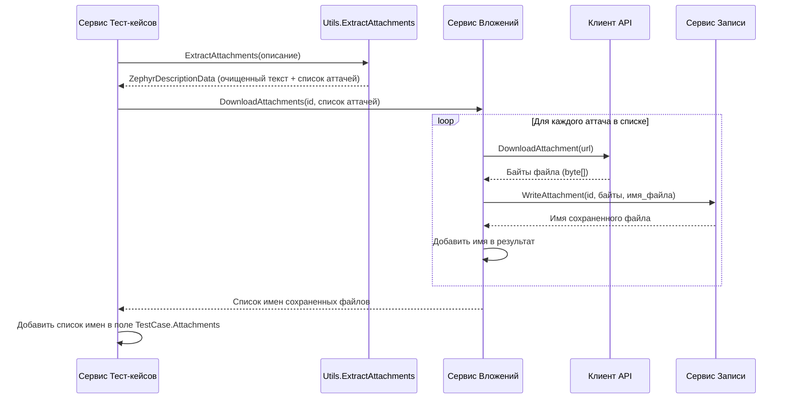

# Chapter 6: Обработка Вложений


В [предыдущей главе](05_преобразование_тест_кейсов_.md) мы погрузились в процесс преобразования тест-кейсов. Мы видели, как `TestCaseService` и `StepService` аккуратно переносили шаги, описания и другие данные. Вы, вероятно, заметили, что при обработке текста (описания, шагов) мы упоминали извлечение и скачивание *вложений* — файлов, прикрепленных к тест-кейсам или шагам в Zephyr.

Но как именно программа находит эти файлы, скачивает их и связывает с новыми тест-кейсами в Test IT? Этим и занимается механизм **обработки вложений**.

Представьте себе, что тест-кейс — это письмо, а в тексте письма есть упоминания с адресами посылок (например, "см. фото по адресу https://.../image.jpg"). Нам нужен почтальон, который:

1.  Прочитает письмо и найдет все адреса посылок (`Utils.ExtractAttachments`).
2.  Сходит по каждому адресу (`Client.DownloadAttachment`).
3.  Заберет посылку (скачает файл).
4.  Доставит ее по нужному адресу (сохранит файл на диск и сообщит имя сохраненного файла) (`WriteService.WriteAttachment`).
5.  Отчитается о доставке, чтобы мы могли указать в новом письме (тест-кейсе Test IT), какие посылки (файлы) к нему прилагаются (`AttachmentService`).

Компонент **Обработки Вложений** в `ZephyrScaleExporter` — это и есть наш усердный почтальон.

## Зачем нужна Обработка Вложений?

В Zephyr Scale пользователи часто прикрепляют файлы прямо в текст описания тест-кейса, в предусловия или в отдельные шаги. Обычно это выглядит как вставленное изображение (``) или ссылка на файл.

Когда мы экспортируем тест-кейс в Test IT, мы хотим, чтобы эти файлы тоже перенеслись и были доступны. Просто скопировать HTML-тег `` или URL недостаточно, потому что:

*   URL может указывать на внутренний ресурс Zephyr, который будет недоступен после миграции.
*   Test IT ожидает, что вложения будут загружены непосредственно в его систему (или доступны локально во время импорта) и будут перечислены списком в свойствах тест-кейса или шага.

**Проблема:** Как автоматически найти все ссылки на файлы в тексте Zephyr, скачать эти файлы и связать их правильным образом с экспортированным тест-кейсом Test IT?

**Решение:** Для этого в `ZephyrScaleExporter` есть несколько взаимодействующих частей:

1.  **`Utils.ExtractAttachments` (Ищейка):** Статический метод в классе `Utils`, который использует регулярные выражения (специальные шаблоны поиска текста) для обнаружения HTML-тегов `` и извлечения из них URL-адресов файлов и их имен. Он также "очищает" исходный текст, заменяя теги `` на понятные маркеры (например, `<<<image.jpg>>>`).
2.  **[Клиент API Zephyr Scale](02_клиент_api_zephyr_scale_.md) (Курьер):** Содержит метод `DownloadAttachment`, который принимает URL файла, обращается к серверу Zephyr по этому URL и скачивает содержимое файла в виде массива байтов.
3.  **`AttachmentService` (Координатор Почты):** Сервис, который оркестрирует процесс. Он получает список найденных вложений от `Utils`, просит `Client` скачать каждое из них, а затем просит `WriteService` сохранить файл.
4.  **`WriteService` (Склад/Архив):** Сервис, отвечающий за запись файлов на диск (мы не рассматривали его подробно, но представьте, что он есть). Его метод `WriteAttachment` принимает ID тест-кейса (для организации папок), байты файла и имя файла, сохраняет файл в специальную папку (например, `attachments/<TestCase_GUID>/filename.jpg`) и возвращает имя файла, которое будет использоваться в экспортированных данных Test IT.

## Как это работает на практике?

Давайте посмотрим, как обрабатывается вложение, найденное, например, в описании тест-кейса.

1.  **Обнаружение:** [Сервис Преобразования Тест-кейсов](05_преобразование_тест_кейсов_.md) получает описание тест-кейса из Zephyr, например:
    ```html
    Проверьте интерфейс.  Все должно быть видно.
    ```
    Он передает этот текст методу `Utils.ExtractAttachments`.

2.  **Извлечение и Очистка (`Utils.ExtractAttachments`):**
    Этот метод находит тег ``, извлекает URL `https://your.jira.server/secure/attachment/10001/screenshot.png` и имя файла `screenshot.png`. Он заменяет тег маркером:
    ```
    Проверьте интерфейс. <<<screenshot.png>>> Все должно быть видно.
    ```
    Метод возвращает объект `ZephyrDescriptionData`, содержащий:
    *   `Description`: Очищенный текст выше.
    *   `Attachments`: Список объектов `ZephyrAttachment`, где каждый объект содержит `Url` и `FileName` найденного файла.

    ```csharp
    // File: Models\ZephyrDescriptionData.cs
    namespace ZephyrScaleExporter.Models;

    // Хранит очищенное описание и список найденных вложений
    public class ZephyrDescriptionData
    {
        public string Description { get; set; }
        public List<ZephyrAttachment> Attachments { get; set; }
    }

    // Представляет одно найденное вложение
    public class ZephyrAttachment
    {
        public string FileName { get; set; }
        public string Url { get; set; }
    }
    ```

3.  **Координация Скачивания (`AttachmentService`):**
    [Сервис Преобразования Тест-кейсов](05_преобразование_тест_кейсов_.md) получает `ZephyrDescriptionData` и передает список `Attachments` (вместе с ID нового тест-кейса Test IT, например `testCaseId`) в метод `AttachmentService.DownloadAttachments`.

    ```csharp
    // File: Services\IAttachmentService.cs
    using ZephyrScaleExporter.Models;

    namespace ZephyrScaleExporter.Services;

    // Интерфейс описывает, что умеет сервис вложений
    public interface IAttachmentService
    {
        // Скачать одно вложение
        Task<string> DownloadAttachment(Guid id, ZephyrAttachment attachment);
        // Скачать список вложений
        Task<List<string>> DownloadAttachments(Guid id, List<ZephyrAttachment> attachments);
    }
    ```

4.  **Скачивание (`Client.DownloadAttachment`):**
    `AttachmentService` в цикле проходит по списку `ZephyrAttachment`. Для каждого вложения он вызывает `_client.DownloadAttachment(attachment.Url)`, передавая URL. [Клиент API Zephyr Scale](02_клиент_api_zephyr_scale_.md) выполняет HTTP-запрос и возвращает содержимое файла как `byte[]`.

5.  **Сохранение (`WriteService.WriteAttachment`):**
    `AttachmentService` берет полученные байты (`bytes`), ID тест-кейса (`testCaseId`) и имя файла (`attachment.FileName`) и вызывает `_writeService.WriteAttachment(testCaseId, bytes, attachment.FileName)`. Сервис записи создает нужные папки (например, `output/attachments/ВАШ_TESTCASE_GUID/`) и сохраняет туда файл под его оригинальным именем (`screenshot.png`). `WriteService` возвращает имя сохраненного файла (обычно то же самое, что и оригинальное).

6.  **Сбор Результатов:**
    `AttachmentService` собирает имена всех успешно сохраненных файлов в список `List<string>` и возвращает его [Сервису Преобразования Тест-кейсов](05_преобразование_тест_кейсов_.md).

7.  **Привязка к Тест-кейсу:**
    [Сервис Преобразования Тест-кейсов](05_преобразование_тест_кейсов_.md) добавляет полученный список имен файлов в поле `Attachments` своего объекта `TestCase` (модель Test IT). Аналогичные списки (`ActionAttachments`, `ExpectedAttachments`, `TestDataAttachments`) заполняются для шагов.

Теперь, когда мы экспортируем данные, тест-кейс Test IT будет содержать "чистое" описание (`Проверьте интерфейс. <<<screenshot.png>>> Все должно быть видно.`) и список прикрепленных файлов (`["screenshot.png"]`). При импорте в Test IT система сможет найти локально сохраненный файл `output/attachments/ВАШ_TESTCASE_GUID/screenshot.png` и прикрепить его к тест-кейсу.

## Немного кода

**`Utils.ExtractAttachments` (Ищейка - Упрощенно):**

Эта функция использует регулярные выражения для поиска тегов ``.

```csharp
// File: Services\Utils.cs (Упрощенно)
using System.Text.RegularExpressions;
using ZephyrScaleExporter.Models;

public static class Utils
{
    // Шаблон для поиска тега 
    private const string ImgPattern = "]*>";
    // Шаблон для извлечения URL из атрибута src="..."
    private const string UrlPattern = @"src=""(https://[^""]+)""";

    public static ZephyrDescriptionData ExtractAttachments(string? description)
    {
        if (string.IsNullOrEmpty(description)) // Если описание пустое
        {
            return new ZephyrDescriptionData { Description = "", Attachments = new() };
        }

        var data = new ZephyrDescriptionData { Description = description, Attachments = new() };
        // Находим все вхождения тега img
        var matches = Regex.Matches(description, ImgPattern);

        if (matches.Count == 0) return data; // Если картинок нет, выходим

        foreach (Match match in matches) // Для каждой найденной картинки
        {
            // Ищем URL внутри тега
            var urlMatch = Regex.Match(match.Value, UrlPattern);
            if (!urlMatch.Success) continue; // Если URL не найден, пропускаем

            var url = urlMatch.Groups[1].Value; // Извлекаем URL
            var fileName = url.Split('/').Last(); // Получаем имя файла из URL

            // Заменяем весь тег  на маркер <<<имя_файла>>>
            data.Description = data.Description.Replace(match.Value, $"<<<{fileName}>>>");
            // Добавляем информацию о вложении в список
            data.Attachments.Add(new ZephyrAttachment { FileName = fileName, Url = url });
        }
        return data; // Возвращаем очищенное описание и список вложений
    }
}
```

*   `Regex.Matches`: Находит все части текста, соответствующие шаблону `ImgPattern`.
*   `Regex.Match`: Ищет URL внутри найденного тега `img` с помощью `UrlPattern`.
*   `url.Split('/').Last()`: Простой способ получить имя файла из URL.
*   `data.Description.Replace(...)`: Заменяет найденный HTML-тег на текстовый маркер.
*   `data.Attachments.Add(...)`: Добавляет информацию о найденном файле (URL и имя).

**`AttachmentService.DownloadAttachments` (Координатор - Упрощенно):**

Этот метод использует `Client` для скачивания и `WriteService` для сохранения.

```csharp
// File: Services\AttachmentService.cs (Упрощенно)
using JsonWriter; // Для IWriteService
using ZephyrScaleExporter.Client; // Для IClient
using ZephyrScaleExporter.Models;

public class AttachmentService : IAttachmentService
{
    // Получаем зависимости через конструктор (не показан)
    private readonly ILogger<AttachmentService> _logger;
    private readonly IWriteService _writeService;
    private readonly IClient _client;
    // ... конструктор ...

    public async Task<List<string>> DownloadAttachments(Guid id, List<ZephyrAttachment> attachments)
    {
        var names = new List<string>(); // Список для имен сохраненных файлов

        foreach (var attachment in attachments) // Для каждого найденного вложения
        {
            _logger.LogDebug("Скачиваем вложение: {Name}", attachment.FileName);
            try
            {
                // 1. Просим клиента скачать файл по URL
                var bytes = await _client.DownloadAttachment(attachment.Url);

                // 2. Просим сервис записи сохранить байты файла
                // Передаем ID тест-кейса, байты и имя файла
                var name = await _writeService.WriteAttachment(id, bytes, attachment.FileName);

                // 3. Добавляем имя сохраненного файла в список
                names.Add(name);
            }
            catch (Exception ex)
            {
                // Если произошла ошибка при скачивании/сохранении
                _logger.LogError("Не удалось скачать вложение {@Attachment}. Ошибка: {Ex}", attachment, ex);
            }
        }
        _logger.LogDebug("Завершено скачивание вложений: {@Names}", names);
        return names; // Возвращаем список имен файлов
    }

    // Метод DownloadAttachment (для одного файла) работает аналогично,
    // но без цикла (пропущено для краткости)
    public async Task<string> DownloadAttachment(Guid id, ZephyrAttachment attachment)
    {
         _logger.LogDebug("Downloading attachment {@Attachment}", attachment);

         // 1. Скачивание
         var bytes = await _client.DownloadAttachment(attachment.Url);

         // 2. Сохранение и получение имени
         return await _writeService.WriteAttachment(id, bytes, attachment.FileName);
    }
}
```

*   Цикл `foreach`: Обрабатывает каждое вложение из списка.
*   `await _client.DownloadAttachment(attachment.Url)`: Вызов [Клиента API Zephyr Scale](02_клиент_api_zephyr_scale_.md) для получения байтов файла.
*   `await _writeService.WriteAttachment(id, bytes, attachment.FileName)`: Вызов сервиса записи для сохранения файла на диск. `id` помогает организовать файлы по папкам для каждого тест-кейса.
*   `names.Add(name)`: Сбор имен файлов, которые были успешно сохранены.

## Внутренняя Реализация: Заглянем за кулисы

Как все части взаимодействуют друг с другом?

1.  **Начало:** `TestCaseService` вызывает `Utils.ExtractAttachments`, передавая ему текст (например, описание).
2.  **Поиск:** `Utils` ищет ссылки на вложения, используя регулярные выражения.
3.  **Возврат:** `Utils` возвращает "очищенный" текст и список объектов `ZephyrAttachment` (содержащих URL и имя файла).
4.  **Делегирование:** `TestCaseService` передает список `ZephyrAttachment` и ID тест-кейса в `AttachmentService.DownloadAttachments`.
5.  **Цикл Скачивания:** `AttachmentService` начинает цикл по списку вложений.
6.  **Запрос к Клиенту:** Для каждого вложения `AttachmentService` вызывает `Client.DownloadAttachment`, передавая URL.
7.  **HTTP Запрос:** `Client` использует `HttpClient` для отправки GET-запроса по URL и получает ответ как массив байт (`byte[]`).
8.  **Возврат Байтов:** `Client` возвращает байты файла в `AttachmentService`.
9.  **Запрос на Запись:** `AttachmentService` вызывает `WriteService.WriteAttachment`, передавая ID тест-кейса, байты файла и оригинальное имя файла.
10. **Запись на Диск:** `WriteService` создает соответствующую папку (если ее нет) и сохраняет байты в файл на файловой системе.
11. **Возврат Имени:** `WriteService` возвращает имя сохраненного файла (например, "screenshot.png").
12. **Сбор:** `AttachmentService` добавляет полученное имя в свой список результатов.
13. **Конец Цикла:** Шаги 6-12 повторяются для всех вложений.
14. **Финальный Результат:** `AttachmentService` возвращает полный список имен сохраненных файлов в `TestCaseService`.
15. **Использование:** `TestCaseService` использует этот список для заполнения поля `Attachments` у объекта `TestCase`.

**Диаграмма Последовательности (Упрощенно):**



Эта диаграмма показывает, как запрос на обработку вложений проходит через `Utils` для поиска, затем через `AttachmentService`, который использует `Client` для скачивания и `WriteService` для сохранения, прежде чем вернуть результат обратно в `TestCaseService`.

## Заключение

В этой главе мы разобрались, как работает механизм обработки вложений в `ZephyrScaleExporter`. Мы узнали, что:

*   Специальная утилита (`Utils.ExtractAttachments`) находит ссылки на файлы (обычно картинки) в текстовых полях Zephyr.
*   `AttachmentService` координирует процесс, используя [Клиент API Zephyr Scale](02_клиент_api_zephyr_scale_.md) для скачивания файлов по найденным URL.
*   Скачанные файлы сохраняются локально с помощью `WriteService`, который организует их по папкам для каждого тест-кейса.
*   Имена сохраненных файлов связываются с соответствующими тест-кейсами и шагами в экспортируемых данных Test IT.

Таким образом, "почтальон" нашего приложения гарантирует, что ни одна "посылка" (файл), прикрепленная к тест-кейсам, не потеряется при переезде.

Мы рассмотрели все основные "строительные блоки" нашего экспортёра: [Модели Данных](01_модели_данных_.md), [Клиент API](02_клиент_api_zephyr_scale_.md), [Сервис Экспорта](03_сервис_экспорта_.md), сервисы для [Преобразования Структуры](04_преобразование_структуры_проекта__папки_и_атрибуты_.md), [Тест-кейсов](05_преобразование_тест_кейсов_.md) и Вложений.

Но как все эти компоненты собираются вместе? Как приложение запускается, читает конфигурацию (URL, токен, имя проекта) и передает нужные сервисы друг другу?

В [следующей и заключительной главе](07_точка_входа_и_конфигурация_.md) мы рассмотрим **Точку Входа и Конфигурацию**, чтобы увидеть, как все части соединяются в единое работающее приложение.

---

Generated by [AI Codebase Knowledge Builder](https://github.com/The-Pocket/Tutorial-Codebase-Knowledge)