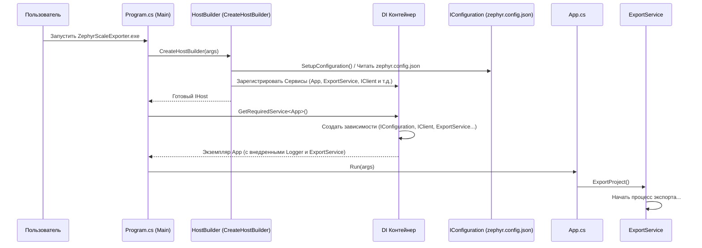

# Chapter 7: Точка Входа и Конфигурация


В [предыдущей главе](06_обработка_вложений_.md) мы подробно рассмотрели, как `ZephyrScaleExporter` находит, скачивает и связывает вложения с нашими тест-кейсами. Мы изучили все ключевые компоненты, отвечающие за преобразование данных. Но как все эти разрозненные части — модели, клиент API, сервисы — собираются вместе и начинают работать как единое целое? Где находится "ключ зажигания" всего приложения?

В этой заключительной главе мы заглянем в "машинное отделение" `ZephyrScaleExporter` и разберемся с **Точкой Входа и Конфигурацией**. Мы узнаем:

*   Откуда начинается выполнение программы (`Program.cs`).
*   Как приложение читает нужные ему настройки (`zephyr.config.json`).
*   Как настраивается система записи событий (логирование).
*   Как все наши сервисы ([Клиент API Zephyr Scale](02_клиент_api_zephyr_scale_.md), [Сервис Экспорта](03_сервис_экспорта_.md) и другие) "узнают" друг о друге и начинают взаимодействовать без необходимости создавать их вручную (Внедрение Зависимостей / Dependency Injection).
*   Как запускается основной класс приложения (`App.cs`), который инициирует весь процесс экспорта.

Представьте себе автомобиль. У него есть двигатель ([Сервис Экспорта](03_сервис_экспорта_.md)), колеса (другие сервисы), топливный бак ([Клиент API Zephyr Scale](02_клиент_api_zephyr_scale_.md)), но нужен ключ зажигания и приборная панель, чтобы все это запустить, настроить и контролировать. Именно эту роль выполняют **Точка Входа (`Program.cs`)** и система **Конфигурации**.

## Мотивация: Как все собрать вместе?

У нас есть множество классов-сервисов, каждый из которых выполняет свою задачу: `Client` общается с Zephyr, `FolderService` обрабатывает папки, `TestCaseService` преобразует тест-кейсы, `AttachmentService` качает файлы, и над всеми ними стоит `ExportService`, который координирует процесс.

Но возникают вопросы:
*   Кто создает экземпляр `ExportService`?
*   Как `ExportService` получает доступ к другим нужным ему сервисам (`Client`, `FolderService`, `TestCaseService` и т.д.)?
*   Как `Client` узнает адрес сервера Zephyr, API токен и имя проекта?
*   Где указывается, куда сохранять итоговые файлы?
*   Как мы можем видеть, что происходит внутри приложения во время его работы?

Ответы на все эти вопросы дает механизм **Точки Входа и Конфигурации**, реализованный в файле `Program.cs` с использованием стандартных возможностей .NET (таких как Host Builder, Dependency Injection, Configuration).

## Ключевые Компоненты "Запуска"

Давайте разберем основные элементы, которые оживляют наше приложение.

### 1. `Program.cs` и метод `Main`: Стартовая площадка

Любое консольное приложение на C# (а `ZephyrScaleExporter` именно такое) начинает свою работу с метода `Main`, который находится в классе `Program`. Это самая первая точка, куда передается управление при запуске исполняемого файла.

```csharp
// File: Program.cs (Самое начало)
using Microsoft.Extensions.DependencyInjection;
using Microsoft.Extensions.Hosting;
// ... другие using ...

namespace ZephyrScaleExporter
{
    internal class Program
    {
        // Вот он, метод Main - точка входа!
        static void Main(string[] args)
        {
            // 1. Настраиваем и строим "хост" приложения
            using var host = CreateHostBuilder(args).Build();
            // 2. Создаем "область видимости" для сервисов
            using var scope = host.Services.CreateScope();

            var services = scope.ServiceProvider; // Получаем доступ к сервисам

            try
            {
                // 3. Получаем главный сервис App и запускаем его
                services.GetRequiredService<App>().Run(args);
            }
            catch (Exception e)
            {
                // Если что-то пошло не так во время работы
                Console.WriteLine($"Произошла ошибка: {e.Message}");
                // В реальном логгере будет больше деталей
            }
        }

        // Дальше идет метод CreateHostBuilder(...) - о нем ниже
        // ...
    }
}
```

*   **`static void Main(string[] args)`**: Это стандартная сигнатура точки входа. `args` — это аргументы командной строки, если они передаются при запуске.
*   **`CreateHostBuilder(args).Build()`**: Здесь создается "хост" приложения. Думайте о хосте как о фундаменте и каркасе, на котором будет работать все остальное. Метод `CreateHostBuilder` (о нем чуть ниже) отвечает за всю сложную настройку.
*   **`host.Services.CreateScope()`**: Создает временную "область", в рамках которой будут существовать наши сервисы.
*   **`services.GetRequiredService<App>()`**: Это ключевой момент! Мы *просим* систему предоставить нам готовый экземпляр класса `App`. Нам не нужно писать `new App(...)` вручную. Система сама его создаст и передаст ему все, что ему нужно (например, `ILogger` и `IExportService`). Это и есть *Внедрение Зависимостей*.
*   **`.Run(args)`**: Вызываем главный метод нашего класса `App`, который запустит процесс экспорта.

### 2. Конфигурация (`zephyr.config.json`): Панель Управления

Приложению нужны настройки: адрес API Zephyr, секретный токен, имя проекта, путь для сохранения результатов. Жестко прописывать их в коде — плохая идея. Вместо этого используется конфигурационный файл, обычно в формате JSON. В нашем проекте это `zephyr.config.json`.

```json
// File: zephyr.config.json (Пример)
{
  "resultPath": "/Users/user01/Documents/importer", // Куда сохранять результат
  "zephyr": {
    "url": "https://api.zephyrscale.smartbear.com/v2/", // Адрес API Zephyr
    "token": "ВАШ_СЕКРЕТНЫЙ_API_ТОКЕН", // Ваш токен доступа
    "projectName": "МойКрутойПроект" // Название проекта в Zephyr
  },
  // Можно добавить настройки логгера Serilog здесь же
  "Serilog": {
      "MinimumLevel": "Information"
      // ... другие настройки Serilog ...
  }
}
```

*   **Структура:** Простой JSON-файл с парами "ключ-значение". Могут быть вложенные секции (как `"zephyr"`).
*   **Чтение:** Приложение автоматически находит и читает этот файл при старте. Это настраивается в `Program.cs`.

За чтение отвечает небольшой вспомогательный метод `SetupConfiguration`:

```csharp
// File: Program.cs (Метод SetupConfiguration)
using Microsoft.Extensions.Configuration; // Необходимо для IConfiguration

// ... внутри класса Program ...

private static IConfiguration SetupConfiguration()
{
    // Создаем "строитель" конфигурации
    return new ConfigurationBuilder()
        // Указываем, что искать файлы в той же папке, где запущено приложение
        .SetBasePath(Directory.GetCurrentDirectory())
        // Указываем, что нужно прочитать файл zephyr.config.json
        .AddJsonFile("zephyr.config.json")
        // Позволяет переопределять настройки через переменные окружения (опционально)
        .AddEnvironmentVariables()
        // Собираем конфигурацию
        .Build();
}
```

*   **`ConfigurationBuilder`**: Стандартный инструмент .NET для сборки конфигурации из разных источников.
*   **`.SetBasePath(...)`**: Указывает, где искать файлы конфигурации.
*   **`.AddJsonFile(...)`**: Говорит системе прочитать указанный JSON-файл.
*   **`.Build()`**: Возвращает готовый объект `IConfiguration`, который содержит все прочитанные настройки. Этот объект потом становится доступен другим частям приложения, например, [Клиенту API Zephyr Scale](02_клиент_api_zephyr_scale_.md) для получения URL и токена.

### 3. Сборка Хоста (`CreateHostBuilder`): Сборочный Конвейер

Метод `CreateHostBuilder` — это сердце настройки приложения. Он связывает воедино конфигурацию, логирование и регистрацию сервисов.

```csharp
// File: Program.cs (Метод CreateHostBuilder)
using Microsoft.Extensions.Hosting; // Необходимо для IHostBuilder, Host
using Serilog; // Необходимо для .UseSerilog

// ... внутри класса Program ...

static IHostBuilder CreateHostBuilder(string[] strings)
{
    // Создаем стандартный "строитель" хоста
    return Host.CreateDefaultBuilder()
        // 1. Подключаем и настраиваем систему логирования Serilog
        .UseSerilog((context, services, configuration) => configuration
            // Читаем часть настроек логгера из zephyr.config.json (секция "Serilog")
            .ReadFrom.Configuration(context.Configuration)
            // Дополнительные настройки...
            .Enrich.FromLogContext()
            .MinimumLevel.Debug() // Минимальный уровень для всех записей - Debug
            // Пишем подробные логи в файл
            .WriteTo.File("logs/log.txt", /* ... настройки формата ... */)
            // В консоль выводим только информационные сообщения и выше
            .WriteTo.Console(Serilog.Events.LogEventLevel.Information)
        )
        // 2. Настраиваем сервисы (Внедрение Зависимостей)
        .ConfigureServices((hostContext, services) =>
        {
            // Регистрируем наш главный класс App
            services.AddSingleton<App>();
            // Регистрируем прочитанную конфигурацию как сервис
            services.AddSingleton(SetupConfiguration()); // Результат SetupConfiguration() доступен как IConfiguration
            // Регистрируем все наши сервисы!
            services.AddSingleton<IClient, Client.Client>(); // Если кто-то попросит IClient, дать ему Client
            services.AddSingleton<IExportService, ExportService>(); // Если попросят IExportService, дать ExportService
            services.AddSingleton<IFolderService, FolderService>();
            services.AddSingleton<IStepService, StepService>();
            services.AddSingleton<IAttributeService, AttributeService>();
            services.AddSingleton<ITestCaseService, TestCaseService>();
            services.AddSingleton<IWriteService, WriteService>(); // Из проекта JsonWriter
            services.AddSingleton<IAttachmentService, AttachmentService>();
            // ... и так далее для всех интерфейсов и их реализаций
        });
}

```

*   **`Host.CreateDefaultBuilder()`**: Создает основу для нашего хоста, уже с некоторыми полезными настройками по умолчанию (например, чтение стандартных переменных окружения).
*   **`.UseSerilog(...)`**: Подключает и настраивает библиотеку `Serilog` для логирования. Здесь мы указываем, куда писать логи (в файл `logs/log.txt` и в консоль) и с каким уровнем детализации. Настройки можно также брать из файла `zephyr.config.json`.
*   **`.ConfigureServices(...)`**: Это секция, где происходит магия **Внедрения Зависимостей (Dependency Injection - DI)**.
    *   **`services.AddSingleton<Interface, Class>()`**: Эта команда регистрирует сервис. Она говорит: "Если какому-либо компоненту понадобится зависимость типа `Interface` (например, `IClient`), создай *один раз* (Singleton) экземпляр класса `Class` (например, `Client.Client`) и предоставь его". Система сама позаботится о создании экземпляра `Client.Client` и передаче ему нужных зависимостей (например, `IConfiguration` для настроек и `ILogger` для логов), если они тоже зарегистрированы.
    *   Мы регистрируем все наши интерфейсы и их конкретные реализации (классы). Это позволяет нам в конструкторах наших сервисов просто запрашивать интерфейсы (`public ExportService(IClient client, ...)`), а система DI сама подставит нужные объекты.

### 4. Логирование (`Serilog`): Бортовой Журнал

Мы используем популярную библиотеку `Serilog`, чтобы записывать информацию о том, что происходит в приложении. Это очень помогает при отладке или для понимания процесса работы.

Настройка происходит в `CreateHostBuilder`, как мы видели выше. Логи пишутся:
*   **В файл (`logs/log.txt`):** Сюда попадают все сообщения, начиная с уровня `Debug` (самый подробный). Удобно для анализа после выполнения.
*   **В консоль:** Сюда выводятся только сообщения уровня `Information` и выше (более важные). Удобно для наблюдения за процессом в реальном времени.

Чтобы использовать логгер в любом сервисе, достаточно запросить его через конструктор (благодаря DI):

```csharp
// File: Services\ExportService.cs (Пример использования логгера)
using Microsoft.Extensions.Logging; // Необходимо для ILogger

public class ExportService : IExportService
{
    private readonly ILogger<ExportService> _logger; // Поле для логгера

    // Запрашиваем логгер через конструктор
    public ExportService(ILogger<ExportService> logger, /*...другие зависимости...*/)
    {
        _logger = logger; // Система DI автоматически предоставит нужный логгер
        // ...
    }

    public async Task ExportProject()
    {
        // Используем логгер для записи сообщений
        _logger.LogInformation("Начинаем экспорт проекта..."); // Уровень Information (попадет и в файл, и в консоль)

        try
        {
             // ... код экспорта ...
            _logger.LogDebug("Запрошены папки у клиента."); // Уровень Debug (попадет только в файл)
            // ...
            _logger.LogInformation("Экспорт завершен.");
        }
        catch(Exception ex)
        {
            _logger.LogError(ex, "Произошла ошибка во время экспорта."); // Уровень Error (попадет везде)
        }
    }
}
```

*   `ILogger<ExportService>`**: Запрашиваем типизированный логгер. Тип `ExportService` помогает понять, из какого класса пришло сообщение в логах.
*   `_logger.LogInformation(...)`, `_logger.LogDebug(...)`, `_logger.LogError(...)`: Методы для записи сообщений разной важности.

### 5. Класс `App.cs`: Капитан Корабля

Класс `App` — это обертка над основной логикой приложения. Он не делает много сам, но он получает главный сервис (`IExportService`) и запускает его.

```csharp
// File: App.cs
using Microsoft.Extensions.Logging;
using ZephyrScaleExporter.Services; // Для IExportService

namespace ZephyrScaleExporter;

public class App
{
    private readonly ILogger<App> _logger;
    // Класс App зависит от IExportService - он его получит через DI
    private readonly IExportService _exportService;

    // Конструктор, принимающий зависимости от DI контейнера
    public App(ILogger<App> logger,  IExportService exportService)
    {
        _logger = logger;
        _exportService = exportService; // Сохраняем полученный ExportService
    }

    // Главный метод, который вызывается из Program.Main
    public void Run(string[] args)
    {
        _logger.LogInformation("Приложение запускается...");

        // Вызываем единственный метод нашего ExportService
        // .Wait() используется, т.к. ExportProject асинхронный, а Run - синхронный
        _exportService.ExportProject().Wait();

        _logger.LogInformation("Приложение завершает работу.");
    }
}
```

*   **Конструктор `App(ILogger<App> logger, IExportService exportService)`**: Запрашивает необходимые ему зависимости. Система DI автоматически предоставит ему экземпляр `ILogger<App>` и тот самый `ExportService`, который мы зарегистрировали в `Program.cs`.
*   **`_exportService.ExportProject().Wait()`**: В методе `Run` он просто вызывает главный метод [Сервиса Экспорта](03_сервис_экспорта_.md), запуская весь процесс.

## Как Все это Работает Вместе: Шаг за Шагом

Давайте проследим всю цепочку запуска:

1.  **Запуск:** Пользователь запускает `ZephyrScaleExporter.exe`.
2.  **Точка Входа:** Выполняется метод `Main` в `Program.cs`.
3.  **Создание Хоста:** Вызывается `CreateHostBuilder`.
    *   **Чтение Конфигурации:** `SetupConfiguration` читает `zephyr.config.json`.
    *   **Настройка Логирования:** Настраивается `Serilog` (вывод в файл и консоль).
    *   **Регистрация Сервисов:** Все интерфейсы и классы (`IClient`/`Client`, `IExportService`/`ExportService`, `App` и т.д.) регистрируются в контейнере DI (`services.AddSingleton<...>()`).
4.  **Сборка Хоста:** `Build()` создает готовый хост со всеми настройками.
5.  **Запрос `App`:** `services.GetRequiredService<App>()` просит у DI контейнера экземпляр `App`.
6.  **Магия DI:**
    *   DI контейнер видит, что `App` нужен `ILogger<App>` и `IExportService`.
    *   Он находит регистрацию `IExportService` -> `ExportService`.
    *   Он видит, что `ExportService` нужен `ILogger<ExportService>`, `IClient`, `IFolderService`, `IAttributeService`, `ITestCaseService`, `IWriteService`.
    *   Он находит регистрацию `IClient` -> `Client.Client`.
    *   Он видит, что `Client.Client` нужен `ILogger<Client>` и `IConfiguration`.
    *   Он находит регистрацию `IConfiguration` (из `SetupConfiguration`) и создает `ILogger<Client>`.
    *   Он создает экземпляр `Client.Client`, передавая ему `ILogger` и `IConfiguration`.
    *   Он аналогично создает все остальные зависимости для `ExportService` (`FolderService`, `AttributeService` и т.д., передавая им их зависимости).
    *   Он создает экземпляр `ExportService`, передавая ему все созданные сервисы (`Client`, `FolderService`...).
    *   Он создает `ILogger<App>`.
    *   Наконец, он создает экземпляр `App`, передавая ему `ILogger<App>` и созданный `ExportService`.
7.  **Запуск Логики:** DI контейнер возвращает готовый `App` в метод `Main`.
8.  **Выполнение:** Вызывается `app.Run(args)`.
9.  **Делегирование:** `App.Run` вызывает `_exportService.ExportProject()`.
10. **Экспорт:** Начинается процесс экспорта, как описано в главах [Сервис Экспорта](03_сервис_экспорта_.md), [Преобразование Структуры Проекта](04_преобразование_структуры_проекта__папки_и_атрибуты_.md), [Преобразование Тест-кейсов](05_преобразование_тест_кейсов_.md) и [Обработка Вложений](06_обработка_вложений_.md).

**Диаграмма Последовательности Запуска:**



Эта диаграмма показывает, как управление передается от `Main` к `HostBuilder` для настройки, затем к DI контейнеру для создания всех необходимых объектов "по цепочке" и, наконец, к классу `App`, который запускает основную логику через `ExportService`.

## Заключение

В этой главе мы рассмотрели "фундамент" и "систему зажигания" нашего приложения `ZephyrScaleExporter`. Мы узнали, что:

*   **`Program.cs`** содержит точку входа (`Main`) и код для настройки всего приложения с помощью **Host Builder**.
*   **`zephyr.config.json`** хранит внешние настройки (URL, токен, пути), которые легко изменить без перекомпиляции кода.
*   **Логирование (`Serilog`)** помогает отслеживать работу приложения, записывая информацию в консоль и файлы.
*   **Внедрение Зависимостей (DI)** — это мощный механизм, который автоматически создает и связывает наши сервисы (`Client`, `ExportService`, `FolderService` и т.д.), избавляя нас от необходимости делать это вручную и делая код более гибким и тестируемым.
*   **`App.cs`** — это простой класс, который получает главный сервис (`IExportService`) через DI и запускает процесс экспорта.

Понимание того, как приложение конфигурируется и запускается, завершает наше путешествие по внутреннему устройству `ZephyrScaleExporter`. Теперь у вас есть полное представление обо всех основных компонентах и их взаимодействии — от чтения настроек и общения с API до преобразования данных и сохранения результатов.

Мы надеемся, что это руководство помогло вам разобраться в работе `ZephyrScaleExporter`!

---

Generated by [AI Codebase Knowledge Builder](https://github.com/The-Pocket/Tutorial-Codebase-Knowledge)