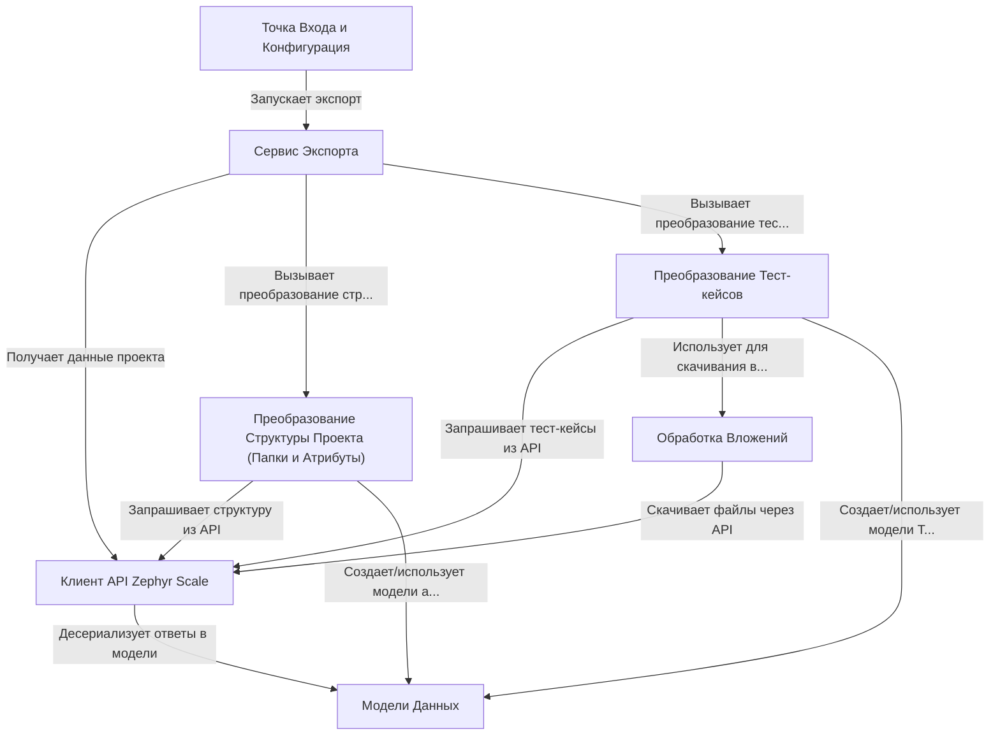

# Tutorial: ZephyrScaleExporter

Этот проект представляет собой **инструмент для экспорта** *тест-кейсов* из системы управления тестированием **Zephyr Scale**.
Он подключается к Zephyr Scale с помощью *API клиента* (**0 # Клиент API Zephyr Scale**), получает информацию о проекте, папках, атрибутах и тест-кейсах.
Затем, с помощью *сервисов преобразования* (**3 # Преобразование Тест-кейсов**, **4 # Преобразование Структуры Проекта**), он конвертирует эти данные в формат, совместимый с Test IT, включая обработку *вложений* (**5 # Обработка Вложений**).
Весь процесс координируется *сервисом экспорта* (**1 # Сервис Экспорта**), а запуск и настройка происходят в *точке входа* (**6 # Точка Входа и Конфигурация**). *Модели данных* (**2 # Модели Данных**) определяют структуру данных на всех этапах.

**Source Repository:** [None](None)

## Chapters

1. [Модели Данных
](01_модели_данных_.md)
2. [Клиент API Zephyr Scale
](02_клиент_api_zephyr_scale_.md)
3. [Сервис Экспорта
](03_сервис_экспорта_.md)
4. [Преобразование Структуры Проекта (Папки и Атрибуты)
](04_преобразование_структуры_проекта__папки_и_атрибуты__.md)
5. [Преобразование Тест-кейсов
](05_преобразование_тест_кейсов_.md)
6. [Обработка Вложений
](06_обработка_вложений_.md)
7. [Точка Входа и Конфигурация
](07_точка_входа_и_конфигурация_.md)

---

Generated by [AI Codebase Knowledge Builder](https://github.com/The-Pocket/Tutorial-Codebase-Knowledge)