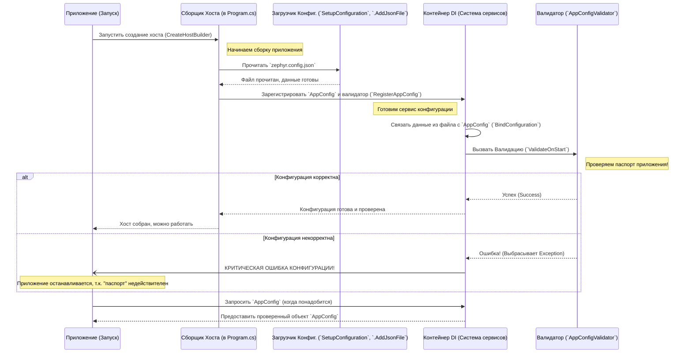

# Chapter 1: Конфигурация Приложения


Представьте, что наше приложение `ZephyrScaleServerExporter` — это путешественник, который собирается отправиться в путь, чтобы собрать важные данные (тест-кейсы) из системы Zephyr Scale. Как и любому путешественнику, ему нужен своего рода "паспорт" и "маршрутный лист", чтобы знать, куда именно идти, как себя представить и где оставить собранные сокровища. В нашем приложении эту роль выполняет **файл конфигурации**.

Эта глава расскажет вам всё о "паспорте" нашего приложения:
*   Зачем нужна конфигурация?
*   Как выглядит файл конфигурации (`zephyr.config.json`)?
*   Какие настройки в нем самые важные?
*   Как приложение читает и проверяет эти настройки?

## Зачем нужна конфигурация?

Без конфигурации наше приложение просто не знает, что делать. Оно как путешественник без карты и адреса назначения. Конфигурационный файл отвечает на ключевые вопросы:

1.  **Куда подключаться?**: Какой адрес у вашего сервера Zephyr Scale (обычно это ваш Jira сервер)?
2.  **Что экспортировать?**: Из какого конкретно проекта в Zephyr нужно забрать тест-кейсы? (Ключ проекта)
3.  **Как войти?**: Какие учетные данные (логин/пароль или специальный токен) использовать для доступа к Zephyr?
4.  **Куда сохранять?**: В какую папку на вашем компьютере нужно сохранить результаты экспорта?
5.  **А что с Confluence?**: Если ваши тест-кейсы содержат ссылки на страницы или вложения из Confluence, то какой адрес у вашего Confluence и как к нему подключиться? (Это нужно для корректной обработки таких ссылок и вложений).

Ответы на все эти вопросы хранятся в одном месте – файле `zephyr.config.json`.

## Файл `zephyr.config.json`

Это текстовый файл в формате JSON (JavaScript Object Notation), который легко читать и редактировать человеку. Он должен лежать в той же папке, откуда вы запускаете приложение.

Вот пример того, как может выглядеть этот файл:

```json
// Файл: zephyr.config.json
{
  // Важно: Путь, куда будут сохранены экспортированные данные
  "ResultPath": "output",

  // Секция настроек для подключения к Zephyr (и Confluence)
  "Zephyr": {
    // Важно: Полный URL вашего сервера Jira/Zephyr Scale
    "Url": "https://your-jira-instance.com",

    // Важно: Ключ проекта в Jira/Zephyr, из которого берем тесты
    "ProjectKey": "PROJ",

    // Важно: Полный URL вашего сервера Confluence (для обработки макросов/вложений)
    "Confluence": "https://your-confluence-instance.com",

    // --- Аутентификация в Zephyr/Jira ---
    // Выберите ОДИН из способов: Логин/Пароль ИЛИ Токен

    // Способ 1: Логин и Пароль (Не рекомендуется для облака, может не работать)
    "Login": "ваш_логин_jira",
    "Password": "ваш_пароль_jira",

    // Способ 2: Персональный Токен Доступа (PAT - Рекомендуется!)
    // Создается в настройках вашего профиля Jira
    "Token": "ваш_персональный_токен_доступа_jira",

    // --- Аутентификация в Confluence ---
    // Тоже выберите ОДИН из способов ниже

    // Способ 1: Логин и Пароль
    "ConfluenceLogin": "ваш_логин_confluence",
    "ConfluencePassword": "ваш_пароль_confluence",

    // Способ 2: Персональный Токен Доступа (PAT - Рекомендуется!)
    // Создается в настройках вашего профиля Confluence
    "ConfluenceToken": "ваш_персональный_токен_доступа_confluence",

    // --- Настройки для частичного экспорта (необязательно) ---
    // Если нужно экспортировать не все, а только часть тест-кейсов

    // "Partial": true,           // true = включить частичный экспорт
    // "Count": 50,               // Сколько тест-кейсов экспортировать?
    // "PartialFolderName": "first_50_tests" // Имя подпапки для этого экспорта
  }
}
```

**Важные моменты:**

*   **`ResultPath`**: Папка, где будут созданы файлы с результатами. Если папки нет, приложение попытается её создать.
*   **`Zephyr.Url`**: Полный адрес вашей Jira, где установлен Zephyr Scale. Например, `https://jira.mycompany.com`.
*   **`Zephyr.ProjectKey`**: Короткий идентификатор (ключ) вашего проекта в Jira. Например, `TEST` или `QA`.
*   **`Zephyr.Confluence`**: Полный адрес вашего Confluence. Нужен, если тест-кейсы ссылаются на Confluence.
*   **Аутентификация**:
    *   **Токены (Token, ConfluenceToken)**: Самый безопасный и рекомендуемый способ. Создайте Personal Access Token (PAT) в настройках своего профиля Jira и Confluence.
    *   **Логин/Пароль (Login, Password, ConfluenceLogin, ConfluencePassword)**: Менее безопасный способ, может не работать с некоторыми настройками безопасности или в облачных версиях Jira/Confluence. Используйте, если токены недоступны.
    *   **Нужно выбрать только *один* способ аутентификации для Jira и *один* для Confluence.** Если указаны и логин/пароль, и токен, приложение будет использовать токен.
*   **Частичный экспорт (`Partial`, `Count`, `PartialFolderName`)**: Позволяет экспортировать только указанное количество (`Count`) тест-кейсов, например, для быстрой проверки. Они будут сохранены в отдельную подпапку (`PartialFolderName`) внутри `ResultPath`. По умолчанию эта функция выключена (`Partial` не `true`).

**Вам нужно отредактировать этот файл, подставив ваши реальные данные!**

## Как приложение читает конфигурацию?

Когда приложение запускается, одна из первых вещей, которую оно делает — это поиск и чтение файла `zephyr.config.json`. За это отвечает небольшой кусочек кода в самом начале работы программы (`Program.cs`).

```csharp
// Файл: ZephyrScaleServerExporter/Program.cs

// ... другие using ...
using Microsoft.Extensions.Configuration; // Используется для работы с конфигурацией
// ...

internal class Program
{
    // ... Main метод ...

    // Метод для настройки хоста приложения
    static IHostBuilder CreateHostBuilder(string[] strings)
    {
        // ... код настройки логирования ...

        // Настройка конфигурации и сервисов
        return Host.CreateDefaultBuilder()
            // ... UseSerilog ...
            .ConfigureServices((context, services) => // Настройка сервисов
            {
                // !!! Вот здесь регистрируется чтение конфигурации !!!
                services.RegisterAppConfig(); 
                
                // ... остальная регистрация сервисов (клиенты, экспорт и т.д.) ...
            });
    }

    // Метод, который непосредственно настраивает чтение файла
    private static IConfiguration SetupConfiguration()
    {
        return new ConfigurationBuilder() // Создаем "строителя" конфигурации
            // Указываем, где искать файлы (в папке запуска приложения)
            .SetBasePath(Directory.GetCurrentDirectory()) 
            // Говорим читать настройки из файла 'zephyr.config.json'
            .AddJsonFile("zephyr.config.json") 
            // Можно также переопределять настройки через переменные окружения (более продвинутая тема)
            .AddEnvironmentVariables() 
            .Build(); // "Строим" объект конфигурации
    }

    // ... остальной код класса Program ...
}
```

**Что здесь происходит (простыми словами):**

1.  `SetupConfiguration` создает объект `ConfigurationBuilder`.
2.  Он указывает, что искать файл `zephyr.config.json` нужно в текущей папке (`SetBasePath`, `AddJsonFile`).
3.  `Build()` создает объект `IConfiguration`, который содержит все прочитанные настройки.
4.  `RegisterAppConfig()` (мы рассмотрим его детальнее ниже) использует этот объект, чтобы связать данные из файла с классами C# и сделать их доступными для других частей приложения.

## Представление конфигурации в коде: Классы `AppConfig` и `ZephyrConfig`

Чтобы приложению было удобно работать с настройками, прочитанными из JSON-файла, они "превращаются" в объекты специальных C#-классов. Эти классы определены в файле `Models/AppConfig.cs`.

```csharp
// Файл: ZephyrScaleServerExporter/Models/AppConfig.cs

using System.ComponentModel.DataAnnotations; // Используется для атрибутов валидации [Required]

namespace ZephyrScaleServerExporter.Models;

// Класс для настроек внутри секции "Zephyr" в JSON
public class ZephyrConfig
{
    [Required] // Означает: это поле ОБЯЗАТЕЛЬНО должно быть в файле zephyr.config.json
    public string Url { get; set; } = string.Empty;

    [Required] // И это поле тоже обязательно
    public string ProjectKey { get; set; } = string.Empty;
    
    [Required] // Confluence URL тоже теперь обязателен
    public string Confluence { get; set; } = string.Empty;

    // Поля для аутентификации (не обязательны все сразу)
    public string Login { get; set; } = string.Empty;
    public string Password { get; set; } = string.Empty;
    public string Token { get; set; } = string.Empty; // Рекомендуется
    
    public string ConfluenceLogin { get; set; } = string.Empty;
    public string ConfluencePassword { get; set; } = string.Empty;
    public string ConfluenceToken { get; set; } = string.Empty; // Рекомендуется

    // Поля для частичного экспорта
    public bool Partial { get; set; } = false; // По умолчанию выключен
    public int Count { get; set; } = 0;
    public string PartialFolderName { get; set; } = string.Empty;
}

// Основной класс конфигурации, соответствующий всему JSON-файлу
public class AppConfig
{
    [Required] // Путь для сохранения тоже обязателен
    public string ResultPath { get; set; } = string.Empty;

    [Required] // Секция "Zephyr" обязательна
    public ZephyrConfig Zephyr { get; set; } = new(); // Сюда попадут данные из "Zephyr": { ... }
}

```

*   Класс `AppConfig` представляет всю конфигурацию. У него есть свойство `ResultPath` и свойство `Zephyr`, которое является объектом класса `ZephyrConfig`.
*   Класс `ZephyrConfig` содержит настройки, специфичные для Zephyr и Confluence (`Url`, `ProjectKey`, `Confluence`, данные для входа, настройки частичного экспорта).
*   Атрибут `[Required]` над некоторыми свойствами (`Url`, `ProjectKey`, `ResultPath`, `Confluence`) указывает, что эти параметры **абсолютно необходимы** для работы приложения. Если их не будет в файле `zephyr.config.json`, приложение не запустится и сообщит об ошибке.

## Доступ к конфигурации: Регистрация и Внедрение Зависимостей (Dependency Injection)

Просто прочитать файл и создать объекты C# недостаточно. Нужно сделать так, чтобы другие части приложения, которым нужна эта информация (например, [Клиент Zephyr API](03_клиент_zephyr_api_.md) или [Сервис Записи Данных](07_сервис_записи_данных_.md)), могли легко её получить.

Для этого используется механизм под названием **Внедрение Зависимостей** (Dependency Injection, DI). Представьте это как почтовую службу внутри приложения: когда какому-то компоненту (например, "отделу отправки запросов к Zephyr") нужен "паспорт" (конфигурация), DI-служба автоматически ему его доставляет.

Регистрация конфигурации в этой "службе" происходит в методе расширения `RegisterAppConfig`, который мы видели в `Program.cs`.

```csharp
// Файл: ZephyrScaleServerExporter/Models/Extensions/ServiceCollectionExtensions.cs

using Microsoft.Extensions.DependencyInjection; // Для IServiceCollection и методов расширения
using Microsoft.Extensions.Options;           // Для IOptions<T>, IValidateOptions<T>
using ZephyrScaleServerExporter.Validators;   // Для нашего валидатора

namespace ZephyrScaleServerExporter.Models.Extensions;

public static class ServiceCollectionExtensions
{
    // Метод, который "регистрирует" нашу конфигурацию в системе DI
    public static void RegisterAppConfig(this IServiceCollection services)
    {
        services
            // 1. Говорим системе DI: "Знай о типе AppConfig"
            .AddOptions<AppConfig>() 
            // 2. Связываем этот тип с конфигурацией из файла (корневой секцией "")
            .BindConfiguration("") 
            // 3. Включаем проверку атрибутов [Required]
            .ValidateDataAnnotations()   
            // 4. Запускаем валидацию ПРИ СТАРТЕ приложения
            .ValidateOnStart(); 

        // 5. Добавляем наш собственный, более сложный валидатор
        services.AddSingleton<IValidateOptions<AppConfig>, AppConfigValidator>();
    }
}
```

**Ключевые шаги:**

1.  `AddOptions<AppConfig>()`: Сообщает системе DI, что у нас будет использоваться конфигурация типа `AppConfig`.
2.  `BindConfiguration("")`: Автоматически сопоставляет данные из прочитанного JSON (начиная с корневого уровня `""`) со свойствами класса `AppConfig` и вложенного `ZephyrConfig`.
3.  `ValidateDataAnnotations()`: Включает проверку атрибутов `[Required]`, которые мы видели в классах `AppConfig` и `ZephyrConfig`.
4.  `ValidateOnStart()`: Указывает, что все проверки (и `[Required]`, и наш собственный валидатор) должны быть выполнены немедленно при запуске приложения. Если что-то не так – приложение сразу остановится с ошибкой.
5.  `AddSingleton<IValidateOptions<AppConfig>, AppConfigValidator>()`: Регистрирует наш собственный класс `AppConfigValidator` для дополнительных проверок конфигурации.

## Проверка корректности: Валидация Конфигурации

Очень важно убедиться, что пользователь указал все необходимые настройки в `zephyr.config.json` *до того*, как приложение начнет выполнять основную работу. Иначе оно может упасть в самый неожиданный момент с непонятной ошибкой. Это как проверить паспорт перед вылетом – лучше обнаружить проблему заранее.

Помимо базовой проверки `[Required]`, у нас есть специальный класс `AppConfigValidator` для более сложных проверок.

```csharp
// Файл: ZephyrScaleServerExporter/Validators/AppConfigValidator.cs

using Microsoft.Extensions.Options; // Используется для IValidateOptions<T>
using ZephyrScaleServerExporter.Models; // Используется AppConfig

namespace ZephyrScaleServerExporter.Validators;

// Класс, отвечающий за проверку корректности настроек AppConfig
public class AppConfigValidator : IValidateOptions<AppConfig>
{
    // Метод, который выполняет проверку
    public ValidateOptionsResult Validate(string? name, AppConfig options)
    {
        // Проверяем, указан ли путь для сохранения результатов
        if (string.IsNullOrEmpty(options.ResultPath))
            // Если нет - выбрасываем исключение с понятным сообщением
            throw new ArgumentException("Путь для сохранения результатов (ResultPath) не указан");
        
        // Проверяем настройки Zephyr
        if (string.IsNullOrEmpty(options.Zephyr.Url)) 
            throw new ArgumentException("URL сервера Zephyr (Zephyr.Url) не указан");
        if (string.IsNullOrEmpty(options.Zephyr.Confluence)) 
            throw new ArgumentException("Базовый URL Confluence (Zephyr.Confluence) не указан. " +
                                        "Укажите 'Confluence' в секции 'Zephyr' для корректной работы с Confluence API.");
        if (string.IsNullOrEmpty(options.Zephyr.ProjectKey)) 
            throw new ArgumentException("Ключ проекта (Zephyr.ProjectKey) не указан");
        
        // Дополнительные проверки для частичного экспорта
        if (options.Zephyr.Partial) // Если частичный экспорт включен...
        {
            // ...то должно быть указано имя папки
            if (string.IsNullOrEmpty(options.Zephyr.PartialFolderName)) 
                throw new ArgumentException("Имя папки для частичного экспорта (PartialFolderName) не указано при Partial=true");
            // ...и количество должно быть больше нуля
            if (options.Zephyr.Count == 0) 
                throw new ArgumentException("Количество для частичного экспорта (Count) не может быть 0 при Partial=true");
        }
        
        // Если все проверки прошли успешно
        return ValidateOptionsResult.Success; 
    }
}
```

Этот валидатор проверяет:
*   Наличие обязательных полей: `ResultPath`, `Zephyr.Url`, `Zephyr.ProjectKey`, `Zephyr.Confluence`.
*   Логику частичного экспорта: если `Partial` равно `true`, то `PartialFolderName` не должно быть пустым, а `Count` не должно быть нулевым.

Если какая-либо из этих проверок не проходит, валидатор выбрасывает исключение (`throw new ArgumentException(...)`). Благодаря `ValidateOnStart()` из предыдущего шага, это исключение остановит запуск приложения и выведет в консоль сообщение об ошибке, указывающее, какая именно настройка отсутствует или некорректна. Это помогает быстро исправить `zephyr.config.json`.

## Как всё работает вместе: Загрузка и проверка конфигурации

Давайте представим весь процесс от запуска до получения готовой и проверенной конфигурации в виде простой схемы:



**По шагам:**
1.  Приложение запускается и просит `HostBuilder` подготовить всё необходимое.
2.  `HostBuilder` через `ConfigLoader` читает файл `zephyr.config.json`.
3.  Настройки регистрируются в системе DI (`RegisterAppConfig`).
4.  DI связывает прочитанные данные с классом `AppConfig`.
5.  DI немедленно вызывает `Validator` для проверки (`ValidateOnStart`).
6.  **Если валидация успешна:** Хост дособирается, и приложение готово к работе. Позже любая часть приложения сможет запросить у DI готовый и проверенный объект `AppConfig`.
7.  **Если валидация провалена:** `Validator` выбрасывает исключение, DI перехватывает его, сборка хоста прерывается, и приложение завершает работу с сообщением об ошибке.

## Заключение

В этой главе мы разобрались с фундаментом нашего приложения – конфигурацией. Мы узнали:

*   Зачем нужен файл `zephyr.config.json` – это "паспорт" и "маршрутный лист" приложения.
*   Какие ключевые настройки он содержит (`Url`, `ProjectKey`, `ResultPath`, данные для аутентификации, `Confluence` URL).
*   Как приложение читает этот файл при запуске (`SetupConfiguration`).
*   Как настройки представляются в коде с помощью классов `AppConfig` и `ZephyrConfig`.
*   Почему важна валидация и как она выполняется с помощью `[Required]` и `AppConfigValidator`, чтобы убедиться в корректности настроек до начала работы.

Правильно настроенный файл `zephyr.config.json` — это первый и самый важный шаг для успешного экспорта данных.

Теперь, когда наше приложение знает свои основные параметры и куда подключаться, в следующей главе мы рассмотрим главный orchestrator всего процесса — [Сервис Экспорта](02_сервис_экспорта_.md), который управляет всеми шагами от подключения до сохранения данных.

---

Generated by [AI Codebase Knowledge Builder](https://github.com/The-Pocket/Tutorial-Codebase-Knowledge)