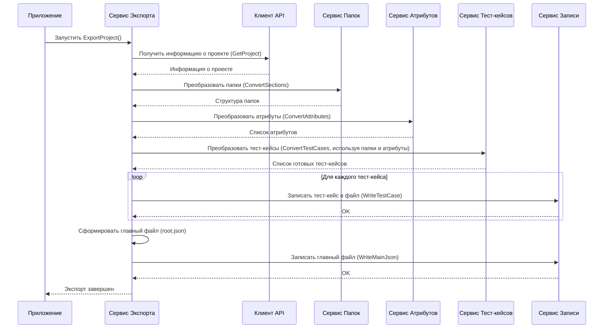

# Chapter 1: Сервис Экспорта

Добро пожаловать в руководство по `ZephyrScaleServerExporter`! Эта утилита поможет вам перенести ваши тест-кейсы из Zephyr Scale Server в формат, совместимый с Test IT. В этой первой главе мы познакомимся с **Сервисом Экспорта** – главным координатором всего процесса.

Представьте, что вам нужно перевезти вещи из старой квартиры в новую. Вы же не будете сами таскать пианино, упаковывать каждую чашку и вести грузовик? Скорее всего, вы наймете организатора переезда. Этот организатор (наш Сервис Экспорта) знает, когда вызвать грузчиков (получить данные из Zephyr), когда прислать упаковщиков (преобразовать данные) и когда отправить машину в путь (записать файлы).

**Сервис Экспорта** – это именно такой организатор для ваших тест-кейсов. Он не выполняет всю работу сам, но руководит другими компонентами, чтобы экспорт прошел гладко от начала и до конца.

## Зачем нужен Сервис Экспорта?

Основная задача `ZephyrScaleServerExporter` – взять все необходимое из вашего проекта в Zephyr Scale Server (тест-кейсы, папки, шаги, пользовательские поля и т.д.) и сохранить это в файлы специального формата. Это довольно сложный процесс, включающий множество шагов:

1.  **Подключение к Zephyr:** Нужно "достучаться" до вашего Zephyr Server.
2.  **Получение данных:** Запросить информацию о проекте, папках, тест-кейсах, атрибутах.
3.  **Преобразование:** Данные из Zephyr нужно перевести в другой формат, понятный для Test IT.
4.  **Сохранение:** Записать преобразованные данные в JSON файлы на вашем компьютере.

Если бы мы пытались сделать все это в одном месте, код стал бы очень большим и запутанным. Сервис Экспорта решает эту проблему, выступая в роли "дирижера оркестра". Он вызывает другие, более специализированные сервисы, каждый из которых отвечает за свою часть работы:

*   [Клиент Zephyr API](02_клиент_zephyr_api.md): Отвечает за общение с Zephyr Server и получение необработанных данных.
*   Сервис папок (`FolderService`): Преобразует структуру папок.
*   [Сервис Конвертации Атрибутов](03_сервис_конвертации_атрибутов.md): Преобразует пользовательские поля (атрибуты).
*   [Сервис Конвертации Тест-кейсов](04_сервис_конвертации_тест_кейсов.md): Преобразует основные данные тест-кейсов, включая шаги ([Сервис Конвертации Шагов](05_сервис_конвертации_шагов.md)), вложения ([Сервис Обработки Вложений](06_сервис_обработки_вложений.md)) и параметры ([Сервис Обработки Параметров](07_сервис_обработки_параметров.md)).
*   Сервис записи (`WriteService`): Сохраняет результаты в файлы.

Сервис Экспорта дергает за нужные ниточки в правильном порядке, чтобы получился готовый результат.

## Как это работает (снаружи)?

Обычно вам не нужно напрямую вызывать Сервис Экспорта. Он автоматически запускается при старте приложения `ZephyrScaleServerExporter`. Давайте посмотрим, как это настроено.

В файле `Program.cs` происходит первоначальная настройка приложения. Здесь создаются и регистрируются все необходимые сервисы, включая `IExportService`:

```csharp
// File: Program.cs (фрагмент)

// ... другие настройки ...
.ConfigureServices((_, services) =>
{
    services.AddSingleton<App>(); // Главный класс приложения
    // ... регистрация других сервисов ...
    services.AddSingleton<IClient, Client.Client>(); // Клиент для Zephyr API
    services.AddSingleton<IExportService, ExportService>(); // НАШ СЕРВИС ЭКСПОРТА
    services.AddSingleton<IFolderService, FolderService>(); // Сервис для папок
    services.AddSingleton<IAttributeService, AttributeService>(); // Сервис для атрибутов
    services.AddSingleton<ITestCaseService, TestCaseService>(); // Сервис для тест-кейсов
    services.AddSingleton<IWriteService, WriteService>(); // Сервис для записи файлов
    // ... регистрация остальных сервисов ...
});
// ... остальной код ...
```

Этот код говорит приложению: "Когда кому-то понадобится `IExportService`, предоставь ему экземпляр `ExportService`". Это называется внедрением зависимостей (Dependency Injection) – удобный способ управлять компонентами программы.

Затем, в классе `App`, который является основной точкой входа в логику приложения, этот `IExportService` используется для запуска процесса экспорта:

```csharp
// File: App.cs (фрагмент)

public class App
{
    private readonly ILogger<App> _logger;
    private readonly IExportService _exportService; // Сюда будет внедрен ExportService

    // Конструктор получает нужные сервисы автоматически
    public App(ILogger<App> logger,  IExportService exportService)
    {
        _logger = logger;
        _exportService = exportService; // Сохраняем ссылку на сервис
    }

    // Основной метод, запускающий экспорт
    public void Run(string[] args)
    {
        _logger.LogInformation("Starting application"); // Записываем в лог о старте

        _exportService.ExportProject().Wait(); // Запускаем экспорт!

        _logger.LogInformation("Ending application"); // Записываем в лог о завершении
    }
}
```

Как видите, класс `App` просто просит `_exportService` начать работу, вызывая метод `ExportProject()`. Вся сложность координации скрыта внутри `ExportService`.

Итак, чтобы начать экспорт, вам просто нужно запустить приложение. Оно само найдет и использует Сервис Экспорта для выполнения всей работы.

## Под капотом: Что происходит внутри `ExportProject()`?

Давайте заглянем внутрь `ExportService` и посмотрим, как он организует процесс экспорта шаг за шагом. Представим это в виде диалога между компонентами:



Эта диаграмма показывает последовательность вызовов: `ExportService` сначала запрашивает данные у [Клиента Zephyr API](02_клиент_zephyr_api.md), затем передает их сервисам конвертации (Папок, [Атрибутов](03_сервис_конвертации_атрибутов.md), [Тест-кейсов](04_сервис_конвертации_тест_кейсов.md)) и, наконец, просит Сервис Записи сохранить результаты.

Теперь посмотрим на код метода `ExportProject` в файле `Services/ExportService.cs`:

```csharp
// File: Services\ExportService.cs (фрагмент)

public class ExportService : IExportService
{
    // Зависимости, которые внедряются через конструктор
    private readonly IFolderService _folderService;
    private readonly IAttributeService _attributeService;
    private readonly ITestCaseService _testCaseService;
    private readonly IWriteService _writeService;
    private readonly ILogger<ExportService> _logger;
    private readonly IClient _client;

    // Конструктор для получения зависимостей
    public ExportService(ILogger<ExportService> logger, IClient client, IFolderService folderService,
        IAttributeService attributeService, ITestCaseService testCaseService, IWriteService writeService)
    {
        _folderService = folderService;
        _attributeService = attributeService;
        _testCaseService = testCaseService;
        _writeService = writeService;
        _logger = logger;
        _client = client;
    }

    // Основной метод оркестрации
    public async Task ExportProject()
    {
        _logger.LogInformation("Exporting project"); // Сообщение в лог

        // 1. Получаем основную информацию о проекте из Zephyr
        var project = await _client.GetProject();

        // 2. Конвертируем папки (секции)
        var folders = await _folderService.ConvertSections(project.Name);

        // 3. Конвертируем пользовательские атрибуты
        var attributes = await _attributeService.ConvertAttributes(project.Id);

        // 4. Конвертируем тест-кейсы, передавая им информацию о папках и атрибутах
        var testCaseData = await _testCaseService.ConvertTestCases(folders, attributes.AttributeMap);

        // 5. Записываем каждый сконвертированный тест-кейс в отдельный файл
        foreach (var testCase in testCaseData.TestCases)
        {
            await _writeService.WriteTestCase(testCase);
        }

        // 6. Готовим данные для главного файла 'root.json'
        var root = new Root
        {
            ProjectName = project.Name, // Имя проекта
            Attributes = testCaseData.Attributes, // Список атрибутов
            Sections = new List<Section> { folders.MainSection }, // Структура папок
            SharedSteps = new List<Guid>(), // Пока не используем общие шаги
            TestCases = testCaseData.TestCases.Select(t => t.Id).ToList() // Список ID всех тест-кейсов
        };

        // 7. Записываем главный файл 'root.json'
        await _writeService.WriteMainJson(root);

        _logger.LogInformation("Export complete"); // Сообщение в лог
    }
}
```

**Разберем по шагам:**

1.  `_client.GetProject()`: Обращение к [Клиенту Zephyr API](02_клиент_zephyr_api.md) для получения базовой информации о проекте (ID, имя).
2.  `_folderService.ConvertSections()`: Вызов сервиса папок для получения структуры папок в нужном формате.
3.  `_attributeService.ConvertAttributes()`: Вызов [Сервиса Конвертации Атрибутов](03_сервис_конвертации_атрибутов.md) для получения списка пользовательских полей.
4.  `_testCaseService.ConvertTestCases()`: Самый объемный шаг. Вызов [Сервиса Конвертации Тест-кейсов](04_сервис_конвертации_тест_кейсов.md), который внутри себя использует другие сервисы (для шагов, вложений, параметров) для полной конвертации тест-кейсов. Ему нужна информация о папках и атрибутах, полученная ранее.
5.  `_writeService.WriteTestCase()`: В цикле проходим по всем сконвертированным тест-кейсам и для каждого вызываем сервис записи, чтобы сохранить его в отдельный JSON-файл.
6.  Создание объекта `Root`: Формируем объект, который содержит общую информацию о проекте: имя, атрибуты, структуру папок и список ID всех экспортированных тест-кейсов.
7.  `_writeService.WriteMainJson()`: Сохраняем объект `Root` в главный файл `root.json`, который связывает все остальные файлы вместе.

Как видите, `ExportService` действует как центральный узел, последовательно вызывая другие компоненты и передавая результаты их работы следующим "звеньям" в цепочке экспорта.

## Заключение

В этой главе мы познакомились с **Сервисом Экспорта** (`ExportService`) – сердцем утилиты `ZephyrScaleServerExporter`. Мы узнали, что он:

*   Является главным **координатором** процесса экспорта.
*   **Оркестрирует** работу других сервисов (клиента API, конвертеров, сервиса записи).
*   Вызывается **автоматически** при запуске приложения.
*   Последовательно выполняет шаги: получение данных -> конвертация папок -> конвертация атрибутов -> конвертация тест-кейсов -> запись файлов.

Понимание роли Сервиса Экспорта дает нам общую картину того, как работает утилита. Теперь мы готовы погрузиться глубже и рассмотреть первый компонент, с которым взаимодействует наш "дирижер".

В следующей главе мы подробно разберем [Клиент Zephyr API](02_клиент_zephyr_api.md), который отвечает за получение данных непосредственно из Zephyr Scale Server.

---

Generated by [AI Codebase Knowledge Builder](https://github.com/The-Pocket/Tutorial-Codebase-Knowledge)