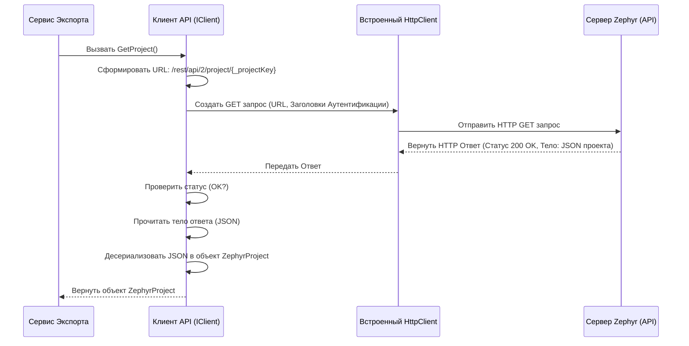

# Chapter 2: Клиент Zephyr API

В [предыдущей главе](01_сервис_экспорта.md) мы познакомились с [Сервисом Экспорта](01_сервис_экспорта.md) – главным координатором, который управляет всем процессом переноса данных. Но чтобы координировать работу, ему нужно сначала получить сами данные из Zephyr Scale Server. Откуда он их берет? Здесь на сцену выходит наш следующий герой: **Клиент Zephyr API**.

## Зачем нужен Клиент Zephyr API?

Представьте, что Zephyr Scale Server – это огромная библиотека, полная информации о ваших тест-кейсах, шагах, папках и многом другом. Вы (или, в нашем случае, [Сервис Экспорта](01_сервис_экспорта.md)) не можете просто зайти и взять все, что нужно. Библиотека имеет свои правила и свой язык общения.

**Проблема:** Как нашей программе получить данные из Zephyr Scale Server, не зная его внутренних деталей и языка общения?

**Решение:** Нам нужен "библиотекарь" или "переводчик", который знает:

1.  **Как подключиться** к "библиотеке" (серверу Zephyr).
2.  **На каком языке** (API) делать запросы (например, "Дай мне список всех тест-кейсов для проекта X").
3.  **Как понять ответ** "библиотеки" и передать его в понятном виде остальной части нашей программы.

Эту роль и выполняет **Клиент Zephyr API**. Это компонент, который берет на себя все сложности общения с сервером Zephyr Scale. Он отправляет запросы, получает ответы и преобразует их в формат, удобный для использования другими частями `ZephyrScaleServerExporter`. Без него [Сервис Экспорта](01_сервис_экспорта.md) был бы как дирижер без оркестра – он не сможет получить "музыкальные ноты" (данные) для своей работы.

## Ключевые задачи Клиента API

Клиент Zephyr API выполняет несколько важных задач:

1.  **Аутентификация:** Подтверждает, что наша программа имеет право доступа к данным в Zephyr. Это может быть сделано с помощью специального ключа (API токена) или логина/пароля.
2.  **Отправка Запросов:** Формирует и отправляет HTTP-запросы к специальным адресам (URL) на сервере Zephyr, которые называются **API эндпоинтами**. Каждый эндпоинт отвечает за определенный тип данных (например, один для проектов, другой для тест-кейсов, третий для пользовательских полей).
3.  **Получение Данных:** Принимает ответ от сервера Zephyr. Обычно данные приходят в формате JSON (текстовый формат для обмена данными, который легко читается и машинами, и людьми).
4.  **Десериализация:** Преобразует полученный JSON-текст в объекты языка C#, с которыми могут работать другие компоненты нашей программы (например, [Сервис Конвертации Атрибутов](03_сервис_конвертации_атрибутов.md) или [Сервис Конвертации Тест-кейсов](04_сервис_конвертации_тест_кейсов.md)).
5.  **Обработка Ошибок:** Если что-то пошло не так (например, нет сети, неверный ключ доступа, сервер Zephyr недоступен), Клиент API должен корректно обработать ошибку и сообщить об этом.

## Как использовать Клиент API?

Обычно вам не нужно напрямую создавать или настраивать Клиент API. Как мы видели в [предыдущей главе](01_сервис_экспорта.md), система внедрения зависимостей (Dependency Injection) автоматически предоставляет экземпляр Клиента API тем сервисам, которым он нужен (например, `ExportService`).

Давайте еще раз посмотрим на фрагмент кода `ExportService`, где он использует клиент:

```csharp
// File: Services\ExportService.cs (фрагмент)

public class ExportService : IExportService
{
    // ... другие зависимости ...
    private readonly IClient _client; // Переменная для хранения клиента API

    // Конструктор получает экземпляр клиента автоматически
    public ExportService(..., IClient client, ...)
    {
        // ...
        _client = client; // Сохраняем ссылку на клиента
        // ...
    }

    public async Task ExportProject()
    {
        _logger.LogInformation("Exporting project");

        // Используем клиент для получения данных о проекте
        var project = await _client.GetProject();
        _logger.LogInformation($"Получен проект: {project.Name}");

        // Используем клиент для получения пользовательских полей
        var customFields = await _client.GetCustomFieldsForTestCases(project.Id);
        _logger.LogInformation($"Получено {customFields.Count} пользовательских полей");

        // Используем клиент для получения списка всех тест-кейсов
        var testCases = await _client.GetTestCases();
        _logger.LogInformation($"Получено {testCases.Count} тест-кейсов");

        // ... дальнейшая обработка данных ...
    }
}
```

В этом примере `ExportService` через переменную `_client` (которая содержит реализацию интерфейса `IClient`) вызывает методы:

*   `GetProject()`: Запрашивает основную информацию о проекте Zephyr, указанном в настройках. Возвращает объект `ZephyrProject`, содержащий ID и имя проекта.
*   `GetCustomFieldsForTestCases(project.Id)`: Запрашивает список пользовательских полей, настроенных для тест-кейсов в этом проекте. Требует ID проекта (полученный на предыдущем шаге) и возвращает список объектов `ZephyrCustomFieldForTestCase`.
*   `GetTestCases()`: Запрашивает список всех тест-кейсов в проекте. Возвращает список объектов `ZephyrTestCase`.

Как видите, для `ExportService` работа с клиентом выглядит очень просто: вызвал нужный метод – получил готовые данные. Вся "магия" общения с сервером Zephyr скрыта внутри реализации `IClient`.

## Заглянем под капот: Как это работает внутри?

Давайте разберемся, что происходит, когда, например, вызывается метод `GetProject()`.

**Шаг за шагом:**

1.  **Определение Цели:** Метод `GetProject` знает, что ему нужно получить информацию о проекте. Он также знает ключ проекта (`_projectKey`), который был указан в настройках при запуске утилиты.
2.  **Формирование Адреса (URL):** На основе базового адреса сервера Zephyr (тоже из настроек) и известного пути к API для получения проекта, клиент формирует полный URL запроса. Например: `https://your-jira-instance.com/rest/api/2/project/YOUR_PROJECT_KEY`.
3.  **Создание HTTP Запроса:** Клиент использует встроенный в .NET класс `HttpClient` для создания HTTP GET-запроса к этому URL.
4.  **Добавление Аутентификации:** Перед отправкой запроса клиент автоматически добавляет в него необходимые заголовки для аутентификации (либо 'Authorization: Bearer ВАШ_ТОКЕН', либо 'Authorization: Basic ВАШ_ЗАКОДИРОВАННЫЙ_ЛОГИН_ПАРОЛЬ'). Эти данные он тоже берет из настроек.
5.  **Отправка и Ожидание:** `HttpClient` отправляет запрос на сервер Zephyr и ожидает ответ.
6.  **Проверка Статуса:** Когда ответ получен, клиент сначала проверяет статус ответа. Успешный ответ обычно имеет код 200 (OK). Если код другой (например, 401 Unauthorized, 404 Not Found, 500 Internal Server Error), клиент сообщает об ошибке.
7.  **Чтение Тела Ответа:** Если статус успешный, клиент читает тело ответа, которое содержит данные о проекте в формате JSON. Например: `{"id": "10001", "key": "YOUR_PROJECT_KEY", "name": "Название вашего проекта"}`.
8.  **Десериализация JSON:** С помощью библиотеки `System.Text.Json` клиент преобразует этот JSON-текст в объект C# типа `ZephyrProject`.
9.  **Возврат Результата:** Готовый объект `ZephyrProject` возвращается тому, кто вызвал метод `GetProject()` (в нашем примере – `ExportService`).

Визуализируем этот процесс с помощью диаграммы:



**Посмотрим на код:**

Во-первых, при создании `Client` в его **конструкторе** (метод, который вызывается при создании объекта) происходит чтение настроек и настройка `HttpClient`:

```csharp
// File: Client\Client.cs (фрагмент конструктора)

public class Client : IClient
{
    private readonly HttpClient _httpClient;
    private readonly string _projectKey;
    // ... другие поля ...

    public Client(ILogger<Client> logger, IConfiguration configuration)
    {
        // ... получение логгера ...

        // Читаем секцию "zephyr" из файла настроек (appsettings.json)
        var section = configuration.GetSection("zephyr");
        var url = section["url"]; // URL сервера Zephyr/Jira
        var projectKey = section["projectKey"]; // Ключ проекта
        var token = section["token"]; // API Токен (если используется)
        var login = section["login"]; // Логин (если используется Basic Auth)
        var password = section["password"]; // Пароль (если используется Basic Auth)

        // Проверяем, что URL и ключ проекта указаны
        if (string.IsNullOrEmpty(url)) throw new ArgumentException("Url is not specified");
        if (string.IsNullOrEmpty(projectKey)) throw new ArgumentException("Project key is not specified");

        _projectKey = projectKey; // Сохраняем ключ проекта для будущих запросов

        _httpClient = new HttpClient(); // Создаем экземпляр HttpClient
        _httpClient.BaseAddress = new Uri(url); // Устанавливаем базовый URL

        // Настраиваем аутентификацию
        if (!string.IsNullOrEmpty(token)) // Если есть токен
        {
            // Добавляем заголовок для Bearer-аутентификации
            _httpClient.DefaultRequestHeaders.Add("Authorization", "Bearer " + token);
        }
        else if (!string.IsNullOrEmpty(login) && !string.IsNullOrEmpty(password)) // Если есть логин и пароль
        {
            // Кодируем логин:пароль в Base64
            var basicAuthValue = Convert.ToBase64String(Encoding.ASCII.GetBytes($"{login}:{password}"));
            // Добавляем заголовок для Basic-аутентификации
            _httpClient.DefaultRequestHeaders.Add("Authorization", "Basic " + basicAuthValue);
        }
        else // Если не указан ни токен, ни логин/пароль
        {
            throw new ArgumentException("Token or login/password is not specified");
        }
    }
    // ... остальные методы ...
}
```

Этот код выполняется один раз при запуске приложения. Он подготавливает `HttpClient`, чтобы все последующие запросы автоматически отправлялись на нужный сервер с правильной аутентификацией.

А вот как выглядит сам метод `GetProject`:

```csharp
// File: Client\Client.cs (фрагмент метода GetProject)

public async Task<ZephyrProject> GetProject()
{
    _logger.LogInformation("Getting project by key {ProjectKey}", _projectKey);

    // Формируем относительный путь и отправляем GET запрос
    var response = await _httpClient.GetAsync($"/rest/api/2/project/{_projectKey}");

    // Проверяем, успешен ли ответ
    if (!response.IsSuccessStatusCode)
    {
        // Если нет - логируем ошибку и выбрасываем исключение
        _logger.LogError("Failed to get project... Status code: {StatusCode}...",
            _projectKey, response.StatusCode);
        throw new Exception($"Failed to get project by key {_projectKey}...");
    }

    // Читаем тело ответа как строку
    var content = await response.Content.ReadAsStringAsync();
    // Десериализуем JSON строку в объект ZephyrProject
    var project = JsonSerializer.Deserialize<ZephyrProject>(content);

    _logger.LogDebug("Found project {@ProjectId}", project);
    return project; // Возвращаем результат
}
```

Этот код реализует шаги 3-9 из нашего описания. Он использует преднастроенный `_httpClient`, отправляет запрос (`GetAsync`), проверяет результат (`IsSuccessStatusCode`), читает содержимое (`ReadAsStringAsync`) и преобразует JSON в объект (`JsonSerializer.Deserialize`).

Другие методы в `Client.cs` (например, `GetTestCases`, `GetCustomFieldsForTestCases`, `GetAttachmentsForTestCase`) работают по очень похожему принципу: они формируют свой уникальный URL для соответствующего API эндпоинта Zephyr, отправляют запрос и обрабатывают ответ, десериализуя его в нужные типы объектов (например, `List<ZephyrTestCase>` или `List<ZephyrCustomFieldForTestCase>`).

## Заключение

В этой главе мы подробно рассмотрели **Клиент Zephyr API** (`Client`). Теперь мы знаем, что:

*   Это **мост** между нашей утилитой `ZephyrScaleServerExporter` и сервером Zephyr Scale.
*   Он отвечает за **подключение**, **отправку запросов** к API Zephyr и **получение данных**.
*   Он **скрывает сложность** HTTP-взаимодействия и JSON-десериализации от других частей программы.
*   Он использует **настройки** (URL, ключ проекта, учетные данные) для своей работы.
*   Другие сервисы, такие как [Сервис Экспорта](01_сервис_экспорта.md), используют его для получения "сырых" данных из Zephyr (информацию о проекте, тест-кейсах, пользовательских полях и т.д.).

Клиент API предоставляет нам исходный материал – необработанные данные из Zephyr. Но часто эти данные нужно преобразовать, чтобы они соответствовали формату, ожидаемому Test IT. Например, пользовательские поля (custom fields) в Zephyr могут иметь разные типы и структуру, и их нужно представить в виде атрибутов Test IT.

Этим займется следующий компонент в нашей цепочке. В следующей главе мы рассмотрим [Сервис Конвертации Атрибутов](03_сервис_конвертации_атрибутов.md), который берет пользовательские поля, полученные с помощью Клиента API, и преобразует их в формат атрибутов Test IT.

---

Generated by [AI Codebase Knowledge Builder](https://github.com/The-Pocket/Tutorial-Codebase-Knowledge)