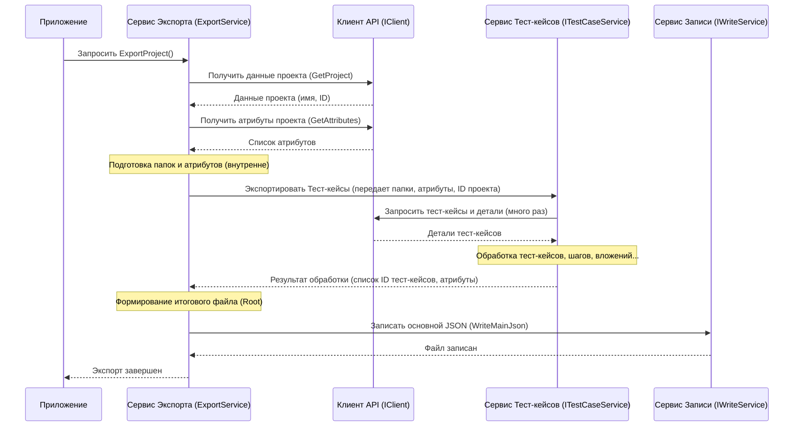

# Chapter 2: Сервис Экспорта


В [предыдущей главе](01_конфигурация_приложения_.md) мы подготовили "паспорт" и "маршрутный лист" для нашего приложения — файл конфигурации `zephyr.config.json`. Теперь, когда приложение знает, *куда* подключаться и *что* искать, нам нужен кто-то, кто будет руководить всем путешествием по сбору данных. Эту роль выполняет **Сервис Экспорта**.

Представьте себе дирижера оркестра. У него есть партитура (наша конфигурация), и он знает, когда должен вступить каждый инструмент (другие сервисы), чтобы получилась красивая мелодия (успешный экспорт проекта). Сервис Экспорта — это наш дирижер.

## Зачем нужен Сервис Экспорта?

Основная задача `ZephyrScaleServerExporter` — это взять данные из Zephyr Scale, преобразовать их и сохранить в понятном формате. Этот процесс состоит из нескольких шагов:

1.  **Получить данные из Zephyr**: Нужно подключиться к Zephyr и "спросить" его о проекте, папках, тест-кейсах, шагах и т.д.
2.  **Преобразовать данные**: Полученные данные из Zephyr могут быть в формате, который нам не совсем подходит. Их нужно превратить в нашу внутреннюю структуру ([Модели Данных](04_модели_данных_.md)).
3.  **Сохранить результаты**: Преобразованные данные нужно аккуратно записать в файлы на вашем компьютере.

Сервис Экспорта **координирует** все эти шаги. Он не выполняет всю работу сам, а делегирует задачи специализированным помощникам:

*   [**Клиенту Zephyr API**](03_клиент_zephyr_api_.md): Чтобы общаться с Zephyr.
*   **Сервисам конвертации** ([Конвертация Тест-кейсов](05_конвертация_тест_кейсов_.md), обработка папок и атрибутов): Чтобы преобразовывать данные.
*   [**Сервису Записи Данных**](07_сервис_записи_данных_.md): Чтобы сохранять файлы.

Сервис Экспорта, как дирижер, следит за тем, чтобы все "музыканты" (сервисы) играли вовремя и слаженно.

## Как запустить экспорт? Полный и Частичный режимы

Наше приложение запускает Сервис Экспорта автоматически, когда вы его запускаете. Но *какой* именно тип экспорта будет выполнен, зависит от вашей конфигурации (`zephyr.config.json` из Главы 1).

Вспомним файл `App.cs`, который является точкой входа в логику нашего приложения:

```csharp
// Файл: ZephyrScaleServerExporter/App.cs

// ... using ...
using Microsoft.Extensions.Options; // Для доступа к конфигурации
using ZephyrScaleServerExporter.Models; // Модели данных (включая AppConfig)
using ZephyrScaleServerExporter.Services; // Сервисы (включая IExportService)
// ...

public class App(
    ILogger<App> logger,
    IOptions<AppConfig> config, // Получаем конфигурацию
    IExportService exportService) // Получаем Сервис Экспорта
{
    // ... вспомогательные методы ...

    public void Run(string[] args)
    {
        logger.LogInformation("Запуск приложения");
        // ... логирование версии и ОС ...

        // !!! Вот ключевой момент !!!
        // Проверяем настройку 'Partial' из конфигурации
        if (config.Value.Zephyr.Partial) // config.Value - это наш объект AppConfig
        {
            logger.LogInformation("Запуск частичного экспорта");
            // Вызываем метод для частичного экспорта
            exportService.ExportProjectBatch().Wait(); 
        }
        else
        {
            logger.LogInformation("Запуск полного экспорта");
            // Вызываем метод для полного экспорта
            exportService.ExportProject().Wait();
        }

        logger.LogInformation("Завершение приложения");
    }
}
```

**Что здесь происходит:**

1.  Класс `App` при создании получает доступ к конфигурации (`config`) и самому Сервису Экспорта (`exportService`) благодаря Механизму Внедрения Зависимостей (DI), который мы настроили в `Program.cs` (см. Главу 1).
2.  В методе `Run`, который выполняется при запуске приложения, мы проверяем значение поля `Partial` в секции `Zephyr` нашей конфигурации (`config.Value.Zephyr.Partial`).
3.  **Если `Partial` равно `true`:** Приложение вызовет метод `ExportProjectBatch()` у Сервиса Экспорта. Этот режим предназначен для экспорта только ограниченного количества тест-кейсов (определенного параметром `Count` в конфигурации). Это полезно для быстрой проверки или отладки.
4.  **Если `Partial` равно `false` (или вообще отсутствует в конфиге):** Приложение вызовет метод `ExportProject()`. Это режим **полного экспорта**, который попытается выгрузить все тест-кейсы из указанного проекта.
5.  `.Wait()` используется здесь, чтобы дождаться завершения операции экспорта перед тем, как приложение закончит свою работу. (Экспорт данных может занять некоторое время).

Таким образом, вы управляете типом экспорта через файл `zephyr.config.json`.

## Интерфейс Сервиса Экспорта: Контракт дирижера

Чтобы другие части приложения (как наш `App.cs`) могли использовать Сервис Экспорта, не зная всех его внутренних деталей, существует "контракт" — интерфейс `IExportService`. Он определяет, *что* сервис умеет делать.

```csharp
// Файл: ZephyrScaleServerExporter/Services/IExportService.cs
namespace ZephyrScaleServerExporter.Services;

// Определяет возможности Сервиса Экспорта
public interface IExportService
{
    // Метод для запуска полного экспорта проекта
    Task ExportProject();
    
    // Метод для запуска частичного (пакетного) экспорта
    Task ExportProjectBatch();
}
```

Этот интерфейс очень прост: он объявляет два метода, соответствующих двум режимам работы, которые мы видели в `App.cs`. `Task` означает, что эти операции могут выполняться асинхронно (то есть, могут занять время, не блокируя основной поток программы).

## Под капотом: Как работает Сервис Экспорта?

Давайте заглянем внутрь "оркестровой ямы" и посмотрим, как `ExportService` (конкретная реализация интерфейса `IExportService`) дирижирует процессом на примере **полного экспорта** (`ExportProject`).

**Шаг за Шагом (без кода):**

1.  **Начало**: Метод `ExportProject()` вызывается (например, из `App.cs`).
2.  **Получение Основной Информации**: Сервис Экспорта обращается к [**Клиенту Zephyr API**](03_клиент_zephyr_api_.md) с просьбой: "Дай мне информацию о проекте (название, ID) и список пользовательских полей (атрибутов) для этого проекта".
3.  **Подготовка Папок**: Сервис Экспорта использует внутренний "помощник" (`IFolderService`) для создания структуры папок на основе имени проекта. Zephyr Scale обычно не имеет глубокой иерархии папок, как файловая система, поэтому мы часто создаем одну основную секцию, соответствующую проекту.
4.  **Подготовка Атрибутов**: Сервис Экспорта передает полученные от клиента пользовательские поля другому "помощнику" (`IAttributeService`), который преобразует их в формат, удобный для дальнейшей работы ([Модели Данных](04_модели_данных_.md)).
5.  **Экспорт Тест-кейсов**: Теперь у Сервиса Экспорта есть структура папок и готовые атрибуты. Он вызывает главного "специалиста" по тест-кейсам (`ITestCaseService`) и говорит: "Вот тебе информация о папках, атрибутах и ID проекта, пожалуйста, получи и обработай все тест-кейсы для этого проекта". `ITestCaseService`, в свою очередь, снова будет использовать [**Клиент Zephyr API**](03_клиент_zephyr_api_.md) для запроса самих тест-кейсов и их деталей. Он также займется [Конвертацией Тест-кейсов](05_конвертация_тест_кейсов_.md) и [Обработкой Вложений](06_обработка_вложений_.md).
6.  **Сбор Результатов**: `ITestCaseService` возвращает Сервису Экспорта собранные и обработанные данные о тест-кейсах.
7.  **Финальная Запись**: Сервис Экспорта берет имя проекта, структуру папок, информацию об атрибутах и список ID обработанных тест-кейсов. Он формирует финальный "основной" JSON-файл (его часто называют `root.json` или `index.json`) и передает его [**Сервису Записи Данных**](07_сервис_записи_данных_.md) с командой: "Сохрани этот главный файл!".
8.  **Завершение**: Экспорт выполнен.

**Визуализация процесса (схема):**



**Взгляд на Код (Упрощенно):**

Вот как выглядит реализация `ExportService`, показывающая эту координацию:

```csharp
// Файл: ZephyrScaleServerExporter/Services/Implementations/ExportService.cs

using Microsoft.Extensions.Logging; // Для логирования
using Models; // Общие модели (например, Root)
using ZephyrScaleServerExporter.Client; // IClient для запросов к API
using ZephyrScaleServerExporter.Models.Client; // Модели, получаемые от клиента (ZephyrProject)
using ZephyrScaleServerExporter.Models.Common; // Модели папок, атрибутов...
using ZephyrScaleServerExporter.Models.TestCases; // Модель TestCaseData

namespace ZephyrScaleServerExporter.Services.Implementations;

internal class ExportService(
    ILogger<ExportService> logger,
    IClient client, // Клиент API
    IFolderService folderService, // Сервис для папок
    IAttributeService attributeService, // Сервис для атрибутов
    ITestCaseService testCaseService, // Сервис для полного экспорта тест-кейсов
    ITestCaseBatchService testCaseBatchService, // Сервис для частичного экспорта
    IWriteService writeService) // Сервис для записи файлов
    : IExportService // Реализуем интерфейс
{
    // Метод для полного экспорта
    public async Task ExportProject()
    {
        logger.LogInformation("Экспорт проекта (полный)");
        // 1. Получаем данные о проекте, папках и атрибутах
        var (project, folders, attributes) = await FetchProjectData();

        // 2. Запускаем экспорт тест-кейсов через соответствующий сервис
        var testCaseData = await testCaseService.ExportTestCases(
            folders, attributes.AttributeMap, project.Id);

        // 3. Записываем итоговый файл
        await WriteMainRoot(project, folders, testCaseData);
        logger.LogInformation("Полный экспорт завершен");
    }
    
    // Метод для частичного (пакетного) экспорта
    public async Task ExportProjectBatch()
    {
        logger.LogInformation("Экспорт проекта (частичный)");
        // 1. Получаем данные о проекте, папках и атрибутах (так же, как в полном)
        var (project, folders, attributes) = await FetchProjectData();
        
        // 2. Запускаем экспорт через сервис ДЛЯ ЧАСТИЧНОГО экспорта
        var testCaseData = await testCaseBatchService.ExportTestCasesBatch(
            folders, attributes.AttributeMap, project.Id);

        // 3. Записываем итоговый файл (так же, как в полном)
        await WriteMainRoot(project, folders, testCaseData);
        logger.LogInformation("Частичный экспорт завершен");
    }

    // Вспомогательный метод для шага 1 (получение данных)
    private async Task<(ZephyrProject, SectionData, AttributeData)> FetchProjectData()
    {
        // Используем Клиент API для получения проекта
        var project = await client.GetProject(); 
        // Используем сервис папок для их подготовки
        var folders = folderService.ConvertSections(project.Name); 
        // Используем сервис атрибутов для их конвертации
        var attributes = await attributeService.ConvertAttributes(project.Id); 
        return (project, folders, attributes);
    }
    
    // Вспомогательный метод для шага 3 (запись итогового файла)
    private async Task WriteMainRoot(ZephyrProject project,
        SectionData folders,
        TestCaseData testCaseData)
    {
        // Создаем корневой объект для главного JSON файла
        var root = new Root 
        {
            ProjectName = project.Name,
            Attributes = testCaseData.Attributes, // Атрибуты, полученные от TestCaseService
            Sections = [folders.MainSection], // Структура папок
            SharedSteps = [],                  // Общие шаги (если есть)
            TestCases = testCaseData.TestCaseIds // ID экспортированных тест-кейсов
        };

        // Используем Сервис Записи для сохранения
        await writeService.WriteMainJson(root); 
    }
}
```

**Ключевые моменты в коде:**

*   **Внедрение "помощников"**: Обратите внимание, что `ExportService` в своем конструкторе получает все необходимые ему другие сервисы (`IClient`, `IFolderService`, `IAttributeService` и т.д.). Ему не нужно их создавать самому – система DI предоставляет их автоматически.
*   **Разделение логики**: Метод `ExportProject` четко показывает шаги: получить данные (`FetchProjectData`), обработать тест-кейсы (`testCaseService.ExportTestCases`), записать результат (`WriteMainRoot`).
*   **Разные сервисы для тест-кейсов**: Для полного (`ITestCaseService`) и частичного (`ITestCaseBatchService`) экспорта используются разные сервисы, хотя общая логика в `ExportService` похожа. Это позволяет изолировать специфику каждого режима.
*   **Асинхронность (`async`/`await`)**: Ключевые слова `async` и `await` используются повсеместно, так как операции общения с внешними системами (Zephyr API) и записи файлов могут занимать время. Это позволяет приложению оставаться отзывчивым.

## Заключение

В этой главе мы познакомились с "дирижером" нашего экспорта – **Сервисом Экспорта (`ExportService`)**. Мы узнали:

*   Его **основная роль** – координировать весь процесс экспорта, вызывая другие специализированные сервисы.
*   Он поддерживает два **режима работы**: полный (`ExportProject`) и частичный (`ExportProjectBatch`), выбор которых зависит от конфигурации (`zephyr.config.json`).
*   Он действует как **центральный узел**, получая данные от [Клиента Zephyr API](03_клиент_zephyr_api_.md), запуская сервисы конвертации ([Конвертация Тест-кейсов](05_конвертация_тест_кейсов_.md)) и используя [Сервис Записи Данных](07_сервис_записи_данных_.md) для сохранения результатов.
*   Мы увидели, как другие части приложения (например, `App.cs`) взаимодействуют с ним через интерфейс `IExportService`.

Теперь, когда мы понимаем, *кто* руководит процессом, самое время познакомиться с первым и одним из самых важных "музыкантов" в нашем оркестре. В следующей главе мы подробно рассмотрим [**Клиент Zephyr API**](03_клиент_zephyr_api_.md), который отвечает за непосредственное общение с сервером Zephyr Scale для получения всех необходимых данных.

---

Generated by [AI Codebase Knowledge Builder](https://github.com/The-Pocket/Tutorial-Codebase-Knowledge)