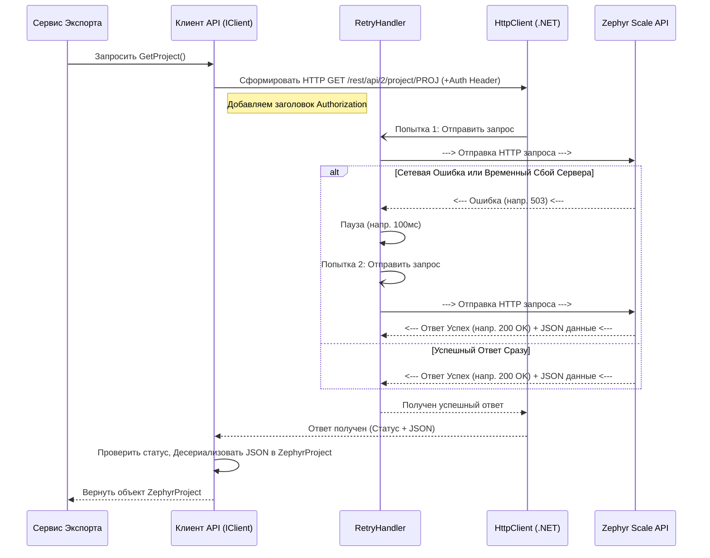

# Chapter 3: Клиент Zephyr API


В [предыдущей главе](02_сервис_экспорта_.md) мы познакомились с Сервисом Экспорта — нашим "дирижером", который управляет всем процессом выгрузки данных. Мы узнали, что он координирует работу разных помощников. Но кто же выполняет самую важную задачу — непосредственное общение с сервером Zephyr Scale, чтобы получить нужную информацию?

Встречайте **Клиента Zephyr API**! Если Сервис Экспорта — это дирижер, то Клиент API — это наш главный "переговорщик" или "посол", который отправляется прямо к Zephyr Scale и запрашивает все необходимые данные: информацию о проекте, список тест-кейсов, их шаги, статусы, вложения и многое другое.

## Зачем нужен Клиент API? Представьте себе Посланника

Представьте, что Zephyr Scale Server – это древний мудрец, хранящий ценные знания (наши тест-кейсы), но говорящий на своем особом языке (HTTP API). Наше приложение `ZephyrScaleServerExporter` хочет получить эти знания, но не понимает этот язык напрямую.

Вот тут-то и нужен Клиент Zephyr API. Он выступает в роли **посланника и переводчика**:

1.  **Знает язык:** Он умеет "говорить" с Zephyr на языке HTTP-запросов.
2.  **Знает, что спросить:** Он знает точные "адреса" (URL endpoints) в Zephyr API, куда нужно обратиться за конкретной информацией (например, `/rest/api/2/project/{ключ_проекта}` для данных о проекте).
3.  **Умеет представиться:** Он знает, как правильно аутентифицироваться (предъявить "паспорт" или "верительную грамоту"), используя логин/пароль или токен, которые мы указали в [Конфигурации Приложения](01_конфигурация_приложения_.md).
4.  **Приносит ответ:** Он получает ответ от Zephyr (обычно в формате JSON) и передает его обратно другим частям нашего приложения (например, [Сервису Экспорта](02_сервис_экспорта_.md)) для дальнейшей обработки.
5.  **Настойчив:** Если при попытке связаться с Zephyr возникла проблема (например, временный сбой сети), он умеет пробовать снова несколько раз (механизм повторных попыток), прежде чем сдаться.

Без такого клиента наше приложение было бы неспособно взаимодействовать с внешним миром Zephyr Scale.

## Как другие части приложения используют Клиента? Интерфейс `IClient`

[Сервис Экспорта](02_сервис_экспорта_.md) и другие компоненты не должны знать всех тонкостей общения с Zephyr API. Им неважно, какой именно HTTP-метод используется (`GET`, `POST` и т.д.) или как именно формируется заголовок аутентификации. Им просто нужно получить результат.

Для этого существует "контракт" или "меню услуг", которое предоставляет Клиент – это интерфейс `IClient`. Он объявляет, какие именно данные можно запросить у клиента.

```csharp
// Файл: ZephyrScaleServerExporter/Client/IClient.cs
using ZephyrScaleServerExporter.Models.Client; // Содержит описание ZephyrProject и др.

namespace ZephyrScaleServerExporter.Client;

// Интерфейс определяет, что УМЕЕТ делать наш Клиент API
public interface IClient
{
    // Получить информацию о проекте
    Task<ZephyrProject> GetProject();

    // Получить список возможных статусов тест-кейсов в проекте
    Task<List<ZephyrStatus>> GetStatuses(string projectId);

    // Получить список тест-кейсов (с параметрами для постраничной загрузки)
    Task<List<ZephyrTestCase>> GetTestCases(int startAt, int maxResults, string statuses);

    // Получить детали конкретного тест-кейса по его ключу (например, "PROJ-T123")
    Task<ZephyrTestCase> GetTestCase(string testCaseKey);

    // Получить список вложений для тест-кейса
    Task<List<ZephyrAttachment>> GetAttachmentsForTestCase(string testCaseKey);

    // Скачать содержимое вложения по его URL
    Task<byte[]> DownloadAttachment(string url);

    // ... и другие методы для получения полей, шагов, ссылок и т.д. ...

    // Получить базовый URL сервера Zephyr (Jira)
    Uri GetUrl();
}
```

*   **`Task<...>`:** Означает, что операция может занять некоторое время (ожидание ответа от сервера) и выполняется асинхронно.
*   **Методы:** Каждый метод соответствует конкретному запросу к API Zephyr (например, `GetProject` для получения проекта, `GetTestCases` для получения тест-кейсов).
*   **Параметры:** Некоторые методы принимают параметры, уточняющие запрос (например, `testCaseKey` для `GetTestCase`).
*   **Возвращаемые значения:** Методы возвращают данные, "переведенные" с языка JSON API в понятные для C# объекты ([Модели Данных](04_модели_данных_.md)), например `ZephyrProject` или `List<ZephyrTestCase>`.

Благодаря этому интерфейсу, [Сервис Экспорта](02_сервис_экспорта_.md) может просто попросить: `var projectInfo = await client.GetProject();` – и получить нужные данные, не вникая в детали HTTP-общения.

## Заглянем внутрь: Как Клиент общается с Zephyr?

Давайте представим, что [Сервис Экспорта](02_сервис_экспорта_.md) просит Клиента получить информацию о проекте (`GetProject`). Что происходит "под капотом"?

**Шаг за шагом (без кода):**

1.  **Запрос получен:** Метод `GetProject()` внутри клиента вызывается.
2.  **Формирование Адреса:** Клиент берет базовый URL Zephyr из конфигурации (`https://your-jira-instance.com`) и добавляет к нему специальный путь для запроса проекта, используя ключ проекта (тоже из конфигурации), например: `/rest/api/2/project/PROJ`. Получается полный адрес запроса.
3.  **Подготовка "Инструмента":** Клиент использует встроенный в .NET инструмент для отправки HTTP-запросов – `HttpClient`.
4.  **Аутентификация:** Перед отправкой запроса Клиент добавляет к нему специальный заголовок `Authorization`. Значение этого заголовка зависит от того, что указано в [конфигурации](01_конфигурация_приложения_.md):
    *   Если указан `Token`, заголовок будет примерно таким: `Authorization: Bearer ваш_персональный_токен_доступа_jira`.
    *   Если указаны `Login` и `Password`, заголовок будет `Authorization: Basic <закодированные_логин_пароль>`.
5.  **Отправка Запроса:** Клиент отправляет HTTP GET-запрос по сформированному адресу с нужным заголовком.
6.  **Ожидание Ответа:** Клиент ждет, пока сервер Zephyr обработает запрос и пришлет ответ.
7.  **Проверка Успеха:** Клиент проверяет статус ответа. Если это код успеха (например, 200 OK), всё хорошо. Если код ошибки (например, 401 Unauthorized - неверный логин/пароль/токен, 404 Not Found - неправильный URL или ключ проекта, 500 Internal Server Error - проблема на сервере Zephyr), клиент обычно сообщает об ошибке (логирует ее и может выбросить исключение).
8.  **Чтение и "Перевод" Данных:** Если ответ успешный, Клиент читает тело ответа (которое приходит в формате JSON) и преобразует (десериализует) этот JSON в понятный C#-объект (например, `ZephyrProject`).
9.  **Возврат Результата:** Клиент возвращает полученный C#-объект тому, кто его просил (например, [Сервису Экспорта](02_сервис_экспорта_.md)).

**А что если ошибка сети? Механизм Повторных Попыток (`RetryHandler`)**

Сеть не всегда надежна. Запрос может не дойти до сервера, или ответ может потеряться по пути. Чтобы не прерывать весь экспорт из-за кратковременного сбоя, наш Клиент использует специального "помощника" – `RetryHandler`.

Если `HttpClient` при отправке запроса сталкивается с сетевой проблемой или получает от сервера ответ, указывающий на временную недоступность (например, код 503 Service Unavailable), `RetryHandler` перехватывает эту ситуацию. Он ждет небольшую паузу (например, 100 миллисекунд) и пытается отправить **тот же самый запрос** еще раз. По умолчанию он делает до 3 таких попыток. Если и после нескольких попыток запрос не удался, то только тогда Клиент сообщит об окончательной ошибке.

**Визуализация процесса:**



## Детали Реализации: Смотрим в Код

Теперь посмотрим на некоторые фрагменты кода, чтобы увидеть, как это реализовано.

**1. Создание Клиента и настройка `HttpClient` (`Client.cs`, Конструктор и `Program.cs`)**

Клиент не создается "из воздуха". Система Внедрения Зависимостей (DI), настроенная в `Program.cs`, отвечает за его создание и передачу ему всего необходимого: логгера, конфигурации и фабрики для создания `HttpClient`.

```csharp
// Файл: ZephyrScaleServerExporter/Program.cs (Упрощенно)

// ... using ...

services.AddTransient<IClient, Client.Client>(serviceProvider =>
{
    // Получаем зависимости через DI
    var logger = serviceProvider.GetRequiredService<ILogger<Client.Client>>();
    var config = serviceProvider.GetRequiredService<IOptions<AppConfig>>();
    var httpClientFactory = serviceProvider.GetRequiredService<IHttpClientFactory>();

    // Создаем именованные HttpClient'ы с RetryHandler
    var httpClient = httpClientFactory.CreateClient("DefaultHttpClient");
    var confluenceHttpClient = httpClientFactory.CreateClient("ConfluenceHttpClient");

    // Создаем экземпляр клиента, передавая ему все необходимое
    return new Client.Client(logger, httpClient, config, confluenceHttpClient);
});

// ... настройка HttpClient с RetryHandler ...
services.AddHttpClient("DefaultHttpClient")
    .AddHttpMessageHandler(sp => new RetryHandler(sp.GetRequiredService<ILogger<RetryHandler>>()));
services.AddHttpClient("ConfluenceHttpClient")
    .AddHttpMessageHandler(sp => new RetryHandler(sp.GetRequiredService<ILogger<RetryHandler>>()));
```

*   `AddTransient<IClient, Client.Client>`: Говорит DI: "Когда кто-то попросит `IClient`, создай новый экземпляр `Client.Client`".
*   `serviceProvider.GetRequiredService<...>`: DI автоматически находит и предоставляет нужные сервисы (логгер, конфигурацию, фабрику HttpClient).
*   `httpClientFactory.CreateClient("...")`: Создает `HttpClient`. Важно, что мы используем фабрику и именуем клиенты (`"DefaultHttpClient"`).
*   `AddHttpClient("...").AddHttpMessageHandler(...)`: Здесь мы настраиваем HttpClient'ы так, чтобы они автоматически использовали наш `RetryHandler` для обработки ошибок и повторных попыток.

Внутри конструктора `Client.cs` происходит первоначальная настройка `HttpClient`:

```csharp
// Файл: ZephyrScaleServerExporter/Client/Client.cs (Упрощенно)

public class Client : IClient
{
    // ... приватные поля для хранения зависимостей (_logger, _httpClient, _config) ...
    private readonly HttpClient _httpClient;
    private readonly AppConfig _config;
    private readonly string _projectKey;
    private readonly Uri _url;

    public Client(ILogger<Client> logger,
        HttpClient httpClient,      // Получаем HttpClient от DI
        IOptions<AppConfig> config, // Получаем конфигурацию от DI
        HttpClient confluenceHttpClient) // И клиент для Confluence
    {
        _config = config.Value; // Сохраняем конфигурацию
        _logger = logger;       // Сохраняем логгер
        _projectKey = _config.Zephyr.ProjectKey; // Берем ключ проекта из конфига
        _url = new Uri(_config.Zephyr.Url);      // Берем URL из конфига

        _httpClient = httpClient; // Сохраняем основной HttpClient
        // _confluenceHttpClient = confluenceHttpClient; // Сохраняем HttpClient для Confluence

        InitHttpClient(); // Вызываем метод для настройки основного клиента
        // InitConfluenceHttpClient(); // Вызываем метод для настройки клиента Confluence
    }

    private void InitHttpClient()
    {
        _httpClient.BaseAddress = _url; // Устанавливаем базовый адрес для всех запросов
        _httpClient.Timeout = TimeSpan.FromSeconds(250); // Устанавливаем таймаут

        // Получаем заголовок аутентификации (Токен или Логин/Пароль)
        var header = GetAuthHeaderBy(_config.Zephyr.Token,
            _config.Zephyr.Login, _config.Zephyr.Password);

        if (header == null) // Проверяем, указан ли хоть какой-то способ входа
        {
            throw new ArgumentException("Токен или логин/пароль не указаны в конфигурации!");
        }
        // Добавляем заголовок по умолчанию ко всем запросам этого клиента
        _httpClient.DefaultRequestHeaders.Add("Authorization", header);
    }

    // Вспомогательный метод для выбора типа аутентификации
    private static string? GetAuthHeaderBy(string token, string login, string password)
    {
        if (!string.IsNullOrEmpty(token)) // Приоритет у токена
        {
            return "Bearer " + token; // Формат для токена
        }

        if (!string.IsNullOrEmpty(login) && !string.IsNullOrEmpty(password)) // Если нет токена, пробуем логин/пароль
        {
            // Кодируем "логин:пароль" в Base64 для Basic Auth
            var loginPassPair = $"{login}:{password}";
            var basicAuthValue = Convert.ToBase64String(Encoding.ASCII.GetBytes(loginPassPair));
            return "Basic " + basicAuthValue; // Формат для Basic Auth
        }
        return null; // Ничего не указано
    }

    // ... остальные методы клиента (GetProject, GetTestCases и т.д.) ...
}
```

*   Конструктор сохраняет полученные зависимости (`logger`, `httpClient`, `config`).
*   `InitHttpClient` устанавливает `BaseAddress` (чтобы не писать полный URL в каждом запросе) и `Timeout`.
*   `GetAuthHeaderBy` проверяет наличие токена или логина/пароля в конфигурации.
*   Найденный заголовок `Authorization` добавляется в `DefaultRequestHeaders`, чтобы он автоматически отправлялся с каждым запросом.

**2. Выполнение Запроса (Пример: `GetProject`)**

```csharp
// Файл: ZephyrScaleServerExporter/Client/Client.cs (Упрощенно)

public async Task<ZephyrProject> GetProject()
{
    _logger.LogInformation("Получение проекта по ключу {ProjectKey}", _projectKey);

    // Формируем относительный путь запроса
    var requestPath = $"/rest/api/2/project/{_projectKey}";

    // Отправляем GET-запрос с помощью настроенного HttpClient
    // BaseAddress и Authorization header добавятся автоматически
    var response = await _httpClient.GetAsync(requestPath);

    // Проверяем, успешен ли ответ
    if (!response.IsSuccessStatusCode)
    {
        // Если нет - логируем ошибку и выбрасываем исключение
        var errorContent = await response.Content.ReadAsStringAsync();
        _logger.LogError("Не удалось получить проект {Key}. Статус: {Code}. Ответ: {Resp}",
            _projectKey, response.StatusCode, errorContent);
        throw new Exception($"Не удалось получить проект {_projectKey}. Статус: {response.StatusCode}");
    }

    // Читаем тело ответа как строку
    var content = await response.Content.ReadAsStringAsync();
    // Преобразуем (десериализуем) JSON-строку в C# объект ZephyrProject
    var project = JsonSerializer.Deserialize<ZephyrProject>(content)!;

    _logger.LogDebug("Проект найден: {@Project}", project);
    return project; // Возвращаем результат
}
```

*   Строится только *относительный* путь (`/rest/api/2/project/...`), базовый URL уже настроен.
*   `_httpClient.GetAsync(requestPath)` отправляет запрос и ждет (`await`) ответа. Механизм `RetryHandler` сработает здесь автоматически в случае сбоев.
*   `response.IsSuccessStatusCode` проверяет, был ли ответ успешным (коды 2xx).
*   В случае ошибки — подробное логирование и выброс исключения.
*   В случае успеха — чтение ответа (`ReadAsStringAsync`) и использование `JsonSerializer.Deserialize` для превращения JSON в объект `ZephyrProject`.

**3. Обработчик Повторных Попыток (`RetryHandler.cs`)**

Этот класс является "оберткой" вокруг стандартной отправки запросов. Его главная задача — перехватить ошибку и повторить попытку.

```csharp
// Файл: ZephyrScaleServerExporter/Client/RetryHandler.cs (Упрощенно)

public class RetryHandler(ILogger<RetryHandler> logger, int maxRetries = 3, TimeSpan? delay = null)
    : DelegatingHandler // Наследуется от специального класса .NET для обработки HTTP
{
    private readonly TimeSpan _delay = delay ?? TimeSpan.FromMilliseconds(100); // Задержка между попытками

    protected override async Task<HttpResponseMessage> SendAsync(HttpRequestMessage request, CancellationToken ct)
    {
        int attempt = 0;
        while (true) // Бесконечный цикл (выход по return или throw)
        {
            try
            {
                // Отправляем запрос через "следующий" обработчик (в нашем случае - реальная отправка)
                var response = await base.SendAsync(request, ct);

                // Если ответ успешный ИЛИ попытки закончились - возвращаем ответ
                if (response.IsSuccessStatusCode || attempt >= maxRetries)
                    return response;

                // Если ответ неуспешный, но это не исключение (например, 4xx) - тоже выходим
                // (Мы повторяем только сетевые ошибки или явные 5xx)
            }
            catch (HttpRequestException ex) when (attempt < maxRetries)
            {
                // Ловим сетевую ошибку, если попытки еще есть
                _logger.LogError(ex, "Ошибка при HTTP запросе (попытка {Attempt}), повтор...", attempt + 1);
            }
            // Если мы здесь - значит была ошибка (исключение или неуспешный код) И попытки еще есть

            attempt++; // Увеличиваем счетчик попыток
            _logger.LogWarning("Повтор запроса к {Url}, попытка {Attempt}", request.RequestUri, attempt);
            await Task.Delay(_delay, ct); // Делаем паузу перед следующей попыткой
        }
    }
}
```

*   `DelegatingHandler`: Специальный тип, позволяющий "вклиниться" в процесс отправки HTTP-запроса.
*   `while(true)` и `attempt`: Цикл для выполнения попыток.
*   `try...catch`: Ловит исключения `HttpRequestException`, которые обычно возникают при сетевых проблемах.
*   `if (response.IsSuccessStatusCode || attempt >= maxRetries)`: Условие выхода из цикла – либо успех, либо кончились попытки.
*   `await Task.Delay(_delay, ct)`: Пауза перед следующей попыткой.

## Заключение

В этой главе мы разобрались с Клиентом Zephyr API — незаменимым компонентом нашего приложения. Мы узнали, что:

*   Он действует как **посланник и переводчик**, общаясь с Zephyr Scale API на языке HTTP.
*   Он отвечает за **отправку запросов** к конкретным API-эндпоинтам Zephyr для получения нужных данных (проект, тест-кейсы, статусы и т.д.).
*   Он обрабатывает **аутентификацию**, используя токен или логин/пароль из конфигурации.
*   Он включает **механизм повторных попыток** (`RetryHandler`) для повышения надежности при сбоях сети.
*   Другие части приложения взаимодействуют с ним через простой **интерфейс `IClient`**, не вдаваясь в детали реализации.

Теперь, когда наш "посланник" умеет приносить данные из Zephyr, нам нужно понять, в каком виде эти данные хранятся и обрабатываются внутри нашего C#-приложения. Как представить тест-кейс, его шаги, параметры или пользовательские поля в виде кода? Об этом мы поговорим в следующей главе, посвященной [Моделям Данных](04_модели_данных_.md).

---

Generated by [AI Codebase Knowledge Builder](https://github.com/The-Pocket/Tutorial-Codebase-Knowledge)