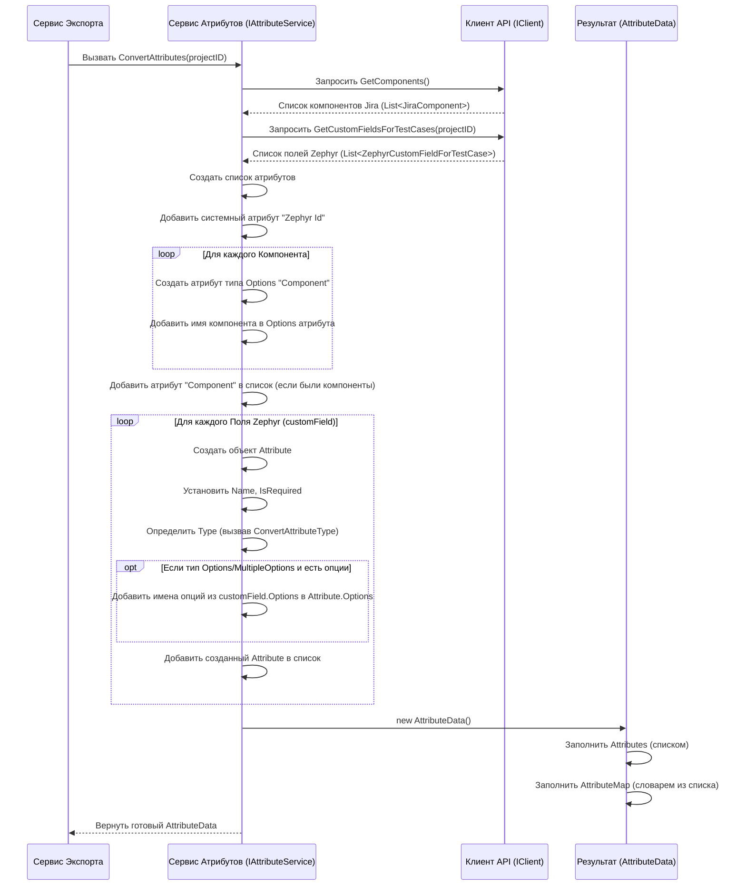

# Chapter 3: Сервис Конвертации Атрибутов

В [предыдущей главе](02_клиент_zephyr_api.md) мы разобрались, как [Клиент Zephyr API](02_клиент_zephyr_api.md) "дозванивается" до сервера Zephyr и получает от него "сырые" данные: информацию о проекте, тест-кейсах, пользовательских полях и так далее. Но эти данные представлены в том виде, в каком их хранит Zephyr. Чтобы использовать их в другой системе (например, Test IT), нам часто нужно их адаптировать, стандартизировать. Особенно это касается пользовательских полей (custom fields) и компонентов.

Именно здесь в игру вступает **Сервис Конвертации Атрибутов**. Его задача – взять специфические поля из Zephyr и преобразовать их в унифицированный список атрибутов для нашей целевой системы.

## Зачем нужен "переводчик" для атрибутов?

Представьте, что Zephyr Scale – это одна страна со своим языком и своими терминами для описания тест-кейсов. Например, у вас может быть поле "Среда Тестирования" (Test Environment) со значениями "Windows 10", "macOS", "Linux". Или поле "Тип Теста" (Test Type) со значениями "Функциональный", "Нагрузочный", "UI". Также в Zephyr (через Jira) могут использоваться "Компоненты" (Components) для группировки тестов, например, "Модуль авторизации", "Платежный шлюз".

Теперь представьте, что мы хотим перенести эти тест-кейсы в другую систему (нашу "новую страну"), которая использует свою терминологию, но похожую по смыслу. Просто скопировать названия полей недостаточно. Нам нужно:

1.  **Понять суть каждого поля:** Это поле для выбора одного значения из списка? Множественного выбора? Или просто текстовое поле? Дата?
2.  **Определить его характеристики:** Оно обязательное для заполнения? Какие конкретно варианты выбора есть в списках?
3.  **Представить это в стандартном виде:** Создать описание этого поля (атрибута), понятное новой системе.

**Проблема:** Как автоматически преобразовать разнообразные пользовательские поля и компоненты Zephyr в стандартизированный список атрибутов для новой системы?

**Решение:** Нам нужен специальный сервис-"переводчик", который:

*   Запросит у [Клиента Zephyr API](02_клиент_zephyr_api.md) список всех пользовательских полей и компонентов, относящихся к тест-кейсам.
*   Проанализирует каждое поле/компонент.
*   Создаст для каждого соответствующий "стандартный" атрибут, указав его имя, тип (строка, опции, дата), обязательность и возможные значения (для списков).
*   Добавит специальный системный атрибут для хранения оригинального ID из Zephyr (на всякий случай).

Этот сервис и есть **Сервис Конвертации Атрибутов**. Он действует как составитель словаря: берет термины из "языка Zephyr" и создает их точные описания на "стандартном языке" нашей целевой системы.

## Ключевые задачи Сервиса Конвертации Атрибутов

1.  **Получение данных:** Использует [Клиент Zephyr API](02_клиент_zephyr_api.md) для получения списка пользовательских полей (custom fields) и компонентов (components), настроенных в вашем проекте Jira/Zephyr.
2.  **Преобразование Пользовательских Полей:** Для каждого поля Zephyr определяет:
    *   **Имя атрибута:** Обычно совпадает с именем поля в Zephyr.
    *   **Тип атрибута:** Преобразует тип поля Zephyr (например, `SINGLE_CHOICE_SELECT_LIST`, `MULTI_CHOICE_SELECT_LIST`, `DATE`) в соответствующий тип целевой системы (например, `Options`, `MultipleOptions`, `Datetime`, `String`).
    *   **Обязательность:** Устанавливает флаг `IsRequired` в зависимости от настроек поля в Zephyr.
    *   **Возможные значения:** Если поле в Zephyr – это список выбора, сервис извлекает все доступные опции и добавляет их в список `Options` атрибута.
3.  **Обработка Компонентов:** Компоненты Jira часто используются для классификации тест-кейсов. Сервис создает специальный атрибут (обычно с именем "Component" или "Компонент"), который является списком выбора (`Options`), а в качестве возможных значений использует имена всех компонентов, полученных из Jira для данного проекта.
4.  **Добавление Системного Атрибута:** Создает дополнительный атрибут (например, с именем `zapi_id`) для хранения оригинального ID тест-кейса из Zephyr. Это может быть полезно для связи данных или отладки.
5.  **Формирование результата:** Упаковывает все созданные атрибуты в специальный объект `AttributeData`, который содержит как полный список атрибутов, так и словарь (`AttributeMap`) для быстрого поиска атрибута по имени.

## Как это используется?

Как и [Клиент Zephyr API](02_клиент_zephyr_api.md), Сервис Конвертации Атрибутов обычно не вызывается вами напрямую. Он используется [Сервисом Экспорта](01_сервис_экспорта.md) как один из шагов подготовки данных.

Вспомним фрагмент кода из `ExportService`:

```csharp
// File: Services\ExportService.cs (фрагмент)

public class ExportService : IExportService
{
    // ... другие зависимости ...
    private readonly IAttributeService _attributeService; // Сервис для атрибутов
    private readonly IClient _client; // Клиент API

    // Конструктор для получения зависимостей
    public ExportService(..., IClient client, ..., IAttributeService attributeService, ...)
    {
        // ...
        _client = client;
        _attributeService = attributeService; // Сохраняем ссылку
        // ...
    }

    public async Task ExportProject()
    {
        _logger.LogInformation("Exporting project");

        // 1. Получаем ID проекта
        var project = await _client.GetProject();

        // ... конвертация папок ...

        // 3. !!! ВЫЗОВ СЕРВИСА АТРИБУТОВ !!!
        // Передаем ID проекта, чтобы получить нужные поля
        var attributeData = await _attributeService.ConvertAttributes(project.Id);
        _logger.LogInformation($"Сконвертировано {attributeData.Attributes.Count} атрибутов.");

        // 4. Конвертируем тест-кейсы, передавая им результат - attributeData.AttributeMap
        var testCaseData = await _testCaseService.ConvertTestCases(folders, attributeData.AttributeMap);

        // ... дальнейшая запись файлов ...

        // Данные об атрибутах нужны и для главного файла root.json
        var root = new Root
        {
            // ...
            Attributes = attributeData.Attributes, // Используем список атрибутов
            // ...
        };
        await _writeService.WriteMainJson(root);

        _logger.LogInformation("Export complete");
    }
}
```

Здесь `ExportService` вызывает метод `_attributeService.ConvertAttributes(project.Id)`. Он передает ID проекта, полученный ранее от [Клиента Zephyr API](02_клиент_zephyr_api.md). Это важно, так как пользовательские поля и компоненты часто настроены индивидуально для каждого проекта.

В ответ сервис возвращает объект `AttributeData`. Давайте посмотрим на его структуру:

```csharp
// File: Models\AttributeData.cs

using Attribute = Models.Attribute; // Используем модель атрибута из общей библиотеки

namespace ZephyrScaleServerExporter.Models;

public class AttributeData
{
    // Просто список всех сконвертированных атрибутов
    public List<Attribute> Attributes { get; set; }

    // Словарь для быстрого поиска атрибута по его имени
    // Ключ - имя атрибута (string), Значение - сам объект атрибута (Attribute)
    public Dictionary<string, Attribute> AttributeMap { get; set; }
}
```

Этот объект `AttributeData` затем используется дальше:

*   `AttributeMap` передается в [Сервис Конвертации Тест-кейсов](04_сервис_конвертации_тест_кейсов.md), чтобы он мог правильно сопоставить значения пользовательских полей из Zephyr с нужными атрибутами.
*   `Attributes` (полный список) записывается в главный файл `root.json`, чтобы целевая система знала, какие атрибуты были созданы.

## Под капотом: Как происходит конвертация?

Давайте проследим шаги, которые выполняет `AttributeService` внутри метода `ConvertAttributes`:

1.  **Запрос Данных:** Сервис обращается к [Клиенту Zephyr API](02_клиент_zephyr_api.md) и запрашивает:
    *   Список компонентов Jira для текущего проекта (`_client.GetComponents()`).
    *   Список пользовательских полей Zephyr, определенных для тест-кейсов в этом проекте (`_client.GetCustomFieldsForTestCases(projectId)`).
2.  **Инициализация:** Создается пустой список `attributes` для хранения результатов.
3.  **Добавление Атрибута "Zephyr ID":** В список сразу добавляется первый, системный атрибут. Он имеет фиксированное имя (например, `zapi_id` или `Zephyr Id`, заданное в константах `Constants.IdZephyrAttribute`), тип `String` и не является обязательным.
4.  **Обработка Компонентов:**
    *   Если список компонентов (`components`) не пуст:
        *   Создается новый атрибут с именем (например, "Component" из `Constants.ComponentAttribute`).
        *   Тип устанавливается как `AttributeType.Options` (список с одиночным выбором).
        *   В список `Options` этого атрибута добавляются **имена** всех полученных компонентов.
        *   Этот атрибут добавляется в общий список `attributes`.
5.  **Обработка Пользовательских Полей:**
    *   Сервис проходит в цикле по каждому пользовательскому полю (`customField`), полученному из Zephyr.
    *   Для каждого поля создается новый объект `Attribute`.
    *   Его `Name` берется из `customField.Name`.
    *   Его `IsRequired` берется из `customField.Required`.
    *   Его `Type` определяется путем вызова вспомогательного метода `ConvertAttributeType`, который смотрит на `customField.Type` (например, `SINGLE_CHOICE_SELECT_LIST`) и возвращает соответствующий тип (`AttributeType.Options`).
    *   Если тип атрибута – это список (`Options` или `MultipleOptions`) и у поля `customField` есть опции (`customField.Options != null`):
        *   Сервис проходит по списку опций Zephyr (`customField.Options`).
        *   **Имена** этих опций добавляются в список `Options` создаваемого атрибута.
    *   Готовый атрибут добавляется в общий список `attributes`.
6.  **Формирование Результата:**
    *   Создается объект `AttributeData`.
    *   В `AttributeData.Attributes` помещается собранный список `attributes`.
    *   Создается словарь `AttributeData.AttributeMap`, где ключами являются имена атрибутов из списка, а значениями – сами объекты атрибутов. Это делается для удобного доступа к атрибутам по имени на следующих этапах конвертации.
7.  **Возврат:** Объект `AttributeData` возвращается вызвавшему коду ([Сервису Экспорта](01_сервис_экспорта.md)).

Представим это в виде диаграммы:



**Теперь посмотрим на код:**

Сервис `AttributeService` зависит от `IClient`, чтобы получать данные. Эта зависимость внедряется через конструктор:

```csharp
// File: Services\AttributeService.cs (фрагмент конструктора)

public class AttributeService : IAttributeService
{
    private readonly ILogger<AttributeService> _logger;
    private readonly IClient _client; // Зависимость от клиента API

    // Конструктор получает логгер и клиент API
    public AttributeService(ILogger<AttributeService> logger, IClient client)
    {
        _logger = logger;
        _client = client; // Сохраняем ссылку на клиент
    }

    // ... остальной код класса ...
}
```

Основная логика находится в методе `ConvertAttributes`:

```csharp
// File: Services\AttributeService.cs (фрагмент ConvertAttributes)

public async Task<AttributeData> ConvertAttributes(string projectId)
{
    _logger.LogInformation("Начинаем конвертацию атрибутов для проекта {ProjectId}", projectId);

    // 1. Запрашиваем данные у клиента API
    var components = await _client.GetComponents();
    var customFields = await _client.GetCustomFieldsForTestCases(projectId);
    _logger.LogDebug($"Получено {components.Count} компонентов и {customFields.Count} полей.");

    // 2. Инициализация списка атрибутов
    var attributes = new List<Attribute>();

    // 3. Добавляем системный атрибут Zephyr Id
    attributes.Add(new()
    {
        Id = Guid.NewGuid(), // Уникальный ID для атрибута
        Name = Constants.IdZephyrAttribute, // Имя из констант (напр., "zapi_id")
        Type = AttributeType.String, // Тип - строка
        IsRequired = false, // Не обязательный
        IsActive = true, // Активный
        Options = new List<string>(), // Опций нет
    });

    // 4. Обработка Компонентов
    if (components.Count != 0)
    {
        attributes.Add(
            new()
            {
                Id = Guid.NewGuid(),
                Name = Constants.ComponentAttribute, // Имя из констант (напр., "Component")
                Type = AttributeType.Options, // Тип - список с одним выбором
                IsRequired = false, // Не обязательный
                IsActive = true, // Активный
                // Заполняем опции именами компонентов
                Options = components.Select(x => x.Name).ToList()
            }
        );
        _logger.LogDebug("Добавлен атрибут для Компонентов с {Count} опциями.", components.Count);
    }

    // 5. Обработка Пользовательских Полей
    foreach (var customField in customFields)
    {
        // Пропускаем архивные поля (если такие есть)
        if (customField.Archived) continue;

        var attribute = new Attribute()
        {
            Id = Guid.NewGuid(),
            Name = customField.Name, // Имя поля
            Type = ConvertAttributeType(customField.Type), // Определяем тип
            IsRequired = customField.Required, // Обязательность
            IsActive = true, // Всегда активный
            Options = new List<string>(), // Пустой список опций по умолчанию
        };

        // Если тип - список, и опции есть в Zephyr
        if ((attribute.Type == AttributeType.Options || attribute.Type == AttributeType.MultipleOptions)
            && customField.Options != null)
        {
            // Добавляем имена опций из Zephyr в атрибут
            attribute.Options.AddRange(customField.Options.Select(x => x.Name).ToList());
        }

        attributes.Add(attribute); // Добавляем готовый атрибут в список
    }
    _logger.LogDebug("Добавлено {Count} атрибутов из пользовательских полей.", customFields.Count(cf => !cf.Archived));

    // 6. Формирование результата
    _logger.LogInformation("Конвертация атрибутов завершена. Всего атрибутов: {Count}", attributes.Count);
    return new AttributeData
    {
        Attributes = attributes, // Полный список
        AttributeMap = attributes.ToDictionary(x => x.Name, x => x) // Словарь для поиска
    };
}
```

Вспомогательный метод `ConvertAttributeType` просто сопоставляет строковые константы типов Zephyr с перечислением `AttributeType` целевой системы:

```csharp
// File: Services\AttributeService.cs (фрагмент ConvertAttributeType)

private AttributeType ConvertAttributeType(string zephyrAttributeType)
{
    // Используем конструкцию switch для проверки типа из Zephyr
    switch (zephyrAttributeType)
    {
        // Если это список с одним выбором
        case ZephyrAttributeType.Options: // "SINGLE_CHOICE_SELECT_LIST"
            return AttributeType.Options;
        // Если это список с множественным выбором
        case ZephyrAttributeType.MultipleOptions: // "MULTI_CHOICE_SELECT_LIST"
            return AttributeType.MultipleOptions;
        // Если это дата
        case ZephyrAttributeType.Datetime: // "DATE"
            return AttributeType.Datetime;
        // Во всех остальных случаях считаем, что это строка
        default:
            return AttributeType.String;
    }
}

// Константы типов полей Zephyr определены в модели:
// File: Models\ZephyrAttributeType.cs
public class ZephyrAttributeType
{
    public const string Options = "SINGLE_CHOICE_SELECT_LIST";
    public const string MultipleOptions = "MULTI_CHOICE_SELECT_LIST";
    public const string Datetime = "DATE";
    // Другие типы (текст, число и т.д.) будут обработаны как String по умолчанию
}
```

Модели данных, такие как `ZephyrCustomFieldForTestCase` и `JiraComponent`, используются для десериализации ответов от [Клиента Zephyr API](02_клиент_zephyr_api.md), а `Attribute` (из общей библиотеки `Models`) – для представления атрибутов в целевом формате.

## Заключение

В этой главе мы погрузились в работу **Сервиса Конвертации Атрибутов**. Мы узнали, что он:

*   Выполняет роль **"переводчика"** или **"составителя словаря"** для пользовательских полей и компонентов Zephyr.
*   Запрашивает необходимые данные (поля, компоненты) у [Клиента Zephyr API](02_клиент_zephyr_api.md).
*   **Преобразует** каждое поле/компонент в стандартизированный **атрибут**, определяя его имя, тип, обязательность и опции.
*   Добавляет **системный атрибут** для хранения ID из Zephyr.
*   Возвращает результат в виде объекта `AttributeData`, который используется другими частями экспортёра.

Теперь, когда у нас есть стандартизированное описание всех атрибутов (пользовательских полей), мы готовы перейти к самому главному – конвертации самих тест-кейсов.

В следующей главе мы рассмотрим [Сервис Конвертации Тест-кейсов](04_сервис_конвертации_тест_кейсов.md), который использует информацию об атрибутах (и папках), чтобы правильно преобразовать основные данные каждого тест-кейса из формата Zephyr в целевой формат.

---

Generated by [AI Codebase Knowledge Builder](https://github.com/The-Pocket/Tutorial-Codebase-Knowledge)