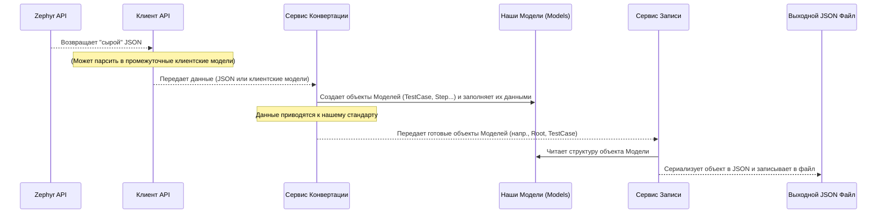

# Chapter 4: Модели Данных


В [предыдущей главе](03_клиент_zephyr_api_.md) мы познакомились с [Клиентом Zephyr API](03_клиент_zephyr_api_.md) — нашим "посланником", который умеет запрашивать и получать данные (тест-кейсы, шаги, атрибуты) напрямую от сервера Zephyr Scale. Он приносит нам информацию в виде JSON-ответов.

Но как наше C#-приложение будет работать с этой информацией? Представьте, что вам прислали посылку с разобранной мебелью. Вам нужна **инструкция по сборке** или **чертёж**, чтобы понять, из каких деталей состоит стол или стул, и как они соединяются.

В нашем приложении роль таких "чертежей" для данных играют **Модели Данных**. Они определяют точную **структуру**, в которой мы будем хранить и обрабатывать информацию о тест-кейсах, шагах, атрибутах и других сущностях внутри нашего приложения.

## Зачем нужны Модели Данных? Контейнеры для Информации

Представьте себе набор кубиков LEGO. Есть разные кубики: красные 2x4, синие 1x2, желтые плоские и так далее. Вы не можете просто взять горсть случайных деталей и построить замок — вам нужны конкретные, **определенные формы** кубиков.

Модели данных — это как эти **определенные формы** кубиков в нашем приложении. Они решают несколько задач:

1.  **Стандартизация:** Неважно, в каком точно виде Zephyr API вернул нам данные. Мы преобразуем их в *наш* стандартизированный формат, описанный моделями. Это упрощает дальнейшую обработку.
2.  **Структура:** Модели четко описывают, из каких полей состоит тест-кейс (имя, описание, шаги...), из каких полей состоит шаг (действие, ожидаемый результат...) и так далее. Это как схема или шаблон.
3.  **Типизация:** Каждое поле в модели имеет определенный тип данных (строка, число, список строк, дата и т.д.). Это помогает избежать ошибок при работе с данными.
4.  **Основа для Вывода:** Когда мы будем сохранять результаты в финальные JSON-файлы, именно структура наших моделей определит, как будут выглядеть эти файлы.

**Центральный Пример:** Как представить внутри нашего C# кода один тест-кейс, который [Клиент Zephyr API](03_клиент_zephyr_api_.md) получил от Zephyr? Ответ: с помощью модели `TestCase.cs`.

## Что такое Модели Данных в Коде? Проект `Models`

В нашем проекте `ZephyrScaleServerExporter` все модели данных вынесены в отдельный, независимый проект (библиотеку), который так и называется — `Models`. Это сделано для того, чтобы их можно было легко переиспользовать, если понадобится.

Физически, каждая модель — это **C#-класс** (файл с расширением `.cs`). Этот класс содержит **свойства** (properties), которые соответствуют полям данных, которые мы хотим хранить.

Например, для тест-кейса нам нужны:
*   Уникальный идентификатор (ID)
*   Название
*   Описание
*   Приоритет
*   Статус
*   Список шагов
*   Список примененных атрибутов (пользовательских полей)
*   ... и так далее.

Все эти поля будут описаны как свойства внутри класса `TestCase.cs`.

## Обзор Основных Моделей: Строительные Блоки

Давайте кратко познакомимся с главными "строительными блоками" (моделями), которые мы используем:

*   `TestCase.cs`: Представляет **один тест-кейс** со всеми его основными полями, включая списки шагов, атрибутов, ссылок и т.д. Это центральная модель.
*   `Step.cs`: Представляет **один шаг** внутри тест-кейса (или предусловия/постусловия). Содержит поля для действия, ожидаемого результата, тестовых данных и вложений.
*   `Attribute.cs`: Представляет **определение пользовательского поля** (атрибута). Содержит его ID, имя, тип (например, "список", "строка", "пользователь"), возможные опции для списков.
*   `CaseAttribute.cs`: Представляет **значение конкретного атрибута**, примененное к конкретному тест-кейсу. Содержит ID атрибута и его значение.
*   `Section.cs`: Представляет **папку** или секцию в иерархии тест-кейсов. Содержит ID, имя и может содержать вложенные секции.
*   `Link.cs`: Представляет **веб-ссылку**, прикрепленную к тест-кейсу.
*   `Iteration.cs`: Представляет **итерацию** для параметризованных тест-кейсов.
*   `SharedStep.cs`: Представляет **общий шаг**, который может быть переиспользован в разных тест-кейсах.
*   `Root.cs`: Особая модель, представляющая **корневую структуру всего экспорта**. Именно она определяет, как будет выглядеть главный JSON-файл (`root.json`), который содержит общую информацию о проекте, список всех атрибутов, структуру папок и ссылки на файлы отдельных тест-кейсов.

## Пример: Модель Тест-кейса (`TestCase.cs`)

Давайте посмотрим на упрощенный пример того, как может выглядеть модель `TestCase.cs`. Это как "чертеж" для объекта тест-кейса в нашем коде.

```csharp
// Файл: Models/TestCase.cs
using System.Text.Json.Serialization; // Для атрибутов [JsonPropertyName]
using Models; // Используем другие модели из этого же проекта (Step, CaseAttribute...)

public class TestCase
{
    // Уникальный ID тест-кейса (тип Guid)
    [JsonPropertyName("id")] // Как поле будет называться в JSON
    [JsonRequired] // Поле обязательно должно быть в JSON
    public Guid Id { get; set; }

    // Название тест-кейса (тип string - строка)
    [JsonPropertyName("name")]
    [JsonRequired]
    public string Name { get; set; }

    // Описание (может отсутствовать)
    [JsonPropertyName("description")]
    public string Description { get; set; }

    // Статус (используется перечисление StateType: Draft, Approved...)
    [JsonPropertyName("state")]
    [JsonRequired]
    public StateType State { get; set; }

    // Приоритет (используется перечисление PriorityType: Low, Normal, High...)
    [JsonPropertyName("priority")]
    [JsonRequired]
    public PriorityType Priority { get; set; }

    // Список шагов (каждый элемент списка - объект типа Step)
    [JsonPropertyName("steps")]
    public List<Step> Steps { get; set; }

    // Список примененных атрибутов (каждый элемент - объект CaseAttribute)
    [JsonPropertyName("attributes")]
    public List<CaseAttribute> Attributes { get; set; }

    // ... другие поля: PreconditionSteps, PostconditionSteps, Tags, Links ...

    // ID секции (папки), к которой принадлежит тест-кейс
    [JsonPropertyName("sectionId")]
    [JsonRequired]
    public Guid SectionId { get; set; }
}
```

**Пояснения:**

*   `public class TestCase`: Объявляет новый тип данных (класс) с именем `TestCase`.
*   `public Guid Id { get; set; }`: Объявляет свойство `Id` типа `Guid` (уникальный идентификатор). `{ get; set; }` означает, что мы можем читать (`get`) и записывать (`set`) значение этого свойства.
*   `public string Name { get; set; }`: Свойство `Name` для хранения имени (тип `string`).
*   `public List<Step> Steps { get; set; }`: Свойство `Steps` для хранения списка шагов. Тип `List<Step>` означает "список объектов типа `Step`".
*   **`[JsonPropertyName("...")]`**: Этот атрибут (специальная метка для компилятора и библиотек) указывает, как это свойство должно называться при чтении или записи JSON-файлов. Например, свойство `SectionId` в C# будет соответствовать полю `"sectionId"` в JSON. Это позволяет использовать стандартные имена полей в JSON (camelCase), даже если в C# мы предпочитаем другие имена (PascalCase).
*   **`[JsonRequired]`**: Указывает, что при чтении JSON, это поле обязательно должно присутствовать. Если его не будет, произойдет ошибка.

## Пример: Модель Шага (`Step.cs`)

А вот как выглядит "чертеж" для одного шага:

```csharp
// Файл: Models/Step.cs
using System.Text.Json.Serialization;

namespace Models;

public class Step
{
    // Действие, которое нужно выполнить
    [JsonPropertyName("action")]
    public required string Action { get; set; } // `required` - обязательно при создании

    // Ожидаемый результат
    [JsonPropertyName("expected")]
    public required string Expected { get; set; }

    // Тестовые данные (необязательно)
    [JsonPropertyName("testData")]
    public string? TestData { get; set; } // `?` означает, что может быть null

    // Списки имен файлов вложений (отдельно для каждого поля)
    [JsonPropertyName("actionAttachments")]
    public required List<string> ActionAttachments { get; set; }

    [JsonPropertyName("expectedAttachments")]
    public required List<string> ExpectedAttachments { get; set; }

    [JsonPropertyName("testDataAttachments")]
    public required List<string> TestDataAttachments { get; set; }

    // Если шаг является ссылкой на общий шаг, здесь будет его ID
    [JsonPropertyName("sharedStepId")]
    public Guid? SharedStepId { get; set; } // `?` - может отсутствовать
}
```

Здесь мы видим поля для действия (`Action`), результата (`Expected`), данных (`TestData`) и списки имен файлов-вложений (`...Attachments`), которые относятся к этому шагу.

## Пример: Модель Атрибута (`Attribute.cs`)

Это "чертеж" для описания самого атрибута (пользовательского поля), не его значения в тест-кейсе:

```csharp
// Файл: Models/Attribute.cs
using System.Text.Json.Serialization;

namespace Models;

public class Attribute
{
    // Уникальный ID атрибута
    [JsonPropertyName("id")]
    [JsonRequired]
    public Guid Id { get; set; }

    // Имя атрибута (как оно видно пользователю)
    [JsonPropertyName("name")]
    [JsonRequired]
    public string Name { get; set; }

    // Тип атрибута (строка, список, пользователь...)
    // Используется перечисление AttributeType
    [JsonPropertyName("type")]
    [JsonRequired]
    public AttributeType Type { get; set; }

    // Обязателен ли атрибут для заполнения?
    [JsonPropertyName("isRequired")]
    [JsonRequired]
    public bool IsRequired { get; set; }

    // Активен ли атрибут (используется ли он)?
    [JsonPropertyName("isActive")]
    [JsonRequired]
    public bool IsActive { get; set; }

    // Если тип - список, здесь хранятся возможные значения
    [JsonPropertyName("options")]
    public List<string> Options { get; set; }
}
```

## Пример: Корневая Модель (`Root.cs`)

Эта модель особенная. Она описывает структуру файла `root.json`, который является главным файлом экспорта. Он не содержит сами тест-кейсы, а содержит общую информацию и ссылки на них.

```csharp
// Файл: Models/Root.cs
using System.Text.Json.Serialization;

namespace Models;

public class Root
{
    // Имя проекта, из которого делался экспорт
    [JsonPropertyName("projectName")]
    [JsonRequired]
    public string ProjectName { get; set; }

    // Список ВСЕХ атрибутов, определенных в проекте
    // Содержит объекты типа Attribute
    [JsonPropertyName("attributes")]
    public List<Attribute> Attributes { get; set; }

    // Список секций (папок) верхнего уровня
    // Содержит объекты типа Section, которые могут содержать вложенные Section
    [JsonPropertyName("sections")]
    [JsonRequired]
    public List<Section> Sections { get; set; }

    // Список ID общих шагов (если они есть)
    // Файлы для них будут лежать отдельно
    [JsonPropertyName("sharedSteps")]
    [JsonRequired]
    public List<Guid> SharedSteps { get; set; }

    // Список ID всех экспортированных тест-кейсов
    // Файлы для них будут лежать отдельно
    [JsonPropertyName("testCases")]
    [JsonRequired]
    public List<Guid> TestCases { get; set; }
}
```

Эта модель собирает воедино всю мета-информацию: имя проекта, определения атрибутов, структуру папок и списки ID отдельных сущностей (тест-кейсов, общих шагов), файлы которых будут лежать рядом.

## Как Модели Используются в Процессе Экспорта?

Теперь давайте посмотрим, как эти "чертежи" применяются на практике во время работы приложения.

1.  **Получение Сырых Данных:** [Клиент Zephyr API](03_клиент_zephyr_api_.md) отправляет запрос к Zephyr и получает ответ в виде JSON. Этот JSON соответствует *внутренней структуре Zephyr Scale*.
2.  **Первичная Обработка (Клиентские Модели):** Иногда [Клиент Zephyr API](03_клиент_zephyr_api_.md) преобразует этот "сырой" JSON в свои *промежуточные* C# модели (например, `ZephyrTestCase`, `ZephyrStep` и т.д.). Эти модели могут быть очень похожи на JSON от Zephyr и отличаться от наших финальных моделей в проекте `Models`.
3.  **Конвертация в Наши Модели:** Специальные сервисы (главный из них мы рассмотрим в главе [Конвертация Тест-кейсов](05_конвертация_тест_кейсов_.md)) берут данные из клиентских моделей (или напрямую из JSON ответа) и "перекладывают" их в наши стандартные модели `TestCase`, `Step`, `Attribute` и другие из проекта `Models`. На этом этапе данные приводятся к нашему единому формату. Теперь у нас есть объекты C# (например, объект `TestCase`), заполненные данными, структура которых точно соответствует нашим "чертежам".
4.  **Запись в Файлы:** Наконец, [Сервис Записи Данных](07_сервис_записи_данных_.md) берет эти готовые объекты (например, объект `Root` или список объектов `TestCase`) и преобразует их обратно в JSON-строки. Благодаря атрибутам `[JsonPropertyName]` и структуре самих классов, итоговые JSON-файлы будут иметь именно тот формат, который мы определили в наших моделях.

**Визуализация потока данных:**



## Где Находятся Файлы Моделей?

Все файлы `.cs`, определяющие наши модели, находятся в отдельном проекте `Models`. Вы можете увидеть это в структуре решения. Файл `Models.csproj` определяет этот проект как библиотеку:

```xml
<!-- Файл: Models/Models.csproj -->
<Project Sdk="Microsoft.NET.Sdk">

    <PropertyGroup>
        <TargetFramework>net8.0</TargetFramework> <!-- Версия .NET -->
        <ImplicitUsings>enable</ImplicitUsings> <!-- Автоматическое подключение пространств имен -->
        <Nullable>enable</Nullable> <!-- Поддержка Nullable типов (например, string?) -->
    </PropertyGroup>

    <!-- ... возможно, другие настройки ... -->

</Project>
```

Этот файл говорит системе сборки, что код в папке `Models` должен быть скомпилирован в отдельную библиотеку (`.dll`), которую затем смогут использовать другие части нашего приложения (например, основной проект `ZephyrScaleServerExporter`).

## Заключение

В этой главе мы разобрались с концепцией **Моделей Данных** в `ZephyrScaleServerExporter`. Мы узнали, что:

*   Модели Данных — это **C#-классы**, выступающие в роли **"чертежей"** или **"контейнеров"** для информации о тест-кейсах, шагах, атрибутах и т.д.
*   Они обеспечивают **стандартизацию, структуру и типизацию** данных внутри приложения.
*   Они находятся в отдельном проекте `Models`.
*   Ключевые модели включают `TestCase`, `Step`, `Attribute`, `Section` и `Root`.
*   Атрибуты `[JsonPropertyName]` и `[JsonRequired]` помогают связывать C# свойства с полями в JSON и обеспечивать корректность данных.
*   Модели используются на этапе **конвертации** данных, полученных от Zephyr, и служат основой для **генерации выходных JSON-файлов**.

Теперь мы знаем, *какую структуру* должны иметь наши данные внутри приложения и в итоговых файлах. Но как именно происходит переход от данных, полученных [Клиентом Zephyr API](03_клиент_zephyr_api_.md), к этой нашей структуре? Как мы заполняем наши "контейнеры" (`TestCase`, `Step` и др.)?

Об этом подробно расскажет следующая глава: [Конвертация Тест-кейсов](05_конвертация_тест_кейсов_.md). Мы увидим, как сервисы конвертации берут информацию из Zephyr и аккуратно раскладывают её по нашим моделям.

---

Generated by [AI Codebase Knowledge Builder](https://github.com/The-Pocket/Tutorial-Codebase-Knowledge)