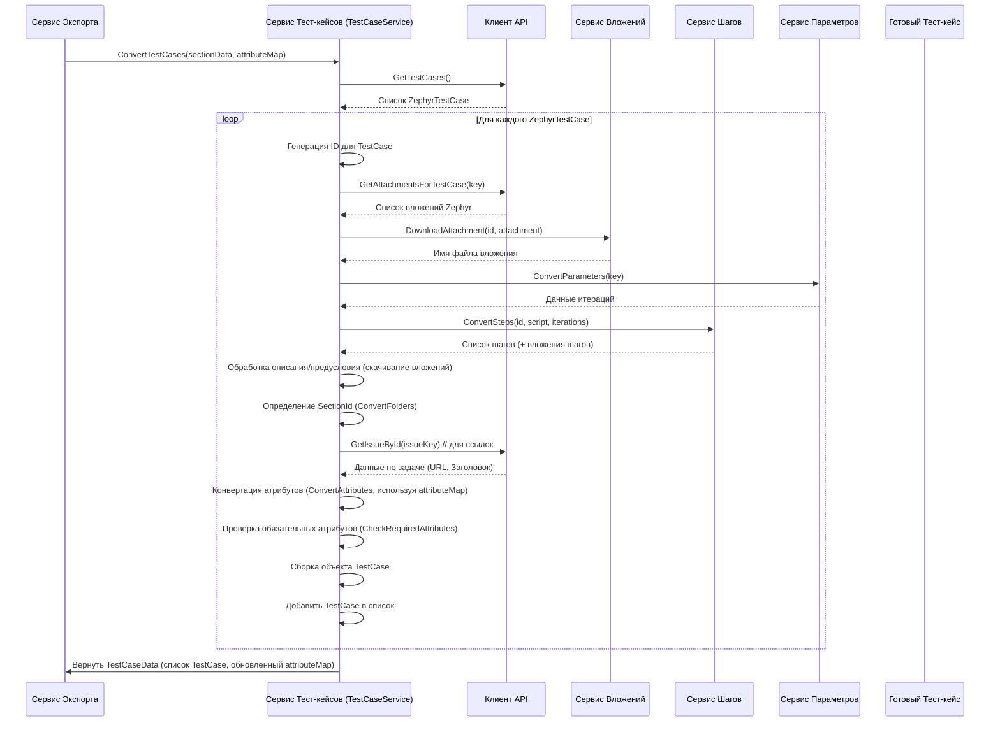

# Chapter 4: Сервис Конвертации Тест-кейсов

В [предыдущей главе](03_сервис_конвертации_атрибутов.md) мы научились превращать специфичные для Zephyr пользовательские поля и компоненты в стандартизированный список атрибутов с помощью [Сервиса Конвертации Атрибутов](03_сервис_конвертации_атрибутов.md). Теперь, когда у нас есть этот "словарь" атрибутов, мы готовы к главной задаче – преобразованию самих тест-кейсов!

Этим занимается **Сервис Конвертации Тест-кейсов**. Это один из самых важных компонентов нашего экспортёра.

## Зачем нужен отдельный сервис для Тест-кейсов?

Представьте, что тест-кейс – это не просто название и описание, а сложный объект, как пазл. У него есть:

*   Основные детали (имя, статус, приоритет).
*   Инструкции по выполнению (шаги).
*   Начальные условия (предусловия).
*   Дополнительная информация (атрибуты/пользовательские поля).
*   Связанные файлы (вложения).
*   Связи с другими задачами (ссылки).
*   Возможно, вариации с разными данными (параметры).

Просто получить все эти данные от [Клиента Zephyr API](02_клиент_zephyr_api.md) недостаточно. Их нужно **собрать вместе** в правильную структуру, понятную для целевой системы (например, Test IT).

**Проблема:** Как взять разрозненные кусочки информации об одном тест-кейсе из Zephyr и сложить их в единый, структурированный объект `TestCase`?

**Решение:** Нам нужен **Сервис Конвертации Тест-кейсов**. Он работает как сборщик пазлов:

1.  Берет "сырой" тест-кейс из Zephyr (полученный через [Клиент API](02_клиент_zephyr_api.md)).
2.  Запрашивает и преобразует все связанные с ним "детали":
    *   Шаги (с помощью [Сервиса Конвертации Шагов](05_сервис_конвертации_шагов.md)).
    *   Вложения (с помощью [Сервиса Обработки Вложений](06_сервис_обработки_вложений.md)).
    *   Параметры (с помощью [Сервиса Обработки Параметров](07_сервис_обработки_параметров.md)).
    *   Ссылки на задачи.
    *   Значения кастомных полей (используя "словарь" атрибутов из [Сервиса Конвертации Атрибутов](03_сервис_конвертации_атрибутов.md)).
    *   Простую информацию (имя, статус, приоритет, описание, предусловие).
3.  Складывает все эти части в единый объект `TestCase` нужного формата.

Этот сервис отвечает за **полную картину** одного-единственного тест-кейса.

## Как используется Сервис Конвертации Тест-кейсов?

Как и другие сервисы конвертации, он вызывается главным координатором – [Сервисом Экспорта](01_сервис_экспорта.md). Помните, как `ExportService` сначала подготавливал папки и атрибуты? Теперь он использует эти результаты для конвертации тест-кейсов.

Вот фрагмент кода из `ExportService`:

```csharp
// File: Services\ExportService.cs (фрагмент)

public async Task ExportProject()
{
    // ... получение проекта, конвертация папок (folders) ...

    // 3. Конвертируем атрибуты
    var attributeData = await _attributeService.ConvertAttributes(project.Id);
    var attributeMap = attributeData.AttributeMap; // Словарь атрибутов

    // 4. !!! ВЫЗОВ СЕРВИСА ТЕСТ-КЕЙСОВ !!!
    // Передаем информацию о папках (sectionData) и словарь атрибутов (attributeMap)
    var testCaseData = await _testCaseService.ConvertTestCases(folders, attributeMap);
    _logger.LogInformation($"Сконвертировано {testCaseData.TestCases.Count} тест-кейсов.");

    // 5. Записываем каждый тест-кейс
    foreach (var testCase in testCaseData.TestCases)
    {
        await _writeService.WriteTestCase(testCase);
    }

    // 6. Готовим главный файл root.json
    var root = new Root
    {
        // ...
        Attributes = testCaseData.Attributes, // Используем обновленный список атрибутов!
        Sections = new List<Section> { folders.MainSection },
        TestCases = testCaseData.TestCases.Select(t => t.Id).ToList() // ID готовых тест-кейсов
    };
    await _writeService.WriteMainJson(root);
    // ...
}
```

Здесь `ExportService` вызывает `_testCaseService.ConvertTestCases()`, передавая ему:

1.  `folders` (`SectionData`): Информация о структуре папок, чтобы сервис мог определить, в какую папку (`SectionId`) поместить каждый тест-кейс.
2.  `attributeMap` (`Dictionary<string, Attribute>`): "Словарь" атрибутов, созданный [Сервисом Конвертации Атрибутов](03_сервис_конвертации_атрибутов.md). Он нужен, чтобы правильно связать значения пользовательских полей из Zephyr с нашими стандартизированными атрибутами.

В ответ `TestCaseService` возвращает объект `TestCaseData`. Посмотрим на его структуру:

```csharp
// File: Models\TestCaseData.cs

using Models; // Используем общие модели
using Attribute = Models.Attribute; // Уточняем, что Attribute - это наша модель

namespace ZephyrScaleServerExporter.Models;

public class TestCaseData
{
    // Список готовых, полностью сконвертированных тест-кейсов
    public List<TestCase> TestCases { get; set; }
    // Список атрибутов (может быть обновлен, если какие-то обязательные атрибуты не нашлись)
    public List<Attribute> Attributes { get; set; }
}
```

Этот `TestCaseData` содержит список `TestCase` объектов, готовых к записи в файлы, а также итоговый список атрибутов (который мог измениться, если сервис обнаружил, что некоторые "обязательные" атрибуты на самом деле не использовались).

## Под капотом: Как происходит сборка одного тест-кейса?

Сервис Конвертации Тест-кейсов выполняет довольно много работы. Давайте разберем по шагам, что происходит внутри `ConvertTestCases`, когда он обрабатывает *один* тест-кейс из Zephyr:

1.  **Получение "сырых" данных:** Сначала сервис запрашивает у [Клиента Zephyr API](02_клиент_zephyr_api.md) полный список всех тест-кейсов проекта (`_client.GetTestCases()`). Затем он начинает перебирать их по одному.
2.  **Генерация ID:** Для каждого тест-кейса создается уникальный идентификатор (`Guid`), который будет использоваться в целевой системе.
3.  **Работа с Вложениями:**
    *   Запрашиваются все вложения, прикрепленные непосредственно к тест-кейсу в Zephyr (`_client.GetAttachmentsForTestCase()`).
    *   Для каждого вложения вызывается [Сервис Обработки Вложений](06_сервис_обработки_вложений.md) (`_attachmentService.DownloadAttachment()`), который скачивает файл и возвращает его новое имя. Имена файлов сохраняются.
4.  **Работа с Параметрами:** Вызывается [Сервис Обработки Параметров](07_сервис_обработки_параметров.md) (`_parameterService.ConvertParameters()`), чтобы получить информацию об итерациях (наборах данных) для этого тест-кейса.
5.  **Работа с Шагами:**
    *   Если у тест-кейса есть шаги (`zephyrTestCase.TestScript != null`), вызывается [Сервис Конвертации Шагов](05_сервис_конвертации_шагов.md) (`_stepService.ConvertSteps()`). Ему передается ID тест-кейса, информация о шагах из Zephyr и данные об итерациях (параметрах).
    *   Сервис шагов возвращает готовый список объектов `Step`. Сохраняются также имена файлов вложений, которые могли быть прикреплены к шагам.
6.  **Обработка Описания и Предусловия:** Тексты описания (`Description`) и предусловия (`Precondition`) извлекаются. Если в них были вложения (специальная разметка Zephyr), они также скачиваются через [Сервис Обработки Вложений](06_сервис_обработки_вложений.md).
7.  **Определение Папки (`SectionId`):** По информации о папке из Zephyr (`zephyrTestCase.Folder`) и структуре папок (`sectionData`), полученной от `ExportService`, определяется ID целевой папки. Если папка не существовала, она может быть создана здесь же.
8.  **Обработка Ссылок:** Если есть ссылки на задачи Jira (`zephyrTestCase.IssueLinks`), для каждой из них запрашивается информация (URL, название) у [Клиента Zephyr API](02_клиент_zephyr_api.md) (`_client.GetIssueById()`). Формируется список объектов `Link`.
9.  **Обработка Атрибутов (самое интересное!):**
    *   Создается пустой список атрибутов для *этого* тест-кейса (`List<CaseAttribute>`).
    *   Добавляется системный атрибут `zapi_id` со значением `zephyrTestCase.Key`.
    *   Если указан компонент (`zephyrTestCase.Component`), находится соответствующий атрибут "Component" в `attributeMap` и добавляется в список `CaseAttribute` с этим значением.
    *   Перебираются все пользовательские поля (`zephyrTestCase.CustomFields`), пришедшие из Zephyr:
        *   Для каждого поля ищется соответствующий атрибут в `attributeMap` по имени поля.
        *   Если атрибут найден, создается объект `CaseAttribute`, связывающий `Id` найденного атрибута и значение поля из Zephyr. (Для полей с множественным выбором значение обрабатывается особо).
        *   Этот `CaseAttribute` добавляется в список атрибутов тест-кейса.
    *   **Важно:** Проверяется, все ли *обязательные* атрибуты (из `attributeMap`) получили значение для этого тест-кейса. Если какой-то обязательный атрибут остался без значения, он помечается как *необязательный* в *основном* `attributeMap`. Это нужно, чтобы не возникло ошибок при импорте в целевую систему.
10. **Конвертация Базовых Полей:** Преобразуются статус (`Status` -> `StateType`), приоритет (`Priority` -> `PriorityType`), извлекаются название (`Name`) и метки (`Labels` -> `Tags`).
11. **Сборка Финального Объекта:** Создается объект `TestCase`, куда помещаются все собранные и преобразованные части: ID, имя, описание, статус, приоритет, шаги, предусловие, атрибуты, теги, ссылки, список имен всех вложений, параметры/итерации, ID папки.
12. **Добавление в Результат:** Готовый объект `TestCase` добавляется в общий список `testCases`.
13. **Возврат `TestCaseData`:** После обработки всех тест-кейсов из Zephyr, сервис формирует и возвращает объект `TestCaseData`, содержащий список всех готовых `TestCase` и потенциально обновленный `attributeMap`.

Визуализируем процесс конвертации **одного** тест-кейса:



## Код в деталях

Сервис `TestCaseService` зависит от множества других сервисов, которые помогают ему собирать "пазл":

```csharp
// File: Services\TestCaseService.cs (фрагмент конструктора)

public class TestCaseService : ITestCaseService
{
    private readonly ILogger<TestCaseService> _logger;
    private readonly IClient _client; // Для получения данных из Zephyr
    private readonly IStepService _stepService; // Для конвертации шагов
    private readonly IAttachmentService _attachmentService; // Для скачивания вложений
    private readonly IParameterService _parameterService; // Для обработки параметров
    public const int _duration = 10000; // Длительность по умолчанию для тест-кейса

    // Конструктор получает все необходимые зависимости
    public TestCaseService(ILogger<TestCaseService> logger, IClient client, IStepService stepService,
        IAttachmentService attachmentService, IParameterService parameterService)
    {
        _logger = logger;
        _client = client;
        _stepService = stepService;
        _attachmentService = attachmentService;
        _parameterService = parameterService;
    }

    // ... остальной код ...
}
```

Основной метод `ConvertTestCases` содержит цикл по всем тест-кейсам из Zephyr:

```csharp
// File: Services\TestCaseService.cs (фрагмент ConvertTestCases)

public async Task<TestCaseData> ConvertTestCases(SectionData sectionData, Dictionary<string, Attribute> attributeMap)
{
    _logger.LogInformation("Запускаем конвертацию тест-кейсов");

    var testCases = new List<TestCase>(); // Список для готовых тест-кейсов
    // Получаем имена обязательных атрибутов, чтобы потом проверить их наличие
    var requiredAttributeNames = attributeMap.Values.Where(a => a.IsRequired).Select(a => a.Name).ToList();

    // Получаем "сырые" тест-кейсы из Zephyr
    var cases = await _client.GetTestCases();

    // Цикл по каждому "сырому" тест-кейсу
    foreach (var zephyrTestCase in cases)
    {
        _logger.LogInformation("Конвертируем тест-кейс {Name}", zephyrTestCase.Name);

        var testCaseId = Guid.NewGuid(); // Уникальный ID для нового тест-кейса
        var attachments = new List<string>(); // Список имен файлов вложений для этого тест-кейса

        // 1. Скачиваем основные вложения
        var zephyrAttachments = await _client.GetAttachmentsForTestCase(zephyrTestCase.Key);
        foreach (var attachment in zephyrAttachments)
        {
            var fileName = await _attachmentService.DownloadAttachment(testCaseId, attachment);
            attachments.Add(fileName);
        }

        // 2. Конвертируем параметры
        var iterations = await _parameterService.ConvertParameters(zephyrTestCase.Key);

        // 3. Конвертируем шаги (если они есть)
        var steps = new List<Step>();
        if (zephyrTestCase.TestScript != null)
        {
            var stepsData = await _stepService.ConvertSteps(testCaseId, zephyrTestCase.TestScript, iterations);
            steps = stepsData.Steps;
            iterations = stepsData.Iterations; // Параметры могли обновиться при конвертации шагов
            // Добавляем вложения из шагов в общий список
            steps.ForEach(s => attachments.AddRange(s.ActionAttachments.Concat(s.ExpectedAttachments).Concat(s.TestDataAttachments)));
        }

        // 4. Обрабатываем описание и предусловие (скачиваем вложения оттуда)
        var (processedDescription, descriptionAttachments) = await ProcessTextField(zephyrTestCase.Description, testCaseId);
        attachments.AddRange(descriptionAttachments);
        var (processedPrecondition, preconditionAttachments) = await ProcessTextField(zephyrTestCase.Precondition, testCaseId);
        attachments.AddRange(preconditionAttachments);

        // 5. Определяем папку
        var sectionId = ConvertFolders(zephyrTestCase.Folder, sectionData);

        // 6. Конвертируем ссылки
        var links = zephyrTestCase.IssueLinks != null ? await ConvertLinks(zephyrTestCase.IssueLinks) : new List<Link>();

        // 7. Конвертируем атрибуты
        var convertedAttributes = ConvertAttributes(zephyrTestCase, attributeMap);
        // Проверяем и обновляем обязательные атрибуты в основной карте
        attributeMap = CheckRequiredAttributes(convertedAttributes, attributeMap, requiredAttributeNames);

        // 8. Собираем финальный объект TestCase
        var testCase = new TestCase
        {
            Id = testCaseId,
            Name = zephyrTestCase.Name,
            Description = processedDescription,
            PreconditionSteps = CreateStepsFromText(processedPrecondition, preconditionAttachments),
            State = ConvertStatus(zephyrTestCase.Status), // Преобразуем статус
            Priority = ConvertPriority(zephyrTestCase.Priority), // Преобразуем приоритет
            Steps = steps,
            PostconditionSteps = new List<Step>(), // Пост-условия не поддерживаются Zephyr в явном виде
            Duration = _duration, // Длительность по умолчанию
            Attributes = convertedAttributes, // Привязанные атрибуты
            Tags = zephyrTestCase.Labels ?? new List<string>(), // Метки
            Attachments = attachments.Distinct().ToList(), // Уникальный список всех имен вложений
            Iterations = iterations, // Параметры/Итерации
            Links = links, // Ссылки
            SectionId = sectionId // ID папки
        };

        testCases.Add(testCase); // Добавляем готовый тест-кейс в список
    }

    _logger.LogInformation("Конвертация тест-кейсов завершена");
    // Возвращаем результат
    return new TestCaseData
    {
        TestCases = testCases,
        Attributes = attributeMap.Values.ToList() // Возвращаем обновленный список атрибутов
    };
}

// Вспомогательные методы: ProcessTextField, CreateStepsFromText, ConvertFolders, ConvertLinks, ConvertAttributes, CheckRequiredAttributes, ConvertStatus, ConvertPriority...
```

Пример внутренней логики конвертации атрибутов для одного тест-кейса:

```csharp
// File: Services\TestCaseService.cs (фрагмент ConvertAttributes)

private List<CaseAttribute> ConvertAttributes(ZephyrTestCase zephyrTestCase, Dictionary<string, Attribute> attributeMap)
{
    _logger.LogDebug("Конвертируем атрибуты для тест-кейса {Key}", zephyrTestCase.Key);
    var attributes = new List<CaseAttribute>(); // Список для атрибутов этого кейса

    // Добавляем системный атрибут Zephyr ID
    if (attributeMap.TryGetValue(Constants.IdZephyrAttribute, out var zephyrIdAttr))
    {
        attributes.Add(new CaseAttribute { Id = zephyrIdAttr.Id, Value = zephyrTestCase.Key });
    }

    // Добавляем компонент, если он есть
    if (!string.IsNullOrEmpty(zephyrTestCase.Component) &&
        attributeMap.TryGetValue(Constants.ComponentAttribute, out var componentAttr))
    {
        attributes.Add(new CaseAttribute { Id = componentAttr.Id, Value = zephyrTestCase.Component });
    }

    // Обрабатываем пользовательские поля
    if (zephyrTestCase.CustomFields != null)
    {
        foreach (var field in zephyrTestCase.CustomFields)
        {
            // Ищем атрибут в нашей карте по имени поля из Zephyr
            if (attributeMap.TryGetValue(field.Key, out var attribute))
            {
                var value = field.Value?.ToString() ?? string.Empty; // Получаем значение

                // Особая обработка для множественного выбора
                if (attribute.Type == AttributeType.MultipleOptions)
                {
                    // Преобразуем строку "val1, val2" в список ["val1", "val2"]
                    var values = ConvertMultipleValue(value, attribute.Options);
                    attributes.Add(new CaseAttribute { Id = attribute.Id, Value = values });
                }
                else // Для остальных типов просто используем значение как есть
                {
                    attributes.Add(new CaseAttribute { Id = attribute.Id, Value = value });
                }
            }
            else
            {
                _logger.LogWarning("Атрибут '{Key}' не найден в карте атрибутов.", field.Key);
            }
        }
    }

    _logger.LogDebug("Сконвертировано {Count} атрибутов.", attributes.Count);
    return attributes;
}
```

Метод `CheckRequiredAttributes` важен, так как он гарантирует, что экспорт не "упадет", если в Zephyr не заполнили поле, которое мы изначально считали обязательным. Он просто меняет флаг `IsRequired` на `false` в общем `attributeMap` для такого атрибута.

## Заключение

В этой главе мы разобрались с **Сервисом Конвертации Тест-кейсов**. Теперь мы знаем, что он:

*   Является **центральным сборщиком** информации для каждого отдельного тест-кейса.
*   **Координирует** работу других сервисов ([Шагов](05_сервис_конвертации_шагов.md), [Вложений](06_сервис_обработки_вложений.md), [Параметров](07_сервис_обработки_параметров.md)) для получения всех "деталей пазла".
*   Использует результаты работы [Сервиса Конвертации Атрибутов](03_сервис_конвертации_атрибутов.md) для правильной обработки пользовательских полей.
*   **Преобразует** данные из формата Zephyr в целевой формат `TestCase`.
*   **Обрабатывает** особые случаи, например, недостающие обязательные атрибуты.
*   Возвращает [Сервису Экспорта](01_сервис_экспорта.md) список полностью готовых к записи тест-кейсов.

Мы увидели, что этот сервис вызывает другие, более мелкие сервисы для выполнения специфических задач, таких как обработка шагов. Чтобы лучше понять, как собирается вся картина тест-кейса, нам нужно рассмотреть эти вспомогательные компоненты.

В следующей главе мы погрузимся в один из ключевых "помощников" – [Сервис Конвертации Шагов](05_сервис_конвертации_шагов.md), который отвечает за преобразование инструкций по выполнению тестов.

---

Generated by [AI Codebase Knowledge Builder](https://github.com/The-Pocket/Tutorial-Codebase-Knowledge)