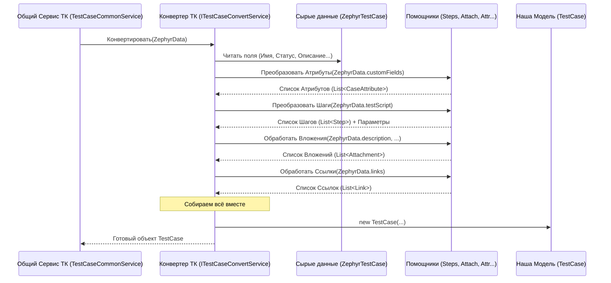

# Chapter 5: Конвертация Тест-кейсов


В [предыдущей главе](04_модели_данных_.md) мы разобрались с "чертежами" нашего приложения — [Моделями Данных](04_модели_данных_.md). Мы узнали, как должны выглядеть наши тест-кейсы, шаги и атрибуты *внутри* нашей программы и в итоговых файлах. Теперь у нас есть готовые "контейнеры" для информации. Но как их заполнить?

Представьте, что [Клиент Zephyr API](03_клиент_zephyr_api_.md) — это наш разведчик, который принёс нам донесение из Zephyr Scale. Донесение написано на "языке Zephyr" (то есть, в формате JSON API Zephyr). А нам нужно перевести это донесение на "язык Test IT" — то есть, заполнить наши [Модели Данных](04_модели_данных_.md) так, чтобы система-приемник их поняла.

Эту задачу решает **Сервис Конвертации Тест-кейсов**. Это наш главный "переводчик".

## Зачем нужна Конвертация? Перевод с одного языка на другой

Данные, которые мы получаем от Zephyr API, не всегда идеально подходят для прямой записи в нашу целевую систему (Test IT). Они могут:

*   Иметь другие названия полей (например, `testScript` вместо `steps`).
*   Использовать другие форматы для статусов или приоритетов.
*   Содержать информацию, которую нужно дополнительно обработать (например, извлечь вложения из описания или шагов).
*   Иметь структуру, отличную от той, что мы определили в наших [Моделях Данных](04_модели_данных_.md).

**Сервис Конвертации** берет "сырой" тест-кейс из Zephyr и, как опытный переводчик, аккуратно адаптирует его:

1.  **Извлекает** нужные данные из ответа Zephyr API.
2.  **Преобразует** форматы (например, статусы "To Do", "In Progress" из Zephyr в "Draft", "Approved" наших моделей).
3.  **Обрабатывает** сложные поля (например, шаги, параметры, вложения, ссылки).
4.  **Раскладывает** результат по полочкам — то есть, создает и заполняет наш объект `TestCase` ([Модель Данных](04_модели_данных_.md)).

Этот сервис является сердцем логики преобразования данных.

## Главный Конвертер и его Помощники

Основную работу по конвертации одного тест-кейса выполняет `TestCaseConvertService`. Но тест-кейс — сущность сложная, и у нашего главного конвертера есть специализированные помощники, которым он делегирует часть задач:

*   `IStepService`: Переводит шаги тест-кейса (обычно хранящиеся в поле `testScript` в Zephyr).
*   `ITestCaseAttachmentsService`: Находит и обрабатывает [Вложения](06_обработка_вложений_.md), связанные с тест-кейсом.
*   `ITestCaseAttributesService`: Преобразует пользовательские поля Zephyr в наши атрибуты.
*   `ITestCaseAdditionalLinksService`: Обрабатывает веб-ссылки.
*   `IParameterService`: Работает с параметрами для параметризованных тестов.

Все эти сервисы работают вместе под руководством `TestCaseConvertService`, чтобы превратить "сырой" тест-кейс из Zephyr в готовую [Модель Данных](04_модели_данных_.md) `TestCase`.

## Как Происходит Конвертация: Шаг за Шагом

Давайте представим, что у [Сервиса Экспорта](02_сервис_экспорта_.md) есть список "сырых" данных для тест-кейсов, полученных от [Клиента Zephyr API](03_клиент_zephyr_api_.md). Он передает каждый "сырой" тест-кейс нашему `TestCaseConvertService` для обработки. Что происходит дальше?

1.  **Получение "Сырого" Тест-Кейса:** `TestCaseConvertService` получает объект `ZephyrTestCase`, который содержит информацию так, как её вернул Zephyr API.
2.  **Проверка:** Сервис проверяет, есть ли у тест-кейса ключ (`Key`). Если нет, он пропускается.
3.  **Базовые Поля:** Простые поля, такие как имя (`Name`), статус (`Status`), приоритет (`Priority`), описание (`Description`), преобразуются в соответствующие поля нашей модели `TestCase`. Статусы и приоритеты переводятся в наши стандартные значения (`Draft`, `Normal` и т.д.).
4.  **Папка (Секция):** Сервис определяет, в какую папку (секцию) должен попасть тест-кейс, анализируя поле `Folder` из Zephyr.
5.  **Атрибуты:** Вызывается `ITestCaseAttributesService`, который смотрит на пользовательские поля в `ZephyrTestCase` (например, `Component`, `Version`) и превращает их в список объектов `CaseAttribute` для нашей модели.
6.  **Шаги:** Вызывается `IStepService`, который разбирает `testScript` из `ZephyrTestCase`, преобразует его в список наших объектов `Step` и также обрабатывает параметры, если они есть.
7.  **Вложения:** Вызывается `ITestCaseAttachmentsService`, который ищет ссылки на вложения в описании, предусловиях, шагах, скачивает их (используя [Клиент Zephyr API](03_клиент_zephyr_api_.md)) и формирует список `Attachment` для нашей модели. Эта тема подробно раскрыта в главе [Обработка Вложений](06_обработка_вложений_.md).
8.  **Ссылки:** Вызывается `ITestCaseAdditionalLinksService` для обработки веб-ссылок.
9.  **Сборка:** Все полученные и преобразованные данные собираются вместе в один объект нашей модели `TestCase`.
10. **Возврат Результата:** Готовый объект `TestCase` возвращается тому, кто его запросил (обычно это `TestCaseCommonService`, который затем передаст его [Сервису Записи Данных](07_сервис_записи_данных_.md)).

**Визуализация Процесса:**



## "Переводчик" в Коде: `TestCaseConvertService`

Давайте посмотрим на упрощенный код основного метода в `TestCaseConvertService.cs`, который выполняет конвертацию одного тест-кейса.

```csharp
// Файл: ZephyrScaleServerExporter\Services\TestCase\Implementations\TestCaseConvertService.cs

// ... using ...
using Models; // Используем наши модели данных (TestCase, Step, Attribute...)
using ZephyrScaleServerExporter.Models.TestCases; // Используем модель ZephyrTestCase
using ZephyrScaleServerExporter.Services.Helpers; // Используем утилиты
// ...

public class TestCaseConvertService(
    // ... другие зависимости: логгер, клиент API ...
    ITestCaseServiceHelper testCaseServiceHelper, // Помощник для статусов, приоритетов
    IStepService stepService,                     // Сервис для шагов
    ITestCaseAttachmentsService testCaseAttachmentsService, // Сервис для вложений
    ITestCaseAttributesService testCaseAttributesService, // Сервис для атрибутов
    ITestCaseAdditionalLinksService testCaseAdditionalLinksService, // Сервис для ссылок
    IParameterService parameterService) // Сервис для параметров
    : ITestCaseConvertService
{
    public async Task<global::Models.TestCase?> ConvertTestCase(
        ZephyrTestCase zephyrTestCase, // Входные "сырые" данные
        SectionData sectionData,        // Информация о папках
        Dictionary<string, Attribute> attributeMap, // Карта всех доступных атрибутов
        List<string> requiredAttributeNames, // Имена обязательных атрибутов
        Attribute ownersAttribute) // Специальный атрибут Владельца
    {
        logger.LogInformation("Конвертация тест-кейса {Name}", zephyrTestCase.Name);

        // Проверка ключа
        if (zephyrTestCase.Key == null) { return null; }

        // Определяем ID папки
        var sectionId = ConvertFolders(zephyrTestCase.Folder, sectionData);
        var testCaseId = Guid.NewGuid(); // Генерируем новый ID для нашего TestCase

        // --- Используем Помощников ---
        // Атрибуты (синхронно)
        var attributes = testCaseAttributesService.CalculateAttributes(
            zephyrTestCase, attributeMap, requiredAttributeNames);
        // Описание и Предусловие (извлекаем текст и вложения)
        var description = Utils.ExtractAttachments(zephyrTestCase.Description);
        var precondition = Utils.ExtractAttachments(zephyrTestCase.Precondition);

        // --- Параллельные Запросы к API и Обработка ---
        // Получаем Владельца (если есть) и обновляем атрибуты
        var parseOwnerTask = ParseTestCaseOwner(zephyrTestCase, attributes, ownersAttribute);
        // Получаем доп. ссылки
        var addLinksTask = testCaseAdditionalLinksService.GetAdditionalLinks(zephyrTestCase);
        // Обрабатываем вложения в описании (может скачивать файлы)
        var attachmentsTask = testCaseAttachmentsService.FillAttachments(
            testCaseId, zephyrTestCase, description);
        // Обрабатываем шаги и параметры (может делать доп. запросы)
        var convertStepsDataTask = ConvertStepsData(testCaseId, zephyrTestCase);

        // Ждем завершения всех параллельных задач
        await Task.WhenAll(parseOwnerTask, convertStepsDataTask, addLinksTask, attachmentsTask);

        // --- Собираем Результаты ---
        var additionalLinks = await addLinksTask;
        var attachments = await attachmentsTask; // Вложения из описания/полей
        var stepsData = await convertStepsDataTask; // Шаги и итерации
        var steps = stepsData.Steps;
        // Добавляем вложения из шагов в общий список
        steps.ForEach(s => Utils.AddIfUnique(attachments, s.GetAllAttachments()));

        // Обрабатываем вложения в предусловии
        var preconditionAttachments =
            await testCaseAttachmentsService.CalcPreconditionAttachments(
                testCaseId, precondition, attachments);

        // --- Создаем Нашу Модель TestCase ---
        var testCase = new global::Models.TestCase
        {
            Id = testCaseId,
            // Используем конвертированные и обработанные данные
            Description = Utils.ExtractHyperlinks(description.Description),
            State = testCaseServiceHelper.ConvertStatus(zephyrTestCase.Status),
            Priority = testCaseServiceHelper.ConvertPriority(zephyrTestCase.Priority),
            Steps = steps,
            PreconditionSteps = /* ... создаем шаг для предусловия ... */,
            PostconditionSteps = [], // В Zephyr Scale нет явных постусловий
            Duration = 10000, // Примерное значение длительности
            Attributes = attributes,
            Tags = zephyrTestCase.Labels ?? [],
            Attachments = testCaseServiceHelper.ExcludeDuplicates(attachments), // Удаляем дубликаты
            Iterations = testCaseServiceHelper.SanitizeIterations(stepsData.Iterations), // Обработка итераций
            Links = additionalLinks,
            Name = zephyrTestCase.Name,
            SectionId = sectionId
        };

        // Дополнительная очистка (например, удаление слишком длинных тегов)
        testCaseServiceHelper.ExcludeLongTags(testCase);

        return testCase; // Возвращаем готовую модель
    }

    // ----- Вспомогательные методы -----

    // Метод для определения ID секции (папки)
    private Guid ConvertFolders(string? stringFolders, SectionData sectionData)
    {
        // ... логика определения ID папки по строке "Folder/SubFolder" ...
        // Использует sectionData для поиска или создания секций
        logger.LogDebug("Определение папки для: {Folders}", stringFolders);
        // Этот код довольно сложный, пропустим детали
        return sectionData.SectionMap.GetValueOrDefault(Constants.MainFolderKey); // Упрощенный пример
    }

    // Метод для конвертации шагов и параметров
    private async Task<StepsData> ConvertStepsData(Guid testCaseId, ZephyrTestCase zephyrTestCase)
    {
        // 1. Конвертируем параметры (если есть)
        var iterations = await parameterService.ConvertParameters(zephyrTestCase.Key!);
        // 2. Если есть скрипт шагов (testScript)
        if (zephyrTestCase.TestScript != null)
        {
            // 3. Вызываем сервис шагов для их конвертации
            return await stepService.ConvertSteps(testCaseId, zephyrTestCase.TestScript, iterations);
        }
        // Если скрипта нет, возвращаем пустые шаги, но с параметрами (если были)
        return new StepsData { Iterations = iterations, Steps = [] };
    }

    // Метод для получения информации о владельце (Owner)
    private async Task ParseTestCaseOwner(ZephyrTestCase? zephyrTestCase,
        List<CaseAttribute> attributes, Attribute ownersAttribute)
    {
        // ... использует client.GetOwner() для запроса данных владельца по OwnerKey ...
        // ... добавляет имя владельца в Options атрибута ownersAttribute ...
        // ... добавляет атрибут владельца в общий список attributes ...
        logger.LogDebug("Обработка владельца: {OwnerKey}", zephyrTestCase?.OwnerKey);
    }
}
```

**Ключевые Моменты:**

*   **Зависимости:** Сервис получает все необходимые "помощники" (`IStepService`, `ITestCaseAttachmentsService` и т.д.) через конструктор (Внедрение Зависимостей).
*   **Входные данные:** Метод `ConvertTestCase` принимает "сырой" объект `ZephyrTestCase` и дополнительную информацию (карту атрибутов, данные о секциях).
*   **Параллельная обработка:** Задачи, которые требуют запросов к API (получение владельца, ссылок, вложений, шагов), выполняются параллельно с помощью `Task.WhenAll` для ускорения процесса.
*   **Делегирование:** Сложные задачи (атрибуты, шаги, вложения, ссылки, параметры) передаются специализированным сервисам-помощникам.
*   **Сборка:** После получения результатов от помощников, все данные собираются в новый объект нашей модели `TestCase`.
*   **Возврат результата:** Метод возвращает готовый, заполненный объект `TestCase` или `null`, если тест-кейс нужно пропустить.

## Как Используется Конвертация? Сервис `TestCaseCommonService`

Сам по себе `TestCaseConvertService` только *переводит* один тест-кейс. Но кто его вызывает и управляет процессом для *всех* тест-кейсов? Этим занимается `TestCaseCommonService` (и его "брат" `TestCaseBatchService` для частичного экспорта).

`TestCaseCommonService` делает следующее:

1.  **Подготовка:** Запрашивает у Zephyr все статусы и готовит карту атрибутов.
2.  **Цикл по Тест-кейсам:** Получает от [Клиента Zephyr API](03_клиент_zephyr_api_.md) порции "сырых" тест-кейсов (`List<ZephyrTestCase>`).
3.  **Вызов Конвертера:** Для каждого `ZephyrTestCase` из порции вызывает `testCaseConvertService.ConvertTestCase(...)`.
4.  **Запись:** Полученный готовый объект `TestCase` передает [Сервису Записи Данных](07_сервис_записи_данных_.md) для сохранения в отдельный JSON-файл.
5.  **Сбор ID:** Собирает ID всех успешно сконвертированных и записанных тест-кейсов.
6.  **Возврат Результатов:** Возвращает [Сервису Экспорта](02_сервис_экспорта_.md) список ID и финальный список атрибутов.

```csharp
// Файл: ZephyrScaleServerExporter\Services\TestCase\Implementations\TestCaseCommonService.cs (Очень упрощенно)

internal class TestCaseCommonService(
    // ... логгер, другие сервисы ...
    ITestCaseConvertService testCaseConvertService, // Наш конвертер
    IWriteService writeService)                     // Сервис записи
    : ITestCaseCommonService
{
    // Метод, который вызывается для обработки пачки тест-кейсов
    public async Task<List<Guid>> WriteTestCasesAsync(
        List<ZephyrTestCase> cases, // Пачка "сырых" тест-кейсов
        SectionData sectionData,
        Dictionary<string, Attribute> attributeMap,
        List<string> requiredAttributeNames,
        Attribute ownersAttribute)
    {
        List<Guid> testCaseIds = []; // Список ID сконвертированных ТК

        // Создаем список задач на конвертацию и запись для каждого ТК
        var tasks = cases
            .Select(zephyrCase =>
                ConvertAndWriteCaseAsync(zephyrCase, sectionData,
                    attributeMap, requiredAttributeNames, ownersAttribute))
            .ToList();

        // Запускаем все задачи параллельно и ждем их завершения
        var results = await Task.WhenAll(tasks);

        // Собираем ID успешно обработанных (не null) тест-кейсов
        testCaseIds = results.OfType<Guid>().ToList();

        return testCaseIds; // Возвращаем список ID
    }

    // Вспомогательный метод для конвертации и записи ОДНОГО тест-кейса
    private async Task<Guid?> ConvertAndWriteCaseAsync(
        ZephyrTestCase zephyrTestCase, /* ... другие параметры ... */)
    {
        // 1. Вызываем наш конвертер
        var testCase = await testCaseConvertService.ConvertTestCase(
            zephyrTestCase, /* ... */ );

        // 2. Если конвертация прошла успешно (не null)
        if (testCase != null)
        {
            // 3. Передаем результат Сервису Записи
            await writeService.WriteTestCase(testCase);
            // 4. Возвращаем ID записанного тест-кейса
            return testCase.Id;
        }
        // Если конвертация не удалась, возвращаем null
        return null;
    }

    // ... другие методы для подготовки (Prepare...) и сборки итоговых данных (PrepareTestCaseIdsData...) ...
}
```

## Заключение

В этой главе мы погрузились в процесс **Конвертации Тест-кейсов** — ключевой этап преобразования данных из формата Zephyr Scale в формат, понятный для Test IT и описанный нашими [Моделями Данных](04_модели_данных_.md). Мы узнали:

*   Зачем нужна конвертация: адаптировать данные, преобразовать форматы и структуру.
*   Что главный "переводчик" — это `TestCaseConvertService`.
*   Что у него есть помощники для обработки шагов, атрибутов, вложений и ссылок.
*   Как происходит пошаговая конвертация одного тест-кейса.
*   Как `TestCaseCommonService` управляет процессом конвертации для всех тест-кейсов и вызывает `TestCaseConvertService`.

Мы упомянули, что одна из важных задач конвертации — обработка вложений. Это нетривиальный процесс, так как вложения могут быть спрятаны в тексте описания или шагов, и их нужно найти, скачать и правильно связать с тест-кейсом. Этому процессу посвящена следующая глава: [Обработка Вложений](06_обработка_вложений_.md).

---

Generated by [AI Codebase Knowledge Builder](https://github.com/The-Pocket/Tutorial-Codebase-Knowledge)