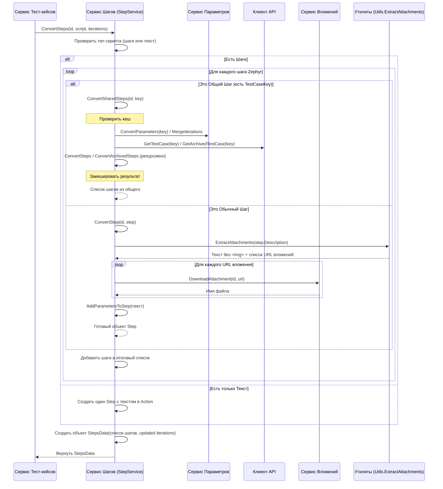

# Chapter 5: Сервис Конвертации Шагов

В [предыдущей главе](04_сервис_конвертации_тест_кейсов.md) мы увидели, как [Сервис Конвертации Тест-кейсов](04_сервис_конвертации_тест_кейсов.md) собирает воедино весь тест-кейс, словно пазл. Но один из самых важных кусочков этого пазла – это сами шаги, инструкции по выполнению теста. Эти шаги могут быть довольно сложными, содержать картинки, переменные данные или даже ссылаться на другие наборы шагов. Просто скопировать их текст недостаточно.

Именно для этой детальной работы у нас есть специальный помощник – **Сервис Конвертации Шагов**.

## Зачем нужен отдельный сервис для шагов?

Представьте, что [Сервис Конвертации Тест-кейсов](04_сервис_конвертации_тест_кейсов.md) – это главный редактор, который готовит статью (тест-кейс) к публикации. А **Сервис Конвертации Шагов** – это его дотошный корректор и верстальщик для инструкций.

**Проблема:** Как взять инструкции из Zephyr, которые могут выглядеть по-разному, и превратить их в понятные и правильно оформленные шаги для целевой системы? Шаги в Zephyr могут быть:

*   Простыми текстовыми описаниями.
*   Содержать в тексте картинки (вложения).
*   Использовать параметры (переменные) для данных.
*   Быть "общими шагами" (shared steps), то есть ссылаться на шаги из другого тест-кейса.
*   Иногда вместо пошаговой инструкции может быть просто один большой блок текста.

**Решение:** Нам нужен специалист, который:

1.  Внимательно прочитает каждый шаг из Zephyr.
2.  **Извлечет** основной текст: что сделать (действие), что проверить (ожидаемый результат), какие данные использовать (тестовые данные).
3.  **Найдет и обработает** картинки-вложения, передав их "[грузчику вложений](06_сервис_обработки_вложений.md)".
4.  **Найдет и обработает** параметры, возможно, советуясь с "[экспертом по параметрам](07_сервис_обработки_параметров.md)".
5.  Если шаг является "общим", он **сходит** и принесет нужные шаги из другого тест-кейса.
6.  **Сформирует** итоговый список шагов в стандартном формате, понятном для нашей новой системы (Test IT).

Этот специалист – наш **Сервис Конвертации Шагов** (`StepService`). Он разбирает инструкции до мельчайших деталей.

## Ключевые задачи Сервиса Конвертации Шагов

*   **Преобразование стандартных шагов:** Извлекает текст из полей "Описание" (Description), "Ожидаемый результат" (Expected Result) и "Тестовые данные" (Test Data) каждого шага Zephyr.
*   **Обработка вложений:** Находит ссылки на изображения (`` тэги с относительными путями) в тексте шагов. Он использует вспомогательную функцию `Utils.ExtractAttachments`, чтобы получить список этих вложений и заменить сами тэги на специальные маркеры (например, `<<<имя_файла.png>>>`). Информацию о файлах он передает [Сервису Обработки Вложений](06_сервис_обработки_вложений.md) для скачивания.
*   **Обработка параметров:** Ищет в тексте шагов параметры, вставленные в Zephyr (например, `<span ...>{имя_параметра}</span>`). Заменяет их на формат, понятный Test IT (`{{{имя_параметра}}}`). При этом он использует информацию о параметрах, полученную от [Сервиса Обработки Параметров](07_сервис_обработки_параметров.md).
*   **Обработка общих шагов (Shared Steps):** Если шаг в Zephyr имеет поле `TestCaseKey`, это значит, что он ссылается на шаги другого тест-кейса. Сервис Конвертации Шагов:
    *   Запоминает (кеширует) уже обработанные общие шаги, чтобы не делать одну и ту же работу много раз.
    *   Если шаги еще не обработаны, он запрашивает информацию об этом тест-кейсе у [Клиента Zephyr API](02_клиент_zephyr_api.md).
    *   Рекурсивно вызывает сам себя для обработки шагов из этого "общего" тест-кейса.
    *   Объединяет параметры из основного и общего тест-кейсов с помощью [Сервиса Обработки Параметров](07_сервис_обработки_параметров.md).
*   **Обработка "Plain Text" скриптов:** Если у тест-кейса в Zephyr нет шагов, а есть только поле `Text` в секции `TestScript`, сервис создает один шаг, помещая весь этот текст в поле "Действие" (Action).
*   **Формирование результата:** Собирает все обработанные шаги в список объектов `Step` и возвращает их вместе с обновленным списком итераций (параметров) в объекте `StepsData`.

## Как это используется?

Сервис Конвертации Шагов вызывается [Сервисом Конвертации Тест-кейсов](04_сервис_конвертации_тест_кейсов.md) в тот момент, когда нужно обработать шаги для конкретного тест-кейса.

Вот упрощенный фрагмент вызова из `TestCaseService`:

```csharp
// File: Services\TestCaseService.cs (фрагмент)

// ... зависимости ...
private readonly IStepService _stepService; // Наш сервис шагов

// ... конструктор ...

public async Task<TestCaseData> ConvertTestCases(...)
{
    // ... цикл по всем тест-кейсам из Zephyr ...
    foreach (var zephyrTestCase in cases)
    {
        // ... получаем ID тест-кейса, обрабатываем вложения, параметры ...
        var testCaseId = Guid.NewGuid();
        var iterations = await _parameterService.ConvertParameters(zephyrTestCase.Key);
        var steps = new List<Step>(); // Список для хранения готовых шагов

        // Проверяем, есть ли у тест-кейса шаги (testScript)
        if (zephyrTestCase.TestScript != null)
        {
            // !!! ВЫЗОВ СЕРВИСА ШАГОВ !!!
            // Передаем ID, данные скрипта из Zephyr и информацию о параметрах
            var stepsData = await _stepService.ConvertSteps(
                testCaseId,
                zephyrTestCase.TestScript, // Содержит шаги или текст из Zephyr
                iterations // Параметры/Итерации
            );

            steps = stepsData.Steps; // Получаем готовый список шагов
            // Обновляем итерации, т.к. общие шаги могли добавить новые параметры
            iterations = stepsData.Iterations;
            // ... добавляем вложения из шагов в общий список ...
        }

        // ... сборка финального объекта TestCase с использованием 'steps' ...
    }
    // ...
}
```

[Сервис Конвертации Тест-кейсов](04_сервис_конвертации_тест_кейсов.md) передает в метод `ConvertSteps` ID текущего тест-кейса (для связывания вложений), объект `ZephyrTestScript` (содержащий шаги или текст из Zephyr) и список `Iteration` (информацию о параметрах).

В ответ `StepService` возвращает объект `StepsData`:

```csharp
// File: Models\StepsData.cs

using Models; // Используем общие модели Step и Iteration

namespace ZephyrScaleServerExporter.Models;

// Контейнер для результата конвертации шагов
public class StepsData
{
    // Готовый список шагов в формате Test IT
    public List<Step> Steps { get; set; }
    // Обновленный список итераций (мог пополниться из общих шагов)
    public List<Iteration> Iterations { get; set; }
}
```

Этот `StepsData` содержит список готовых шагов `Steps`, которые затем помещаются в финальный объект `TestCase`, и обновленный список итераций `Iterations`.

## Под капотом: Как происходит конвертация шагов?

Давайте проследим путь одного вызова `ConvertSteps`:

1.  **Проверка Типа Скрипта:** Сервис сначала смотрит, что содержит `ZephyrTestScript` - список шагов (`Steps`) или просто текст (`Text`).
2.  **Если есть список шагов (`testScript.Steps != null`):**
    *   Сервис проходит в цикле по каждому шагу (`ZephyrStep`) из списка.
    *   **Проверка на Общий Шаг:** Для каждого шага проверяется поле `TestCaseKey`.
        *   **Если `TestCaseKey` НЕ пустой (это Общий Шаг):** Вызывается метод `ConvertSharedSteps(testCaseId, step.TestCaseKey)`. Этот метод (возможно, используя кеш):
            *   Запрашивает данные об этом тест-кейсе (`step.TestCaseKey`) у [Клиента Zephyr API](02_клиент_zephyr_api.md).
            *   Запрашивает его параметры у [Сервиса Обработки Параметров](07_сервис_обработки_параметров.md).
            *   Объединяет параметры основного и общего тест-кейсов.
            *   Рекурсивно вызывает `ConvertSteps` (или аналогичный метод для архивных данных) для получения его шагов.
            *   Возвращает список шагов из общего тест-кейса.
        *   **Если `TestCaseKey` пустой (это Обычный Шаг):** Вызывается метод `ConvertStep(testCaseId, step)`. Этот метод:
            *   Для полей "Описание", "Ожидаемый результат", "Тестовые данные" вызывает `Utils.ExtractAttachments`, чтобы найти картинки, заменить их на `<<<имя_файла>>>` и получить список этих вложений.
            *   Вызывает [Сервис Обработки Вложений](06_сервис_обработки_вложений.md) (`_attachmentService.DownloadAttachment`) для каждого найденного вложения, чтобы скачать его и получить имя файла.
            *   Вызывает `AddParametersToStep`, чтобы заменить параметры Zephyr `{параметр}` на `{{{параметр}}}`.
            *   Собирает все в объект `Step` и возвращает его.
    *   Все полученные шаги (обычные и из общих шагов) добавляются в итоговый список.
3.  **Если есть только текст (`testScript.Text != null`):**
    *   Создается один-единственный шаг (`Step`).
    *   Весь текст из `testScript.Text` помещается в поле `Action` этого шага.
    *   Поля `Expected` и `TestData` остаются пустыми.
4.  **Формирование `StepsData`:** Создается объект `StepsData`, в который помещается итоговый список шагов и обновленный список итераций.
5.  **Возврат:** Объект `StepsData` возвращается [Сервису Конвертации Тест-кейсов](04_сервис_конвертации_тест_кейсов.md).

Визуализируем этот процесс:



## Код в деталях

Сервис Шагов зависит от других сервисов для выполнения своих задач:

```csharp
// File: Services\StepService.cs (фрагмент конструктора)

public class StepService : IStepService
{
    private readonly ILogger<StepService> _logger;
    private readonly IAttachmentService _attachmentService; // Для скачивания вложений
    private readonly IParameterService _parameterService; // Для работы с параметрами
    private readonly IClient _client; // Для получения общих шагов
    private List<Iteration> _iterations; // Хранит текущие итерации
    // Словарь для кеширования общих шагов: ключ - testCaseKey, значение - список шагов
    private readonly Dictionary<string, List<Step>> _sharedStepsData = new();

    // Конструктор для получения зависимостей
    public StepService(ILogger<StepService> logger, IAttachmentService attachmentService,
        IParameterService parameterService, IClient client)
    {
        _logger = logger;
        _attachmentService = attachmentService;
        _parameterService = parameterService;
        _client = client;
    }
    // ... остальной код ...
}
```

Основной метод `ConvertSteps` решает, как обрабатывать скрипт:

```csharp
// File: Services\StepService.cs (фрагмент ConvertSteps)

public async Task<StepsData> ConvertSteps(Guid testCaseId, ZephyrTestScript testScript, List<Iteration> iterations)
{
    _logger.LogInformation("Конвертируем шаги...");
    _iterations = iterations; // Сохраняем переданные итерации

    // Если есть список шагов
    if (testScript.Steps != null)
    {
        var stepList = new List<Step>(); // Список для готовых шагов
        // Сортируем шаги по их индексу на всякий случай
        var steps = testScript.Steps.OrderBy(s => s.Index).ToList();

        // Перебираем шаги из Zephyr
        foreach (var step in steps)
        {
            // Если TestCaseKey не указан - это обычный шаг
            if (string.IsNullOrEmpty(step.TestCaseKey))
            {
                var newStep = await ConvertStep(testCaseId, step); // Конвертируем его
                stepList.Add(newStep);
            }
            // Иначе - это общий шаг
            else
            {
                var sharedSteps = await ConvertSharedSteps(testCaseId, step.TestCaseKey); // Конвертируем общий шаг
                stepList.AddRange(sharedSteps); // Добавляем все его шаги
            }
        }
        // Возвращаем результат с списком шагов и (возможно) обновленными итерациями
        return new StepsData { Steps = stepList, Iterations = _iterations };
    }

    // Если шагов нет, но есть текст
    if (testScript.Text != null)
    {
        // Создаем один шаг с текстом в поле Action
        return new StepsData
        {
            Steps = new List<Step> { new() { Action = testScript.Text } },
            Iterations = _iterations // Итерации не меняются
        };
    }

    // Если нет ни шагов, ни текста - возвращаем пустой результат
    return new StepsData { Steps = new List<Step>(), Iterations = _iterations };
}
```

Метод `ConvertStep` обрабатывает один обычный шаг:

```csharp
// File: Services\StepService.cs (фрагмент ConvertStep)

private async Task<Step> ConvertStep(Guid testCaseId, ZephyrStep step)
{
    // Извлекаем текст и URL вложений из полей
    var actionData = Utils.ExtractAttachments(step.Description);
    var expectedData = Utils.ExtractAttachments(step.ExpectedResult);
    var testDataData = Utils.ExtractAttachments(step.TestData);

    // Создаем новый объект Step и обрабатываем текст (параметры)
    var newStep = new Step
    {
        Action = AddParametersToStep(actionData.Description),
        Expected = AddParametersToStep(expectedData.Description),
        TestData = AddParametersToStep(testDataData.Description),
        ActionAttachments = new List<string>(), // Списки для имен скачанных файлов
        ExpectedAttachments = new List<string>(),
        TestDataAttachments = new List<string>()
    };

    // Скачиваем вложения для поля Action
    foreach (var attachment in actionData.Attachments)
    {
        var fileName = await _attachmentService.DownloadAttachment(testCaseId, attachment);
        newStep.ActionAttachments.Add(fileName);
    }
    // Аналогично для Expected и TestData...

    _logger.LogDebug("Сконвертирован обычный шаг: {Action}", newStep.Action);
    return newStep;
}
```

Метод `ConvertSharedSteps` обрабатывает ссылки на общие шаги, используя кеш:

```csharp
// File: Services\StepService.cs (фрагмент ConvertSharedSteps)

private async Task<List<Step>> ConvertSharedSteps(Guid testCaseId, string testCaseKey)
{
    _logger.LogInformation("Конвертируем общие шаги из {testCaseKey}", testCaseKey);

    // Проверяем, нет ли уже в кеше шагов для этого ключа
    if (_sharedStepsData.ContainsKey(testCaseKey))
    {
        _logger.LogInformation("Возвращаем общие шаги из кеша для {testCaseKey}", testCaseKey);
        return _sharedStepsData[testCaseKey]; // Возвращаем из кеша
    }

    // Получаем и объединяем параметры для общего шага
    var sharedStepsIterations = await _parameterService.ConvertParameters(testCaseKey);
    _iterations = _parameterService.MergeIterations(_iterations, sharedStepsIterations);

    List<Step> sharedSteps;
    try
    {
        // Пытаемся получить тест-кейс через API
        var zephyrTestCase = await _client.GetTestCase(testCaseKey);
        // Рекурсивно вызываем ConvertSteps для его скрипта
        sharedSteps = zephyrTestCase.TestScript != null ?
            (await ConvertSteps(testCaseId, zephyrTestCase.TestScript, _iterations)).Steps
            : new List<Step>();
    }
    catch (Exception) // Если не найден (возможно, архивный)
    {
        _logger.LogWarning("Не удалось получить тест-кейс {testCaseKey}, пробуем получить архивный", testCaseKey);
        // Пытаемся получить архивный тест-кейс
        var zephyrArchivedTestCase = await _client.GetArchivedTestCase(testCaseKey);
        // Вызываем специальный метод для обработки архивных шагов
        sharedSteps = zephyrArchivedTestCase.TestScript != null ?
            await ConvertArchivedSteps(testCaseId, zephyrArchivedTestCase.TestScript)
            : new List<Step>();
    }

    // Сохраняем результат в кеш
    _sharedStepsData.Add(testCaseKey, sharedSteps);
    _logger.LogDebug("Добавлены общие шаги из {testCaseKey} в кеш.", testCaseKey);

    return sharedSteps; // Возвращаем результат
}
```

Вспомогательная функция `Utils.ExtractAttachments` ищет картинки:

```csharp
// File: Services\Utils.cs (фрагмент ExtractAttachments)

public static ZephyrDescriptionData ExtractAttachments(string? description)
{
    if (string.IsNullOrEmpty(description)) /*...*/; // Обработка пустого текста

    var data = new ZephyrDescriptionData { Description = description, Attachments = new() };
    var imgRegex = new Regex("]*>"); // Регулярное выражение для поиска 
    var urlRegex = new Regex(@"src=""\.\.([^""]+)"""); // Для извлечения URL из src="..."

    var matches = imgRegex.Matches(description);
    if (matches.Count == 0) return data; // Если картинок нет

    foreach (Match match in matches) // Для каждой найденной картинки
    {
        var urlMatch = urlRegex.Match(match.Value);
        if (!urlMatch.Success) continue; // Если не нашли URL

        var url = urlMatch.Groups[1].Value; // Получаем URL (относительный путь)
        var fileName = url.Split('/').Last(); // Получаем имя файла

        // Заменяем весь тег  на маркер <<<имя_файла>>>
        data.Description = data.Description.Replace(match.Value, $"<<<{fileName}>>>");
        // Добавляем информацию о вложении в список
        data.Attachments.Add(new ZephyrAttachment { FileName = fileName, Url = url });
    }
    return data; // Возвращаем очищенный текст и список вложений
}
```

А метод `AddParametersToStep` заменяет формат параметров:

```csharp
// File: Services\StepService.cs (фрагмент AddParametersToStep)

private string AddParametersToStep(string stepText)
{
    // Ищем специфичные теги Zephyr для параметров
    if (stepText.Contains("<span ...>{") && stepText.Contains("}</span>")) // Упрощенная проверка
    {
        // Для каждой известной итерации и параметра в ней
        foreach (var iteration in _iterations)
        {
            foreach (var parameter in iteration.Parameters)
            {
                // Формируем строку параметра в формате Zephyr (приблизительно)
                string zephyrParamTag = $"<span ...>{parameter.Name}}}</span>"; // Очень упрощенно!
                // Заменяем её на формат Test IT
                string testitParamTag = $"<<<{parameter.Name}>>>";
                // Используем Regex.Replace для более надежной замены (в реальном коде)
                stepText = stepText.Replace(zephyrParamTag, testitParamTag); // Упрощенная замена
            }
        }
    }
    return stepText;
}
```
*(Примечание: Реальная реализация `AddParametersToStep` использует регулярные выражения для более точного поиска и замены параметров)*

## Заключение

В этой главе мы познакомились с **Сервисом Конвертации Шагов** – незаменимым помощником, который берет на себя всю кропотливую работу по преобразованию инструкций тест-кейсов. Мы узнали, что он:

*   Разбирает шаги из Zephyr на **действие, ожидаемый результат и тестовые данные**.
*   Находит и подготавливает **вложения** (картинки) для [Сервиса Обработки Вложений](06_сервис_обработки_вложений.md).
*   Находит и преобразует **параметры**, взаимодействуя с [Сервисом Обработки Параметров](07_сервис_обработки_параметров.md).
*   Умеет обрабатывать **общие шаги**, рекурсивно получая и кешируя их.
*   Может работать с тест-кейсами, где вместо шагов дан **простой текст**.
*   Возвращает [Сервису Конвертации Тест-кейсов](04_сервис_конвертации_тест_кейсов.md) готовый и структурированный список шагов.

Мы много раз упоминали обработку вложений – картинок, которые могут быть как в шагах, так и в описании или предусловии тест-кейса. Как именно утилита находит и скачивает эти файлы?

В следующей главе мы подробно рассмотрим [Сервис Обработки Вложений](06_сервис_обработки_вложений.md), который отвечает за загрузку всех связанных файлов.

---

Generated by [AI Codebase Knowledge Builder](https://github.com/The-Pocket/Tutorial-Codebase-Knowledge)